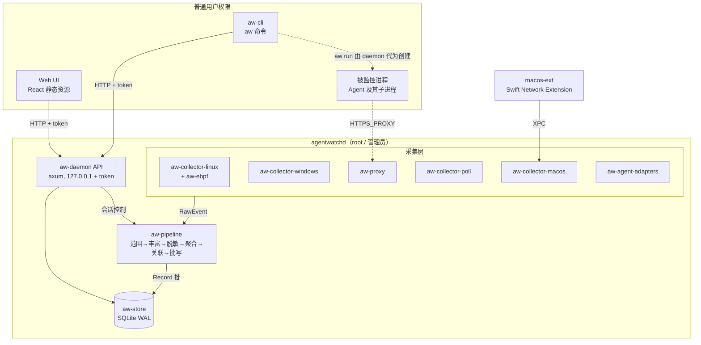
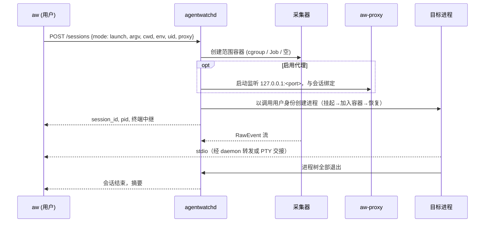

# 总体架构

> 状态：草案
> 最后更新：2026-10-06
> 关联：REQ-01~07、[ADR-0001](../03-adr/0001-rust-workspace.md)、[ADR-0002](../03-adr/0002-embedded-web-ui.md)、[ADR-0005](../03-adr/0005-privileged-daemon-split.md)、[ADR-0011](../03-adr/0011-aggregate-first.md)

## 1. 设计原则

1. **采集层要薄，管道要厚**。平台代码只把系统事件翻译成 `RawEvent`。范围过滤之后的一切逻辑都在平台无关的 `aw-pipeline` 中，可以用 `fixtures/` 中录制的事件流回放测试。
2. **证据等级是一等字段**。每条事件从采集时就标上 `source` 和 `evidence`，一路保留到存储和 UI（[ADR-0004](../03-adr/0004-evidence-levels.md)）。
3. **先聚合再存储**。默认不存单次 read/write，只存聚合结果（[ADR-0011](../03-adr/0011-aggregate-first.md)）。
4. **先脱敏再写入**。敏感内容在内存中完成脱敏，脱敏前的内容不落盘（[ADR-0012](../03-adr/0012-no-content-redact-before-write.md)）。
5. **特权最小化**。只有 `agentwatchd` 以 root / 管理员运行；CLI 与 UI 以普通用户运行，通过本地 API 访问（[ADR-0005](../03-adr/0005-privileged-daemon-split.md)）。
6. **拿不到就说拿不到**。丢失、降级、不支持都以 `Gap` 或 `NA` 形式显式记录。

## 2. 组件图



## 3. crate 划分与依赖方向

| crate | 职责 | 依赖 | 特权测试 |
|---|---|---|---|
| `aw-core` | `RawEvent`、`Record`、`Evidence`、`ProcUid`、配置类型、错误类型 | 无内部依赖 | 否 |
| `aw-pipeline` | 范围、丰富、脱敏、聚合、关联、缺口合并 | core | 否 |
| `aw-store` | SQLite schema、迁移、批写、查询、保留、导出 | core | 否 |
| `aw-proxy` | MITM 显式代理、CA 管理、分块哈希 | core | 否 |
| `aw-collector-linux` | eBPF 加载与事件翻译、cgroup 管理、fanotify/sock_diag 降级 | core, aw-ebpf | 是 |
| `aw-ebpf` | eBPF 内核侧程序（`no_std`，Aya） | — | 是 |
| `aw-collector-windows` | ETW 会话、Job Object | core | 是 |
| `aw-collector-macos` | ES（或 eslogger 子进程）、nettop/pktap、与 NE 的 XPC | core | 是 |
| `aw-collector-poll` | 跨平台轮询：进程表与 socket 表 | core | 否 |
| `aw-agent-adapters` | Agent 画像、hooks 接收、日志/OTEL 解析（E3） | core | 否 |
| `aw-daemon` | 进程入口、组装采集器与管道、会话管理、HTTP API、嵌入 UI | 全部 | 部分 |
| `aw-cli` | `aw` 命令行，API 客户端 | core | 否 |

依赖规则：
- 采集器之间互不依赖，只依赖 `aw-core`。
- `aw-pipeline` 和 `aw-store` 不依赖任何平台 crate，确保能在任何 CI runner 上无特权测试。
- 平台 crate 用 `#[cfg(target_os = ...)]` 在 `aw-daemon` 中装配；在非目标平台上编译为空壳。

## 4. 进程模型

| 进程 | 权限 | 说明 |
|---|---|---|
| `agentwatchd` | Linux: root 或 `CAP_BPF+CAP_PERFMON+CAP_SYS_ADMIN`；Windows: 管理员（服务，LocalSystem）；macOS: root（launchd daemon） | 常驻；可以按需启停，没有会话时不加载重采集器 |
| `aw` | 普通用户 | 一次性命令或 `aw run` 的前台进程 |
| 被监控进程 | 调用 `aw run` 的用户 | 由 daemon 以该用户身份创建（见 §5.1） |
| macOS NE 扩展 | 系统扩展 | P4 引入；与 daemon 通过 XPC 通信 |

开发模式允许用 `sudo aw dev` 把 daemon 和 CLI 合并为单进程运行，便于调试。

## 5. 关键数据流

### 5.1 启动模式（`aw run`）



目标进程必须在**加入范围容器之后**才开始执行，否则早期子进程可能逃逸。各平台的挂起创建方式见 [process-tracking §4](process-tracking.md#4-启动模式)。

stdio 处理有两个候选方案：
- daemon 把 PTY 主端的文件描述符传给 `aw`（Unix 域 socket 的 SCM_RIGHTS；Windows 上用 ConPTY + 句柄复制）；
- `aw` 自己创建进程，由 daemon 的特权 API 将其移入容器。

【待验证】两种方案的取舍见 [SPIKE-05](../06-research/SPIKE-05-launch-scoping.md)。

### 5.2 附着模式（`aw attach`）

1. daemon 读取进程表快照，算出根进程的后代集合，写入范围。
2. 启动采集器并按范围过滤；快照与采集启动之间的窗口记为 `Gap{kind: attach_window}`。
3. 对已有 socket 做一次快照，生成 `NetFlow{preexisting: true}`。

### 5.3 事件处理

见 [pipeline](pipeline.md)。简图：

```
采集器 ──mpsc(有界)──▶ Scope ─▶ Enrich ─▶ Redact ─▶ Aggregate ─┬─▶ Batcher ─▶ SQLite
                                                              └─▶ Correlate ─▶ findings
```

## 6. 并发与运行时

- 使用 tokio 多线程运行时。采集器各自占一个线程：ETW 回调线程、eBPF ring buffer 轮询、ES 回调队列。采集线程内只做解码，然后用 `try_send` 投递，永不阻塞系统回调。
- 管道是单 actor：一个 task 顺序处理，状态（进程缓存、句柄表、流表）不加锁。吞吐不够时可以按 `session_id` 分片。
- 存储写入由独立线程持有写连接；查询使用只读连接池（WAL 模式下读写不互斥）。

## 7. 配置

配置文件为 TOML，位置如下。字段定义在 `aw-core::config`，由 `aw config schema` 输出 JSON Schema。

| 平台 | daemon 配置 | 数据目录 |
|---|---|---|
| Linux | `/etc/agentwatch/config.toml` | `/var/lib/agentwatch/` |
| Windows | `%ProgramData%\AgentWatch\config.toml` | `%ProgramData%\AgentWatch\data\` |
| macOS | `/Library/Application Support/AgentWatch/config.toml` | 同目录 `data/` |

顶层节：`[storage]`、`[retention]`、`[redaction]`、`[sensitive_paths]`、`[proxy]`、`[collectors.<name>]`、`[limits]`、`[correlation]`、`[api]`、`[debug]`。

### 7.1 配置项登记（跨文档引用的键）

键名为点分 snake_case。完整字段以 `aw-core::config` 和 `aw config schema` 的输出为准；本表只登记各文档和任务卡中引用到的键。新增配置项时要同步更新本表。

| 键 | 默认 | 含义 | 定义处 |
|---|---|---|---|
| `retention.max_db_size_mb` / `retention.max_age_days` | 2048 / 30 | 保留上限 | [storage](storage.md) |
| `proxy.on_tls_reject` | `fail` | 客户端拒绝会话 CA 时的处理方式（`fail` / `tunnel`），对应 `--proxy-on-reject` | [network-attribution](network-attribution.md) |
| `proxy.max_hash_body` | 50 MB | 请求体超过该大小则不做分块哈希 | [performance-budget](performance-budget.md) |
| `correlation.max_hash_file_size` | 10 MB | 文件侧做内容哈希的大小上限 | [evidence-model §6](evidence-model.md) |
| `collectors.windows.sni` | `false` | Windows pktmon SNI 采集（可选） | [windows](../02-platforms/windows.md) |
| `collectors.linux.tls_uprobe` | `false` | Linux TLS 明文 uprobe（可选，开启时 UI 显著提示） | [network-attribution](network-attribution.md) |
| `debug.keep_raw_events` | `false` | 另写未聚合的 `raw_events` 表 | [pipeline](pipeline.md) |

### 7.2 环境变量

| 变量 | 使用方 | 含义 | 生产可用 |
|---|---|---|---|
| `AW_SESSION` | `aw run` 注入到被监控进程 | 会话 public_id，`aw hook` 用它归属 E3 事件 | 是 |
| `AW_FORCE_MODE` | aw-collector-linux 测试 | 强制指定采集模式：`ebpf` / `ebpf-lite` / `legacy` | 否，仅测试 |
| `AW_FORCE_SNI_FALLBACK` | aw-collector-linux 测试 | 模拟读用户内存失败，强制走 AF_PACKET 获取 SNI | 否，仅测试 |
| `AW_UI_DEV_URL` | aw-daemon（debug 构建） | UI 请求代理到 Vite dev server | 否，release 构建忽略 |

标为“仅测试”的变量在 release 构建中用 `cfg(any(test, debug_assertions, feature = "e2e"))` 整体编译掉。

## 8. 采集器接口

```rust
/// 每个平台采集器实现此 trait，位于 aw-core。
#[async_trait::async_trait]
pub trait Collector: Send {
    /// 稳定名称，如 "linux.ebpf"，写入 RawEvent.source 前缀。
    fn name(&self) -> &'static str;
    /// 运行前自检：权限、内核版本、entitlement 等。结果供 `aw doctor` 展示。
    fn probe(&self) -> ProbeReport;
    /// 声明本采集器能产生的事件类型及其证据等级，用于能力矩阵和 UI 的 NA 标注。
    fn capabilities(&self) -> Vec<CapabilityDecl>;
    /// 启动采集。事件通过 sink 推送；sink 满时采集器自行计数并报告 Gap。
    async fn start(&mut self, ctx: CollectorCtx, sink: EventSink) -> anyhow::Result<()>;
    /// 更新内核侧 / 源头过滤（如 eBPF 的 cgroup 白名单、ETW 无法过滤则忽略）。
    fn update_scope(&mut self, scope: &ScopeFilter) -> anyhow::Result<()>;
    async fn stop(&mut self) -> anyhow::Result<()>;
}
```

一个平台可以同时运行多个采集器（如 eBPF + poll）。同一事实有多个来源时，由管道去重，保留证据等级最高的一条（见 [pipeline §4.2](pipeline.md#42-多源去重)）。

## 9. 平台差异入口

平台能力以 [capability-matrix](../02-platforms/capability-matrix.md) 为准，细节见 [linux](../02-platforms/linux.md)、[windows](../02-platforms/windows.md)、[macos](../02-platforms/macos.md)、[fallback-poll](../02-platforms/fallback-poll.md)。本目录的设计文档不重复描述平台细节。
