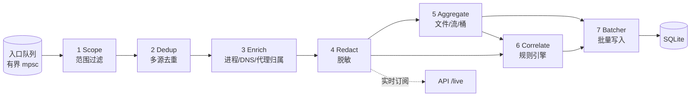

# 事件处理管道

> 状态：草案
> 最后更新：2026-10-07
> 关联：REQ-03~07、REQ-11、NFR-01~06、[ADR-0011](../03-adr/0011-aggregate-first.md)、[ADR-0012](../03-adr/0012-no-content-redact-before-write.md)、[ADR-0013](../03-adr/0013-inter-agent-observation.md)、[event-schema](event-schema.md)、[storage](storage.md)、[inter-agent-communication](inter-agent-communication.md)

`aw-pipeline` 把 `RawEvent` 流变成可存储的 `Record` 和 `Finding`。它不依赖任何平台 crate，所有逻辑都可以通过回放 JSONL 测试。

## 1. 总览



阶段顺序的理由：
- **Scope 最先**：丢掉 95% 以上无关事件，后续阶段处理的量就小得多。
- **Redact 在 Aggregate 之前**：确保任何落盘或对外推送的内容都已脱敏。
- **Correlate 同时消费两类输入**：原始事件用于时间精度，聚合结果用于字节数。

## 2. 队列与背压

| 位置 | 类型 | 默认容量 | 满时行为 |
|---|---|---|---|
| 内核 → 采集器 | eBPF ring buffer / ETW buffer / ES 队列 | eBPF 8 MB；ETW 64×64 KB | 由内核丢弃；采集器读取丢失计数 → `Gap{lost_by_os}` |
| 采集器 → 管道 | `tokio::mpsc` 有界 | 65536 条 | 采集线程 `try_send` 失败则丢弃并计数，每秒汇总为 `Gap{dropped}`；**绝不阻塞内核回调** |
| 管道 → Batcher | `mpsc` 有界 | 1024 批 | 管道等待（允许反压至入口队列） |
| Batcher → SQLite | 同步事务 | — | 慢盘时批大小自动增大（最多 10000） |
| 管道 → /live 订阅者 | `broadcast` | 4096 | 慢订阅者丢弃并收到 `lagged` 通知；不影响存储 |

优先级：队列占用超过 80% 时进入降级模式（见 [performance-budget §4](performance-budget.md#4-降级阶梯)）。优先丢弃的是可以被聚合替代的高频事件，即 `FileRead`/`FileWrite`/`NetSend`/`NetRecv`，并将它们转为计数器。`ProcessStart`、`FileOpen`、`FileDelete`、`NetConnect`、`Dns*` 最后丢弃。

## 3. 各阶段

### 3.1 Scope（范围过滤）
- **输入**：`RawEvent`，`session_id = None`。
- **输出**：填好 `session_id` 的 `RawEvent`，或丢弃。
- **逻辑**：见 [process-tracking §3](process-tracking.md#3-范围scope模型)。同一进程属于多个会话时（嵌套附着），事件复制到各会话。
- **源头下推**：范围变化时调用 `Collector::update_scope`。各平台下推方式不同：
  - eBPF：更新 cgroup id map 或 pid map；
  - ETW：无法下推，全量在用户态过滤；
  - ES：用 `es_mute_process_inverted` 做白名单【待验证】。
- **无会话时**：采集器应停止或保持最小订阅，只保留进程事件，用于维护进程缓存。

### 3.2 Dedup（多源去重）
- 同一事实可能有多个来源，如 eBPF 和 poll 同时报告一条连接。
- **去重键**：
  - 进程：`ProcUid + kind`；
  - 连接：`FlowKey + kind`；
  - 文件删除、改名：`ProcUid + path + kind`，时间窗 100 ms。
- 保留证据等级最高的一条，其余来源写入 `corroborated_by`。
- 字段可以互补：高等级来源缺的字段用低等级来源补上，并写入 `field_evidence`。

### 3.3 Enrich（丰富）
| 子步骤 | 说明 |
|---|---|
| 进程解析 | PID-only 事件 → `ProcUid`；补全 exe/argv（见 process-tracking §8） |
| 句柄 → 路径 | `FileRead/Write/Close` 只带 handle 时，用 `(ProcUid, handle) → path` 表补路径。表由 `FileOpen` 建立，在 `FileClose` 时清除 |
| DNS 映射 | 维护 `(session, ip) → [(domain, ts, ttl, source_proc)]`。`NetConnect` 时查找：本进程的查询记为 E1；本会话其他进程的查询记为 I；全局缓存也记为 I。详见 [network-attribution §4](network-attribution.md#4-ip--域名映射) |
| 代理归属 | `HttpRequest.client`（代理看到的客户端端口）→ 查本地连接表，得到发起进程 |
| 敏感路径标记 | 路径匹配 `sensitive_paths` 规则后打标签 `sensitive:<rule_id>` |
| 路径归一化 | Windows 设备路径 `\Device\HarddiskVolume3\...` 转为 `C:\...`；`~` 展开；符号链接保持原样，另存 `resolved_path`【待验证】 |

### 3.4 Redact（脱敏）
- 输入输出都是 `RawEvent`。
- 作用字段：`argv`、`env`、`url`、`headers`、`AgentToolCall.summary`、路径中的用户名（可选）。
- 规则清单见 [security-privacy §3](security-privacy.md#3-脱敏规则)。
- 被替换的值写成 `«redacted:<rule_id>»`；当前会话内可以附上 8 位加盐哈希，用于判断前后两次是否是同一个值。盐值不落盘。
- 脱敏在内存中完成。脱敏前的内容不进入后续阶段，也不写日志。

### 3.5 Aggregate（聚合）

**文件访问**
- 状态表：`(ProcUid, handle) → FileAccessAcc`，累计字段有 `{path, access, first_ts, last_ts, reads, bytes_read, writes, bytes_written, created, truncated}`。
- 输出为一条 `file_access` 记录，触发条件有三种：
  - 收到 `FileClose`；
  - 进程退出；
  - 句柄存活超过 `aggregate.file_flush_secs`（默认 30 秒）。此时输出一条中间记录，标记 `partial = 1`，之后继续累计，以便长时间打开的文件也能及时可见。
- 没有句柄的平台（macOS ES）用 `(ProcUid, path)` 作键：
  - `OPEN` 开启累计，`CLOSE` 结束累计；
  - 同一路径的重复打开计入 `opens` 计数。
- 上述聚合记录的 `op = access`。`FileDelete` / `FileRename` / `FileCreate` 不聚合，直接产生 `file_access` 记录，`op` 分别为 `delete` / `rename` / `create`；exec 产生 `op = exec`。
- **合并重复打开**：同一进程对同一路径的只读访问，如果在 1 秒内反复发生（如编译器反复 stat 或读取头文件），合并为一条，`opens += 1`。这一项由 `aggregate.coalesce_window_ms` 控制。

**网络流**
- 状态表：`FlowKey → FlowAcc`。
- 每个 `aggregate.bucket_secs`（默认 5 秒）输出一条 `net_flow_buckets`，内容为该时间窗的上行、下行字节数。
- 流结束时更新 `net_flows` 总量。如果平台在 `NetClose` 里给了累计值，就和我们自己的累加值对比：差异超过 5% 时记录差异，并把字节字段的证据标为“有偏差”。
- UDP：同一五元组 60 秒内无报文即视为结束。

**本机 IPC（P6）**
- 状态表：`(kind, a_proc_uid, b_proc_uid, name) → IpcAcc`，按 `aggregate.bucket_secs`（默认 5 秒）累加各方向字节，输出 `ipc_channels`。
- 两端映射到 AgentInstance 后生成 `agent_links`（`ipc` / `rpc`）；同一 Agent 内部的管道只累加总数，不生成边。详见 [inter-agent-communication §3.2](inter-agent-communication.md#32-通信通道channel与通信边agentlink)。

**单事件保留**：`debug.keep_raw_events = true` 时，另写一份 `raw_events` 表。只用于调试，写入前同样要脱敏。

### 3.6 Correlate（关联规则引擎）

- **输入**：脱敏后的事件和聚合记录。
- **输出**：`Finding`，证据等级为 E1（事实汇总）或 I（推测）。每条结论都引用依据记录的 ID。
- **实现**：每条规则是一个小状态机，维护按会话划分的滑动窗口。窗口上限由 `correlation.max_window_secs` 控制，默认 300 秒。

规则采用声明式 TOML，内置规则位于 `crates/aw-pipeline/rules/*.toml`，用户规则放在配置目录的 `rules.d/` 下。草案如下：

```toml
# 内置规则：读取敏感文件后的时序相关外发
[rule]
id = "sensitive_read_then_send"
version = 1
title = "读取敏感文件后有外发流量"
evidence = "I"                       # 输出等级；引擎会拒绝把关联规则声明为 E1
wording = "infer.temporal"           # 必须引用 evidence-model §5 的模板 ID
severity = "notice"                  # info / notice / warn；不表示“恶意”

[[rule.match]]                       # 第 1 步：触发条件
as = "a"
record = "file_access"
where = 'op = "access" and access in ["read","read_write"] and tag:sensitive'

[[rule.match]]                       # 第 2 步：后续条件
as = "b"
record = "net_flow_bucket"
where = 'bytes_up > 0 and not remote.is_loopback'
within = "10s"                       # 相对 a.last_ts
same = "session"                     # session / process / process_tree

[rule.emit]
key = ["a.path", "b.domain_or_ip"]   # 去重键：同一组合只报一次，后续只累加计数
upgrade_if = "content_match(a.path, b.flow)"   # 若成立，改用 evidence.content_match 另行生成
```

`where` 表达式与 API 的筛选语法共用一个解析器，只有两点差异：字段名以记录类型为上下文；可以用别名引用前一步的记录。语法见 [api-and-cli §4](api-and-cli.md#4-筛选查询语法)。

引擎强制的约束：
- 多步规则（`match` 数量 ≥ 2）的 `evidence` 必须是 `I`。
- `wording` 必须存在于模板表，渲染结果要通过 `wording::lint`。
- `severity` 不接受 `critical`、`malicious` 等暗示意图的取值。

内置规则清单（P3）：

| ID | 等级 | 说明 |
|---|---|---|
| `sensitive_access` | E1 | 任何对敏感路径的访问（单步） |
| `sensitive_read_then_send` | I | 见上 |
| `content_match` | 内容匹配证据 | 由代理哈希比对触发 |
| `direct_bypass_proxy` | E1 | 代理会话中的直连 |
| `attribution_break` | E1 | 见 process-tracking §6 |
| `self_report_mismatch` | E1 | E3 与 E1 不一致 |
| `mass_delete` | E1 | 10 秒内删除的文件超过 N 个（默认 50） |
| `new_executable_written_then_run` | E1 | 写入文件后又 exec 了该文件。两步均为 E1 且路径相同，可以直接作为事实陈述，算作“事实汇总”类规则，允许声明 E1 |
| `agent_shared_artifact` | I | AgentInstance A 修改文件后、另一 AgentInstance B 读取同一文件（P6）。排除构建产物、缓存和锁文件；措辞 `infer.shared_artifact` |

> 注：“事实汇总”类多步规则的条件是：每一步都是 E1，而且规则只陈述各步的合取，不推断因果。它们用 `kind = "fact_conjunction"` 声明，允许输出 E1，并须通过专门的评审。

P6 另有委托链路引擎（只读已有记录，不生成新事实）：从任一记录往上追溯所属进程 → AgentInstance → 入边。每跳带等级，整条链取最弱一跳。见 [inter-agent-communication §6](inter-agent-communication.md#6-间接通信t4与委托链路)。

### 3.7 Batcher（批量写入）
- 触发条件：满 `store.batch_max_rows`（默认 1000 行）或 `store.batch_max_ms`（默认 100 ms），先到先触发。
- 每批一个事务，使用预编译语句。批内先写 processes，满足外键上的逻辑顺序。
- 写入失败（如磁盘满）时：
  - 保留最近 N 批在内存中重试；
  - 超过上限后丢弃，并尝试写入 `Gap{kind: store_failure}`；
  - 通过 API 健康状态告警。

## 4. 事件丢失与缺口

### 4.1 缺口来源与合并
| 来源 | 触发 | GapKind |
|---|---|---|
| eBPF ring buffer `reserve` 失败计数 | 内核侧 per-CPU 计数器，每秒读取 | `lost_by_os` |
| ETW `EventsLost` / `BuffersLost` | 会话统计轮询 | `lost_by_os` |
| ES 客户端队列溢出 | `seq_num` 不连续【待验证】 | `lost_by_os` |
| 入口队列 `try_send` 失败 | 采集器计数 | `dropped` |
| 限流器丢弃 | §5 | `rate_limited` |
| 采集器崩溃或重启 | supervisor | `restart` |
| 权限或能力不足 | `probe()` | `permission` / `unsupported` |

同一采集器、同一种缺口，如果在 5 秒内连续发生，合并为一条并累加 `count`，避免缺口记录本身变成风暴。

### 4.2 多源去重
见 §3.2。

### 4.3 缺口对结论的影响
关联规则生成结论时会检查：依据时间窗内是否有影响相关类别的缺口。有就在 `Finding.caveats` 中加上该缺口的引用，UI 会显示“此时间段数据可能不完整”。

“未发现”类的汇总（如会话概览里的“未观测到敏感文件访问”）也必须附上会话内的缺口摘要。

## 5. 限流

- **每进程限流**：令牌桶按事件类别配置，默认值如下表。超出部分只计数，并记为 `rate_limited` 缺口。聚合计数器照常累加，所以字节数不受影响。

| 类别 | 每进程速率 | 突发 |
|---|---|---|
| `file_open` | 2000/s | 10000 |
| `file_rw` | 不限（只累加计数器，不产生记录） | — |
| `process_start` | 200/s | 1000 |
| `net_connect` | 500/s | 2000 |
| `dns` | 500/s | 2000 |
| `ipc_transfer` | 不限（只累加计数器；内核侧已按跨 Agent 过滤） | — |
| `agent_rpc` | 200/s | 1000 |

- **全局限流**：管道 CPU 使用超过预算时进入降级阶梯，见 [performance-budget](performance-budget.md)。

## 6. 可测试性

- `aw-pipeline` 提供 `Pipeline::replay(events: impl Iterator<Item = RawEvent>, cfg) -> Output`，输出为内存中的 records 和 findings。它不依赖 SQLite，可以用于快照测试（`insta`）。
- 测试时使用虚拟时钟，时间取自事件的 `ts_mono_ns`，不依赖真实时间。这样涉及时间窗的规则结果是确定的。
- `fixtures/` 中每个场景一个目录：`events.jsonl`、`expected.snap`、`README.md`（场景说明）。
