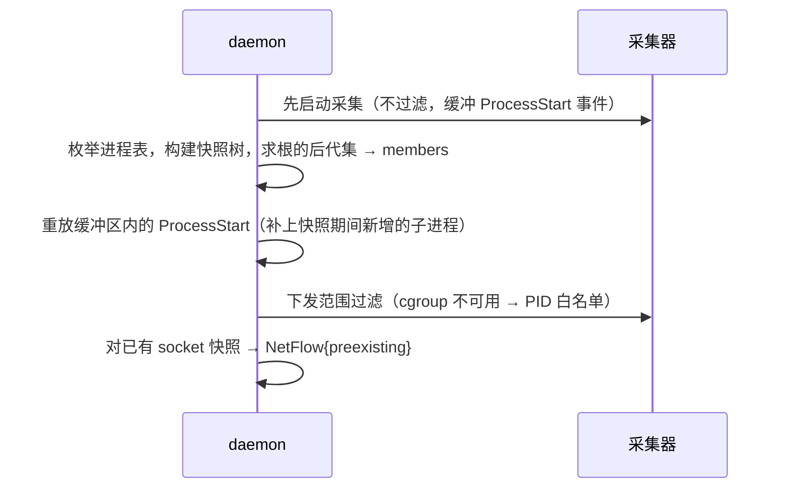

# 进程身份与范围追踪

> 状态：草案
> 最后更新：2026-10-06
> 关联：REQ-02、[ADR-0007](../03-adr/0007-process-identity.md)、[SPIKE-05](../06-research/SPIKE-05-launch-scoping.md)、[event-schema](event-schema.md)

## 1. 问题

1. **PID 复用**：短命进程大量创建时，PID 可能在一次会话内被复用，尤其是 Windows（PID 为 4 的倍数，回收快）和容器内。
2. **逃逸**：子进程可以 daemonize（双 fork、setsid）、改变父进程（被 init / subreaper 收养），单纯跟踪 ppid 链会丢失。
3. **竞态**：附着模式下，快照与采集启动之间创建的进程可能漏掉。
4. **委托**：工作被交给会话外已存在的进程（dockerd、ssh-agent、git credential helper、IDE language server、同步盘）。

## 2. 进程唯一 ID（`ProcUid`）

```
ProcUid = xxh3_64( boot_id || pid(u32 LE) || start_time_ticks(u64 LE) )
```

| 平台 | `start_time_ticks` 来源 | `boot_id` 来源 |
|---|---|---|
| Linux | `task_struct->start_boottime`（eBPF）；用户态用 `/proc/<pid>/stat` 第 22 列（clock ticks）。**两者精度不同，需统一换算到 ticks** | `/proc/sys/kernel/random/boot_id` |
| Windows | ETW Process 事件的 CreateTime；用户态 `GetProcessTimes` | 开机时间（`GetTickCount64` 反推，取整到秒） |
| macOS | ES `audit_token` 中的 pidversion + `proc_bsdinfo.pbi_start_tvsec/usec` | `kern.boottime` |

- 【待验证】Linux 上 eBPF 与 `/proc` 换算后能否稳定得到同一 ID，见 [SPIKE-01](../06-research/SPIKE-01-linux-aya-poc.md)。
- macOS 优先使用 `pidversion`：它在 exec 时也会变化。按我们的模型，exec 不生成新的 ProcUid，所以实际使用 fork 时的 pidversion。【待验证】[SPIKE-03](../06-research/SPIKE-03-macos-eslogger-poc.md)。

**exec 语义**：Linux/macOS 的 exec 不创建新进程。我们保留同一 `ProcUid`，并在 `processes` 表中追加一条 `process_images` 记录（一个进程可以有多个镜像阶段），这样“bash → exec python”的链条可见。Windows 的 CreateProcess 直接产生新进程。

## 3. 范围（Scope）模型

```rust
pub struct Scope {
    pub session_id: SessionId,
    pub mode: ScopeMode,                 // Launch / Attach
    /// 内核侧或平台侧的容器标识（cgroup id / Job 句柄）。有它时以它为准。
    pub container: Option<ScopeContainer>,
    /// 当前已知属于会话的进程。
    pub members: HashSet<ProcUid>,
    /// 显式排除的进程（如 aw 自身、代理）。
    pub excluded: HashSet<ProcUid>,
    pub follow_children: bool,           // 默认 true
}
```

**归属判定**（每条事件）：

1. 有容器（cgroup / Job）时，属于容器即属于会话。
2. 否则 `proc.uid ∈ members` 即属于会话。
3. 对于 `ProcessStart`：若 `parent_uid ∈ members` 且 `follow_children`，则把新进程加入 `members`。
4. 以上都不满足则丢弃。尽量在内核侧丢弃，见 pipeline §3.1。

进程退出后保留在 `members` 中，以便处理乱序到达的事件；会话结束时整体释放。

## 4. 启动模式

目标：目标进程的**第一条指令执行之前**，它就已经在范围容器内。

| 平台 | 容器 | 创建方式 | 逃逸风险 |
|---|---|---|---|
| Linux | cgroup v2 子组 `/sys/fs/cgroup/agentwatch.slice/s-<sid>/` | `clone3(CLONE_INTO_CGROUP)`（内核 5.7+）；降级为 fork 后写 `cgroup.procs`，再通过管道通知子进程 exec | 只有 root 或持有 cgroup 写权限的进程能移出；`systemd-run --user` 会把进程放到其他 cgroup |
| Windows | Job Object（`JOB_OBJECT_LIMIT_SILENT_BREAKAWAY_OK` **不设置**） | `CreateProcessAsUser(CREATE_SUSPENDED)` → `AssignProcessToJobObject` → `ResumeThread`；也可以用 `PROC_THREAD_ATTRIBUTE_JOB_LIST` 在创建时直接加入 | 子进程若用 `CREATE_BREAKAWAY_FROM_JOB` 且 Job 允许 breakaway 则会离开，我们不允许；通过 WMI / 计划任务 / 服务启动的进程不在 Job 内 |
| macOS | 无内核容器 | `posix_spawn` + `POSIX_SPAWN_START_SUSPENDED`，先把 pid 加入 members、确认 ES 订阅就绪，再发 `SIGCONT` | `launchctl` / XPC 服务启动的进程由 launchd 创建，属于归属中断；可参考 ES 的 `responsible_audit_token` 做补充归属【待验证】 |

身份切换：daemon 以 root/SYSTEM 运行，目标进程必须以调用 `aw run` 的用户身份运行。
- **Unix**：通过 Unix socket 的 `SO_PEERCRED` / `LOCAL_PEERCRED` 获取调用者的 uid/gid，在子进程中执行 `setgroups` / `setgid` / `setuid`，并继承调用者传来的 env 和 cwd。
- **Windows**：通过命名管道的 `ImpersonateNamedPipeClient` + `OpenThreadToken` 拿到用户 token，再调用 `CreateProcessAsUser`。

【待验证】以下两点见 [SPIKE-05](../06-research/SPIKE-05-launch-scoping.md)：
- 另一条路线：`aw` 自己创建挂起进程，再请求 daemon 将其移入容器。需要确认 daemon 对普通用户进程的操作权限。
- 交互式 TTY 的处理。优先评估这条路线，因为它让 TTY、信号、终端尺寸都保留在用户进程内。

## 5. 附着模式



- **先采集、后快照**，再用缓冲区补齐，可以消除大部分竞态。仍无法完全排除时，记录 `Gap{attach_window}`。
- 快照生成的进程记录 `how = snapshot`，证据等级为 S。它们的 argv 来自读取时刻，而非启动时刻。
- 附着之前打开的文件句柄：Linux 可以枚举 `/proc/<pid>/fd`，Windows 和 macOS 不枚举。当作 `FileOpen{evidence: S, how: preexisting}` 处理，读写字节从附着时刻开始计。
- Linux 上附着时可以选择 `--move-to-cgroup`：把整棵子树移入会话 cgroup，从而获得与启动模式一样的防逃逸能力。但这会改变目标的资源控制属性，默认关闭。

## 6. 归属中断的识别

会话内进程把工作交给会话外进程时，我们**不追踪会话外进程的行为**，但会识别下列信号并生成 `Finding{kind: attribution_break}`（措辞 `attr.break`）：

| 信号 | 示例 | 检测方式 |
|---|---|---|
| 连接已知守护进程的 Unix socket / 命名管道 | `/var/run/docker.sock`、`$SSH_AUTH_SOCK`、`\\.\pipe\docker_engine` | 文件打开或连接的路径匹配内置清单 |
| 启动服务管理器命令 | `systemd-run`、`launchctl submit`、`schtasks /create`、`sc start` | exec 的可执行文件名匹配 |
| 连接本机回环地址上的会话外服务 | IDE 语言服务、本地数据库 | `NetConnect` 的远端为回环地址，且监听者不在 members 中 |
| 写入同步盘目录 | OneDrive、Dropbox、iCloud Drive | 路径前缀匹配；提示“后续上传由同步进程完成，不在本会话统计内” |

内置清单位于 `aw-pipeline/src/scope/delegation.toml`，可由用户扩展。

可选：用户可以用 `--include-proc <name>` 把某个会话外守护进程的全部行为纳入会话。这些记录的归属会被标为 I。

## 7. Agent 识别

`aw-agent-adapters` 提供 `AgentProfile`：

```toml
[[agent]]
id = "claude-code"
display = "Claude Code"
match.exe_names = ["claude", "claude.exe"]
match.argv_regex = ['(^|/)@anthropic-ai/claude-code/']   # node 入口脚本
self_report = ["hooks", "otel"]                           # 见 SPIKE-07
```

用途如下：
- `aw run --agent auto` 时自动标注会话的 Agent 类型；
- 在进程选择器中置顶显示 Agent 进程；
- 决定接入哪种 E3 数据源。

【待验证】各 Agent 的实际进程形态见 [SPIKE-07](../06-research/SPIKE-07-agent-hooks.md)。

## 8. 进程缓存（管道 Enrich 阶段使用）

- 以 `ProcUid` 为键，缓存 exe、argv（已脱敏）、父进程、用户、所属会话。
- 平台事件只给 PID 时的处理：
  - 先用 `pid → 最近一个存活的 ProcUid` 索引解析；
  - 解析不到时调用平台接口补查，证据等级降为 S。
  - 这种情况常见于 Windows Kernel-Network 事件和 macOS nettop。
- 容量上限由 `limits.proc_cache_entries` 控制，默认 65536。退出超过 5 分钟且不属于活动会话的条目优先淘汰。
