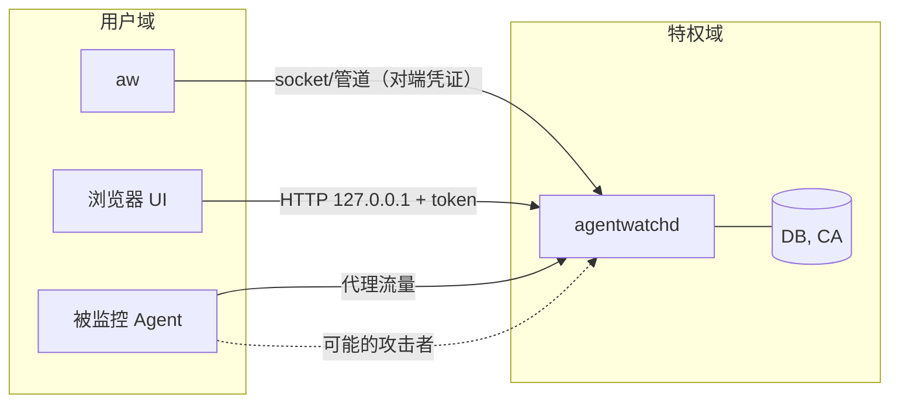

# 安全与隐私

> 状态：草案
> 最后更新：2026-10-06
> 关联：REQ-07、NFR-09、[ADR-0005](../03-adr/0005-privileged-daemon-split.md)、[ADR-0006](../03-adr/0006-explicit-mitm-proxy-for-url.md)、[ADR-0012](../03-adr/0012-no-content-redact-before-write.md)

AgentWatch 本身就是一个**高权限、能看到大量敏感信息**的程序。它的安全性与审计能力同等重要。

## 1. 资产与信任边界

| 资产 | 敏感性 | 位置 |
|---|---|---|
| 数据库（路径、命令行、URL、域名） | 高：可以还原用户的工作内容 | 数据目录 |
| 代理 CA 私钥 | **极高**：泄露后可以对信任它的进程做中间人攻击 | 数据目录 `ca/` |
| UI token / ticket | 中：可以读取该用户的会话 | 内存 |
| daemon 特权 | **极高**：具备 root / SYSTEM 权限 | 进程 |
| 内存中的未脱敏事件 | 高 | 管道 Redact 之前 |

**关键假设**：被监控的 Agent 以普通用户身份运行，并且**可能是对手**。它会试图做三类事：
- 读取审计数据（其中有其他会话的内容）；
- 干扰采集；
- 利用 daemon 提权。

但它不具备 root 权限。如果 Agent 已经是 root，就超出了我们的防护范围，见非目标。

## 2. STRIDE 威胁模型

| 类别 | 威胁 | 缓解措施 | 状态 |
|---|---|---|---|
| **S 仿冒** | 其他本地进程冒充 CLI 或 UI 调用 API | socket/管道使用对端凭证判定用户；HTTP 必须带由一次性 ticket 换来的 token；校验 `Host` 头防止 DNS rebinding | 设计 |
| S | 网页（恶意站点）对 127.0.0.1:7456 发起跨站请求 | 不开 CORS；所有修改类端点都要求 `Authorization` 头，简单跨站请求无法携带；不使用 cookie 鉴权 | 设计 |
| S | 被监控进程伪造 E3 自报告 | E3 只作为参考，始终低于 E1；E3 与 E1 不一致时生成发现 | 设计 |
| **T 篡改** | 普通用户修改或删除数据库 | 数据目录归 root/SYSTEM 所有，权限 0700（Unix）或仅 SYSTEM + Administrators（Windows） | 设计 |
| T | Agent 进程逃出范围 | 启动模式使用内核容器（见 process-tracking）；识别归属中断并如实记录 | 设计 |
| T | Agent 杀死或干扰 daemon | 普通用户无法结束 root/SYSTEM 进程；daemon 自身的意外退出由服务管理器拉起，并记录 `restart` 缺口 | 设计 |
| T | Agent 制造大量事件，把关键事件淹没或挤掉 | 不同类别优先级不同；关键事件（exec、open、delete、connect）最后才丢弃；所有丢弃都记入缺口 | 设计 |
| **R 抵赖** | 用户事后否认自己删除过会话 | 会话删除和清理都写入 `schema_meta` 中的 purge 记录；可选开启导出签名（C） | P3+ |
| **I 信息泄露** | 普通用户 A 读取用户 B 的会话 | API 按 `user_id` 授权 | 设计 |
| I | 凭证进入数据库（argv 中的 token、URL 查询参数、请求头） | 先脱敏再写入（§3）；请求头使用白名单 | 设计 |
| I | 文件内容和 body 泄露 | 默认不存；哈希比对只在内存中进行 | 设计 |
| I | CA 私钥泄露 | §5 | 设计 |
| I | 日志泄露敏感信息 | daemon 日志只记录自身状态，不记录事件内容；在 `tracing` 层用类型包装禁止打印 `RawEvent` 内容 | 设计 |
| I | 导出文件被随意传播 | 导出内容同样是已脱敏数据；提供 `--redact-paths` / `--redact-hosts` | 设计 |
| I | 崩溃转储中包含未脱敏事件 | 关闭 daemon 的 core dump（Linux 上设 `prctl(PR_SET_DUMPABLE, 0)`） | 设计 |
| **D 拒绝服务** | 事件风暴导致 CPU 或磁盘耗尽 | 限流、降级阶梯、单会话体积上限、磁盘余量保护（见 performance-budget、storage） | 设计 |
| D | 恶意筛选表达式拖慢查询 | 不支持正则；查询超时 5 秒（`sqlite3_progress_handler`） | 设计 |
| **E 提权** | 通过 `aw run` 以 root 身份启动程序 | daemon 必须以调用者的凭证启动目标，禁止调用方指定用户；在子进程中先 `setgroups` 再 `setgid`/`setuid`，并验证无法恢复权限 | 设计、需测试 |
| E | 通过传入的 env 注入特权代码 | 启动目标进程时，这些 env 只作用于已经降权的子进程；daemon 自身不读取调用者传入的 env | 设计 |
| E | 解析器漏洞（eBPF 事件、DNS/TLS 解析、HTTP 解析） | 只用 Rust 安全代码解析，对外部输入做长度上限检查；fuzz 目标覆盖 DNS、ClientHello、筛选语法和 eslogger JSON | 计划中 |
| E | 规则文件带来代码执行 | 规则是纯声明式 TOML，没有脚本能力；`rules.d/` 只允许管理员写入 | 设计 |
| E | 用户进程在特权文件操作中利用 symlink 攻击 | daemon 只读写自己的数据目录；做哈希比对而读取用户文件时带 `O_NOFOLLOW`，以只读方式打开，并且不读特殊文件（FIFO、设备）。在 Linux 上可以切换到文件属主的文件系统 uid 再读【待验证】 | 设计 |

## 3. 脱敏规则

### 3.1 处理方式
- 规则按下表顺序依次应用。被替换的值写成 `«redacted:<rule_id>»`，当前会话内可以附加加盐短哈希。
- 用户可以在 `[redaction]` 中追加规则。内置规则只能整体关闭：需要管理员权限，并且在 UI 中长期显示警示。
- 正则使用 Rust `regex` crate，它保证线性时间，不会造成 ReDoS。

### 3.2 默认规则

**A. 命令行参数（argv）**

| ID | 模式 | 处理 |
|---|---|---|
| `argv.flag_secret` | 参数名匹配 `(?i)^--?(?:[a-z0-9-]*[-_])?(password\|passwd\|pwd\|token\|secret\|api[-_]?key\|access[-_]?key\|auth\|credential\|private[-_]?key)$` | 替换**下一个**参数 |
| `argv.flag_secret_eq` | `(?i)^(--?(?:[a-z0-9-]*[-_])?(?:password\|passwd\|token\|secret\|api[-_]?key\|auth\|credential))=(.+)$` | 替换 `=` 之后的部分 |
| `argv.header` | 前一个参数是 `-H` 或 `--header`，且本参数匹配 `(?i)^(authorization\|cookie\|x-api-key\|proxy-authorization)\s*:` | 替换冒号之后的部分 |
| `argv.basic_auth` | `curl -u user:pass` 形式：前一个参数是 `-u` / `--user` | 替换冒号之后的部分 |
| `argv.mysql_p` | `^-p(.+)$`，只在 exe 为 mysql、mysqldump 时生效 | 替换 |
| `argv.env_assign` | 形如 `KEY=VALUE`，且 KEY 命中下方环境变量规则 | 替换 VALUE |

**B. 通用 token 形态（作用于 argv、URL、请求头值、E3 摘要）**

| ID | 正则 |
|---|---|
| `tok.aws_akid` | `\b(AKIA\|ASIA)[0-9A-Z]{16}\b` |
| `tok.github` | `\bgh[pousr]_[A-Za-z0-9]{36,255}\b` 与 `\bgithub_pat_[A-Za-z0-9_]{22,255}\b` |
| `tok.anthropic` | `\bsk-ant-[A-Za-z0-9_\-]{20,}\b` |
| `tok.openai` | `\bsk-(?:proj-)?[A-Za-z0-9_\-]{20,}\b` |
| `tok.slack` | `\bxox[abprs]-[A-Za-z0-9-]{10,}\b` |
| `tok.google_api` | `\bAIza[0-9A-Za-z_\-]{35}\b` |
| `tok.stripe` | `\b(?:sk\|rk)_(?:live\|test)_[A-Za-z0-9]{16,}\b` |
| `tok.jwt` | `\beyJ[A-Za-z0-9_-]{8,}\.[A-Za-z0-9_-]{8,}\.[A-Za-z0-9_-]{8,}\b` |
| `tok.private_key` | `-----BEGIN [A-Z ]*PRIVATE KEY-----` 之后的内容，直到 END 行 |
| `tok.bearer` | `(?i)\bbearer\s+[A-Za-z0-9._~+/\-]+=*` |
| `tok.url_userinfo` | `(?i)\b([a-z][a-z0-9+.-]*://)([^/\s:@]+):([^/\s@]+)@` → 只替换密码部分 |
| `tok.high_entropy`（可选，默认关） | 长度 ≥ 32、Shannon 熵 ≥ 4.0 的 `[A-Za-z0-9+/_=-]` 串。误伤较多，比如 git commit 哈希。开启时跳过 40 位和 64 位纯十六进制串 |

**C. URL**

| ID | 规则 |
|---|---|
| `url.query_secret` | 查询参数名匹配 `(?i)^(?:.*[-_])?(token\|key\|apikey\|api_key\|secret\|password\|passwd\|pwd\|sig\|signature\|auth\|code\|session\|sid\|access_token\|refresh_token\|client_secret\|x-amz-[a-z-]+)$` 时替换其值 |
| `url.fragment` | 去掉 `#` 之后的全部内容（OAuth 隐式流会把 token 放在这里） |
| `url.path_token` | 路径中有单段匹配 B 类 token 形态时替换 |

**D. 环境变量**
- 默认**只保留白名单中的变量名**，其余一律丢弃。白名单为：`PATH`、`HOME`、`USER`、`SHELL`、`PWD`、`LANG`、`TERM`、`HTTP(S)_PROXY`、`NO_PROXY`、`NODE_OPTIONS`、`VIRTUAL_ENV`、`CI`。
- 白名单内的变量值仍会经过 B 类规则。
- 变量名匹配 `(?i)(token|secret|key|password|passwd|credential|auth|cookie|session)` 的一律不保留值，即使它在白名单中。

**E. HTTP 头**
- **白名单（存值）**：`Host`、`User-Agent`、`Content-Type`、`Content-Length`、`Content-Encoding`、`Accept`、`Accept-Encoding`、`Referer`（经 C 类规则处理）、`Origin`、`X-Request-Id`、`Server`、`Location`（经 C 类规则处理）。
- **黑名单（只记录“存在”）**：`Authorization`、`Proxy-Authorization`、`Cookie`、`Set-Cookie`、`X-Api-Key`、`Api-Key`、`X-Auth-Token`、`X-Amz-Security-Token`、以及任何名称匹配 D 类关键词的头。
- **其他头**：只记录头名。

**F. 路径（可选，导出时使用）**
- `--redact-paths` 把家目录前缀替换为 `~`，把用户名替换为 `<user>`。

### 3.3 测试
- `aw-pipeline/tests/redact_corpus/` 中有正例和反例语料，分别用来测试“必须被替换”和“不应被替换”。每条规则至少各有 3 个用例。
- 使用 proptest：随机生成 token 并嵌入任意文本，断言输出中不含原 token。

## 4. 敏感路径规则

- 命中敏感路径规则只会打上标签并触发 `sensitive_access` 发现，**不会**读取文件内容。
- 例外是代理会话中的哈希比对，见 evidence-model §6。
- glob 语法与筛选语法一致；`~` 指会话用户的家目录。

| 规则 ID | Linux | macOS | Windows |
|---|---|---|---|
| `ssh-keys` | `~/.ssh/**`（不含 `*.pub`、`known_hosts`） | 同 Linux | `~\.ssh\**` |
| `gpg` | `~/.gnupg/**` | 同 Linux | `~\AppData\Roaming\gnupg\**` |
| `cloud-aws` | `~/.aws/credentials`、`~/.aws/config`、`~/.aws/sso/cache/**` | 同 Linux | `~\.aws\**` |
| `cloud-gcp` | `~/.config/gcloud/**` | 同 Linux | `~\AppData\Roaming\gcloud\**` |
| `cloud-azure` | `~/.azure/**` | 同 Linux | `~\.azure\**` |
| `kube` | `~/.kube/config`、`~/.kube/**` | 同 Linux | `~\.kube\**` |
| `docker-auth` | `~/.docker/config.json` | 同 Linux | `~\.docker\config.json` |
| `git-cred` | `~/.git-credentials`、`~/.config/git/credentials` | 同 Linux | `~\.git-credentials` |
| `pkg-tokens` | `~/.npmrc`、`~/.pypirc`、`~/.cargo/credentials*`、`~/.gem/credentials`、`~/.config/gh/hosts.yml` | 同 Linux | `~\.npmrc`、`~\.pypirc`、`~\.cargo\credentials*`、`~\AppData\Roaming\GitHub CLI\hosts.yml` |
| `netrc` | `~/.netrc` | 同 Linux | `~\_netrc` |
| `dotenv` | `**/.env`、`**/.env.*`（不含 `.env.example`、`.env.sample`） | 同 Linux | 同 Linux |
| `key-files` | `**/*.pem`、`**/*.key`、`**/*.p12`、`**/*.pfx`、`**/id_rsa*`、`**/id_ed25519*` | 同 Linux | 同 Linux |
| `browser-profile` | `~/.mozilla/**`、`~/.config/google-chrome/**`、`~/.config/chromium/**`、`~/.config/BraveSoftware/**` | `~/Library/Application Support/Google/Chrome/**`、`~/Library/Application Support/Firefox/**`、`~/Library/Safari/**`、`~/Library/Cookies/**` | `~\AppData\Local\Google\Chrome\User Data\**`、`~\AppData\Roaming\Mozilla\Firefox\**`、`~\AppData\Local\Microsoft\Edge\User Data\**` |
| `os-keystore` | `~/.local/share/keyrings/**` | `~/Library/Keychains/**` | `~\AppData\Roaming\Microsoft\Credentials\**`、`~\AppData\Local\Microsoft\Credentials\**`、`~\AppData\Roaming\Microsoft\Protect\**` |
| `shell-history` | `~/.bash_history`、`~/.zsh_history`、`~/.local/share/fish/fish_history` | 同 Linux | `~\AppData\Roaming\Microsoft\Windows\PowerShell\PSReadLine\ConsoleHost_history.txt` |
| `agent-config` | `~/.claude/**`、`~/.codex/**`、`~/.config/github-copilot/**`、`~/.cursor/**` | 同 Linux | 同 Linux（`~\.claude\**` 等） |
| `system-secrets` | `/etc/shadow`、`/etc/sudoers*`、`/etc/ssh/ssh_host_*_key` | `/etc/master.passwd`、`/Library/Keychains/**` | `C:\Windows\System32\config\SAM`、`C:\Windows\System32\config\SECURITY` |

> `agent-config` 规则有一个特殊处理：Agent 读取自己的配置目录是正常行为。所以当访问者的 `AgentProfile` 与目录归属一致时（例如 claude 读 `~/.claude`），只打 `info` 级标签，不生成发现。

## 5. 代理 CA 证书生命周期

| 阶段 | 行为 |
|---|---|
| 生成 | daemon 首次需要代理时生成：ECDSA P-256 自签 CA；CN 为 `AgentWatch Local CA <host_id短串> <日期>`；`basicConstraints CA:TRUE, pathlen:0`；`nameConstraints` 不设置（需要签发任意域名）；有效期 90 天 |
| 存储 | 私钥存放在 `<data>/ca/ca.key`。Unix 上权限 0600、属主 root；Windows 上仅 SYSTEM 可读，并用 DPAPI（机器范围）加密。macOS 可选存入系统钥匙串【待验证】。私钥永不离开 daemon 进程 |
| 分发 | 只把**公钥证书**写入 `<session_tmp>/ca.pem` 与 `bundle.pem`，供被监控进程读取。该目录归会话用户所有，会话结束后删除 |
| 信任范围 | **不**安装到系统或用户证书库，只通过环境变量对单个进程树生效。用户如果确实需要（如 Go 在 macOS 上只认系统证书库），可以显式执行 `aw proxy trust --user`，并会看到高风险确认提示；卸载时自动移除【待验证】 |
| 叶证书 | 按需签发；有效期 7 天；只缓存在内存中，不落盘 |
| 轮换 | 到期前 7 天自动轮换；用户也可以通过 UI 或 `aw proxy rotate-ca` 手动轮换。旧 CA 继续服务正在进行的会话，之后删除 |
| 撤销 / 卸载 | `aw daemon uninstall` 会删除 CA 目录，并检查和移除用户曾经显式安装到证书库的副本（对应 NFR-09） |
| 泄露响应 | 怀疑泄露时执行 `aw proxy rotate-ca --revoke-now`，立即终止所有代理会话 |

命令见 [api-and-cli §2](api-and-cli.md#2-cli-命令树) 的 `aw proxy` 子命令。

## 6. 其他安全要求

- **供应链**：
  - `cargo-deny` 检查许可证和已知漏洞；
  - `cargo-audit` 纳入 CI；
  - 前端依赖跟随 Dependabot 更新；
  - 发布产物附带 SBOM（CycloneDX）和校验和。
- **签名**：Windows 使用 Authenticode；macOS 使用 Developer ID 签名并公证；Linux 提供带签名的校验和。详见 ci-release。
- **最小能力**（Linux）：systemd 单元文件配置如下：
  - `CapabilityBoundingSet=CAP_BPF CAP_PERFMON CAP_SYS_ADMIN CAP_SYS_RESOURCE CAP_SETUID CAP_SETGID CAP_DAC_READ_SEARCH CAP_SYS_PTRACE`；
  - `ProtectHome=read-only`、`ProtectSystem=strict`；
  - `ReadWritePaths=/var/lib/agentwatch /run/agentwatch /sys/fs/cgroup/agentwatch.slice`。
  - 【待验证】哪些能力是确实必须的，见 [SPIKE-01](../06-research/SPIKE-01-linux-aya-poc.md)。
- **自身可见性**：监控进行时，`aw run` 在终端中显示提示，UI 显示录制中标记。本工具不提供隐藏运行模式。
