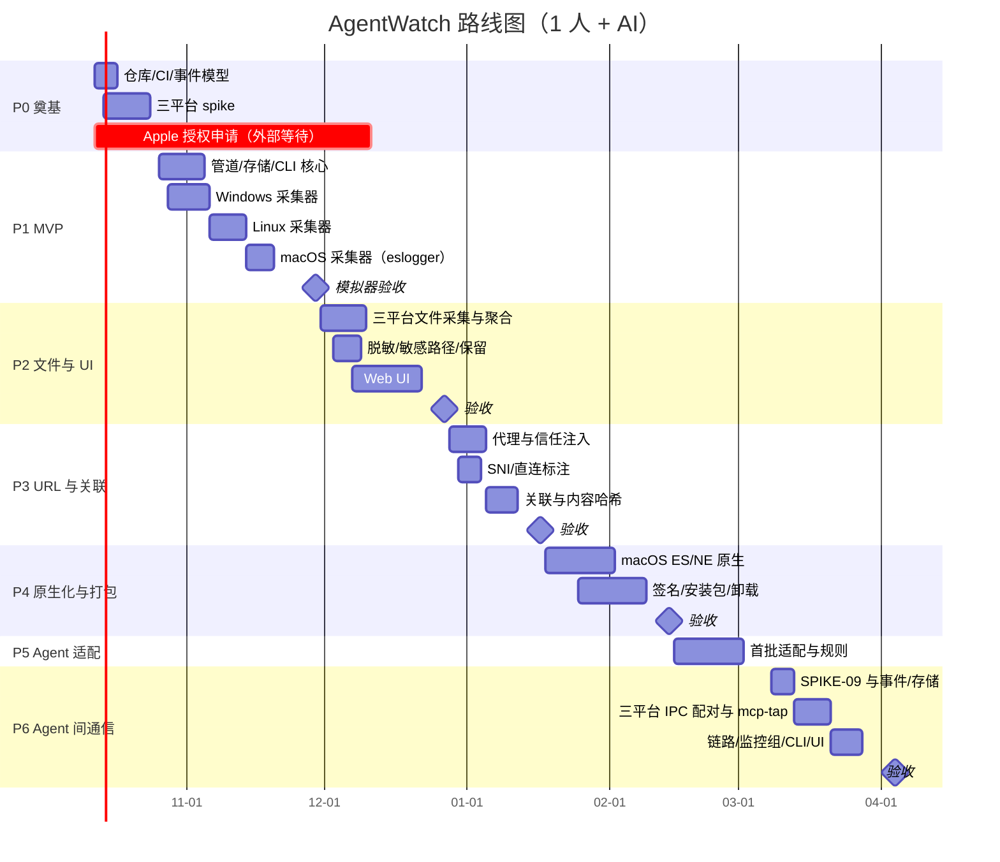
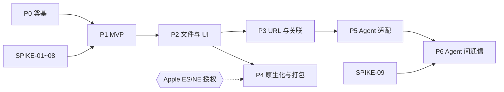

# 路线图

> 状态：草案
> 最后更新：2026-10-07
> 关联：[requirements](../00-overview/requirements.md)、[tasks](tasks/README.md)、[risks](risks.md)

估算基准：**1 名开发者 + AI 辅助**，每周约 5 个有效工作日。起始日 2026-10-12（周一）。日期是规划值，每个阶段结束时按实际速度重排。

## 1. 阶段总览

| 阶段 | GitHub Milestone | 计划区间 | 任务清单 | 一句话目标 |
|---|---|---|---|---|
| P0 | `P0 奠基` | 2026-10-12 → 2026-10-25（2 周） | [P0-foundation](tasks/P0-foundation.md) | 骨架可构建、事件模型定稿、三平台技术验证完成 |
| P1 | `P1 MVP` | 2026-10-26 → 2026-11-29（5 周） | [P1-mvp](tasks/P1-mvp.md) | 三平台可追踪进程树、命令、按进程流量与 DNS，落库可查可导 |
| P2 | `P2 文件与 UI` | 2026-11-30 → 2026-12-27（4 周） | [P2-files-ui](tasks/P2-files-ui.md) | 文件访问完整采集与聚合、脱敏、保留，Web UI 可用 |
| P3 | `P3 URL 与关联` | 2026-12-28 → 2027-01-17（3 周） | [P3-url-correlation](tasks/P3-url-correlation.md) | 代理拿完整 URL、SNI、推测关联与内容哈希匹配 |
| P4 | `P4 原生化与打包` | 2027-01-18 → 2027-02-14（4 周） | [P4-native-packaging](tasks/P4-native-packaging.md) | macOS 原生 ES/NE、三平台签名安装包、干净卸载 |
| P5 | `P5 Agent 适配` | 2027-02-15 → 2027-03-07（首批 3 周，之后持续） | [P5-agent-adapters](tasks/P5-agent-adapters.md) | 识别主流 Agent、接入 E3 自报告、规则告警 |
| P6 | `P6 Agent 间通信` | 2027-03-08 → 2027-04-04（4 周） | [P6-inter-agent](tasks/P6-inter-agent.md) | 识别多个 Agent 实例、配对 IPC 两端、MCP 调用可见、委托链路可回溯 |

## 2. 甘特图

## 3. 阶段详情

### P0 奠基

- **目标**：确定技术路线在三平台可行，建立让 AI 能高效迭代的工程基础。
- **范围**：Cargo workspace 骨架；CI 三平台矩阵；`aw-core` 事件类型；fixtures 格式；模拟器骨架；SPIKE-01~08；Apple 授权申请；GitHub 标签、模板、Projects 初始化；首批 ADR 定稿。
- **退出标准**：
  1. `cargo check --workspace` 在三平台 CI 通过。
  2. 三平台各有一个 PoC，能对指定进程树输出 exec 与网络连接事件的 JSONL。
  3. 8 份 SPIKE 报告完成，结论回填到 [capability-matrix](../02-platforms/capability-matrix.md)，对应【待验证】标注已清理或转为风险。
  4. ADR-0001~0012 状态为“已接受”或已有替代 ADR。
  5. Apple ES（及 NE）授权申请已提交。
- **依赖**：无。

### P1 MVP

- **目标**：三平台完成“进程 + 命令 + 流量 + DNS”的采集、落库、查询与导出。
- **范围**：启动 / 附着模式；进程树；命令行；按进程流量（IP、端口、字节）；DNS 映射；管道（范围过滤、进程缓存、流量聚合、批量写入）；SQLite 存储；daemon + CLI；JSONL/CSV 导出；轮询兜底。平台顺序 **Windows → Linux → macOS**（eslogger + nettop）。
- **退出标准**：
  1. 模拟器剧本 `basic_proc_net` 在三平台通过：进程与连接事件召回率 ≥95%，上传/下载字节误差 <5%（macOS 为 S 级，误差放宽到 <15%，并在 UI/CLI 标注）。
  2. `aw run`、`aw attach`、`aw sessions`、`aw procs`、`aw flows`、`aw timeline`、`aw export`、`aw doctor`、`aw daemon` 可用。
  3. 丢事件与权限不足会写入 `gaps`。
  4. NFR-01/02 在 Windows、Linux 上达标。
- **依赖**：P0 全部；P1-MAC 依赖 SPIKE-03 结论。

### P2 文件与 UI

- **目标**：补齐文件访问审计，提供可视化的时间线与筛选。
- **范围**：三平台文件打开/读/写/删/重命名/创建；句柄级聚合；敏感路径规则；脱敏器；保留与轮转；`aw files`、`aw db purge`、`aw config`；Web UI（会话列表、概览、时间线、进程树、文件、网络、缺口、设置）。
- **退出标准**：
  1. 模拟器剧本 `file_ops` 在 Linux/Windows 召回率 ≥95%；macOS 除读取字节数（标 NA）外 ≥95%。
  2. 1 小时真实 Agent 会话数据库 <50 MB（NFR-03）。
  3. 100 万事件会话 UI 常用筛选 <300 ms（REQ-05）。
  4. 脱敏测试集全部通过，数据库中无明文 token。
- **依赖**：P1。

### P3 URL 与关联

- **目标**：在不夸大证据的前提下，把文件与网络行为关联起来。
- **范围**：`aw-proxy`（hudsucker）与信任注入；HTTP 元数据入库；SNI 解析；直连标注；关联规则引擎；结论措辞模板；内容分块哈希匹配；`aw findings`；UI 发现页；Linux TLS uprobe（可选）。
- **退出标准**：
  1. 代理模式下 Node / Python / curl 三类客户端 URL 记录准确。
  2. 每条 finding 都带证据等级，措辞由快照测试断言；不存在“上传了文件”类表述（除内容匹配证据）。
  3. 剧本 `read_then_send`（代理开启） 中内容哈希匹配命中，剧本 `read_then_send`（无代理） 中只产生“推测”。
  4. 代理关闭后系统证书库无变化。
- **依赖**：P2（文件事件）、SPIKE-04。

### P4 原生化与打包

- **目标**：达到可对外发布的质量。
- **范围**：macOS 原生 ES 采集（替代 eslogger）与 NE 系统扩展流量统计；签名、公证；Windows 安装包与代码签名；Linux deb/rpm/tar；daemon 服务化；卸载清理；dist 发布流水线；可选 Tauri 外壳。
- **退出标准**：
  1. 三平台安装包在干净虚拟机安装 → 运行剧本 → 卸载，卸载后无服务、系统扩展、CA 残留（NFR-09）。
  2. macOS 有 ES 授权时文件/进程事件升为 E1；有 NE 授权时流量升为 E1。
  3. 打 tag 自动产出 GitHub Release。
- **依赖**：P1、P2；macOS 部分依赖 Apple 授权结果（RISK-01）。

### P5 Agent 适配（持续）

- **目标**：针对主流 AI Agent 提供开箱即用的识别与自报告关联。
- **范围**：Agent 识别规则；Claude Code hooks / OTEL、Codex CLI、Cursor、Aider 等适配；E3 与 E1 事件对齐；规则告警；Agent 维度报告。
- **退出标准（首批）**：至少 2 个 Agent 的工具调用能与系统观测对齐；E3 与 E1 矛盾时以 E1 为准并提示。
- **依赖**：P3。

### P6 Agent 间通信

- **目标**：同时监控多个 Agent 之间的通信，回答“谁和谁通信了、通过什么通道、传了多少”，并能回溯委托链路。
- **范围**：SPIKE-09；IPC 事件类型与存储；三平台 IPC 两端配对；AgentInstance 识别；`aw mcp-tap`；共享工件规则与委托链路；监控组；CLI 与 UI 通信图；可选的 `aw merge`。设计见 [inter-agent-communication](../01-architecture/inter-agent-communication.md)、[ADR-0013](../03-adr/0013-inter-agent-observation.md)。
- **退出标准**：`multi_agent` 剧本在 Linux / Windows 上通道配对召回率 ≥95%；`mcp_chain` 链路断言通过；新增措辞通过 lint；开启 IPC 采集后 CPU 增量 <1%。
- **依赖**：P5（Agent 识别）、P3（代理与关联引擎）。

## 4. 关键路径与外部依赖

- **Apple 授权**是唯一不可控的外部依赖。P0 第一天提交申请；若 P4 开始时仍未获批，P4-MAC 任务标 `status:blocked`，macOS 继续使用 eslogger/nettop 方案发布，并在发布说明中标注能力降级。
- P3 与 P4 之间无硬依赖，如有第二开发者可并行。

## 5. 版本对应

| 版本 | 对应阶段 | 发布形式 |
|---|---|---|
| 0.1.0 | P1 结束 | 预发布，仅二进制压缩包，面向自用 |
| 0.2.0 | P2 结束 | 预发布，含 Web UI |
| 0.3.0 | P3 结束 | 预发布，含代理与关联 |
| 1.0.0 | P4 结束 | 正式发布，签名安装包 |
| 1.x | P5 | 按适配器增量发布 |
| 1.1.0 | P6 结束 | Agent 间通信 |

## 6. 阶段复盘

每个阶段结束时在本节追加一条复盘记录：计划与实际对比、未完成任务去向、对后续阶段日期的调整。

| 阶段 | 计划结束 | 实际结束 | 备注 |
|---|---|---|---|
| P0 | 2026-10-25 | — | — |
