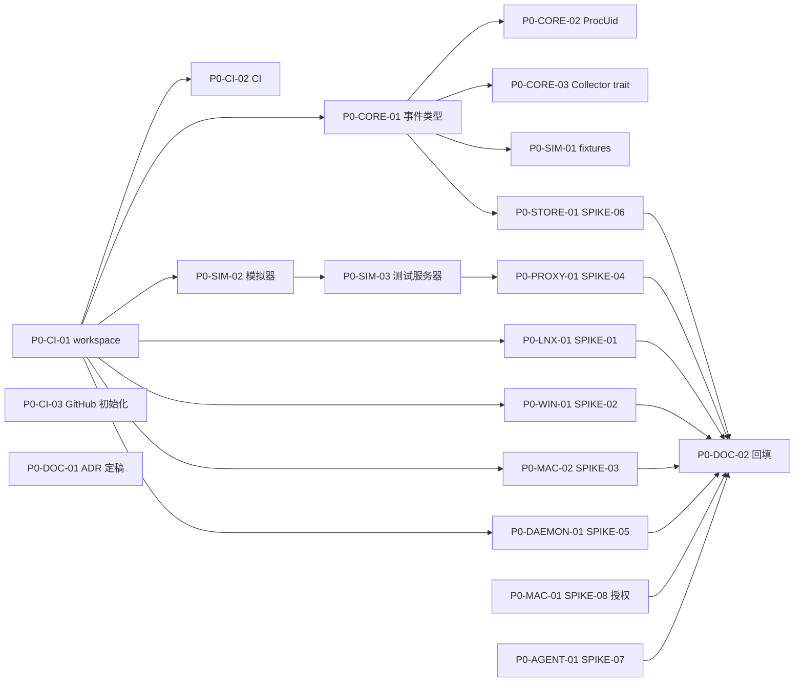

# P0 奠基 任务清单

> 状态：草案
> 最后更新：2026-10-06
> 关联：[roadmap](../roadmap.md#p0-奠基)、[任务卡规范](README.md)
> 里程碑：P0 奠基
> 截止：2026-10-25

## 1. 阶段目标

1. 工程骨架可在三平台构建与测试，AI 可以按任务卡独立交付。
2. 统一事件模型（`aw-core`）与 fixtures 格式定稿，后续平台采集器与管道可并行开发。
3. 用 8 个 spike 把方案中的【待验证】结论变成实测结论，并回填能力矩阵。
4. 尽早启动 Apple 授权申请这一不可控的外部依赖。

## 2. 任务总表

| 编号 | 标题 | AREA | 规模 | 依赖 | 并行组 |
|---|---|---|---|---|---|
| P0-MAC-01 | 申请 Apple ES 与 NE 授权（SPIKE-08） | MAC | S | 无 | A |
| P0-CI-01 | Cargo workspace 骨架与编译加速配置 | CI | M | 无 | A |
| P0-CI-02 | CI 骨架：三平台矩阵与质量门禁 | CI | M | P0-CI-01 | B |
| P0-CI-03 | GitHub 仓库初始化：标签、模板、Projects、Milestone | CI | S | 无 | A |
| P0-CORE-01 | aw-core 统一事件类型 | CORE | M | P0-CI-01 | B |
| P0-CORE-02 | 进程身份 ProcUid 与时钟抽象 | CORE | S | P0-CORE-01 | C |
| P0-CORE-03 | Collector trait 与能力声明 | CORE | S | P0-CORE-01 | C |
| P0-SIM-01 | fixtures JSONL 格式与读写工具 | SIM | S | P0-CORE-01 | C |
| P0-SIM-02 | 行为模拟器骨架与剧本格式 | SIM | M | P0-CI-01 | B |
| P0-SIM-03 | 本地测试服务器（已知字节上传/下载） | SIM | S | P0-SIM-02 | C |
| P0-LNX-01 | SPIKE-01 Linux Aya eBPF PoC | LNX | M | P0-CI-01 | B |
| P0-WIN-01 | SPIKE-02 Windows ETW PoC | WIN | M | P0-CI-01 | B |
| P0-MAC-02 | SPIKE-03 macOS eslogger + nettop PoC | MAC | M | P0-CI-01 | B |
| P0-PROXY-01 | SPIKE-04 代理信任注入矩阵 | PROXY | M | P0-SIM-03 | C |
| P0-DAEMON-01 | SPIKE-05 启动模式范围隔离 | DAEMON | M | P0-CI-01 | B |
| P0-STORE-01 | SPIKE-06 SQLite 写入吞吐与体积 | STORE | S | P0-CORE-01 | C |
| P0-AGENT-01 | SPIKE-07 Agent hooks / 遥测调研 | AGENT | S | 无 | A |
| P0-DOC-01 | ADR-0001~0012 评审定稿 | DOC | S | 无 | A |
| P0-DOC-02 | spike 结论回填能力矩阵与风险 | DOC | S | 全部 SPIKE 任务 | D |

并行组：同组任务之间文件不重叠，可同时分给多个 subagent；组 A → B → C → D 大致顺序推进。

## 3. 依赖图

## 4. 任务卡

### P0-MAC-01 申请 Apple ES 与 NE 授权（SPIKE-08）

- **AREA**: MAC
- **平台**: macos
- **类型**: spike
- **优先级**: M
- **规模**: S
- **依赖**: 无
- **关联**: REQ-01, CAP-PRIV, ADR-0009, SPIKE-08, RISK-01
- **文件范围**: `docs/06-research/SPIKE-08-apple-entitlements.md`

**背景**：macOS 原生 Endpoint Security 与 Network Extension 内容过滤需要 Apple 单独授权，审批可能耗时数周，是全项目唯一不可控的外部依赖。

**实现要点**：
- 确认 Apple Developer Program 账号（个人或组织），记录 Team ID。
- 提交 `com.apple.developer.endpoint-security.client` 申请；用途描述强调“本地审计、用户主动安装、无数据外发”。
- 确认 Network Extension（content filter / packet tunnel 中哪种可按进程统计流量）是否仍需单独申请【待验证】。
- 在 SPIKE-08 中记录：提交日期、提交内容、预期答复时间、被拒时的替代路径。

**限制**：
- 不要在仓库中提交证书、描述文件（provisioning profile）或账号凭证。

**验收标准**：
- [ ] SPIKE-08 文档记录了申请已提交及提交日期。
- [ ] RISK-01 的触发信号日期已更新。

**参考文档**：[macos](../../02-platforms/macos.md)、[ADR-0009](../../03-adr/0009-macos-two-step.md)、[risks](../risks.md#risk-01-apple-es--ne-授权审批慢或被拒)

### P0-CI-01 Cargo workspace 骨架与编译加速配置

- **AREA**: CI
- **平台**: all
- **类型**: chore
- **优先级**: M
- **规模**: M
- **依赖**: 无
- **关联**: NFR-07, NFR-08, ADR-0001, RISK-09
- **文件范围**: `Cargo.toml`, `rust-toolchain.toml`, `.cargo/config.toml`, `crates/*/Cargo.toml`, `crates/*/src/lib.rs|main.rs`, `xtask/`

**背景**：后续所有任务都在这个骨架上展开；crate 边界决定了哪些代码可无特权测试。

**实现要点**：
- 按 [repo-layout](../../05-dev/repo-layout.md) 创建 12 个 crate（空实现 + 一个可通过的占位测试），依赖方向严格按文档。
- 平台 crate 在 `Cargo.toml` 中用 `[target.'cfg(...)'.dependencies]` 隔离；非目标平台编译为空 crate，保证 `cargo check --workspace` 三平台均可通过。
- `aw-ebpf` 不加入默认 workspace members（需要 bpf 目标与 nightly），由 `xtask build-ebpf` 构建。
- `workspace.dependencies` 统一版本；`[profile.dev]` 设置 `debug = "line-tables-only"`，依赖用 `opt-level = 1`。
- `.cargo/config.toml`：Linux 使用 mold（可选，缺失时不报错的写法注释说明）；提示 sccache 用法。
- `xtask`：先实现 `cargo xtask ci`（fmt + clippy + test）占位。

**限制**：
- 不实现任何业务逻辑；不引入未在 ADR 或设计文档中提到的重量依赖。

**验收标准**：
- [ ] `cargo check --workspace` 和 `cargo test --workspace` 在本机通过。
- [ ] `cargo tree -p aw-core` 不包含任何平台采集库。
- [ ] 在未改动代码的情况下修改一个叶子 crate，增量 `cargo check` <10 s（记录在 PR 描述）。

**参考文档**：[repo-layout](../../05-dev/repo-layout.md)、[dev-setup](../../05-dev/dev-setup.md)、[ADR-0001](../../03-adr/0001-rust-workspace.md)

### P0-CI-02 CI 骨架：三平台矩阵与质量门禁

- **AREA**: CI
- **平台**: all
- **类型**: chore
- **优先级**: M
- **规模**: M
- **依赖**: P0-CI-01
- **关联**: NFR-08, RISK-09, RISK-13
- **文件范围**: `.github/workflows/ci.yml`, `deny.toml`, `xtask/`

**背景**：AI 大量生成代码，需要自动化门禁在合并前拦住格式、lint、许可证与跨平台编译问题。

**实现要点**：
- 矩阵：`ubuntu-latest`、`windows-latest`、`macos-latest`；步骤：`cargo fmt --check` → `cargo clippy --workspace --all-targets -- -D warnings` → `cargo test --workspace`。
- 独立 job：`cargo deny check`（初版 `deny.toml`：禁止 GPL/AGPL/LGPL 静态链接）与 `cargo audit`；规则细化与 SBOM 在 P4-SEC-01。见 [ci-release](../../05-dev/ci-release.md)。
- `Swatinem/rust-cache`；`concurrency` 取消同分支旧运行。
- 独立 job：`cargo deny check licenses bans advisories`；禁止 GPL/AGPL 依赖。
- 独立 job（仅 Linux）：`cargo xtask build-ebpf`（可在 P0-LNX-01 完成后启用，先留 `if: false` 占位）。
- 文档链接检查（lychee 或同类，仅检查仓库内相对链接）。

**限制**：
- 不在 CI 中使用任何仓库 secret（签名放在 P4）。

**验收标准**：
- [ ] 空骨架 PR 上三平台 job 全绿，总时长 <15 min。
- [ ] 故意引入一个 clippy 警告的提交会使 CI 失败。
- [ ] 文档中的一个坏链接会使文档检查 job 失败。

**参考文档**：[ci-release](../../05-dev/ci-release.md)

### P0-CI-03 GitHub 仓库初始化：标签、模板、Projects、Milestone

- **AREA**: CI
- **平台**: all
- **类型**: chore
- **优先级**: M
- **规模**: S
- **依赖**: 无
- **关联**: REQ-08
- **文件范围**: `scripts/`, `.github/ISSUE_TEMPLATE/`, `.github/pull_request_template.md`

**背景**：需求与任务在 GitHub 管理（REQ-08），文档中的任务卡要能一键同步为 Issue。

**实现要点**：
- 创建远端仓库（私有），推送初始提交；开启分支保护（见 github-workflow）。
- 运行 `scripts/sync-labels.ps1` 创建标签。
- 创建 Projects v2 项目「AgentWatch」，字段：Status、Phase、Platform、Area、Size、Priority（见 github-workflow）；记录项目编号。
- 运行 `scripts/sync-issues.ps1 -DryRun` 检查解析结果，确认后同步 P0、P1。
- 修正脚本在真实环境中暴露的问题。

**限制**：
- 不要一次性同步 P2 之后的阶段（任务卡仍会变化）。

**验收标准**：
- [ ] `gh label list` 包含 `scripts/labels.json` 中全部标签。
- [ ] P0、P1 的 Issue 与 Milestone 已创建；重复运行同步脚本不产生重复 Issue。
- [ ] Projects 看板可按 Phase / Platform 分组显示。

**参考文档**：[github-workflow](../../05-dev/github-workflow.md)、[任务卡规范](README.md#5-与-github-同步)

### P0-CORE-01 aw-core 统一事件类型

- **AREA**: CORE
- **平台**: all
- **类型**: feature
- **优先级**: M
- **规模**: M
- **依赖**: P0-CI-01
- **关联**: REQ-06, NFR-07, ADR-0004, RISK-12
- **文件范围**: `crates/aw-core/`
- **额外标签**: evidence

**背景**：所有采集器只输出 `RawEvent`，所有下游只消费 `RawEvent`。这是平台并行开发的契约。

**实现要点**：
- 按 [event-schema](../../01-architecture/event-schema.md) 实现 `RawEvent`、`EventKind`、`Evidence`（E1/E2/E3/S/I/NA）、`Source`、`Gap` 等类型。
- serde 序列化为稳定 JSON（`#[serde(tag = "kind")]`），字段名 snake_case；带版本字段 `v`。
- 不可得字段：字段用 `Option<T>`，并在 `field_evidence` 中写 `NA(reason)`（ADR-0004）；提供 `RawEvent::mark_na(field, reason)` 辅助方法，并做校验：非可空语义字段为 `None` 时必须有对应 NA 条目。
- 为每种事件提供构造器与示例；快照测试（insta）锁定 JSON 形态。

**限制**：
- `aw-core` 不依赖 tokio、平台库或数据库库；只允许 serde、thiserror、time/chrono 类轻量依赖。

**验收标准**：
- [ ] `cargo test -p aw-core` 通过，快照覆盖全部 `EventKind` 变体。
- [ ] 序列化 → 反序列化往返一致（proptest 或等价测试）。
- [ ] 反序列化时未知字段被忽略；未知枚举值落到 `Unknown`；主版本 `v` 不匹配时返回明确错误（event-schema 版本策略）。

**参考文档**：[event-schema](../../01-architecture/event-schema.md)、[evidence-model](../../01-architecture/evidence-model.md)、[ADR-0004](../../03-adr/0004-evidence-levels.md)

### P0-CORE-02 进程身份 ProcUid 与时钟抽象

- **AREA**: CORE
- **平台**: all
- **类型**: feature
- **优先级**: M
- **规模**: S
- **依赖**: P0-CORE-01
- **关联**: REQ-02, CAP-PROC, ADR-0007
- **文件范围**: `crates/aw-core/src/proc.rs`, `crates/aw-core/src/time.rs`

**背景**：PID 会被复用，必须用 `(pid, start_time)` 生成稳定身份；各平台时间源不同，需要统一到单调时钟 + 墙钟。

**实现要点**：
- `ProcUid`：由 `pid` 与平台启动时间（Linux boot 以来 jiffies/ns、Windows FILETIME、macOS `p_start`）派生的 64 位哈希，并保留原始字段用于展示。
- `Timestamp`：`mono_ns` + `wall`；提供平台无关的换算接口 trait，具体实现由各采集器提供。

**限制**：
- 不在 aw-core 中调用任何系统 API。

**验收标准**：
- [ ] 同 pid 不同启动时间生成不同 `ProcUid`；相同输入结果稳定（跨进程、跨平台一致）。
- [ ] `cargo test -p aw-core proc time` 通过。

**参考文档**：[process-tracking](../../01-architecture/process-tracking.md)、[ADR-0007](../../03-adr/0007-process-identity.md)

### P0-CORE-03 Collector trait 与能力声明

- **AREA**: CORE
- **平台**: all
- **类型**: feature
- **优先级**: M
- **规模**: S
- **依赖**: P0-CORE-01
- **关联**: REQ-01, NFR-07, CAP-PRIV
- **文件范围**: `crates/aw-core/src/collector.rs`

**背景**：daemon 需要以统一方式启动、停止、监管各平台采集器，并知道它们各自能提供什么证据等级，供 `aw doctor` 与 UI 展示。

**实现要点**：
- `trait Collector`：`name()`、`capabilities() -> CapabilitySet`、`start(scope, sink)`、`update_scope()`、`stop()`、`health()`。`sink` 为有界通道的抽象（不绑定 tokio，仅定义 trait）。
- `CapabilitySet`：每个能力类别（PROC/FILE/NET/DNS/URL/SCOPE）→ 证据等级 + 不可得原因。
- `Scope`：启动模式（平台句柄由采集器解释）/ 附着模式（根 ProcUid 集合）。

**限制**：
- 不实现任何具体采集器。

**验收标准**：
- [ ] 提供一个 `MockCollector`（从 fixtures 回放）并有单测。
- [ ] `cargo doc -p aw-core` 无警告，公开 API 都有文档注释。

**参考文档**：[architecture](../../01-architecture/architecture.md)、[capability-matrix](../../02-platforms/capability-matrix.md)

### P0-SIM-01 fixtures JSONL 格式与读写工具

- **AREA**: SIM
- **平台**: all
- **类型**: feature
- **优先级**: M
- **规模**: S
- **依赖**: P0-CORE-01
- **关联**: NFR-07
- **文件范围**: `fixtures/`, `crates/aw-core/src/fixture.rs`

**背景**：录制真实事件流并在无特权环境下回放，是管道/存储/关联逻辑快速迭代的基础。

**实现要点**：
- 文件格式：首行为 header（`v`、平台、OS 版本、采集器、录制时间、剧本名），之后每行一个 `RawEvent`。可选 `.jsonl.zst` 压缩。
- 目录约定以 [repo-layout §5](../../05-dev/repo-layout.md) 为准：`fixtures/<common|platform>/<case>/events.jsonl` + `expected.snap`（insta 快照）+ `README.md`。
- `FixtureReader` / `FixtureWriter`；录制时调用脱敏（P2 之前先用占位）。
- `fixtures/README.md` 说明如何录制、命名、脱敏。

**限制**：
- fixtures 中不得包含真实用户名、主机名、token（录制工具必须替换为占位符）。

**验收标准**：
- [ ] 提交 1 个手写样例 fixture，读取后事件数与类型断言通过。
- [ ] header 版本不匹配时给出明确错误。

**参考文档**：[testing](../../05-dev/testing.md#3-fixtures-回放测试)、[event-schema](../../01-architecture/event-schema.md)

### P0-SIM-02 行为模拟器骨架与剧本格式

- **AREA**: SIM
- **平台**: all
- **类型**: feature
- **优先级**: M
- **规模**: M
- **依赖**: P0-CI-01
- **关联**: REQ-02, REQ-03, REQ-04
- **文件范围**: `sim/`

**背景**：模拟器按剧本产生“已知的真实行为”，用于衡量采集召回率与字节误差，是各阶段验收的核心。

**实现要点**：
- `sim` 为独立二进制（可作为 workspace 成员 `sim/`），读取 TOML 剧本，按步骤执行：`spawn`（含多层派生）、`read_file`、`write_file`、`delete`、`rename`、`http_upload`、`http_download`、`dns_lookup`、`sleep`。
- 每步在本地写出“真值日志”（ground truth JSONL：动作、pid、路径、字节、时间）。
- 剧本格式及示例剧本 `smoke.toml` 见 [testing](../../05-dev/testing.md)。
- 诱饵文件放在临时目录，内容为可识别的随机串，结束后清理。

**限制**：
- 模拟器只访问自己创建的临时目录与本地测试服务器；不得读取真实的 `~/.ssh` 等敏感位置（敏感路径用临时目录内的同名结构模拟）。

**验收标准**：
- [ ] `cargo run -p sim -- run sim/scenarios/smoke.toml --truth out/truth.jsonl` 在三平台成功并生成真值日志。
- [ ] 真值日志中记录了 3 层派生进程的 pid 与父子关系。

**参考文档**：[testing](../../05-dev/testing.md#4-行为模拟器)

### P0-SIM-03 本地测试服务器（已知字节上传/下载）

- **AREA**: SIM
- **平台**: all
- **类型**: feature
- **优先级**: M
- **规模**: S
- **依赖**: P0-SIM-02
- **关联**: REQ-04
- **文件范围**: `sim/src/server/`

**背景**：流量统计的准确度需要服务端对照值。

**实现要点**：
- `sim serve`：HTTP 与 HTTPS（自签证书）端点 `POST /upload`（记录收到字节）、`GET /download?bytes=N`。
- 服务端同样写真值日志（按连接的应用层字节与 TLS 字节）。
- 可选本地 DNS 存根（把 `sim.agentwatch.test` 解析到 127.0.0.1）【待验证：三平台无特权方式】。

**限制**：
- 只监听 127.0.0.1。

**验收标准**：
- [ ] 上传 10 MB，服务端真值与客户端真值一致。
- [ ] `cargo test -p sim` 通过。

**参考文档**：[testing](../../05-dev/testing.md#4-行为模拟器)

### P0-LNX-01 SPIKE-01 Linux Aya eBPF PoC

- **AREA**: LNX
- **平台**: linux
- **类型**: spike
- **优先级**: M
- **规模**: M
- **依赖**: P0-CI-01
- **关联**: CAP-PROC, CAP-NET, CAP-FILE, CAP-SCOPE, ADR-0010, SPIKE-01, RISK-05
- **文件范围**: `crates/aw-ebpf/`, `crates/aw-collector-linux/examples/`, `docs/06-research/SPIKE-01-linux-aya-poc.md`

**背景**：验证 Aya 工具链、CO-RE 可移植性、按 cgroup 过滤和流量探针口径。

**实现要点**：
- 探针：`sched_process_exec/fork/exit`、`tcp_sendmsg`、`tcp_cleanup_rbuf`、`openat`（tracepoint）。
- 内核侧按 cgroup id 过滤；ring buffer 输出到用户态，打印 JSONL。
- 测量：在 Ubuntu 22.04/24.04、Debian 12、一个 5.10 内核上的加载情况；`cargo build` 的 bpf 构建耗时；GitHub runner 上 sudo 是否可运行。
- 测量 `tcp_sendmsg` 字节与 sim 服务器真值的误差。

**限制**：
- PoC 代码放在 `examples/`，不要求生产质量；不写管道集成。

**验收标准**：
- [ ] `sudo cargo run --example poc -- --cgroup <path>` 输出 sim smoke 剧本的 exec 与网络事件。
- [ ] SPIKE-01 报告包含：内核兼容表、字节误差、构建时间、CI 可行性、结论与对 ADR-0010 的影响。

**参考文档**：[linux](../../02-platforms/linux.md)、[SPIKE-01](../../06-research/SPIKE-01-linux-aya-poc.md)

### P0-WIN-01 SPIKE-02 Windows ETW PoC

- **AREA**: WIN
- **平台**: windows
- **类型**: spike
- **优先级**: M
- **规模**: M
- **依赖**: P0-CI-01
- **关联**: CAP-PROC, CAP-FILE, CAP-NET, CAP-DNS, ADR-0008, SPIKE-02, RISK-02
- **文件范围**: `crates/aw-collector-windows/examples/`, `docs/06-research/SPIKE-02-windows-etw-poc.md`

**背景**：验证仅凭 ETW（不写驱动）能否拿到进程、命令行、文件、按 PID 网络字节与 DNS，并测量事件量与 CPU 开销。

**实现要点**：
- 用 ferrisetw 订阅：Microsoft-Windows-Kernel-Process、Kernel-File、Kernel-Network、DNS-Client；对比 NT Kernel Logger 方式。
- 确认哪个提供者的进程事件带完整命令行；确认 FileObject → 路径的映射方式。
- 在「`cargo build` 一个中型项目」场景下测量每秒事件数、CPU、EventsLost。
- 对比 sim 服务器真值的网络字节误差。

**限制**：
- 不引入 WinDivert；不写驱动。

**验收标准**：
- [ ] 管理员运行 `cargo run --example poc -- --pid <pid>` 输出该进程树的 exec、文件、网络、DNS 事件 JSONL。
- [ ] SPIKE-02 报告包含：各提供者字段清单、事件量与 CPU、丢失情况、字节误差、结论。

**参考文档**：[windows](../../02-platforms/windows.md)、[SPIKE-02](../../06-research/SPIKE-02-windows-etw-poc.md)

### P0-MAC-02 SPIKE-03 macOS eslogger + nettop PoC

- **AREA**: MAC
- **平台**: macos
- **类型**: spike
- **优先级**: M
- **规模**: M
- **依赖**: P0-CI-01
- **关联**: CAP-PROC, CAP-FILE, CAP-NET, CAP-DNS, ADR-0009, SPIKE-03, RISK-03
- **文件范围**: `crates/aw-collector-macos/examples/`, `docs/06-research/SPIKE-03-macos-eslogger-poc.md`

**背景**：在拿到 ES 授权前，macOS 依赖系统自带工具。需要验证其可用性、字段和开销。

**实现要点**：
- 以 root + 完全磁盘访问运行 `eslogger exec fork exit open close write unlink rename create --format json`，解析字段。
- `nettop -P -L 0 -J bytes_in,bytes_out -x` 或等价参数拿按进程字节；`libproc`（`proc_pidfdinfo`）拿 socket 五元组。
- `tcpdump -i pktap -k` 是否能拿到带进程信息的 DNS 包。
- 测量 eslogger 在高负载下的 CPU 与延迟；nettop 字节误差（对比 sim 服务器）。

**限制**：
- 不编写 Swift 扩展。

**验收标准**：
- [ ] `sudo cargo run --example poc -- --pid <pid>` 输出 smoke 剧本的 exec 与网络事件。
- [ ] SPIKE-03 报告包含：权限引导步骤、字段清单、macOS 13/14/15 差异【至少一个版本实测】、误差与开销、结论。

**参考文档**：[macos](../../02-platforms/macos.md)、[SPIKE-03](../../06-research/SPIKE-03-macos-eslogger-poc.md)

### P0-PROXY-01 SPIKE-04 代理信任注入矩阵

- **AREA**: PROXY
- **平台**: all
- **类型**: spike
- **优先级**: M
- **规模**: M
- **依赖**: P0-SIM-03
- **关联**: REQ-04, CAP-URL, ADR-0006, SPIKE-04, RISK-04
- **文件范围**: `crates/aw-proxy/examples/`, `docs/06-research/SPIKE-04-proxy-trust-injection.md`

**背景**：完整 URL 依赖显式 MITM 代理；各运行时认不认代理、怎么注入信任差异很大。

**实现要点**：
- hudsucker + rcgen 最小代理，打印方法、URL、body 字节数。
- 逐一测试客户端：curl、Node（fetch/undici、axios）、Python（requests、httpx）、Go、git、一个 Electron 应用、至少一个真实 AI CLI（如 Claude Code）。
- 记录：认哪个代理变量、哪个 CA 变量、是否证书固定、是否尝试 QUIC。

**限制**：
- 不将 CA 安装到系统证书库。

**验收标准**：
- [ ] SPIKE-04 报告中的矩阵覆盖上述至少 8 种客户端。
- [ ] 给出 `aw run --proxy` 需要注入的环境变量最小集合。

**参考文档**：[network-attribution](../../01-architecture/network-attribution.md)、[ADR-0006](../../03-adr/0006-explicit-mitm-proxy-for-url.md)

### P0-DAEMON-01 SPIKE-05 启动模式范围隔离

- **AREA**: DAEMON
- **平台**: all
- **类型**: spike
- **优先级**: M
- **规模**: M
- **依赖**: P0-CI-01
- **关联**: REQ-02, CAP-SCOPE, ADR-0005, SPIKE-05, RISK-15
- **文件范围**: `crates/aw-daemon/examples/`, `docs/06-research/SPIKE-05-launch-scoping.md`

**背景**：启动模式要确保所有后代进程都被纳入。同时，特权 daemon 要以普通用户身份启动目标程序。

**实现要点**：
- Linux：创建 cgroup v2 子组并把子进程放入（daemon 创建、用户身份启动）；验证 `setsid`/daemonize 后仍在组内。
- Windows：Job Object（`JOB_OBJECT_LIMIT_BREAKAWAY_OK` 关闭）；验证 `CREATE_BREAKAWAY_FROM_JOB` 与计划任务、WMI 创建进程的逃逸情况。
- macOS：基于 fork/exec 事件追踪 + responsible pid；验证 `launchctl` 拉起的进程是否脱离。
- 特权分离：CLI（普通用户）请求 daemon → daemon 创建范围 → CLI 自己以普通用户启动子进程并加入范围，还是 daemon 代为启动？给出推荐。

**限制**：
- 仅 PoC，不接入采集器。

**验收标准**：
- [ ] 三平台各有一个 example 启动 sim 剧本并列出范围内全部进程。
- [ ] SPIKE-05 报告列出各平台已知逃逸路径及应对。

**参考文档**：[process-tracking](../../01-architecture/process-tracking.md)、[ADR-0005](../../03-adr/0005-privileged-daemon-split.md)

### P0-STORE-01 SPIKE-06 SQLite 写入吞吐与体积

- **AREA**: STORE
- **平台**: all
- **类型**: spike
- **优先级**: M
- **规模**: S
- **依赖**: P0-CORE-01
- **关联**: NFR-03, NFR-05, ADR-0003, ADR-0011, SPIKE-06, RISK-14
- **文件范围**: `crates/aw-store/benches/`, `docs/06-research/SPIKE-06-sqlite-throughput.md`

**背景**：确认 SQLite（WAL + 批量事务）能承载聚合后的写入量，并测算每小时体积。

**实现要点**：
- 按 [storage](../../01-architecture/storage.md) 草案建表，生成合成负载：1k / 10k / 50k 行每秒。
- 测量不同批大小下的吞吐与 P99 延迟、每百万行体积、常用查询在 100 万行时的耗时。
- 对比：路径字符串内联 vs 字典表（path_id）。

**限制**：
- 不引入 DuckDB 等第二存储。

**验收标准**：
- [ ] `cargo bench -p aw-store` 可运行。
- [ ] SPIKE-06 报告给出推荐的批大小、是否采用字典表、体积估算公式。

**参考文档**：[storage](../../01-architecture/storage.md)、[performance-budget](../../01-architecture/performance-budget.md)

### P0-AGENT-01 SPIKE-07 Agent hooks / 遥测调研

- **AREA**: AGENT
- **平台**: all
- **类型**: spike
- **优先级**: S
- **规模**: S
- **依赖**: 无
- **关联**: REQ-09, SPIKE-07
- **文件范围**: `docs/06-research/SPIKE-07-agent-hooks.md`

**背景**：P5 要接入 Agent 自报告（E3）。提前调研，可以让事件模型预留字段。

**实现要点**：
- 调研 Claude Code（hooks、OpenTelemetry）、Codex CLI、Cursor、Aider、Gemini CLI 的可观测接口：是否有工具调用事件、字段、传输方式、进程特征（可执行名、命令行、父进程）。
- 输出对 `EventKind::AgentToolCall` 字段的建议。

**限制**：
- 仅调研文档，不写代码。

**验收标准**：
- [ ] SPIKE-07 报告覆盖 ≥4 个 Agent，每个给出接入方式与识别特征。

**参考文档**：[SPIKE-07](../../06-research/SPIKE-07-agent-hooks.md)、[event-schema](../../01-architecture/event-schema.md)

### P0-DOC-01 ADR-0001~0012 评审定稿

- **AREA**: DOC
- **平台**: all
- **类型**: docs
- **优先级**: M
- **规模**: S
- **依赖**: 无
- **关联**: ADR-0001, ADR-0002, ADR-0003, ADR-0004, ADR-0005, ADR-0006, ADR-0007, ADR-0008, ADR-0009, ADR-0010, ADR-0011, ADR-0012
- **文件范围**: `docs/03-adr/`

**背景**：初版 ADR 是基于经验的草案，需要结合 spike 结论定稿，作为后续开发的约束。

**实现要点**：
- 逐篇评审：背景是否准确、备选方案是否充分、后果是否写明。
- 与 spike 冲突的 ADR 改为“已取代”并新开 ADR。

**限制**：
- 不修改已定稿 ADR 的决策正文，只能新开 ADR 取代。

**验收标准**：
- [ ] `docs/03-adr/README.md` 索引中每篇 ADR 状态为“已接受”或“已取代”。

**参考文档**：[03-adr](../../03-adr/README.md)

### P0-DOC-02 spike 结论回填能力矩阵与风险

- **AREA**: DOC
- **平台**: all
- **类型**: docs
- **优先级**: M
- **规模**: S
- **依赖**: P0-LNX-01, P0-WIN-01, P0-MAC-02, P0-PROXY-01, P0-DAEMON-01, P0-STORE-01, P0-AGENT-01, P0-MAC-01
- **关联**: REQ-01, REQ-06
- **文件范围**: `docs/02-platforms/`, `docs/04-plan/risks.md`, `docs/04-plan/tasks/P1-mvp.md`

**背景**：进入 P1 前，平台能力必须是实测结论。

**实现要点**：
- 将 spike 结论写入 capability-matrix 与各平台文档，去掉已验证项的【待验证】。
- 未通过验证的能力：降级证据等级或新增风险；必要时调整 P1 任务卡。

**限制**：
- 不删除 spike 报告中的原始数据。

**验收标准**：
- [ ] `grep -rn "【待验证】" docs/02-platforms` 的剩余条目均有对应 RISK 或后续 SPIKE。
- [ ] roadmap 阶段复盘表填写 P0 实际结束日期。

**参考文档**：[capability-matrix](../../02-platforms/capability-matrix.md)、[06-research](../../06-research/README.md)
