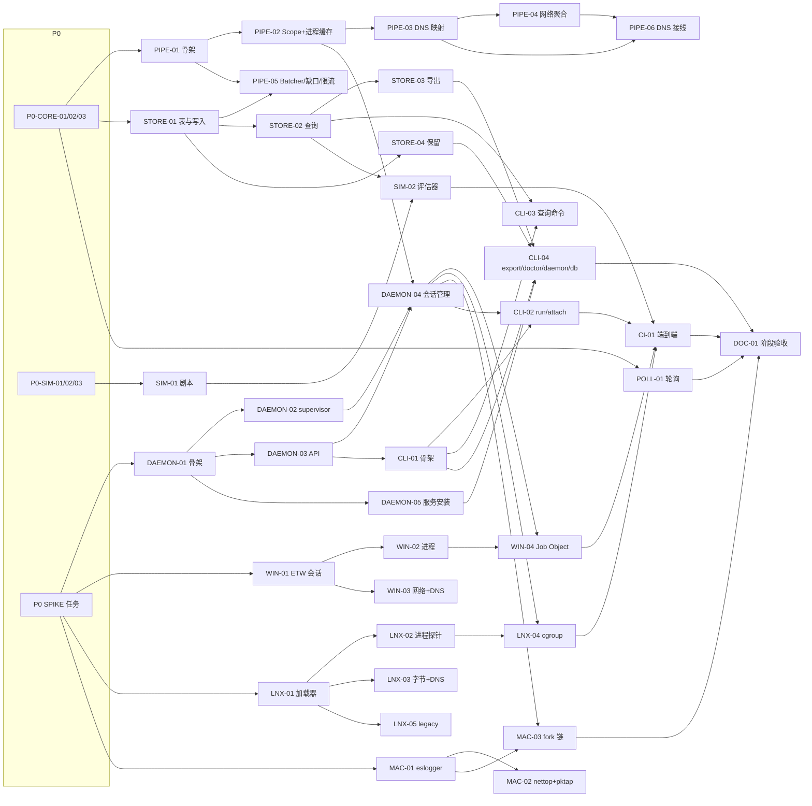

# P1 MVP 任务清单

> 状态：草案
> 最后更新：2026-10-10
> 关联：[roadmap](../roadmap.md#p1-mvp)、[任务卡规范](README.md)、[P0 任务](P0-foundation.md)
> 里程碑：P1 MVP
> 截止：2026-11-29

## 1. 阶段目标

1. 三平台完成“进程 + 命令 + 流量 + DNS”的采集、落库、查询与导出（REQ-01、REQ-02、REQ-03.2、REQ-04.1~04.3、REQ-05.2/05.3）。
2. 平台顺序 **Windows → Linux → macOS**。macOS 本阶段只用 eslogger + nettop + pktap（M1），网络字节为 S 级。
3. 平台无关部分（管道、存储、daemon、CLI）全部可用 fixtures 无特权测试（NFR-07）。
4. 丢事件、权限不足、采集器重启都会写入 `gaps`（REQ-06.4）。

**不在本阶段**：文件采集、脱敏规则全集、Web UI（P2）；代理、SNI、关联规则（P3）；macOS 原生 ES/NE（P4）。管道里为这些阶段留好挂接点即可。

**退出标准**（与 roadmap 一致，由 P1-DOC-01 统一验收）：
1. 模拟器剧本 `basic_proc_net` 在三平台通过：进程与连接事件召回率 ≥95%，上传/下载字节误差 <5%；macOS 为 S 级，误差放宽到 <15% 并在 CLI 中标注。
2. `aw run / attach / sessions / procs / flows / timeline / export / doctor / daemon` 可用。
3. 丢事件与权限不足会写入 `gaps`。
4. NFR-01/02 在 Windows、Linux 上达标。

## 2. 任务总表

| 编号 | 标题 | AREA | 规模 | 依赖 | 并行组 |
|---|---|---|---|---|---|
| P1-PIPE-01 | 管道骨架：阶段框架、有界队列、虚拟时钟与 replay | PIPE | M | P0-CORE-01, P0-CORE-02, P0-SIM-01 | A |
| P1-STORE-01 | 迁移框架、P1 表结构与批量写入器 | STORE | M | P0-CORE-01, P0-STORE-01 | A |
| P1-DAEMON-01 | daemon 骨架：配置、日志、单实例、数据目录 | DAEMON | M | P0-CI-01, P0-DAEMON-01 | A |
| P1-SIM-01 | 剧本 `basic_proc_net` 与 `typical_agent`（进程+网络部分） | SIM | S | P0-SIM-02, P0-SIM-03 | A |
| P1-POLL-01 | 轮询兜底采集器 | POLL | M | P0-CORE-03 | A |
| P1-WIN-01 | ETW 会话管理与丢失计数 | WIN | M | P0-WIN-01, P0-CORE-03 | A |
| P1-LNX-01 | aw-ebpf 构建链、加载器与档位探测 | LNX | M | P0-LNX-01, P0-CORE-03 | A |
| P1-MAC-01 | eslogger 进程事件采集 | MAC | M | P0-MAC-02, P0-CORE-03 | A |
| P1-PIPE-02 | Scope 过滤（含待定缓冲）与进程缓存 Enrich | PIPE | M | P1-PIPE-01 | B |
| P1-PIPE-05 | Batcher、缺口合并与限流 | PIPE | M | P1-PIPE-01, P1-STORE-01 | B |
| P1-STORE-02 | P1 查询层：会话、进程树、流量分组、时间线、缺口 | STORE | M | P1-STORE-01 | B |
| P1-STORE-04 | 保留策略与 `aw db stats/purge` 服务端 | STORE | S | P1-STORE-01 | B |
| P1-DAEMON-02 | 采集器 supervisor：生命周期、崩溃重启、能力探测 | DAEMON | M | P1-DAEMON-01, P0-CORE-03 | B |
| P1-DAEMON-03 | 本地 API 三通道与鉴权 | DAEMON | M | P1-DAEMON-01 | B |
| P1-DAEMON-05 | 系统服务安装与卸载 | DAEMON | M | P1-DAEMON-01 | B |
| P1-WIN-02 | 进程事件与命令行/cwd | WIN | M | P1-WIN-01 | B |
| P1-WIN-03 | Kernel-Network 与 DNS-Client 事件 | WIN | M | P1-WIN-01 | B |
| P1-LNX-02 | 进程探针 | LNX | M | P1-LNX-01 | B |
| P1-LNX-03 | TCP/UDP 字节探针与 DNS 载荷 | LNX | M | P1-LNX-01 | B |
| P1-LNX-05 | legacy 档：proc connector + sock_diag | LNX | M | P1-LNX-01 | B |
| P1-MAC-02 | nettop 采样与 pktap DNS | MAC | M | P1-MAC-01 | B |
| P1-CLI-01 | CLI 骨架与 daemon 客户端 | CLI | S | P1-DAEMON-03 | C |
| P1-PIPE-03 | DNS 映射与 IP→域名回填 | PIPE | M | P1-PIPE-02 | C |
| P1-PIPE-06 | DNS 丰富逻辑接入默认管道与流量聚合 | PIPE | M | P1-PIPE-03, P1-PIPE-04 | G |
| P1-STORE-03 | 导出 JSONL / CSV | STORE | S | P1-STORE-02 | C |
| P1-DAEMON-04 | 会话管理：run/attach/stop 编排，附着先采集后快照 | DAEMON | M | P1-DAEMON-02, P1-DAEMON-03, P1-PIPE-02 | C |
| P1-SIM-02 | 评估器 `sim eval`：召回率与字节误差报告 | SIM | M | P1-SIM-01, P1-STORE-02 | C |
| P1-PIPE-04 | 网络聚合：net_flows + 5 s 桶 + 校准 | PIPE | M | P1-PIPE-03 | D |
| P1-CLI-02 | `aw run / attach / stop / ps` | CLI | M | P1-CLI-01, P1-DAEMON-04 | D |
| P1-CLI-03 | `aw sessions / timeline / procs / flows / gaps` | CLI | M | P1-CLI-01, P1-STORE-02 | D |
| P1-WIN-04 | Windows 启动模式 Job Object 与附着快照 | WIN | M | P1-WIN-02, P1-DAEMON-04 | D |
| P1-LNX-04 | Linux cgroup v2 启动模式与 scope_pids 附着 | LNX | M | P1-LNX-02, P1-DAEMON-04 | D |
| P1-MAC-03 | macOS 挂起启动与 fork 链范围追踪 | MAC | M | P1-MAC-01, P1-DAEMON-04 | D |
| P1-CLI-04 | `aw export / doctor / daemon / db` | CLI | S | P1-CLI-01, P1-STORE-03, P1-STORE-04, P1-DAEMON-02, P1-DAEMON-05 | E |
| P1-CI-01 | Linux / Windows 托管 runner 特权端到端测试 | CI | M | P1-SIM-02, P1-WIN-04, P1-LNX-04, P1-CLI-02 | E |
| P1-DOC-01 | P1 阶段验收：性能基准、macOS 手动端到端、文档回填 | DOC | M | P1-CI-01, P1-MAC-03, P1-POLL-01, P1-CLI-04 | F |

共 36 项。并行组：同组任务的文件范围不重叠，可以同时分给多个 subagent；组 A → F 大致顺序推进。同一平台内按 Windows → Linux → macOS 安排真机验证时间。

**建议周计划**（1 人 + AI，5 周）：

| 周 | 重点 |
|---|---|
| W1（10-26） | 组 A：管道/存储/daemon 骨架，Windows ETW 会话 |
| W2（11-02） | 组 B：Windows 进程与网络、API 通道、supervisor、Linux 加载器 |
| W3（11-09） | 组 C/D：会话管理、Windows 端到端打通；Linux 探针 |
| W4（11-16） | Linux 范围追踪与 legacy、macOS M1 采集、CLI 查询命令 |
| W5（11-23） | 组 E/F：CI 端到端、导出、doctor、阶段验收 |

## 3. 依赖图

## 4. 任务卡
### P1-PIPE-01 管道骨架：阶段框架、有界队列、虚拟时钟与 replay

- **AREA**: PIPE
- **平台**: all
- **类型**: feature
- **优先级**: M
- **规模**: M
- **依赖**: P0-CORE-01, P0-CORE-02, P0-SIM-01
- **关联**: REQ-06.4, NFR-05, NFR-07, ADR-0011
- **文件范围**: `crates/aw-pipeline/`

**背景**：所有平台采集器的输出都要经过同一条管道。先把框架和回放能力做好，后续各阶段才能分别开发，并用 fixtures 在无特权环境下测试。

**实现要点**：
- 按 [pipeline §1](../../01-architecture/pipeline.md#1-总览) 定义阶段 trait：`Stage::process(&mut self, ev, out)` 与 `Stage::tick(now)`。阶段顺序固定为 Scope → Dedup → Enrich → Redact → Aggregate → (Correlate) → Batcher。P1 中 Dedup、Redact、Correlate 先用直通实现：Redact 的完整实现在 P2，Correlate 在 P3。
- 入口为有界 `tokio::mpsc`（默认 65536），采集器一侧只用 `try_send`。失败次数由 `EventSink` 暴露，供 P1-PIPE-05 生成 `Gap{dropped}`。
- 时钟抽象 `Clock`：生产环境用单调时钟；回放时用事件的 `ts_mono_ns` 驱动虚拟时钟。所有时间窗逻辑只依赖 `Clock`。
- `Pipeline::replay(events, cfg) -> Output`：输出内存中的记录（`ProcessRec`、`NetFlowRec`、`FlowBucketRec`、`DnsRec`、`GapRec`），不依赖 SQLite。
- 配置结构 `PipelineConfig`，字段名与 [architecture §7](../../01-architecture/architecture.md#7-配置) 中的 `[aggregate]`、`[store]`、`[limits]` 对齐。

**限制**：
- 不依赖 `aw-store` 和任何平台 crate。输出记录类型定义在 `aw-pipeline` 内；如果 P0 已在 `aw-core` 中定义，就复用。
- 不实现文件聚合（P2）。

**验收标准**：
- [ ] `cargo test -p aw-pipeline` 通过，包含一个用 `fixtures/` 样例回放、断言输出记录数的 insta 快照测试。
- [ ] 同一 fixture 回放两次，输出完全一致（确定性测试）。
- [ ] 基准 `cargo bench -p aw-pipeline --bench passthrough`：直通模式单核 ≥ 50 万事件/秒。

**参考文档**：[pipeline](../../01-architecture/pipeline.md)、[event-schema](../../01-architecture/event-schema.md)、[testing](../../05-dev/testing.md)

### P1-PIPE-02 Scope 过滤（含待定缓冲）与进程缓存 Enrich

- **AREA**: PIPE
- **平台**: all
- **类型**: feature
- **优先级**: M
- **规模**: M
- **依赖**: P1-PIPE-01
- **关联**: REQ-02.1, REQ-02.2, REQ-02.3, REQ-02.4, CAP-SCOPE-01, CAP-SCOPE-02, CAP-SCOPE-03, ADR-0007
- **文件范围**: `crates/aw-pipeline/src/scope.rs`, `crates/aw-pipeline/src/enrich/proc_cache.rs`

**背景**：Scope 是管道的第一道过滤，会丢掉 95% 以上的无关事件。进程缓存把每条事件与进程树关联起来，是会话归属和 `processes` 表的数据来源。

**实现要点**：
- `ScopeSet`：会话 → 根 `ProcUid` 集合 + 已纳入的后代集合。收到 `ProcessStart` 时，若父进程在集合内，就把子进程纳入。这是用户态的兜底，内核侧过滤由各采集器负责。
- **待定缓冲**：未知 PID 的事件先暂存 `scope.pending_ms`（默认 200 ms），等对应的 `ProcessStart` 到达后再判断；超时仍未知则丢弃并计数。这是为了处理 Windows IOCP 和 macOS eslogger 的竞态，见 [windows §4.1](../../02-platforms/windows.md#41-启动模式) 和 [macos §4](../../02-platforms/macos.md#4-范围追踪)。
- 进程缓存：`ProcUid → ProcInfo{pid, ppid, parent_uid, exe, argv, cwd, start, exit, agent_hint}`。进程退出后保留 `proc_cache.linger_secs`（默认 60 s）供迟到事件使用；达到容量上限后按 LRU 淘汰已退出的进程。
- 产出 `ProcessRec`（新进程、退出码更新）。ProcUid 的生成规则见 [process-tracking §2](../../01-architecture/process-tracking.md#2-进程唯一-idprocuid)。
- 归属中断：父进程是已知的系统守护进程、不在范围内时，子进程不纳入范围。守护进程列表（launchd、systemd、services.exe 等）可配置。P1 只记录 `attribution_break` 标注，不做关联规则。

**限制**：
- 不读取 `/proc`，也不调用任何平台 API；快照数据由 daemon 通过 `ScopeUpdate` 消息注入。

**验收标准**：
- [ ] 单测：3 层派生的进程全部被纳入，包括子进程事件比 fork 事件早 150 ms 到达的情况；超过 200 ms 仍未知的 PID 被丢弃并计数。
- [ ] 单测：PID 复用（同 pid、不同 start_time）时不串号。
- [ ] fixture 回放：混入 1 万条无关进程事件，输出只含会话内的进程。

**参考文档**：[process-tracking](../../01-architecture/process-tracking.md)、[pipeline §3](../../01-architecture/pipeline.md#3-各阶段)

### P1-PIPE-03 DNS 映射与 IP→域名回填

- **AREA**: PIPE
- **平台**: all
- **类型**: feature
- **优先级**: M
- **规模**: M
- **依赖**: P1-PIPE-02
- **关联**: REQ-04.3, CAP-DNS-01, CAP-DNS-02, CAP-DNS-04, ADR-0004
- **文件范围**: `crates/aw-pipeline/src/enrich/dns.rs`

**背景**：用户关心“连到了哪个域名”，而大多数连接只有 IP。域名必须标注来源，不能把推测当成观测。

**实现要点**：
- 维护 DNS 缓存：`(session?, ip) → [(qname, ts, ttl, source_evidence)]`。进程自己发出的查询（Linux eBPF、带 PID 的 Windows DNS-Client 事件）记在会话内；系统解析器代为查询的（如 macOS 的 mDNSResponder）记在全局缓存。
- 匹配顺序按 [network-attribution](../../01-architecture/network-attribution.md) 的 6 级顺序实现。P1 没有 SNI 和代理两级，先留占位。**不做 PTR 反查**。
- 回填结果写入 `NetConnect` 的 `domain` 字段，并在 `field_evidence.domain` 中给出等级：同一进程、时间窗内的应答为 E1；来自全局缓存或其他进程的为 I；查不到记录则为 `NA(no_dns_observed)`。
- 产出 `DnsRec`：查询与应答合并为一条。

**限制**：
- 不发起任何网络请求，不读取系统 DNS 缓存。

**验收标准**：
- [ ] 单测覆盖四种情况：同进程命中（E1）、全局缓存命中（I）、TTL 过期后不命中、无记录（NA）；每种情况的 `field_evidence` 都正确。
- [ ] 一个 IP 对应多个域名（CDN）时，选取时间最近的一条，其余保留在 `alt_domains` 中。

**参考文档**：[network-attribution](../../01-architecture/network-attribution.md)、[evidence-model](../../01-architecture/evidence-model.md)

### P1-PIPE-04 网络聚合：net_flows + 5 s 桶 + 校准

- **AREA**: PIPE
- **平台**: all
- **类型**: feature
- **优先级**: M
- **规模**: M
- **依赖**: P1-PIPE-03
- **关联**: REQ-04.1, REQ-04.2, CAP-NET-01, CAP-NET-02, CAP-NET-03, CAP-NET-04, CAP-NET-05, NFR-03, ADR-0011
- **文件范围**: `crates/aw-pipeline/src/aggregate/net.rs`

**背景**：逐包事件不落库；按连接和时间桶聚合，是控制磁盘和 CPU 开销的关键（ADR-0011）。

**实现要点**：
- 状态表 `FlowKey → FlowAcc{proc_uid, first, last, bytes_up, bytes_down, domain, …}`。
- 每个 `aggregate.bucket_secs`（默认 5 s）输出一条 `FlowBucketRec{session, flow, bucket_ns, up, down}`。流结束时（收到 `NetClose`，或 UDP 60 s 无报文）输出或更新 `NetFlowRec` 的总量。长连接每 30 s 输出一次 `partial` 更新。
- 校准：`NetClose` 带有平台累计值（`total_sent/total_recv`）时，与自己的累加值比较。偏差超过 5% 时，在 `field_evidence` 中标注并记录差值。
- 如果数据只有 S 级来源（poll 或 nettop 差分），字节字段整体为 S；采样覆盖不到的短连接不臆造。
- 支持按 proc / domain / ip / port 分组的内存汇总函数，供 CLI 实时视图复用。

**限制**：
- 不处理代理回环连接的重写（在 P3 实现，见 network-attribution §5），但要为 `via_proxy` 字段预留位置。

**验收标准**：
- [ ] 单测：10 MB 分 1 万次发送，桶的总和与 `NetFlowRec` 总量都等于 10 MB。
- [ ] 单测：跨桶边界的事件归入正确的桶；UDP 超时后正确关闭。
- [ ] 回放 `fixtures/linux/basic_proc_net/`（由 P1-LNX-03 录制），快照稳定。

**参考文档**：[pipeline §3.5](../../01-architecture/pipeline.md#35-aggregate聚合)、[network-attribution](../../01-architecture/network-attribution.md)、[storage](../../01-architecture/storage.md)

### P1-PIPE-05 Batcher、缺口合并与限流

- **AREA**: PIPE
- **平台**: all
- **类型**: feature
- **优先级**: M
- **规模**: M
- **依赖**: P1-PIPE-01, P1-STORE-01
- **关联**: REQ-06.4, NFR-01, NFR-06, CAP-PRIV-03
- **文件范围**: `crates/aw-pipeline/src/batcher.rs`, `crates/aw-pipeline/src/gaps.rs`, `crates/aw-pipeline/src/limits.rs`

**背景**：采集缺口是一等数据。丢了什么、为什么丢，必须和事件一起落库。

**实现要点**：
- Batcher：满 `store.batch_max_rows`（1000）行或到 `store.batch_max_ms`（100 ms）就写一批，先到先触发。通过 `RecordSink` trait 调用存储（实现由 `aw-store` 提供），批内先写 processes。
- 写入失败时：内存中保留最近 N 批重试，超过上限就丢弃，并生成 `Gap{store_failure}`。
- 缺口合并：按 [pipeline §4](../../01-architecture/pipeline.md#4-事件丢失与缺口) 的来源表实现。同一采集器、同一 `GapKind` 在 5 s 内的缺口合并为一条，累加 `count`。
- 限流：每进程令牌桶，默认值见 [pipeline §5](../../01-architecture/pipeline.md#5-限流) 的表。超出部分只计数，并记为 `Gap{rate_limited}`；字节聚合不受影响。
- 队列占用超过 80% 时发出降级信号。P1 只实现 L1：丢弃高频的 `NetSend/NetRecv` 单条事件，只保留计数器。

**限制**：
- `aw-pipeline` 不直接依赖 `rusqlite`，只依赖 `RecordSink` trait。

**验收标准**：
- [ ] 单测：入口队列满时 `try_send` 失败 1000 次，生成 1 条 `dropped` 缺口，`count=1000`。
- [ ] 单测：单进程每秒 5000 次 `process_start` 被限流，缺口记录为 `rate_limited`，其他进程不受影响。
- [ ] 单测：`RecordSink` 返回错误时会重试，超过上限后生成 `store_failure` 缺口。

**参考文档**：[pipeline](../../01-architecture/pipeline.md)、[performance-budget](../../01-architecture/performance-budget.md)

### P1-STORE-01 迁移框架、P1 表结构与批量写入器

- **AREA**: STORE
- **平台**: all
- **类型**: feature
- **优先级**: M
- **规模**: M
- **依赖**: P0-CORE-01, P0-STORE-01
- **关联**: REQ-07.5, NFR-03, ADR-0003, SPIKE-06
- **文件范围**: `crates/aw-store/`

**背景**：SQLite 是唯一的持久化层。从第一张表开始就要有迁移机制，避免后续升级出问题。

**实现要点**：
- 迁移执行器：`crates/aw-store/migrations/NNNN_*.sql` 编译进二进制，按 [storage §6](../../01-architecture/storage.md#6-迁移策略) 执行：升级前在线备份；在事务内执行；失败则回滚并拒绝启动；数据库版本更高时以只读模式启动。
- `0001_init.sql` 只建 P1 需要的表：`schema_meta`、`sessions`、`processes`、`process_images`、`net_flows`、`net_flow_buckets`、`dns`、`gaps`，DDL 与 [storage §3](../../01-architecture/storage.md#3-ddl) 一致。其余表（file_access、http、findings、agent_events、raw_events）在后续阶段以新迁移加入。
- PRAGMA 设置（WAL、`synchronous=NORMAL`、`auto_vacuum=INCREMENTAL` 等）按 storage §1。
- 实现 P1-PIPE-05 定义的 `RecordSink`：每批一个 `BEGIN IMMEDIATE` 事务，使用预编译语句；`net_flows` 和 `net_flow_buckets` 用 UPSERT 累加。
- 数据库文件创建后的权限：Unix 上为 0600，属主是 daemon 用户；Windows ACL 只允许 SYSTEM 和 Administrators。

**限制**：
- 只有一个写连接（在 Batcher 线程）；读连接池单独开。
- 不实现保留清理（P1-STORE-04）和查询（P1-STORE-02）。

**验收标准**：
- [ ] `cargo test -p aw-store` 通过，覆盖：空库迁移、重复启动时幂等、模拟迁移失败后回滚。
- [ ] 提交 `fixtures/db/v1.db`，作为后续迁移测试的样例库。
- [ ] 基准：单批 1000 行时，写入吞吐 ≥ 5 万行/秒；在 PR 中贴出结果，并与 SPIKE-06 的结论对照。

**参考文档**：[storage](../../01-architecture/storage.md)、[ADR-0003](../../03-adr/0003-sqlite-storage.md)、[SPIKE-06](../../06-research/SPIKE-06-sqlite-throughput.md)

### P1-STORE-02 P1 查询层：会话、进程树、流量分组、时间线、缺口

- **AREA**: STORE
- **平台**: all
- **类型**: feature
- **优先级**: M
- **规模**: M
- **依赖**: P1-STORE-01
- **关联**: REQ-05.1, REQ-05.2, REQ-04.1
- **文件范围**: `crates/aw-store/src/query/`, `crates/aw-store/migrations/0002_timeline_view.sql`

**背景**：CLI（本阶段）和 Web UI（P2）都通过同一套查询函数读库；查询层一旦稳定，API 就只是序列化。

**实现要点**：
- 查询函数：`list_sessions(filter)`、`session_summary(id)`、`process_tree(id)`、`flows(id, filter, group_by, sort)`、`timeline(id, filter, from, to, limit, cursor)`、`gaps(id)`。分页一律用游标（`(ts_ns, id)`），不用 OFFSET。
- 筛选表达式：实现 [api-and-cli](../../01-architecture/api-and-cli.md) 中 BNF 的子集。P1 支持字段 `kind`、`proc`、`pid`、`domain`、`ip`、`port`、`evidence`、`time`；完整的 `path:` glob 留给 P2。解析器产出 AST，再翻译为带参数的 SQL，禁止拼接字符串。
- `timeline` 视图按 [storage §3.1](../../01-architecture/storage.md#31-时间线视图) 实现。P1 只 UNION processes、net_flows、dns、gaps 四张表，后续迁移再扩展。
- 按用户隔离：普通用户只能查到自己的 `sessions.user_id`。这一条件在查询层强制加上，不依赖调用方。

**限制**：
- 只读，使用读连接池；不得持有长事务。

**验收标准**：
- [ ] `cargo test -p aw-store query::` 通过，筛选解析器至少有 30 个正反例。
- [ ] SQL 注入用例（如 `domain:"x' OR 1=1 --"`）被当作字面量处理。
- [ ] 在 100 万行的合成库上，`timeline --filter 'kind:net domain:*.example.com'` 的 p95 小于 300 ms（REQ-05 验收）；合成库由 `cargo run -p aw-store --example gen_bench_db` 生成。

**参考文档**：[storage](../../01-architecture/storage.md)、[api-and-cli](../../01-architecture/api-and-cli.md)

### P1-STORE-03 导出 JSONL / CSV

- **AREA**: STORE
- **平台**: all
- **类型**: feature
- **优先级**: M
- **规模**: S
- **依赖**: P1-STORE-02
- **关联**: REQ-05.3, REQ-06.1
- **文件范围**: `crates/aw-store/src/export/`

**背景**：导出是审计结果离开本工具的唯一途径。导出内容必须自带证据等级和字节口径说明。

**实现要点**：
- JSONL：首行 header（`export_version`、session、collectors、gaps_summary），其后每行一条记录，按时间排序，带 `evidence` 和 `field_evidence`。格式见 [storage §7](../../01-architecture/storage.md#7-导出格式)。
- CSV：每类记录一个文件，打包成 zip，并附 `README.txt`（字段说明与字节口径）。P1 包含 processes、net_flows、dns、gaps。
- 流式写出，内存占用与会话大小无关。
- 支持 `--filter`；`--redact-paths`、`--redact-hosts` 先实现为简单替换（用户名、主机名），完整规则随 P2 的脱敏模块一起接入。

**限制**：
- 导出文件以调用用户身份写入，由 CLI 写盘；daemon 只通过 API 返回数据流，不往用户目录写文件。

**验收标准**：
- [ ] 导出后重新解析，记录数与库中一致；每行都有 `evidence`。
- [ ] 100 万行的会话导出时，峰值内存不超过 50 MB。
- [ ] CSV zip 能被 Python `csv` 模块正常读取（测试脚本放在 `crates/aw-store/tests/`）。

**参考文档**：[storage §7](../../01-architecture/storage.md#7-导出格式)、[evidence-model](../../01-architecture/evidence-model.md)

### P1-STORE-04 保留策略与 `aw db stats/purge` 服务端

- **AREA**: STORE
- **平台**: all
- **类型**: feature
- **优先级**: M
- **规模**: S
- **依赖**: P1-STORE-01
- **关联**: NFR-03, REQ-07.1
- **文件范围**: `crates/aw-store/src/retention.rs`

**背景**：默认上限 2 GB / 30 天，必须自动执行，不能依赖用户手动清理。

**实现要点**：
- 按 [storage §5](../../01-architecture/storage.md#5-保留与轮转) 的算法实现：先按天数删；体积超过 90% 上限时删最旧的、已结束且未固定的会话。分批删除，每批 5000 行；然后执行 `incremental_vacuum` 和 `wal_checkpoint(TRUNCATE)`。
- `min_free_disk_bytes` 触发时进入“只写元数据和缺口”模式，并生成 `Gap{store_failure}`。
- `stats()`：体积、各表行数、最旧会话；`purge(older_than | all)`。每次删除都在 `schema_meta` 中留下 `purged:<public_id>` 审计记录。

**限制**：
- 永远不删除活动中的会话和 `pinned=1` 的会话。
- 单步清理持有写锁不超过 50 ms。

**验收标准**：
- [ ] 单测：把上限设为 10 MB，写入 30 MB 会话后，体积回落到 9 MB 以下，且固定会话保留。
- [ ] 单测：清理期间并发写入不失败，Batcher 最长等待不超过 100 ms。

**参考文档**：[storage §5](../../01-architecture/storage.md#5-保留与轮转)、[performance-budget](../../01-architecture/performance-budget.md)

### P1-DAEMON-01 daemon 骨架：配置、日志、单实例、数据目录

- **AREA**: DAEMON
- **平台**: all
- **类型**: feature
- **优先级**: M
- **规模**: M
- **依赖**: P0-CI-01, P0-DAEMON-01
- **关联**: REQ-07.1, NFR-02, NFR-06, ADR-0005
- **文件范围**: `crates/aw-daemon/src/main.rs`, `crates/aw-daemon/src/config.rs`, `crates/aw-daemon/src/paths.rs`, `crates/aw-daemon/src/runtime.rs`

**背景**：daemon 是唯一的特权进程（ADR-0005），把采集器、管道、存储和 API 组装在一起。

**实现要点**：
- 配置：TOML，位置与优先级见 [architecture §7](../../01-architecture/architecture.md#7-配置)。未知键报警告，非法值拒绝启动；并提供 `config schema`（由 schemars 生成 JSON Schema）。
- 三平台数据目录：Linux `/var/lib/agentwatch`、macOS `/Library/Application Support/AgentWatch`、Windows `%ProgramData%\AgentWatch`；目录权限只允许 root/SYSTEM。
- 单实例锁：用文件锁，Windows 用命名互斥体。
- 日志：`tracing` 输出到滚动文件，单文件 10 MB、保留 5 个；Linux 下同时输出到 journald（可选）。**日志中不得出现 argv、URL 等事件内容**。
- tokio 运行时加一个独立的 Batcher 线程，并支持优雅退出：收到停止信号后，先停采集器，再 flush 管道，最后关库。
- 关闭 core dump：Linux `prctl(PR_SET_DUMPABLE, 0)`，macOS `setrlimit(RLIMIT_CORE, 0)`，Windows 不生成全量转储（ADR-0012）。

**限制**：
- 不含平台采集器代码，采集器通过 `Collector` trait 注入（P1-DAEMON-02）。

**验收标准**：
- [ ] `aw-daemon --foreground --config tests/minimal.toml` 三平台均能启动；收到 SIGTERM（Windows 上为服务停止指令）后 2 s 内退出，数据库完整。
- [ ] 同时启动第二个实例时，以明确错误退出。
- [ ] 空闲常驻内存小于 30 MB（为 NFR-02 的 60 MB 留出余量）。

**参考文档**：[architecture](../../01-architecture/architecture.md)、[ADR-0005](../../03-adr/0005-privileged-daemon-split.md)、[security-privacy](../../01-architecture/security-privacy.md)

### P1-DAEMON-02 采集器 supervisor：生命周期、崩溃重启、能力探测

- **AREA**: DAEMON
- **平台**: all
- **类型**: feature
- **优先级**: M
- **规模**: M
- **依赖**: P1-DAEMON-01, P0-CORE-03
- **关联**: NFR-06, REQ-01, REQ-06.4, CAP-PRIV-01, CAP-PRIV-03
- **文件范围**: `crates/aw-daemon/src/supervisor.rs`, `crates/aw-daemon/src/capabilities.rs`

**背景**：单个采集器崩溃不能拖垮 daemon；每类能力实际由哪个采集器提供，必须可见。

**实现要点**：
- 启动时按平台优先级依次 `probe()`：原生 → legacy → poll。每类能力（PROC/NET/DNS）单独选择来源，可以混用（[fallback-poll §4](../../02-platforms/fallback-poll.md#4-与原生采集器共存)）。选择结果写入会话元数据。
- 每个采集器跑在独立任务中。崩溃或返回错误时生成 `Gap{restart}`，并按指数退避重启（1 s → 最长 60 s）。连续失败 5 次就降级到下一档，并生成 `Gap{unsupported}`。
- 能力报告 `CapabilityReport`：各 CAP 类别的实际来源、等级、NA 原因，供 `aw doctor` 和 `/doctor` API 使用。
- 会话开始和结束时，调用 `update_scope()` 把范围下发到采集器。

**限制**：
- 采集器的 panic 必须被捕获（`catch_unwind` 或任务隔离），不得传播到 daemon 主循环。

**验收标准**：
- [ ] 用 `MockCollector` 模拟第 3 秒 panic：supervisor 重启它，`gaps` 表中出现 1 条 `restart`，其他采集器不受影响。
- [ ] 模拟连续 5 次失败后降级到 poll，能力报告中 NET 的来源变为 `poll`、等级变为 S。

**参考文档**：[architecture §8](../../01-architecture/architecture.md#8-采集器接口)、[capability-matrix](../../02-platforms/capability-matrix.md)、[pipeline §4](../../01-architecture/pipeline.md#4-事件丢失与缺口)

### P1-DAEMON-03 本地 API 三通道与鉴权

- **AREA**: DAEMON
- **平台**: all
- **类型**: feature
- **优先级**: M
- **规模**: M
- **依赖**: P1-DAEMON-01
- **关联**: REQ-07.6, ADR-0005
- **文件范围**: `crates/aw-daemon/src/api/`
- **额外标签**: area:sec

**背景**：普通权限的 CLI 和 UI 通过本地 API 访问特权 daemon。鉴权是本工具自身安全最关键的一环。

**实现要点**：
- 三条通道共用一套 axum 路由：
  - Unix socket：用 `SO_PEERCRED` / `LOCAL_PEERCRED` 取对端 uid；权限 0660，属组 `agentwatch`。
  - Windows 命名管道：用 `GetNamedPipeClientProcessId` 和客户端 token 取 SID；DACL 只允许 Administrators 和 `AgentWatch Users`。
  - HTTP `127.0.0.1:7456`：Bearer token，并校验 Host 头。
- P1 实现的端点：会话 CRUD、run/attach/stop、procs、flows、timeline、gaps、export（流式）、doctor、db stats/purge、`ui_ticket`。路径与 [api-and-cli §3](../../01-architecture/api-and-cli.md) 一致。
- 授权：普通用户只能看到自己的会话；附着属于其他用户的进程、purge 全部数据、修改配置，都需要管理员。
- `ui_ticket`：一次性、有效期 60 s；换取的 `ui_token` 有效期 12 h，只保存在内存中。P1 先实现服务端，前端在 P2。

**限制**：
- HTTP 不得监听非回环地址（配置里写了也拒绝）；不开 CORS。

**验收标准**：
- [ ] 集成测试：不带 token 的 HTTP 请求返回 401；`Host: evil.com` 返回 421 或 403；ticket 第二次使用失败。
- [ ] 集成测试：用户 A 看不到用户 B 的会话（Linux 用两个 uid，在 CI 中用 sudo 创建）。
- [ ] Windows：非管理员、且不在 `AgentWatch Users` 组的用户无法打开管道。

**参考文档**：[api-and-cli](../../01-architecture/api-and-cli.md)、[security-privacy](../../01-architecture/security-privacy.md)

### P1-DAEMON-04 会话管理：run/attach/stop 编排，附着先采集后快照

- **AREA**: DAEMON
- **平台**: all
- **类型**: feature
- **优先级**: M
- **规模**: M
- **依赖**: P1-DAEMON-02, P1-DAEMON-03, P1-PIPE-02
- **关联**: REQ-02.1, REQ-02.2, CAP-SCOPE-01, CAP-SCOPE-02, CAP-PROC-05, SPIKE-05
- **文件范围**: `crates/aw-daemon/src/session/`

**背景**：会话是审计的基本单位。平台无关的编排逻辑在这里完成，平台差异由 `ScopeProvider` trait 交给 P1-WIN-04、P1-LNX-04、P1-MAC-03 实现。

**实现要点**：
- 定义 `trait ScopeProvider { prepare_launch(req) -> LaunchTicket; adopt(pid, ticket); attach(root_pid, opts); release(session) }`。
- 启动流程（采用 SPIKE-05 的结论，默认是“CLI 自己创建进程，daemon 负责纳入范围”）：
  1. CLI 调用 `POST /sessions`（mode=run），得到 session 和 ticket。
  2. CLI 以挂起状态创建目标进程，然后调用 `POST /sessions/{id}/adopt {pid}`。
  3. daemon 纳入范围并更新采集器过滤后返回。
  4. CLI 恢复目标进程运行。
  adopt 超时（5 s）则终止目标进程并报错。
- 附着流程：**先开启采集和范围跟踪，再做进程树快照，最后重扫一遍补齐**。快照里的进程以 `ProcessStart{preexisting}` 注入管道，启动时间的证据等级为 S。
- 结束条件：根进程退出、`stop`、`--duration`、`--until-exit`。结束时 flush 管道，写入 `ended_ns` 和摘要。
- 重启恢复：daemon 重启后，把未结束的会话标为 `interrupted`，并生成一条覆盖中断时段的 `Gap{restart}`。

**限制**：
- 不得以 root/SYSTEM 身份启动目标程序。
- `stop` 不结束目标进程。

**验收标准**：
- [ ] 用 mock `ScopeProvider` 的单测覆盖：run 正常完成、adopt 超时、attach 快照与事件交错时不漏不重、daemon 重启后会话被标为 interrupted。
- [ ] 同一个进程被两个会话附着时，两个会话都能收到它的事件。

**参考文档**：[process-tracking §4–§5](../../01-architecture/process-tracking.md#4-启动模式)、[architecture §5](../../01-architecture/architecture.md#5-关键数据流)、[SPIKE-05](../../06-research/SPIKE-05-launch-scoping.md)

### P1-DAEMON-05 系统服务安装与卸载

- **AREA**: DAEMON
- **平台**: all
- **类型**: feature
- **优先级**: M
- **规模**: M
- **依赖**: P1-DAEMON-01
- **关联**: NFR-09, CAP-PRIV-01, CAP-PRIV-02
- **文件范围**: `crates/aw-daemon/src/service/`, `packaging/`

**背景**：P1 需要可重复的安装方式来跑端到端测试；正式的签名安装包在 P4。

**实现要点**：
- Linux：`agentwatchd.service` systemd unit，内容见 [linux §5](../../02-platforms/linux.md#5-权限与安装)；创建 `agentwatch` 组。
- Windows：服务名 `AgentWatch`，以 LocalSystem 运行；配置 `sc failure` 自动重启；创建 `AgentWatch Users` 本地组。使用 `windows-service` crate。
- macOS：`/Library/LaunchDaemons/dev.agentwatch.daemon.plist`。
- `install` 和 `uninstall [--purge]` 都必须幂等。`--purge` 会删除数据目录；P1 还没有 CA，但要为 P3 预留删除 CA 的钩子。
- Windows 启动时按名称停掉残留的 ETW 会话；Linux 启动时清理残留的 `agentwatch.slice` 子 cgroup。

**限制**：
- 不做签名和公证（P4）。

**验收标准**：
- [ ] 三平台各执行 `install → status → uninstall --purge`，重复两遍均成功。卸载后检查无服务、无数据目录、无残留 ETW 会话或 cgroup，检查脚本放在 `packaging/tests/`。
- [ ] Windows：用任务管理器结束 daemon 进程后，服务在 10 s 内自动重启。

**参考文档**：[linux §5](../../02-platforms/linux.md#5-权限与安装)、[windows §5](../../02-platforms/windows.md#5-权限与安装)、[macos §5](../../02-platforms/macos.md#5-权限与安装)、[ci-release](../../05-dev/ci-release.md)

### P1-SIM-01 剧本 `basic_proc_net` 与 `typical_agent`（进程+网络部分）

- **AREA**: SIM
- **平台**: all
- **类型**: feature
- **优先级**: M
- **规模**: S
- **依赖**: P0-SIM-02, P0-SIM-03
- **关联**: REQ-02, REQ-03.2, REQ-04, NFR-01
- **文件范围**: `sim/scenarios/`

**背景**：P1 的退出标准以剧本为准，需要稳定、跨平台的剧本。

**实现要点**：
- `basic_proc_net.toml`：
  - 3 层派生，其中一个子进程是运行不足 100 ms 的短命进程；
  - 带空格和 Unicode 的 argv；
  - 5 次 DNS 查询，其中 1 次不存在的域名；
  - HTTP 上传 1 MB 和 10 MB，HTTPS 下载 5 MB；
  - 1 条持续 30 s 的长连接，1 次 UDP 发送。
- `typical_agent.toml`（P1 只含进程和网络部分）：按 [performance-budget](../../01-architecture/performance-budget.md) 的负载模型，每秒约 20 次 exec、约 10 个连接，持续 10 分钟。文件部分在 P2 补充。
- 两个剧本都只访问本地测试服务器和临时目录。

**限制**：
- 不访问公网。DNS 查询用 `*.agentwatch.test` 域名，由测试服务器的 DNS 存根应答；存根不可用的平台，这一步标为 skip。

**验收标准**：
- [ ] `cargo run -p sim -- run sim/scenarios/basic_proc_net.toml --truth out/truth.jsonl` 在三平台未受监控时运行成功。
- [ ] 真值日志中客户端与服务端的字节数一致。

**参考文档**：[testing](../../05-dev/testing.md)、[performance-budget](../../01-architecture/performance-budget.md)

### P1-SIM-02 评估器 `sim eval`：召回率与字节误差报告

- **AREA**: SIM
- **平台**: all
- **类型**: feature
- **优先级**: M
- **规模**: M
- **依赖**: P1-SIM-01, P1-STORE-02
- **关联**: REQ-02, REQ-04, REQ-06.4
- **文件范围**: `sim/src/eval/`

**背景**：召回率和字节误差是“如实”的量化指标，也是各阶段验收的硬门槛。

**实现要点**：
- `sim eval --truth truth.jsonl --session <id|@last> [--export file.jsonl] --thresholds p1.toml`：可以用 `aw export` 的导出文件评估（适合无特权的 CI），也可以直接读库。
- 匹配规则：
  - 进程按 `(pid, exe, 近似启动时间 ± 1 s)` 匹配；
  - 连接按 `(本地端口, 远端端口)` 匹配；
  - DNS 按 `qname` 匹配。
- 报告内容：
  - 各类事件的召回率；
  - 每条连接的上行/下行字节误差；
  - 证据等级分布；
  - 缺口列表；
  - 未匹配项明细。
  报告输出为 Markdown 和 JSON；低于阈值时退出码为 1。
- 阈值按平台配置：E1 平台召回率 ≥ 95%、误差 < 5%；macOS M1 误差 < 15%。短命进程在 S 级来源下只报告不断言。

**限制**：
- 评估器不依赖 daemon 运行。

**验收标准**：
- [ ] 用手工构造的真值日志和导出文件做单测：漏 1 个进程时召回率计算正确；字节偏差 6% 时判定失败。
- [ ] `cargo test -p sim eval::` 通过。

**参考文档**：[testing](../../05-dev/testing.md)、[requirements](../../00-overview/requirements.md)

### P1-POLL-01 轮询兜底采集器

- **AREA**: POLL
- **平台**: all
- **类型**: feature
- **优先级**: M
- **规模**: M
- **依赖**: P0-CORE-03
- **关联**: REQ-01, CAP-PROC-05, CAP-NET-01, CAP-NET-05, ADR-0005
- **文件范围**: `crates/aw-collector-poll/`

**背景**：轮询采集器用于三种场景：无特权或无原生能力时仍能工作（`aw run --no-daemon`）；作为附着模式的快照来源；作为管道早期联调的参照实现。

**实现要点**：
- 按 [fallback-poll §2](../../02-platforms/fallback-poll.md#2-机制) 实现：
  - 进程列表：每 250 ms 用 `sysinfo` 差分；
  - 连接列表：每 1 s 用 `netstat2`/`listeners`；
  - 连接字节：Linux 用 sock_diag `tcp_info`，Windows 用 `GetPerTcpConnectionEStats`；拿不到时为 NA。
- 所有事件的等级都是 S，source 为 `poll/<子源>`（如 `poll/sysinfo`、`poll/sock_diag`）。退出码在 `field_evidence` 中标为 `NA(collector_unavailable)`。
- 默认只枚举范围内的 PID；只有发现新子进程时，才做一次全量枚举。
- 提供 `snapshot(root_pid) -> Vec<ProcessStart>`，供附着模式使用（P1-DAEMON-04）。
- 支持两种运行方式：作为库被 CLI 在进程内调用（`--no-daemon`），或由 daemon 托管。

**限制**：
- 不实现文件相关部分（`/proc/<pid>/fd` 快照和 `notify` 在 P2）。
- 不臆造采样间隔内的短命进程或短连接。

**验收标准**：
- [ ] 三平台 CI（无特权）运行 `aw run --no-daemon -- <sim basic_proc_net>`，再用 `sim eval` 评估：长命进程（>1 s）召回率 100%，长连接召回率 100%；短命进程的漏报率只报告、不断言。
- [ ] 会话元数据和 CLI 输出中都显示“采样模式”标注。
- [ ] 监控 1 个进程时，采集器自身 CPU 小于 1%。

**参考文档**：[fallback-poll](../../02-platforms/fallback-poll.md)、[capability-matrix](../../02-platforms/capability-matrix.md)

### P1-WIN-01 ETW 会话管理与丢失计数

- **AREA**: WIN
- **平台**: windows
- **类型**: feature
- **优先级**: M
- **规模**: M
- **依赖**: P0-WIN-01, P0-CORE-03
- **关联**: REQ-01, REQ-06.4, NFR-06, CAP-PRIV-01, CAP-PRIV-03, CAP-PRIV-04, ADR-0008, SPIKE-02
- **文件范围**: `crates/aw-collector-windows/src/etw/session.rs`, `crates/aw-collector-windows/src/lib.rs`

**背景**：Windows 只用 ETW，不写驱动（ADR-0008）。会话的稳定性和丢失检测，是后续所有 Windows 事件的基础。

**实现要点**：
- 基于 `ferrisetw` 创建实时会话 `AgentWatch-<boot>`。启动前先按名字 `ControlTrace(STOP)` 停掉残留会话。缓冲参数采用 SPIKE-02 的实测值（初始值见 [windows §6](../../02-platforms/windows.md#6-已知坑)）。
- provider 的启用和禁用由配置驱动，P1 启用 Kernel-Process、Kernel-Network、DNS-Client。
- 回调线程的第一步是先读事件头 PID，不在范围集合内就直接返回，不解析属性。范围集合用无锁结构（`arc-swap` 或分片锁）。这一点需由 SPIKE-02 确认可行。
- 回调中只调用 `try_send` 把事件推入有界通道，禁止阻塞。
- 每 5 s 用 `ControlTrace(QUERY)` 读取 `EventsLost` 和 `RealTimeBuffersLost`，有增量时生成 `Gap{lost_by_os}`。
- 时间戳：把 ETW 时间戳换算为 `ts_mono_ns` 和 `ts_wall_ns`，换算方法见 [event-schema](../../01-architecture/event-schema.md) 的时钟章节。
- `probe()`：检查管理员权限和是否能创建会话，并给出可用 provider 列表。

**限制**：
- 不使用 NT Kernel Logger，除非 SPIKE-02 证明命令行只能从那里拿到。如果结论如此，先开 ADR。
- 不启用 Kernel-File（P2）。

**验收标准**：
- [ ] 管理员 PowerShell 中运行 `cargo test -p aw-collector-windows --features e2e session::` 通过。测试覆盖：创建会话、重复创建（残留会话被清理）、停止。
- [ ] 人为构造缓冲区压力（把缓冲调到极小，并打开高频 provider），`gaps` 中出现 `lost_by_os`。
- [ ] 强制结束 daemon 后重启，`logman query -ets` 中只有一个 AgentWatch 会话。

**参考文档**：[windows](../../02-platforms/windows.md)、[ADR-0008](../../03-adr/0008-windows-etw-no-driver.md)、[SPIKE-02](../../06-research/SPIKE-02-windows-etw-poc.md)

### P1-WIN-02 进程事件与命令行/cwd

- **AREA**: WIN
- **平台**: windows
- **类型**: feature
- **优先级**: M
- **规模**: M
- **依赖**: P1-WIN-01
- **关联**: REQ-02.3, REQ-03.2, CAP-PROC-01, CAP-PROC-02, CAP-PROC-03, CAP-PROC-04, ADR-0007, SPIKE-02
- **文件范围**: `crates/aw-collector-windows/src/etw/process.rs`, `crates/aw-collector-windows/src/peb.rs`

**背景**：命令行是“执行了什么命令”的核心证据。Windows 上它的来源和等级由 SPIKE-02 确定。

**实现要点**：
- 解码 Kernel-Process 事件：ProcessStart（id 1）生成 `ProcessStart`，ProcessStop（id 2）生成 `ProcessExit`，字段映射见 [windows §2.1](../../02-platforms/windows.md#21-microsoft-windows-kernel-process)。source 分别为 `windows.etw/kernel_process` 和 `windows.etw/kernel_process_stop`。
- `ProcUid = hash(boot_id, pid, CreateTime)`；父进程的 `parent_uid` 通过进程缓存解析，并校验父进程的 CreateTime 早于子进程。
- 命令行：事件本身带 CommandLine 时为 E1；否则立即用 `NtQueryInformationProcess(ProcessCommandLineInformation)` 补读，结果为 S；进程已退出则为 `NA(collector_unavailable)`。三种情况都在 `field_evidence.argv` 中体现。
- cwd：读取 PEB 的 `ProcessParameters->CurrentDirectory`，等级为 S。支持 WOW64（32 位进程）。
- 补读在独立的小线程池中执行，不阻塞 ETW 回调。

**限制**：
- 不读取 PPL 保护的进程，失败时标为 NA。
- 不记录环境变量。

**验收标准**：
- [ ] 解码单测：用 `fixtures/windows/` 中录制的 ETW 事件回放，字段快照稳定。
- [ ] 管理员端到端：`cmd /c "echo a b & ping -n 1 127.0.0.1"` 的子进程链完整，argv 包含空格参数，退出码正确。
- [ ] 运行不足 50 ms 的短命进程，其 ProcessStart 不丢失；argv 的证据等级与来源如实标注。

**参考文档**：[windows §2.1](../../02-platforms/windows.md#21-microsoft-windows-kernel-process)、[process-tracking](../../01-architecture/process-tracking.md)、[ADR-0007](../../03-adr/0007-process-identity.md)

### P1-WIN-03 Kernel-Network 与 DNS-Client 事件

- **AREA**: WIN
- **平台**: windows
- **类型**: feature
- **优先级**: M
- **规模**: M
- **依赖**: P1-WIN-01
- **关联**: REQ-04.1, REQ-04.2, REQ-04.3, CAP-NET-01, CAP-NET-02, CAP-NET-03, CAP-NET-04, CAP-DNS-01, CAP-DNS-02, SPIKE-02
- **文件范围**: `crates/aw-collector-windows/src/etw/network.rs`, `crates/aw-collector-windows/src/etw/dns.rs`

**背景**：Windows 的按进程流量和 DNS 都能从 ETW 拿到 E1 级数据，是三平台中最容易打通的一个。

**实现要点**：
- Kernel-Network：TCP 发送/接收/连接/断开/接受事件和 UDP 发送/接收事件，IPv4 与 IPv6 都要支持。映射见 [windows §2.3](../../02-platforms/windows.md#23-microsoft-windows-kernel-network)。IPv4-mapped 地址要归一化。
- 采集器内先按连接做 1 s 的预聚合，再输出 `NetSend`/`NetRecv`，降低管道压力；最终的 5 s 分桶仍在管道中完成。
- DNS-Client：3006 生成 `DnsQuery`，3008 生成 `DnsAnswer`（解析以 `;` 分隔的 QueryResults）。如果 SPIKE-02 证实事件头 PID 在 Dnscache 代查时不是原始请求方，就把 DNS 记入全局缓存，归属等级为 I。
- 自行发送 UDP 53 的程序：只能从 Kernel-Network 看到这些流量，在连接记录上标注“DNS 未解析”。
- source：`windows.etw/kernel_network`、`windows.etw/dns_client`。

**限制**：
- 不做 SNI、不启用 WinINet/WinHTTP provider（P3）。

**验收标准**：
- [ ] 管理员端到端：用 `sim` 上传 10 MB、下载 5 MB，`aw flows @last --json` 的字节数与真值误差小于 5%。
- [ ] `Resolve-DnsName sim.agentwatch.test` 在会话中生成 `dns` 记录，归属等级与 SPIKE-02 的结论一致。
- [ ] 解码单测覆盖 IPv6 和 UDP。

**参考文档**：[windows §2.3–§2.4](../../02-platforms/windows.md#23-microsoft-windows-kernel-network)、[network-attribution](../../01-architecture/network-attribution.md)

### P1-WIN-04 Windows 启动模式 Job Object 与附着快照

- **AREA**: WIN
- **平台**: windows
- **类型**: feature
- **优先级**: M
- **规模**: M
- **依赖**: P1-WIN-02, P1-DAEMON-04
- **关联**: REQ-02.1, REQ-02.2, CAP-SCOPE-01, CAP-SCOPE-02, CAP-PROC-05, SPIKE-05
- **文件范围**: `crates/aw-collector-windows/src/scope.rs`, `crates/aw-cli/src/launch/windows.rs`

**背景**：Job Object 能让所有后代进程自动归入会话，是 Windows 启动模式的范围边界。

**实现要点**：
- 在 CLI 侧实现启动流程，步骤见 [windows §4.1](../../02-platforms/windows.md#41-启动模式)：
  1. 用 `CREATE_SUSPENDED` 创建目标进程；
  2. 创建 Job 并用 `AssignProcessToJobObject` 加入；
  3. 把 Job 句柄交给 daemon，采用 SPIKE-05 选定的 `DuplicateHandle` 或命名 Job 方案；
  4. 调用 adopt；
  5. `ResumeThread`。
- daemon 侧给 Job 关联 IOCP，接收 `JOB_OBJECT_MSG_NEW_PROCESS` / `EXIT_PROCESS`，更新范围集合。
- 不设置 `BREAKAWAY_OK`。如果 SPIKE-05 发现某些程序因此异常，提供 `--allow-breakaway` 选项，并在会话上标注“范围可能不完整”。
- 控制台体验：目标进程继承 CLI 的控制台，Ctrl-C 透传给它；CLI 透传目标进程的退出码。
- 附着：用 `CreateToolhelp32Snapshot` 建树，并校验父进程的 CreateTime；不对已在运行的进程加 Job。

**限制**：
- 目标进程以调用用户身份和令牌运行，由 CLI 创建，不由 daemon 创建。

**验收标准**：
- [ ] 端到端：`aw run -- cmd /c "start /b ping -n 3 127.0.0.1 & timeout 1"`，父进程退出后仍在运行的 ping 也归入会话。
- [ ] 端到端：`aw attach --pid <已运行的 powershell>`，附着前已存在的子进程被纳入，其启动时间等级为 S；附着后新建的子进程等级为 E1。
- [ ] `aw run -- cmd /c exit 7` 的退出码为 7。

**参考文档**：[windows §4](../../02-platforms/windows.md#4-范围追踪)、[SPIKE-05](../../06-research/SPIKE-05-launch-scoping.md)、[process-tracking](../../01-architecture/process-tracking.md)

### P1-LNX-01 aw-ebpf 构建链、加载器与档位探测

- **AREA**: LNX
- **平台**: linux
- **类型**: feature
- **优先级**: M
- **规模**: M
- **依赖**: P0-LNX-01, P0-CORE-03
- **关联**: REQ-01, CAP-PRIV-01, CAP-PRIV-03, CAP-PRIV-04, ADR-0010, SPIKE-01
- **文件范围**: `crates/aw-ebpf/`, `crates/aw-collector-linux/src/loader.rs`, `crates/aw-collector-linux/src/probe.rs`, `crates/aw-collector-linux/build.rs`

**背景**：eBPF 程序要在编译期生成并嵌入二进制；运行时需要自动判断能运行哪一档。

**实现要点**：
- 将 SPIKE-01 的 PoC 整理为正式 crate。`aw-ebpf` 用 Aya 编写内核侧程序，需要 `bpf-linker` 和 nightly 工具链，版本在 [dev-setup](../../05-dev/dev-setup.md) 中固定。由 `build.rs` 产出字节码，并用 `include_bytes_aligned!` 嵌入。
- 共享 map 定义：
  - `scope_cgroups`、`scope_pids`（范围过滤）；
  - `events` ringbuf，默认 16 MB；
  - `lost` per-CPU 计数。
- 档位探测按 [linux §1](../../02-platforms/linux.md#1-总体方案) 实现，依次尝试 ebpf-full → ebpf-lite → legacy。每个探针单独尝试挂载，失败就换备选探针；仍然失败则在能力报告里标黑，并生成 `Gap{unsupported}`。
- 每秒读取 `lost` 计数，有增量时生成 `Gap{lost_by_os}`。
- `--collector ebpf-full|ebpf-lite|legacy|poll` 参数用于强制指定档位。

**限制**：
- 不依赖运行时的 clang，也不依赖内核头文件（使用 CO-RE）。
- 本卡只搭建框架、放一个空探针；具体探针在 P1-LNX-02 和 P1-LNX-03 中实现。

**验收标准**：
- [ ] 在 `ubuntu-latest` CI 上运行 `cargo build -p aw-collector-linux --release` 成功，且产物中嵌入了字节码。
- [ ] `sudo aw-daemon --probe-only` 输出档位和各探针的挂载结果；在 vmtest 的 5.15 和 6.6 内核上分别进入预期档位。
- [ ] 无 root 运行时给出明确的权限提示，并降级到 poll。

**参考文档**：[linux](../../02-platforms/linux.md)、[ADR-0010](../../03-adr/0010-linux-ebpf-with-fallback.md)、[SPIKE-01](../../06-research/SPIKE-01-linux-aya-poc.md)、[dev-setup](../../05-dev/dev-setup.md)

### P1-LNX-02 进程探针

- **AREA**: LNX
- **平台**: linux
- **类型**: feature
- **优先级**: M
- **规模**: M
- **依赖**: P1-LNX-01
- **关联**: REQ-02.3, REQ-03.2, CAP-PROC-01, CAP-PROC-02, CAP-PROC-03, CAP-PROC-04, CAP-SCOPE-04, ADR-0007
- **文件范围**: `crates/aw-ebpf/src/proc.rs`, `crates/aw-collector-linux/src/decode/proc.rs`

**背景**：这是 Linux 上进程树和命令行的 E1 级来源。

**实现要点**：
- 挂载 tracepoint：`sched_process_fork`、`sched_process_exec`、`sched_process_exit`、`cgroup_attach_task`，取得的字段见 [linux §2.1](../../02-platforms/linux.md#21-进程)。
- argv 从 `mm->arg_start..arg_end` 拷贝，上限 4 KB，超出则设 `truncated=true`；用 per-CPU 数组做暂存区。
- `proc_uid = hash(boot_id, tgid, task->start_time)`，保证与 `/proc/<pid>/stat` 换算后一致（ADR-0007）。
- cwd 在用户态读 `/proc/<pid>/cwd`，等级为 S；读不到时为 `NA(collector_unavailable)`。
- 退出码只在线程组 leader 退出时输出。
- `cgroup_attach_task`：范围内的进程移出会话 cgroup 时，生成逃逸 Gap（CAP-SCOPE-04）。
- source：`linux.ebpf/sched_process_exec` 等，子源名与探针名一致。

**限制**：
- 不记录环境变量，不跟踪线程创建。

**验收标准**：
- [ ] 解码单测：用 `fixtures/linux/*.bin` 回放。
- [ ] sudo 端到端：`bash -c 'sh -c "true"; /bin/echo "a b" 中文'` 的进程链完整，argv 正确；5000 个短命进程的召回率 ≥ 99%。
- [ ] argv 超过 4 KB 时 `truncated=true`。

**参考文档**：[linux §2.1](../../02-platforms/linux.md#21-进程)、[ADR-0007](../../03-adr/0007-process-identity.md)

### P1-LNX-03 TCP/UDP 字节探针与 DNS 载荷

- **AREA**: LNX
- **平台**: linux
- **类型**: feature
- **优先级**: M
- **规模**: M
- **依赖**: P1-LNX-01
- **关联**: REQ-04.1, REQ-04.2, REQ-04.3, CAP-NET-01, CAP-NET-02, CAP-NET-03, CAP-NET-04, CAP-DNS-01, SPIKE-01
- **文件范围**: `crates/aw-ebpf/src/net.rs`, `crates/aw-collector-linux/src/decode/net.rs`, `crates/aw-collector-linux/src/dns_parse.rs`, `fixtures/linux/`

**背景**：这是 Linux 上按进程统计字节和 DNS 归属的 E1 级来源。

**实现要点**：
- 探针按 [linux §2.3](../../02-platforms/linux.md#23-网络) 实现：
  - `tcp_connect`、`inet_csk_accept`、`inet_sock_set_state`；
  - `tcp_sendmsg`（取返回值）、`tcp_cleanup_rbuf`（取 copied）；
  - `udp_sendmsg`、`udpv6_sendmsg`、`udp_recvmsg`。
- 内核侧聚合采用 SPIKE-01 的结论。默认方案：用 `sock_stats` hash map 累加，用户态每 1 s 扫一遍，生成 `NetSend`/`NetRecv` 增量。
- 目标端口为 53 时，把前 512 B 载荷拷贝到 ringbuf，在用户态用 `hickory-proto` 解析出 `DnsQuery`/`DnsAnswer`。只解析、不保存原始包。
- 查询发往本机 systemd-resolved（127.0.0.53）时，仍然归属于发起进程（E1）。resolved 的上游查询不属于会话。
- 录制 `fixtures/linux/basic_proc_net/`（events.jsonl / expected.snap / README.md），供 P1-PIPE-04 回放。

**限制**：
- 不做 SNI（P3）。
- 范围外的进程在内核侧直接返回，不写 map。

**验收标准**：
- [ ] sudo 端到端：运行 `sim` 的 `basic_proc_net` 剧本后执行 `sim eval`，连接召回率 ≥ 95%，上传/下载字节误差小于 5%，DNS 查询召回率 ≥ 95%。
- [ ] `iperf3 -c 127.0.0.1 -t 10` 期间，采集器 CPU 小于 3%，且 `lost` 计数为 0。

**参考文档**：[linux §2.3](../../02-platforms/linux.md#23-网络)、[network-attribution](../../01-architecture/network-attribution.md)、[SPIKE-01](../../06-research/SPIKE-01-linux-aya-poc.md)

### P1-LNX-04 Linux cgroup v2 启动模式与 scope_pids 附着

- **AREA**: LNX
- **平台**: linux
- **类型**: feature
- **优先级**: M
- **规模**: M
- **依赖**: P1-LNX-02, P1-DAEMON-04
- **关联**: REQ-02.1, REQ-02.2, CAP-SCOPE-01, CAP-SCOPE-02, CAP-SCOPE-04, SPIKE-05
- **文件范围**: `crates/aw-collector-linux/src/scope.rs`, `crates/aw-cli/src/launch/unix.rs`

**背景**：cgroup v2 下，守护化、双重 fork、`setsid` 都无法脱离范围，是三平台中最可靠的范围边界。

**实现要点**：
- 启动模式采用 SPIKE-05 的结论。默认方案是“CLI 自己 fork，daemon 负责移入 cgroup”：
  1. CLI fork 出子进程，子进程在 exec 前通过管道等待；
  2. daemon 创建 `agentwatch.slice/session-<sid>`，在 systemd 系统上优先通过 D-Bus `StartTransientUnit` 创建 scope；
  3. daemon 把子进程写入 `cgroup.procs`，并把 cgroup id 写入 `scope_cgroups`；
  4. adopt 返回后，子进程执行 exec。
- 附着模式：先挂探针并把根 tgid 写入 `scope_pids`，由内核在 fork 时自动纳入子进程；然后扫描 `/proc` 写入已存在的后代，再重扫一遍补齐。`--move-to-cgroup` 是可选项。
- 会话结束时清理 cgroup，前提是其中已无进程；仍有进程则保留，并在会话上标注。
- 进程以调用用户身份运行，继承 CLI 的 TTY、环境变量和 cwd。

**限制**：
- 不支持 cgroup v1 的启动模式。cgroup v1 系统上启动模式退化为按 `scope_pids` 跟踪进程树，并在 `doctor` 中提示。

**验收标准**：
- [ ] sudo 端到端：`aw run -- bash -c 'setsid sleep 5 & disown; exit 0'`，脚本退出后 `sleep` 仍归入会话，其网络事件也被采集。
- [ ] 端到端：`aw run -- vim` 一类 TUI 程序的交互正常，由人工验证并在 PR 中记录。
- [ ] 端到端：`aw attach --pid <bash>` 后，在该 bash 中执行的命令全部归入会话。
- [ ] 用户手动把进程移出会话 cgroup 时，生成逃逸 Gap。

**参考文档**：[linux §4](../../02-platforms/linux.md#4-范围追踪)、[SPIKE-05](../../06-research/SPIKE-05-launch-scoping.md)

### P1-LNX-05 legacy 档：proc connector + sock_diag

- **AREA**: LNX
- **平台**: linux
- **类型**: feature
- **优先级**: S
- **规模**: M
- **依赖**: P1-LNX-01
- **关联**: REQ-01, CAP-PROC-01, CAP-NET-02, ADR-0010
- **文件范围**: `crates/aw-collector-linux/src/legacy/`

**背景**：老内核或没有 BTF 的系统上，仍要提供进程的 E1 级数据，网络则为 S 级。

**实现要点**：
- 进程：用 netlink proc connector（`PROC_EVENT_FORK/EXEC/EXIT`），argv 从 `/proc/<pid>/cmdline` 补读。进程本身为 E1，argv 为 S。
- 网络：每 1 s 用 sock_diag 轮询 `tcp_info` 中的 `bytes_acked`/`bytes_received`，得到差分字节，等级为 S。用 `/proc/<pid>/fd` 的 inode 将 socket 映射到进程。
- DNS：用 `AF_PACKET` 加 BPF 过滤器抓 53 端口。只能按五元组将 DNS 包归到 socket，归属等级为 I。
- source：`linux.legacy/proc_connector`、`linux.legacy/sock_diag`、`linux.legacy/af_packet`。

**限制**：
- 文件部分（fanotify）在 P2。

**验收标准**：
- [ ] 在 vmtest 无 BTF 的内核上，或在 CI 中用 `--collector legacy` 强制指定，运行 `basic_proc_net`：进程召回率 ≥ 95%，长连接字节误差小于 5%，等级标注正确。

**参考文档**：[linux §1](../../02-platforms/linux.md#1-总体方案)、[fallback-poll](../../02-platforms/fallback-poll.md)

### P1-MAC-01 eslogger 进程事件采集

- **AREA**: MAC
- **平台**: macos
- **类型**: feature
- **优先级**: M
- **规模**: M
- **依赖**: P0-MAC-02, P0-CORE-03
- **关联**: REQ-01, REQ-02.3, REQ-03.2, CAP-PROC-01, CAP-PROC-02, CAP-PROC-03, CAP-PROC-04, CAP-PRIV-03, ADR-0009, SPIKE-03
- **文件范围**: `crates/aw-collector-macos/src/eslogger/`, `fixtures/macos/`

**背景**：拿到 Apple 授权之前，用系统自带的 eslogger 获取 E1 级进程事件（ADR-0009 的第一步）。

**实现要点**：
- daemon 以子进程方式启动 `/usr/bin/eslogger exec fork exit`，逐行读取 stdout。eslogger 异常退出时生成 `Gap{restart}`，并按指数退避重启。
- **先过滤再解析**：用 `memchr` 定位 `"pid":` 取出 PID，不在范围内的行直接丢弃。fork 事件例外：只要父进程在范围内，就必须解析。
- 宽松解析：未知字段忽略；缺失字段在 `field_evidence` 中标为 NA；记录 ES 消息的 `version`。JSON 路径见 [macos §1.1](../../02-platforms/macos.md#11-eslogger进程与文件)，以 SPIKE-03 的实测结果为准。
- 丢失检测：检查 `seq_num` 和 `global_seq_num` 是否连续，出现跳号就生成 `Gap{lost_by_os}`。
- ProcUid：由 `audit_token` 中的 pid 和 `pidversion` 加上启动时间生成，换算方式以 SPIKE-03 的结论为准。
- 保留 `responsible_audit_token`，供 P1-MAC-03 做 I 级归属。
- 按 macOS 主版本录制 `fixtures/macos/eslogger-<ver>/`。
- `probe()`：检查 macOS 版本是否 ≥13、是否为 root、是否有完全磁盘访问权限。判断方法：启动 eslogger 后如果立即报 TCC 错误，就给出引导信息。

**限制**：
- P1 不订阅 open、close 等文件事件（P2）。
- 不使用私有 API。

**验收标准**：
- [ ] 解码单测：用录制的 fixture 回放（可在 Linux CI 上跑），快照稳定；单独测试缺字段和多出字段的情况。
- [ ] macOS 真机（root 且已授予完全磁盘访问）：`zsh -c 'sh -c true; /bin/echo "a b"'` 的进程链完整，argv 正确。
- [ ] 一般负载下，eslogger 子进程和解析器合计 CPU 小于 3%，测量结果贴在 PR 中。

**参考文档**：[macos §1.1](../../02-platforms/macos.md#11-eslogger进程与文件)、[ADR-0009](../../03-adr/0009-macos-two-step.md)、[SPIKE-03](../../06-research/SPIKE-03-macos-eslogger-poc.md)

### P1-MAC-02 nettop 采样与 pktap DNS

- **AREA**: MAC
- **平台**: macos
- **类型**: feature
- **优先级**: M
- **规模**: M
- **依赖**: P1-MAC-01
- **关联**: REQ-04.1, REQ-04.2, REQ-04.3, CAP-NET-01, CAP-NET-02, CAP-NET-05, CAP-DNS-01, CAP-DNS-02, CAP-DNS-04, SPIKE-03
- **文件范围**: `crates/aw-collector-macos/src/nettop.rs`, `crates/aw-collector-macos/src/pktap.rs`

**背景**：没有 Network Extension 时，macOS 只能拿到 S 级的网络字节数，必须如实标注。

**实现要点**：
- nettop：按 SPIKE-03 验证过的参数常驻运行（初始参数见 [macos §1.2](../../02-platforms/macos.md#12-nettop网络字节)），每 1 s 取一次累计值，差分后生成 `NetSend`/`NetRecv`。按 `name.pid` 列归属到进程，只保留范围内的进程。
- 连接五元组：用 nettop 的每连接输出；不可用时用 libproc `PROC_PIDFDSOCKETINFO` 补充。生成 `NetConnect` 和 `NetClose`，等级为 S。
- pktap：由 daemon 启动 `tcpdump -i pktap,all -k ...` 并解析 pcapng，或者直接用 libpcap，采用 SPIKE-03 选定的方案。只处理 53 端口。归属到 mDNSResponder 的查询进入全局 DNS 缓存（CAP-DNS-02），由 P1-PIPE-03 以 I 级回填域名。
- 会话元数据标注：“macOS 网络字节为采样（S），持续不足 1 s 的连接可能遗漏”。
- source：`macos.nettop/flow`、`macos.pktap/dns`。

**限制**：
- 不使用 `NetworkStatistics.framework` 私有 API。
- 不解析 SNI（P3）。

**验收标准**：
- [ ] 解码单测：用录制的 nettop CSV 和 pcapng 回放。
- [ ] macOS 真机：运行 `basic_proc_net` 后执行 `sim eval`，长连接召回率 ≥ 95%，字节误差小于 15%；CLI 显示 S 级标注。
- [ ] `dscacheutil -q host -a name sim.agentwatch.test` 产生的 DNS 记录在全局缓存中可见。

**参考文档**：[macos §1.2–§1.3](../../02-platforms/macos.md#12-nettop网络字节)、[network-attribution](../../01-architecture/network-attribution.md)

### P1-MAC-03 macOS 挂起启动与 fork 链范围追踪

- **AREA**: MAC
- **平台**: macos
- **类型**: feature
- **优先级**: M
- **规模**: M
- **依赖**: P1-MAC-01, P1-DAEMON-04
- **关联**: REQ-02.1, REQ-02.2, REQ-02.4, CAP-SCOPE-01, CAP-SCOPE-02, CAP-SCOPE-03, SPIKE-05
- **文件范围**: `crates/aw-collector-macos/src/scope.rs`, `crates/aw-cli/src/launch/unix.rs`

**背景**：macOS 没有类似 cgroup 的机制，只能靠进程树跟踪。竞态和由 launchd 代为启动的进程都要如实处理。

**实现要点**：
- 启动流程：CLI 用 `posix_spawn` 并设置 `POSIX_SPAWN_START_SUSPENDED`；该标志不可用时，改为 fork 后在管道上等待。接着调用 adopt，收到确认后发 `SIGCONT`。这一步与 Linux 共用 `launch/unix.rs`，用 `cfg` 区分平台。
- daemon 在收到 fork 事件时，如果父进程在范围内，就把子进程加入范围。未知 PID 的事件交给管道的待定缓冲处理（200 ms）。
- 归属中断：父进程为 launchd，但 `responsible_audit_token` 指向范围内进程时，纳入范围，归属等级为 I；否则按 CAP-SCOPE-03 标注为链路中断。
- 附着：用 libproc `proc_listchildpids` 或 `sysinfo` 做快照。

**限制**：
- 不使用原生 ES 的 mute/inverted mute（P4）。

**验收标准**：
- [ ] macOS 真机：`aw run -- zsh -c '(sleep 2; curl -s http://127.0.0.1:<port>/) & exit 0'` 中的后台子进程及其连接都归入会话。
- [ ] `aw run -- open -a TextEdit` 被标注为链路中断或 I 级归属，不被当作 E1。

**参考文档**：[macos §4](../../02-platforms/macos.md#4-范围追踪)、[process-tracking §6](../../01-architecture/process-tracking.md#6-归属中断的识别)

### P1-CLI-01 CLI 骨架与 daemon 客户端

- **AREA**: CLI
- **平台**: all
- **类型**: feature
- **优先级**: M
- **规模**: S
- **依赖**: P1-DAEMON-03
- **关联**: REQ-05, ADR-0005
- **文件范围**: `crates/aw-cli/src/main.rs`, `crates/aw-cli/src/client.rs`, `crates/aw-cli/src/output.rs`

**背景**：CLI 是 P1 唯一的用户界面，并且以普通权限运行。

**实现要点**：
- 用 `clap` derive 定义命令树，结构与 [api-and-cli §2](../../01-architecture/api-and-cli.md#2-cli-命令树) 一致。本卡只搭骨架，各子命令由后续卡片实现。
- 全局参数：`--json`、`--socket`、`--lang`、`-q`、`-v`。
- 退出码：0 成功；1 一般错误；2 参数错误；3 daemon 不可达；4 权限不足。
- 客户端通过 Unix socket 或命名管道发送 HTTP/1.1 请求，使用 hyper 加自定义 connector。
- 输出层：表格（终端宽度自适应）和 JSON。证据等级列在所有表格中都显示，展示样式见 [evidence-model §4](../../01-architecture/evidence-model.md#4-展示样式)。
- `<SESSION>` 支持 public_id、会话名和 `@last` 三种写法；时间参数支持 RFC 3339、`-10m`、`+30s`。

**限制**：
- CLI 不直接打开数据库。唯一例外是 `--no-daemon` 模式：此时使用用户目录下的库。

**验收标准**：
- [ ] `aw --help` 输出的命令树与 api-and-cli 一致，用 snapshot 测试录制 `aw --help`。
- [ ] daemon 未运行时，任一命令的退出码为 3，并提示 `aw daemon start` 或 `--no-daemon`。

**参考文档**：[api-and-cli](../../01-architecture/api-and-cli.md)

### P1-CLI-02 `aw run / attach / stop / ps`

- **AREA**: CLI
- **平台**: all
- **类型**: feature
- **优先级**: M
- **规模**: M
- **依赖**: P1-CLI-01, P1-DAEMON-04
- **关联**: REQ-02.1, REQ-02.2, REQ-02.3
- **文件范围**: `crates/aw-cli/src/cmd/run.rs`, `crates/aw-cli/src/cmd/attach.rs`, `crates/aw-cli/src/cmd/stop.rs`, `crates/aw-cli/src/cmd/ps.rs`, `crates/aw-cli/src/launch/mod.rs`

**背景**：启动模式和附着模式是用户的两个入口。用户通过 `aw run` 启动目标程序时，体验应与直接运行一致。

**实现要点**：
- `aw run [OPTIONS] -- <CMD>`：P1 支持 `--agent`、`--name`、`--no-follow-children`、`--cwd`、`--env`、`--summary`、`--pin`、`--no-daemon`、`--raw <file>`。`--proxy*` 和 `--self-report` 两组参数先保留，传入时提示“P3/P5 提供”。
- 平台启动器在 `launch/mod.rs` 中分发到 `windows.rs` 或 `unix.rs`（由 P1-WIN-04、P1-LNX-04、P1-MAC-03 实现）。
- 信号与 TTY：Ctrl-C 转发给目标进程；目标进程退出后打印摘要：N 个进程、上传/下载字节数、Top 5 域名、缺口数、等级说明。摘要格式见 [api-and-cli §2.1](../../01-architecture/api-and-cli.md#21-aw-run-终端体验)。最后透传目标进程的退出码。
- `aw attach (--pid | --name)`：支持 `--no-follow-children`、`--no-existing-children`、`--move-to-cgroup`、`--until-exit`、`--duration`。
- `aw stop <SESSION>`：只停止监控，不结束进程。
- `aw ps [--agents-only] [--filter]`：树状列出可附着的进程。`--agents-only` 先用内置名称列表匹配；完整的 Agent 识别在 P5。

**限制**：
- 目标进程一定以当前用户身份启动。

**验收标准**：
- [ ] 三平台执行 `aw run -- <sim> run sim/scenarios/basic_proc_net.toml`，结束后打印摘要，退出码与目标进程一致。
- [ ] `aw run --no-daemon -- ...` 在无特权时可用，摘要显示“采样模式”。
- [ ] `aw attach --pid <pid> --duration 10s` 到时自动结束，目标进程不受影响。

**参考文档**：[api-and-cli §2](../../01-architecture/api-and-cli.md#2-cli-命令树)、[process-tracking](../../01-architecture/process-tracking.md)

### P1-CLI-03 `aw sessions / timeline / procs / flows / gaps`

- **AREA**: CLI
- **平台**: all
- **类型**: feature
- **优先级**: M
- **规模**: M
- **依赖**: P1-CLI-01, P1-STORE-02
- **关联**: REQ-04.1, REQ-05.1, REQ-05.2, REQ-06.1, REQ-06.4
- **文件范围**: `crates/aw-cli/src/cmd/sessions.rs`, `crates/aw-cli/src/cmd/timeline.rs`, `crates/aw-cli/src/cmd/procs.rs`, `crates/aw-cli/src/cmd/flows.rs`, `crates/aw-cli/src/cmd/gaps.rs`

**背景**：P1 没有 UI，查询全靠 CLI。输出必须在终端里就能看出证据等级和缺口。

**实现要点**：
- `sessions list|show|rename|pin|unpin|delete`。`show` 展示统计信息、缺口摘要、每类能力的实际来源和等级。
- `timeline <S> [--filter] [--from] [--to] [--follow] [--limit]`：`--follow` 订阅 `/live` 实时输出；缺口行醒目标出，终端支持时用红色。
- `procs <S> [--tree]`：树状显示进程链和命令行。命令行已经过管道脱敏；P1 的脱敏是占位实现，输出中要显式标注。
- `flows <S> [--group-by domain|ip|proc|port] [--sort up|down|total]`：列出本地和目标端口、IP、域名（附域名来源的等级）、上行和下行字节。
- `gaps <S>`。

**限制**：
- `files`、`http`、`findings`、`around`、`search` 五个命令不在本卡，分别在 P2/P3 实现。

**验收标准**：
- [ ] 用录制的库（`fixtures/db/`）做输出 snapshot 测试：表格和 `--json` 两种格式，每行都带证据等级。
- [ ] `aw flows @last --group-by domain --json`，其字节合计等于 `net_flows` 表的合计。
- [ ] `aw timeline @last --follow` 在会话进行中实时输出，延迟小于 2 s（NFR-05）。

**参考文档**：[api-and-cli](../../01-architecture/api-and-cli.md)、[evidence-model §4](../../01-architecture/evidence-model.md#4-展示样式)

### P1-CLI-04 `aw export / doctor / daemon / db`

- **AREA**: CLI
- **平台**: all
- **类型**: feature
- **优先级**: M
- **规模**: S
- **依赖**: P1-CLI-01, P1-STORE-03, P1-STORE-04, P1-DAEMON-02, P1-DAEMON-05
- **关联**: REQ-01, REQ-05.3, NFR-03, NFR-09
- **文件范围**: `crates/aw-cli/src/cmd/export.rs`, `crates/aw-cli/src/cmd/doctor.rs`, `crates/aw-cli/src/cmd/daemon.rs`, `crates/aw-cli/src/cmd/db.rs`

**背景**：这组命令用于运维和导出，其中 `doctor` 是用户了解“本机能看到什么”的入口。

**实现要点**：
- `export <S> [--format jsonl|csv] [-o] [--filter] [--redact-paths] [--redact-hosts]`：以流式写入用户指定的文件。`md` 格式在 P3。
- `doctor [--json]`：展示权限、内核或系统版本、各采集器 `probe()` 的结果，以及每类能力的实测来源、等级和 NA 原因，并给出修复建议。例如 macOS 提示开启完全磁盘访问，Linux 提示当前无 BTF、已降级到 legacy。`--perf` 在 P2 实现。
- `daemon status|start|stop|restart|install|uninstall [--purge]|logs [--follow]`。
- `db stats|vacuum|migrate [--dry-run]|purge [--older-than] [--all] [--yes]`。

**限制**：
- `install`、`uninstall`、`db purge --all` 需要管理员权限。权限不足时退出码为 4，并提示用 sudo 或管理员终端运行。

**验收标准**：
- [ ] 三平台运行 `aw doctor --json`，输出能通过 schema 校验，且与 capability-matrix 的类别一一对应。
- [ ] `aw export @last --format csv -o out.zip` 的结果可以被 `sim eval --export` 读取。
- [ ] `aw db purge --older-than 0s --yes` 之后，`aw db stats` 显示的会话数为 0（固定会话除外）。

**参考文档**：[api-and-cli](../../01-architecture/api-and-cli.md)、[capability-matrix](../../02-platforms/capability-matrix.md)、[storage](../../01-architecture/storage.md)

### P1-CI-01 Linux / Windows 托管 runner 特权端到端测试

- **AREA**: CI
- **平台**: linux, windows
- **类型**: chore
- **优先级**: M
- **规模**: M
- **依赖**: P1-SIM-02, P1-WIN-04, P1-LNX-04, P1-CLI-02
- **关联**: REQ-01, REQ-02, REQ-04, NFR-08
- **文件范围**: `.github/workflows/e2e.yml`, `scripts/e2e/`

**背景**：P1 退出标准中的召回率和字节误差要在 CI 中持续回归，不能只在开发机上验证一次。

**实现要点**：
- `e2e.yml`：触发条件为 PR（只限改动了采集器、管道或 daemon 路径的 PR）、main 分支和每日定时任务。
  - `ubuntu-latest`：用 sudo 安装 daemon，跑 `basic_proc_net` 剧本，再跑 `sim eval --thresholds p1-linux.toml`；另开一个子任务用 `--collector legacy` 再跑一遍。
  - `windows-latest`：托管 runner 本身是管理员身份。安装服务，跑 `basic_proc_net`，再跑 `sim eval --thresholds p1-windows.toml`。
  - 所有平台都跑一次 `aw run --no-daemon` 的无特权测试。
- 把评估报告（Markdown）写入 Job Summary，失败时上传导出文件和 daemon 日志作为 artifact。
- 使用 `vmtest` 跑内核矩阵（5.15 和 6.6），作为每日定时任务，不阻塞 PR。

**限制**：
- macOS 端到端不进 CI：托管 runner 无法授予完全磁盘访问。macOS 的手动验收见 P1-DOC-01。
- 不在 CI 中访问公网目标。

**验收标准**：
- [ ] main 分支上 e2e 工作流全绿；Job Summary 显示进程和连接的召回率 ≥ 95%、字节误差小于 5%。
- [ ] 人为注入一个会导致漏采的 bug（例如关闭 UDP 探针）时，工作流失败。
- [ ] 单次 e2e 的墙钟时间小于 15 min。

**参考文档**：[ci-release](../../05-dev/ci-release.md)、[testing](../../05-dev/testing.md)

### P1-DOC-01 P1 阶段验收：性能基准、macOS 手动端到端、文档回填

- **AREA**: DOC
- **平台**: all
- **类型**: docs
- **优先级**: M
- **规模**: M
- **依赖**: P1-CI-01, P1-MAC-03, P1-POLL-01, P1-CLI-04
- **关联**: NFR-01, NFR-02, NFR-03, REQ-01, REQ-06.4
- **文件范围**: `docs/02-platforms/`, `docs/04-plan/`, `docs/06-research/`, `sim/reports/P1/`

**背景**：由主 Agent 或维护者对照退出标准逐条验收，并把实测结论写回文档，去掉相应的【待验证】标注。

**实现要点**：
- macOS 手动端到端：在一台已授予完全磁盘访问的 macOS 13+ 机器上，跑 `basic_proc_net` 和 `sim eval --thresholds p1-macos.toml`，报告存入 `sim/reports/P1/macos-<ver>.md`。
- 性能：在 Windows 和 Linux 上跑 10 分钟 `typical_agent`，按 [performance-budget](../../01-architecture/performance-budget.md) 的方法测量 daemon CPU、常驻内存和数据库增量，对照 NFR-01/02/03。
- 缺口验收：在每个平台各构造一次丢事件和一次权限不足，确认 `gaps` 中有记录，且 CLI 可见。
- 文档回填：
  - 把实测结果写入 capability-matrix 的验证状态列；
  - 更新 [risks](../risks.md) 中相关风险的状态；
  - 在 roadmap 中记录 P1 复盘。
- 对未达标的项：开 Issue 跟踪，并在 roadmap 中如实记录，不得修改阈值来让验收通过。

**限制**：
- 不改代码。发现的问题一律开 Issue。

**验收标准**：
- [ ] roadmap 中 P1 的 4 条退出标准逐条有结论，并有对应证据的链接（CI 运行记录或报告文件）。
- [ ] capability-matrix 中 P1 涉及的 CAP-PROC、CAP-NET、CAP-DNS、CAP-SCOPE 各项都已更新验证状态。
- [ ] 未达标的项都有对应的 Issue 编号。

**参考文档**：[roadmap](../roadmap.md)、[capability-matrix](../../02-platforms/capability-matrix.md)、[performance-budget](../../01-architecture/performance-budget.md)、[risks](../risks.md)

### P1-PIPE-06 DNS 丰富逻辑接入默认管道与流量聚合

- **AREA**: PIPE
- **平台**: all
- **类型**: feature
- **优先级**: M
- **规模**: M
- **依赖**: P1-PIPE-03, P1-PIPE-04
- **关联**: REQ-04.3, CAP-DNS-01, CAP-DNS-02, CAP-DNS-04, ADR-0004
- **文件范围**: `crates/aw-pipeline/src/stage.rs`, `crates/aw-pipeline/src/pipeline.rs`, `crates/aw-pipeline/src/enrich/dns.rs`, `crates/aw-pipeline/src/aggregate/net.rs`, `crates/aw-pipeline/tests/dns_replay.rs`, `docs/01-architecture/pipeline.md`, `docs/04-plan/tasks/P1-mvp.md`

**背景**：DNS 缓存与网络聚合已分别实现，但默认 EnrichStage 仍透传，最终流量没有 DNS 域名归属。RawEvent 的 NetConnect 没有 domain 字段，接线应使用已有管道记录与阶段内部状态，不修改事件模型。

**实现要点**：
- 消费查询与应答，输出 DnsRec；对连接使用事件时间按同进程、同会话其他进程、全局缓存的顺序选择域名。
- 通过内部阶段接口把域名与字段证据带到最终 NetFlowRec，记录级证据不变；SNI 继续按已有规则处理，不能丢失其观测值。
- 有限 TTL 的缓存按事件时间淘汰，消耗已输出的 DNS 行，避免持续运行时无界积累；未知 TTL 不冒充新鲜 E1。

**限制**：
- 不发起任何网络请求，不读取系统 DNS 缓存或平台 API。
- 不修改 aw-core 类型、数据库 schema、HTTP API、证据规则或依赖；不同时接入代理、规则引擎或内容哈希。
- 不把 E3、S 或 I 的来源提升为 E1；未命中域名保持 None 并标 NA(no_dns_observed)。当前输出没有候选域名字段，保留缓存接口的候选结果，不为此扩展公共记录类型。

**验收标准**：
- [ ] 默认 Pipeline 回放覆盖同进程 E1、全局缓存 I、其他进程 I、TTL 过期 NA、无记录 NA；最终 flow 的 domain 字段证据正确且记录证据不变。
- [ ] DNS 查询与应答只输出一次合并行；采样或自报告来源不被升级，已有 SNI 仍可见。
- [ ] 相同输入重复回放输出一致；连续输入缓存清理可验证，不引入按主机时间计算的 TTL。
- [ ] cargo test -p aw-pipeline、相关严格 Clippy、cargo fmt 检查通过；文档说明本轮接线和仍未接入部分。

**参考文档**：[pipeline](../../01-architecture/pipeline.md)、[network-attribution](../../01-architecture/network-attribution.md)、[evidence-model](../../01-architecture/evidence-model.md)、[testing](../../05-dev/testing.md)
