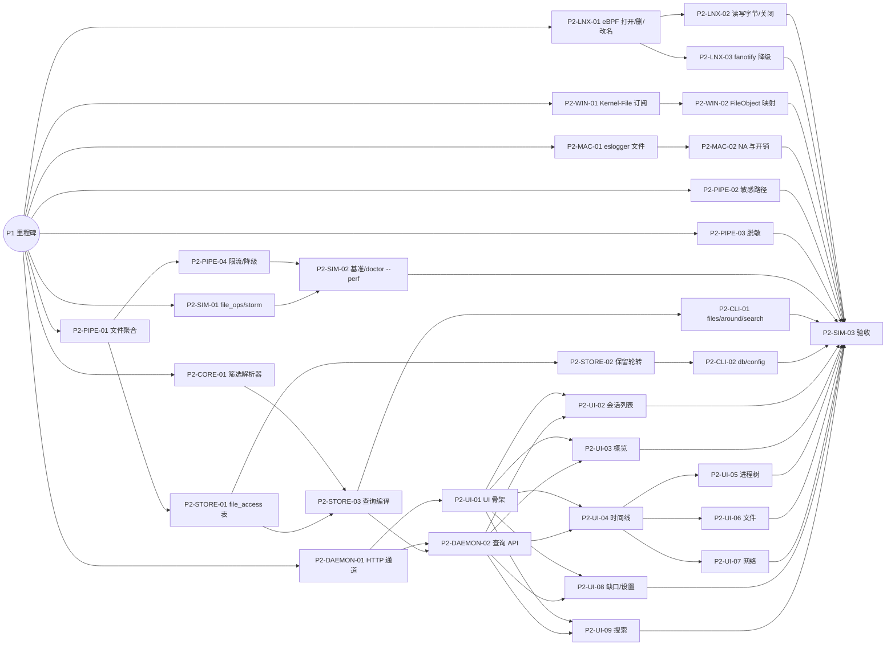

# P2 文件与 UI 任务清单

> 状态：草案
> 最后更新：2026-10-06
> 关联：[roadmap](../roadmap.md#p2-文件与-ui)、[任务卡规范](README.md)、REQ-03、REQ-05、REQ-07、NFR-01、NFR-03
> 里程碑：P2 文件与 UI
> 截止：2026-12-27

## 1. 阶段目标

1. 三平台补齐文件访问审计：打开（含读写意图）、读、写、创建、删除、重命名、关闭；平台拿不到的字段如实标 NA。
2. 文件事件按句柄聚合为 `file_access` 记录，控制磁盘占用（1 小时典型会话 <50 MB，NFR-03）。
3. 落地敏感路径规则、脱敏引擎、保留与轮转、每进程限流与降级阶梯，保证“默认安全、资源可控”。
4. 提供本地 HTTP API 与 Web UI：会话列表、概览、时间线、进程树、文件、网络、缺口、设置、跨会话搜索；100 万条记录的会话常用筛选 <300 ms。

**退出标准**（与 [roadmap](../roadmap.md#p2-文件与-ui) 一致）：

- 剧本 `file_ops` 在 Linux / Windows 召回率 ≥95%；macOS 除读取字节数（NA）外 ≥95%。
- 剧本 `typical_agent` 跑 1 小时，数据库增量 <50 MB。
- 100 万条记录会话，常用筛选 p95 <300 ms。
- `redact_corpus` 全部通过；对测试会话的数据库做明文扫描，不含任何语料 token。

## 2. 任务总表

| 编号 | 标题 | AREA | 规模 | 依赖 | 并行组 |
|---|---|---|---|---|---|
| P2-CORE-01 | 筛选表达式解析器（共享给 API 与规则引擎） | CORE | M | P1 里程碑 | A |
| P2-LNX-01 | eBPF 文件打开、创建、删除、重命名探针 | LNX | M | P1 里程碑 | A |
| P2-LNX-02 | eBPF 读写字节计数、关闭与 mmap/sendfile 标注 | LNX | M | P2-LNX-01 | B |
| P2-LNX-03 | fanotify 降级文件采集（legacy 模式） | LNX | M | P2-LNX-01 | B |
| P2-WIN-01 | Kernel-File ETW 订阅与用户态尽早过滤 | WIN | M | P1 里程碑 | A |
| P2-WIN-02 | FileObject 路径缓存与文件事件映射 | WIN | M | P2-WIN-01 | B |
| P2-MAC-01 | eslogger 文件事件解析 | MAC | M | P1 里程碑 | A |
| P2-MAC-02 | macOS 文件字段级 NA 与订阅开销控制 | MAC | S | P2-MAC-01 | B |
| P2-PIPE-01 | 文件访问聚合器（open→close） | PIPE | M | P1 里程碑 | A |
| P2-PIPE-02 | 敏感路径规则库 | PIPE | S | P1 里程碑 | A |
| P2-PIPE-03 | 脱敏引擎与 redact_corpus | PIPE | M | P1 里程碑 | A |
| P2-PIPE-04 | 每进程限流与降级阶梯 | PIPE | M | P2-PIPE-01 | B |
| P2-STORE-01 | file_access 表、写入与全文搜索索引 | STORE | M | P2-PIPE-01 | B |
| P2-STORE-02 | 保留与轮转 | STORE | M | P2-STORE-01 | C |
| P2-STORE-03 | 筛选表达式到 SQL 的编译与查询性能 | STORE | M | P2-CORE-01, P2-STORE-01 | C |
| P2-DAEMON-01 | 本地 HTTP 通道、UI ticket 鉴权与静态资源嵌入 | DAEMON | M | P1 里程碑 | A |
| P2-DAEMON-02 | 会话查询 API 端点与 SSE 实时流 | DAEMON | M | P2-DAEMON-01, P2-STORE-03 | D |
| P2-CLI-01 | `aw files` / `aw around` / `aw search` | CLI | S | P2-STORE-03 | D |
| P2-CLI-02 | `aw db` 子命令与 `aw config` | CLI | S | P2-STORE-02 | D |
| P2-UI-01 | Web UI 骨架、公共布局与 API 客户端 | UI | M | P2-DAEMON-01 | B |
| P2-UI-02 | 会话列表与新建会话页 | UI | S | P2-UI-01, P2-DAEMON-02 | E |
| P2-UI-03 | 会话概览页 | UI | S | P2-UI-01, P2-DAEMON-02 | E |
| P2-UI-04 | 时间线页（虚拟滚动、密度条、详情侧栏） | UI | M | P2-UI-01, P2-DAEMON-02 | E |
| P2-UI-05 | 进程树页 | UI | S | P2-UI-04 | F |
| P2-UI-06 | 文件页 | UI | S | P2-UI-04 | F |
| P2-UI-07 | 网络页 | UI | S | P2-UI-04 | F |
| P2-UI-08 | 缺口与采集能力页、设置页 | UI | M | P2-UI-01, P2-DAEMON-02 | E |
| P2-UI-09 | 跨会话搜索页 | UI | S | P2-UI-01, P2-DAEMON-02 | E |
| P2-SIM-01 | 剧本 `file_ops`、`storm`、`secrets` 与比对工具 | SIM | M | P1 里程碑 | A |
| P2-SIM-02 | 性能基准与 `aw doctor --perf` | SIM | M | P2-PIPE-04, P2-SIM-01 | D |
| P2-SIM-03 | P2 验收：召回率、体积、查询性能 | SIM | S | 除本卡外全部 P2 任务 | G |

并行组：同组任务文件范围互不重叠，可同时分给多个 subagent。大致按 A → B → C → D → E → F → G 推进；平台采集器（LNX / WIN / MAC）三条线彼此独立，可全程并行。

## 3. 依赖图

## 4. 任务卡
### P2-CORE-01 筛选表达式解析器（共享给 API 与规则引擎）

- **AREA**: CORE
- **平台**: all
- **类型**: feature
- **优先级**: M
- **规模**: M
- **依赖**: P1 里程碑
- **关联**: REQ-05.2, ADR-0004
- **文件范围**: `crates/aw-core/src/filter/`

**背景**：CLI `--filter`、API `filter=`、UI 搜索框和关联规则的 `where` 共用一个解析器。先定死语法和 AST，存储侧（SQL 编译）和规则侧（内存谓词）才能并行开发。

**实现要点**：
- 按 [api-and-cli §4.2](../../01-architecture/api-and-cli.md#42-bnf) 实现 BNF：`or` / `and`（空格即 and）/ `not`、括号、`field op value_list`、无字段的裸词。
- 输出 `Expr` AST，每个节点带源位置，用于错误提示（如“第 12 列：未知字段 `domian`，是否想写 `domain`？”）。
- 字段注册表：字段名 → 类型（string / glob / number / bytes / duration / time / bool / enum）→ 适用的 `kind`。未知字段报错，不静默忽略。
- 值解析：字节单位（`1MB` 与 `1MiB` 区分）、时长、相对时间（`+5m` 相对会话开始，`-10m` 相对现在）、glob（`*` 不跨分隔符，`**` 跨）。
- 提供 `Expr::to_predicate(ctx)`，在内存中求值，供 `/live` 和规则引擎使用；SQL 编译在 P2-STORE-03 中完成。
- `~` 子串操作符**不支持正则**；`path`、`dir` 在 Windows 会话上不区分大小写。

**限制**：
- 不依赖数据库库；不实现 SQL 编译。
- 推荐 `winnow` 或手写递归下降，不引入更重的解析器生成工具。

**验收标准**：
- [ ] `cargo test -p aw-core filter` 通过，覆盖 api-and-cli §4.1 的全部示例，AST 由 `insta` 快照锁定。
- [ ] 属性测试（proptest）：对随机输入不 panic；解析失败时返回带位置的错误。
- [ ] `cargo bench -p aw-core filter`：对 10 万条内存记录求值 `kind:file path:~/.ssh/** and not proc:git` 用时 <50 ms。

**参考文档**：[api-and-cli §4](../../01-architecture/api-and-cli.md#4-筛选查询语法)、[pipeline §3.6](../../01-architecture/pipeline.md#36-correlate关联规则引擎)

### P2-LNX-01 eBPF 文件打开、创建、删除、重命名探针

- **AREA**: LNX
- **平台**: linux
- **类型**: feature
- **优先级**: M
- **规模**: M
- **依赖**: P1 里程碑
- **关联**: REQ-03.1, CAP-FILE, ADR-0010, SPIKE-01, RISK-05
- **文件范围**: `crates/aw-ebpf/src/file/`, `crates/aw-collector-linux/src/file/`

**背景**：P1 的 Linux 采集器只覆盖进程和网络。本任务补齐文件元操作的 E1 采集，探针组合以 SPIKE-01 的结论为准。

**实现要点**：
- 按 ebpf-full / ebpf-lite 模式选择探针：优先 `lsm/file_open`，其次 `fexit/do_filp_open`，兜底 `sys_enter/exit_openat(2)`。删除、重命名、创建用 tracepoint，或 LSM `path_unlink` / `path_rename` / `path_mkdir`，见 [linux §2.2](../../02-platforms/linux.md#22-文件)。
- 内核侧按 cgroup id / pid 集合 map 过滤，只上报会话内进程。
- 产生 `FileOpen`（含 `access`、`created`、`truncated`、`result`、`path_resolved`）、`FileCreate`、`FileDelete`、`FileRename`。`source` 形如 `linux.ebpf/lsm_file_open`、`linux.ebpf/tp_unlinkat`。
- tracepoint 兜底拿到的是原始路径字符串：用户态结合进程 cwd 规范化，`path_resolved = false`。
- 在 `fd_kind` map 中记录 fd 类型（普通文件 / socket / 管道），供 P2-LNX-02 使用。
- 失败的打开（EACCES、ENOENT）也上报，带 `result`。

**限制**：
- 不在内核里丢弃噪声路径（`/proc`、`/sys`、动态库等），只在管道里折叠，以便保留计数。
- 不实现读写字节统计（P2-LNX-02）和 fanotify 降级（P2-LNX-03）。

**验收标准**：
- [ ] `sudo -E cargo test -p aw-collector-linux --features e2e file_meta` 在 Ubuntu 24.04 CI runner 上通过：对临时目录做 open / create / unlink / rename，事件全部捕获，字段与真值一致。
- [ ] ebpf-lite 模式（`AW_FORCE_MODE=ebpf-lite`）下同一测试通过，`path_resolved` 符合预期。
- [ ] 会话外进程的文件操作不产生任何事件（断言为 0 条）。

**参考文档**：[linux](../../02-platforms/linux.md)、[event-schema](../../01-architecture/event-schema.md)、[capability-matrix](../../02-platforms/capability-matrix.md)

### P2-LNX-02 eBPF 读写字节计数、关闭与 mmap/sendfile 标注

- **AREA**: LNX
- **平台**: linux
- **类型**: feature
- **优先级**: M
- **规模**: M
- **依赖**: P2-LNX-01
- **关联**: REQ-03.1, REQ-03.3, CAP-FILE, ADR-0011
- **文件范围**: `crates/aw-ebpf/src/file/`, `crates/aw-collector-linux/src/file/`

**背景**：逐条上报 read/write 会让事件量失控。按 ADR-0011，字节数在内核 map 中按 `(tgid, fd)` 累加，只在 close 或定时刷新时上报一次。

**实现要点**：
- `sys_exit_read/pread64/readv/preadv` 与 `sys_exit_write/pwrite64/writev/pwritev`：只对 `fd_kind = regular` 的 fd 累加 `{reads, bytes_read, writes, bytes_written}`。
- `sys_enter_close`：把累计值作为聚合的 `FileRead` / `FileWrite` 和 `FileClose` 上报，然后删除 map 条目。
- 进程退出时冲刷该进程所有未关闭的 fd；附着前已打开的 fd，用 `/proc/<pid>/fd` 补充路径和类型（S 级）。
- `mmap`：上报 `FileOpen { via: Mmap }`，并在 `field_evidence` 中把 `bytes` 标为 `NA(mmap_not_observable)`。
- `sendfile` / `splice` / `copy_file_range`：源是文件、目标是 socket 时，同时上报 `FileRead { via: Sendfile }` 与 `NetSend { via: Sendfile }`。这只是线索，不改变证据等级。
- map 满时写 `Gap { kind: dropped }`，不得静默丢弃。

**限制**：
- 不在内核侧逐条上报读写。
- 不对 sendfile 做“上传了文件”之类的判定。判定属于 P3 规则引擎，而且只能是 I 级。

**验收标准**：
- [ ] `sudo -E cargo test -p aw-collector-linux --features e2e file_rw`：对 1 MiB 文件分 100 次读取，只上报 1 条聚合记录，且 `bytes_read = 1048576`。
- [ ] sendfile 测试：用 sendfile 把文件发到本地测试服务器，两条事件都带 `via = sendfile`。
- [ ] 运行 `cargo run -p sim -- run sim/scenarios/storm.toml` 期间，内核 map 与 ring buffer 内存 <16 MB（用 `bpftool map show` 统计）。

**参考文档**：[linux §2.2](../../02-platforms/linux.md#22-文件)、[pipeline §3.5](../../01-architecture/pipeline.md#35-aggregate聚合)、[ADR-0011](../../03-adr/0011-aggregate-first.md)

### P2-LNX-03 fanotify 降级文件采集（legacy 模式）

- **AREA**: LNX
- **平台**: linux
- **类型**: feature
- **优先级**: S
- **规模**: M
- **依赖**: P2-LNX-01
- **关联**: REQ-01, REQ-03.4, CAP-FILE, ADR-0010, RISK-05
- **文件范围**: `crates/aw-collector-linux/src/legacy/fanotify.rs`

**背景**：没有 BTF 或内核低于 5.8 时无法使用 eBPF。fanotify 能提供 E1 级的打开、修改、删除、改名事件，但拿不到字节数。

**实现要点**：
- `fanotify_init(FAN_CLASS_NOTIF | FAN_REPORT_FID | FAN_REPORT_DFID_NAME)`，按 mount 或文件系统标记。订阅 `FAN_OPEN`、`FAN_ACCESS`、`FAN_MODIFY`、`FAN_CLOSE_WRITE`、`FAN_CLOSE_NOWRITE`；内核 5.1+ 加 `FAN_CREATE` / `FAN_DELETE`，5.17+ 加 `FAN_RENAME`。
- 内核不支持的事件类型写入能力声明 `capabilities()`，在 `aw doctor` 中显示为不可得。
- 在用户态按 pid 范围过滤。`FAN_ACCESS` / `FAN_MODIFY` 只累计次数，字节数标 `NA`。
- fanotify 事件中的 pid 可能为 0 或进程已退出：无法归属时写 `Gap { kind: attribution_unknown }` 计数，不硬套归属。
- 队列溢出（`FAN_Q_OVERFLOW`）时写 `Gap { kind: dropped }`。

**限制**：
- 不使用 `FAN_CLASS_CONTENT` 或任何权限事件，不阻塞被监控进程。
- 不读取文件内容。

**验收标准**：
- [ ] `sudo -E AW_FORCE_MODE=legacy cargo test -p aw-collector-linux --features e2e file_meta` 通过，读字节数在 `field_evidence` 中为 `NA`。
- [ ] 用 `storm` 剧本制造队列溢出时，`gaps` 中出现 `dropped` 记录。

**参考文档**：[linux](../../02-platforms/linux.md)、[fallback-poll](../../02-platforms/fallback-poll.md)

### P2-WIN-01 Kernel-File ETW 订阅与用户态尽早过滤

- **AREA**: WIN
- **平台**: windows
- **类型**: feature
- **优先级**: M
- **规模**: M
- **依赖**: P1 里程碑
- **关联**: REQ-03.1, NFR-01, CAP-FILE, CAP-PRIV, ADR-0008, SPIKE-02, RISK-02
- **文件范围**: `crates/aw-collector-windows/src/etw/file.rs`, `crates/aw-collector-windows/src/etw/session.rs`

**背景**：Microsoft-Windows-Kernel-File 能提供 E1 级文件事件，但全系统事件量可达每秒数万条，而且无法在内核侧按 PID 过滤。CPU 预算是本任务的核心约束。

**实现要点**：
- 在 P1 的 ETW 会话上追加 Kernel-File provider，按需启用关键字（Create、Close、Read、Write、DeletePath、RenamePath、CreateNewFile、FileName），见 [windows §2.2](../../02-platforms/windows.md#22-microsoft-windows-kernel-file)。
- 回调第一步只读事件头里的 ProcessId，查范围集合（无锁结构，如用 `arc-swap` 包装的 `HashSet`）。不在集合内就立即返回，不解析 schema。
- Read / Write 事件不逐条转发：按 `(pid, FileObject)` 在采集器内累加，由 P2-WIN-02 在 Close 时输出聚合值。
- 读取 ETW 会话的 `EventsLost` 和 `BuffersLost`，每次增长都写 `Gap { kind: dropped }`。
- `source` 形如 `windows.etw/kernel_file`。

**限制**：
- 不使用 `EVENT_FILTER_TYPE_PID`，因为它无法动态追加子进程（见平台文档）。
- 不写驱动或 minifilter（ADR-0008）。

**验收标准**：
- [ ] 在 Windows CI runner（管理员）上，`cargo test -p aw-collector-windows --features e2e file_filter` 通过：会话外进程的文件 I/O 不产生事件。
- [ ] 运行 `storm` 剧本，同时另开一个无关的大量文件 I/O 进程（如用 `robocopy` 复制大目录）：daemon CPU <15%，由 `aw doctor --perf` 记录。
- [ ] 人为调小缓冲区造成丢失时，`gaps` 中出现 `dropped` 记录。

**参考文档**：[windows](../../02-platforms/windows.md)、[performance-budget](../../01-architecture/performance-budget.md)、[SPIKE-02](../../06-research/SPIKE-02-windows-etw-poc.md)

### P2-WIN-02 FileObject 路径缓存与文件事件映射

- **AREA**: WIN
- **平台**: windows
- **类型**: feature
- **优先级**: M
- **规模**: M
- **依赖**: P2-WIN-01
- **关联**: REQ-03.1, REQ-03.3, CAP-FILE, SPIKE-02
- **文件范围**: `crates/aw-collector-windows/src/file_map.rs`, `fixtures/windows/`

**背景**：Kernel-File 的 Read / Write / Close 事件只带 FileObject，路径只在 Create（或 NameCreate）时出现，所以必须维护一张从 FileObject 到路径和归属进程的映射表。

**实现要点**：
- 键用 `(FileObject, Create 时间)`，避免地址复用导致串号；Close 时删除条目。
- 以 **Create 事件的进程**作为该 FileObject 的归属。缓存管理器的延迟写会归到 System（PID 4），这些 Write 也记到原进程，并在 `field_evidence` 中标注。【待验证 SPIKE-02】
- 设备路径 `\Device\HarddiskVolumeN\...` 用 `QueryDosDeviceW` 映射为盘符；卷发生变化时（`WM_DEVICECHANGE` 或定期刷新）更新映射。`\Device\Mup\` 转为 UNC 路径。
- 输出 `FileOpen`（CreateDisposition 为新建时输出 `FileCreate`）、聚合后的 `FileRead` / `FileWrite`、`FileClose`、`FileDelete`、`FileRename`。
- 映射表设上限（默认 20 万条），按 LRU 淘汰，淘汰时写 `Gap { kind: cache_evicted }` 计数。
- 解码逻辑与 ETW 回调分开，可以用录制的 `fixtures/windows/*.jsonl` 做无特权单测。

**限制**：
- 不调用 `NtQueryObject` 等需要打开目标进程句柄的 API 来补路径。

**验收标准**：
- [ ] `cargo test -p aw-collector-windows file_map`（无需管理员）基于 fixtures 通过，覆盖地址复用、延迟写归属、盘符映射、UNC 路径四种情况。
- [ ] 端到端：在 Windows 上运行 `file_ops` 剧本，召回率 ≥95%（用 P2-SIM-01 的比对工具计算）。

**参考文档**：[windows §2.2](../../02-platforms/windows.md#22-microsoft-windows-kernel-file)、[testing](../../05-dev/testing.md)

### P2-MAC-01 eslogger 文件事件解析

- **AREA**: MAC
- **平台**: macos
- **类型**: feature
- **优先级**: M
- **规模**: M
- **依赖**: P1 里程碑
- **关联**: REQ-03.1, CAP-FILE, ADR-0009, SPIKE-03, RISK-03
- **文件范围**: `crates/aw-collector-macos/src/eslogger/file.rs`, `fixtures/macos/`

**背景**：拿到 Apple ES 授权之前，macOS 用系统自带的 eslogger 采集文件事件。P1 已用 eslogger 采集进程事件，本任务追加文件类事件。

**实现要点**：
- 订阅 `open`、`close`、`create`、`unlink`、`rename`、`truncate`。`write` 默认不订阅，用 `close.modified` 代替（见 [macos](../../02-platforms/macos.md)）；`mmap` 可选。
- JSON 解析前先快速过滤：用 `memchr` 定位 pid 字段，不在范围集合内的行直接丢弃。
- 映射规则：
  - `open` → `FileOpen`，`fflag` 转为读写意图；
  - `close` → `FileClose`；`modified = true` 时另生成一条不带字节数的 `FileWrite`；
  - `create` / `unlink` / `rename` / `truncate` 分别映射到对应事件。
- 按事件类型检查 `seq_num` 是否连续，并检查 `global_seq_num`；出现跳号写 `Gap { kind: dropped }`。
- 解析器容忍未知字段，因为 eslogger 格式不稳定（RISK-03）；无法解析的行计数，并写 `Gap { kind: parse_error }`。
- `source` 形如 `macos.eslogger/open`。

**限制**：
- 不调用 `fs_usage` 等工具补字节数。这属于 S 级可选增强，不在本任务范围内。
- 不引入 ES 原生框架（P4）。

**验收标准**：
- [ ] `cargo test -p aw-collector-macos eslogger_file`（无需特权）基于 `fixtures/macos/` 中 macOS 13 / 14 / 15 的录制样本通过。
- [ ] 手工端到端（macOS 真机，root + 完全磁盘访问）：用 `aw run` 启动 `file_ops` 剧本，召回率 ≥95%（不含读字节数），结果贴在 PR 中。

**参考文档**：[macos](../../02-platforms/macos.md)、[SPIKE-03](../../06-research/SPIKE-03-macos-eslogger-poc.md)

### P2-MAC-02 macOS 文件字段级 NA 与订阅开销控制

- **AREA**: MAC
- **平台**: macos
- **类型**: feature
- **优先级**: M
- **规模**: S
- **依赖**: P2-MAC-01
- **关联**: REQ-03.4, REQ-06.1, NFR-01, CAP-FILE
- **文件范围**: `crates/aw-collector-macos/src/eslogger/`

**背景**：ES 没有 read 事件，所以 macOS 上读取次数和字节数不可得，必须明确标出原因，而不是显示 0。另外，eslogger 的全系统 `open` 事件可能超出 CPU 预算，需要能够降级。

**实现要点**：
- eslogger 产生的所有读方式 `FileOpen`，在 `field_evidence` 中把 `bytes_read` 和 `reads` 标为 `NA(es_no_read_event)`。
- 在 `capabilities()` 中声明 CAP-FILE-02 为 NA，并在 `aw doctor` 和 UI 缺口页显示。
- 开销监测：eslogger 子进程与解析线程的 CPU 合计超过阈值（默认 5%，持续 30 秒）时，自动退订 `open`，只保留 `close.modified` / `create` / `unlink` / `rename`，并写 `Gap { kind: rate_limited, detail: "eslogger open unsubscribed" }`。
- 配置项 `collectors.macos.subscribe_open = auto | on | off`。

**限制**：
- 不估算字节数（例如用文件大小代替）。不可得就标不可得。

**验收标准**：
- [ ] 单元测试断言：由 macOS fixtures 产生的读方式 `file_access` 记录，`field_evidence.bytes_read.level` 为 `NA`，reason 为 `es_no_read_event`。
- [ ] 用 fixtures 模拟高 CPU 场景，断言触发退订并写入缺口。

**参考文档**：[evidence-model §3](../../01-architecture/evidence-model.md#3-不可得原因码na_reason)、[macos](../../02-platforms/macos.md)

### P2-PIPE-01 文件访问聚合器（open→close）

- **AREA**: PIPE
- **平台**: all
- **类型**: feature
- **优先级**: M
- **规模**: M
- **依赖**: P1 里程碑
- **关联**: REQ-03.3, NFR-03, ADR-0011
- **文件范围**: `crates/aw-pipeline/src/aggregate/file.rs`, `fixtures/file_*/`

**背景**：三平台采集器输出的文件事件粒度不同（Linux 与 Windows 有句柄，macOS 只有路径）。聚合器把它们统一为 `file_access` 记录，这是磁盘占用达标的关键。

**实现要点**：
- 按 [pipeline §3.5](../../01-architecture/pipeline.md#35-aggregate聚合) 实现状态表 `(ProcUid, handle) → FileAccessAcc`；没有句柄时以 `(ProcUid, path)` 作键。
- 输出时机有三种：收到 `FileClose`、进程退出、句柄存活超过 `aggregate.file_flush_secs`（输出 `partial = 1` 的中间记录，之后继续累计）。
- 合并重复打开：同一进程在 `aggregate.coalesce_window_ms`（默认 1 秒）内对同一路径的只读访问合并为一条，`opens += 1`。
- `FileDelete` / `FileRename` / `FileCreate` / exec 不聚合，直接产生对应 `op` 的记录。
- 证据合并：记录级取来源中最弱的一级；字段级 `field_evidence` 原样保留，合并规则见 [evidence-model §2.2](../../01-architecture/evidence-model.md#22-合并规则)。
- 噪声路径折叠：`/proc`、`/sys`、`/dev`、动态库、locale 等按规则折叠为按目录计数的记录，规则可配置。
- 状态表大小设上限（默认每会话 10 万条），超出时提前输出最旧条目并计数。

**限制**：
- 聚合器不访问文件系统，不补全字段。
- 不处理敏感标签（P2-PIPE-02）和限流（P2-PIPE-04）。

**验收标准**：
- [ ] `cargo test -p aw-pipeline aggregate::file` 通过，用 `Pipeline::replay` 加 `insta` 快照覆盖：多次读写后 close、进程退出时未 close、长时间打开产生 partial、macOS 无句柄、重复打开合并。
- [ ] 回放 `fixtures/file_compile/`（模拟编译器反复读头文件），输出记录数小于输入事件数的 5%。
- [ ] `cargo bench -p aw-pipeline aggregate_file`：单核吞吐 ≥ 20 万条事件/秒。

**参考文档**：[pipeline §3.5](../../01-architecture/pipeline.md#35-aggregate聚合)、[storage](../../01-architecture/storage.md)、[ADR-0011](../../03-adr/0011-aggregate-first.md)

### P2-PIPE-02 敏感路径规则库

- **AREA**: PIPE
- **平台**: all
- **类型**: feature
- **优先级**: M
- **规模**: S
- **依赖**: P1 里程碑
- **关联**: REQ-07.4, RISK-07
- **文件范围**: `crates/aw-pipeline/src/sensitive/`, `crates/aw-pipeline/rules/sensitive_paths.toml`
- **额外标签**: evidence

**背景**：用户最关心的是 Agent 是否碰了凭证。敏感路径规则只给记录打标签，不读取文件内容。

**实现要点**：
- 内置规则按 [security-privacy §4](../../01-architecture/security-privacy.md#4-敏感路径规则) 的 17 类三平台清单写入 `sensitive_paths.toml`，每条带 ID、平台、glob、排除项。
- glob 匹配复用 `aw-core::filter` 的 glob 语义；`~` 展开为**会话用户**的家目录，而不是 daemon 用户。
- 用 `globset` 把全部规则编译为一个匹配器，单次匹配 O(路径长度)。
- 命中时写 `file_access.sensitive_rule` 和 `tag:sensitive.<rule>`。
- `agent-config` 特例：访问者的 `AgentProfile` 与目录归属一致时（如 claude 读 `~/.claude`），只打 `info` 标签。
- 用户可在配置 `[sensitive_paths]` 中追加规则；内置规则只读。

**限制**：
- 命中后**不得**读取文件内容。唯一例外是 P3 的内容哈希，不在本任务实现。
- 不生成 finding：`sensitive_access` 规则属于 P3 关联引擎。

**验收标准**：
- [ ] `cargo test -p aw-pipeline sensitive` 通过：每条规则在三平台路径风格下各有至少 2 个正例和 1 个反例（如 `~/.ssh/id_rsa.pub`、`.env.example` 不命中）。
- [ ] Windows 路径匹配不区分大小写；以非 daemon 用户身份启动的会话，`~` 展开正确。
- [ ] `cargo bench -p aw-pipeline sensitive_match`：单次匹配 <2 µs。

**参考文档**：[security-privacy §4](../../01-architecture/security-privacy.md#4-敏感路径规则)、[process-tracking](../../01-architecture/process-tracking.md)

### P2-PIPE-03 脱敏引擎与 redact_corpus

- **AREA**: PIPE
- **平台**: all
- **类型**: feature
- **优先级**: M
- **规模**: M
- **依赖**: P1 里程碑
- **关联**: REQ-07.2, REQ-07.3, ADR-0012, RISK-07
- **文件范围**: `crates/aw-pipeline/src/redact/`, `crates/aw-pipeline/tests/redact_corpus/`
- **额外标签**: area:sec, evidence

**背景**：按 ADR-0012，脱敏必须在写入前、在内存中完成。如果 P1 只实现了命令行的最小脱敏，本任务补齐全部默认规则和测试语料。

**实现要点**：
- 实现 [security-privacy §3.2](../../01-architecture/security-privacy.md#32-默认规则) 的 A–F 六类默认规则：argv、环境变量、URL 查询参数、请求头、已知 token 格式、路径中的用户名（可选）。
- 作用字段：`argv`、`env`、`url`、`headers`、`AgentToolCall.summary`。
- 替换格式为 `«redacted:<rule_id>»`；可选附 8 位加盐哈希，盐值每个会话随机生成、不落盘。
- 只用 `regex` crate（线性时间）；全部规则编译为 `RegexSet` 做预筛。
- 内置规则不能单条关闭；`--unsafe-no-redact` 关闭全部内置规则时，会话写入永久标记 `sessions.flags`。
- 语料：`redact_corpus/positive/*.txt` 与 `negative/*.txt`，每条规则至少各 3 个用例。

**限制**：
- 脱敏前的原值不得进入日志、错误信息或 panic 消息。
- 不使用 `fancy-regex` 等允许回溯的正则库。

**验收标准**：
- [ ] `cargo test -p aw-pipeline redact` 通过，语料正例全部被替换，反例全部保留。
- [ ] proptest：随机生成的 token 嵌入任意文本后，输出中不含原 token。
- [ ] 端到端明文扫描：用 `aw run -- sim run sim/scenarios/secrets.toml`（命令行与环境变量中带语料 token）跑一个会话，然后对数据库文件和 WAL 运行 `cargo run -p sim -- scan-secrets <db>`，命中数为 0。

**参考文档**：[security-privacy §3](../../01-architecture/security-privacy.md#3-脱敏规则)、[pipeline §3.4](../../01-architecture/pipeline.md#34-redact脱敏)、[ADR-0012](../../03-adr/0012-no-content-redact-before-write.md)

### P2-PIPE-04 每进程限流与降级阶梯

- **AREA**: PIPE
- **平台**: all
- **类型**: feature
- **优先级**: M
- **规模**: M
- **依赖**: P2-PIPE-01
- **关联**: NFR-01, NFR-02, NFR-03, NFR-06, REQ-06.4, RISK-02, RISK-14
- **文件范围**: `crates/aw-pipeline/src/limit/`, `crates/aw-pipeline/src/degrade.rs`

**背景**：编译、`npm install` 这类场景会在短时间内产生海量文件事件。限流和降级保证资源可控，并且所有损失都可见。

**实现要点**：
- 每进程令牌桶，按类别配置，默认值见 [pipeline §5](../../01-architecture/pipeline.md#5-限流)。超出部分只计数，并合并为 `Gap { kind: rate_limited }`；聚合计数器照常累加，字节数不受影响。
- 降级阶梯 L0–L4 及触发条件见 [performance-budget §4](../../01-architecture/performance-budget.md#4-降级阶梯)：队列水位、管道 CPU、单会话体积、磁盘余量。逐级进入；条件解除 30 秒后逐级恢复。
- 每次进入或退出某一级都写 `Gap { kind: rate_limited, detail: "degrade L<n>" }`。
- 敏感路径访问、删除、exec、网络流总量在任何级别都不被丢弃。
- 应急停止：RSS 超过 `limits.hard_rss_bytes` 时冻结采集器，写 `Gap { kind: restart }`，然后重启。
- 把当前降级级别暴露给 `/health` 和 `aw doctor`。

**限制**：
- 不使用采样（如“每 10 条保留 1 条”）替代计数，避免产生伪精确的统计。

**验收标准**：
- [ ] `cargo test -p aw-pipeline limit degrade` 通过：用虚拟时钟回放事件风暴，断言各级的进入和恢复顺序，以及缺口记录。
- [ ] 断言在 L4 下，敏感访问、删除、exec 记录数与 L0 相同。
- [ ] `storm` 剧本下 daemon RSS <60 MB（由 P2-SIM-02 的基准记录）。

**参考文档**：[performance-budget](../../01-architecture/performance-budget.md)、[pipeline §4–§5](../../01-architecture/pipeline.md#4-事件丢失与缺口)

### P2-STORE-01 file_access 表、写入与全文搜索索引

- **AREA**: STORE
- **平台**: all
- **类型**: feature
- **优先级**: M
- **规模**: M
- **依赖**: P2-PIPE-01
- **关联**: REQ-03, REQ-05.2, NFR-03, ADR-0003, SPIKE-06
- **文件范围**: `crates/aw-store/migrations/`, `crates/aw-store/src/file_access.rs`, `crates/aw-store/src/fts.rs`, `fixtures/db/`

**背景**：把聚合后的文件记录持久化，并为跨会话搜索建立 FTS5 索引。

**实现要点**：
- 新增迁移 `NNNN_file_access.sql`：按 [storage §3](../../01-architecture/storage.md#3-ddl) 创建 `file_access` 表与 4 个索引，并更新 `timeline` 视图。
- 写入走 Batcher；`partial = 1` 的中间记录用 UPSERT，与最终记录合并。
- 新增迁移 `NNNN_fts.sql`：建立 `fts_text` 虚拟表（trigram tokenizer），索引路径、argv、URL；开关为 `storage.fts = true | false`。
- 会话删除时，级联清理 FTS 中的对应行。
- 为新迁移提供旧版本样例库 `fixtures/db/v<N>.db`，用于升级测试。

**限制**：
- 不修改已发布的迁移文件，只新增。
- FTS 不索引脱敏前的内容（写入的本来就是脱敏后的值）。

**验收标准**：
- [ ] `cargo test -p aw-store file_access migrate` 通过，包括从 `fixtures/db/v<N-1>.db` 升级后查询结果正确。
- [ ] `cargo bench -p aw-store write_file_access`：批量写入 ≥ 5 万行/秒。
- [ ] 对写入 5 万条 `file_access` 的库，分别在开启和关闭 FTS 时记录体积，结果写入 PR，并更新 storage.md 中的【待验证】标注。

**参考文档**：[storage](../../01-architecture/storage.md)、[SPIKE-06](../../06-research/SPIKE-06-sqlite-throughput.md)

### P2-STORE-02 保留与轮转

- **AREA**: STORE
- **平台**: all
- **类型**: feature
- **优先级**: M
- **规模**: M
- **依赖**: P2-STORE-01
- **关联**: REQ-07.1, NFR-03, ADR-0003
- **文件范围**: `crates/aw-store/src/retention.rs`

**背景**：默认数据库上限为 2 GiB / 30 天，超出后自动清理最旧的会话，且清理不能阻塞写入。

**实现要点**：
- 按 [storage §5](../../01-architecture/storage.md#5-保留与轮转) 实现配置 `[retention]`（`max_db_bytes`、`max_age_days`、`min_free_disk_bytes`、`max_session_bytes`、`check_interval_secs`）及清理算法。
- 大会话分批删除，每批 5000 行；每次删除后执行 `PRAGMA incremental_vacuum(N)`，每步 ≤ 50 ms；没有活动读事务时执行 `wal_checkpoint(TRUNCATE)`。
- 固定的会话和活动会话不删除；无会话可删时发出 `storage_full` 告警，并触发降级阶梯。
- 删除会在 `schema_meta` 中留下 `purged:<public_id>` 审计记录，会话列表中显示为“已按保留策略清理”。
- 磁盘余量低于 `min_free_disk_bytes` 时，只写会话元数据和缺口。

**限制**：
- 不执行全量 `VACUUM`（会长时间锁库）；全量 `VACUUM` 只由用户通过 `aw db vacuum` 主动触发。

**验收标准**：
- [ ] `cargo test -p aw-store retention` 通过：按天数清理、按体积清理、跳过固定会话、留下审计记录。
- [ ] 性能测试：删除一个 100 万行的会话时，并发写入的 p99 延迟 <200 ms。
- [ ] 将 `max_db_bytes` 设为 50 MB 并持续写入，数据库加 WAL 的总体积始终 ≤ 55 MB。

**参考文档**：[storage §5](../../01-architecture/storage.md#5-保留与轮转)

### P2-STORE-03 筛选表达式到 SQL 的编译与查询性能

- **AREA**: STORE
- **平台**: all
- **类型**: feature
- **优先级**: M
- **规模**: M
- **依赖**: P2-CORE-01, P2-STORE-01
- **关联**: REQ-05.2, REQ-05.4
- **文件范围**: `crates/aw-store/src/query/`, `fixtures/bench/`

**背景**：REQ-05 要求 100 万条记录的会话常用筛选 <300 ms。这取决于把 AST 编译为能命中索引的参数化 SQL。

**实现要点**：
- `compile(expr, target_table) -> (sql, params)`：只生成参数化 SQL，不拼接字符串。
- glob 编译为前缀范围查询加 `GLOB`；`~` 子串匹配走 FTS5 trigram（若已开启），否则用 `instr`。
- `kind:` 决定查哪些表；不指定时查 `timeline` 视图。
- `subtree:<proc_uid>` 用递归 CTE 展开进程子树。
- 分页采用 cursor（`(ts, id)` 键集分页），不用 OFFSET。
- 实现 `around(ref, window)`（REQ-05.4）和跨会话 `search(q)`。
- 生成 100 万条记录的基准库：`cargo run -p sim -- gen-db --rows 1000000 -o fixtures/bench/1m.db`（生成器位于 sim，生成的库不入库）。

**限制**：
- 不为了某个查询新增未评审的索引；确需新增时，在 PR 中说明对体积的影响。

**验收标准**：
- [ ] `cargo test -p aw-store query` 通过：同一组表达式的 SQL 结果与 `to_predicate` 的内存求值结果一致（差分测试）。
- [ ] SQL 注入测试：包含 `'; DROP TABLE` 等内容的筛选值不影响查询。
- [ ] `cargo bench -p aw-store query_1m`：api-and-cli §4.1 的 8 个示例在 1m.db 上 p95 <300 ms。对每条示例运行 `EXPLAIN QUERY PLAN`，确认没有全表扫描。

**参考文档**：[api-and-cli §4](../../01-architecture/api-and-cli.md#4-筛选查询语法)、[storage](../../01-architecture/storage.md)、[performance-budget](../../01-architecture/performance-budget.md)

### P2-DAEMON-01 本地 HTTP 通道、UI ticket 鉴权与静态资源嵌入

- **AREA**: DAEMON
- **平台**: all
- **类型**: feature
- **优先级**: M
- **规模**: M
- **依赖**: P1 里程碑
- **关联**: REQ-07.6, ADR-0002, ADR-0005, RISK-07
- **文件范围**: `crates/aw-daemon/src/http/`, `crates/aw-daemon/src/auth/`, `crates/aw-daemon/build.rs`
- **额外标签**: area:sec

**背景**：P1 的 CLI 只走 socket 或命名管道。Web UI 需要一个只绑定回环地址、带鉴权的 HTTP 通道，并且要防范本机其他用户和恶意网页。

**实现要点**：
- 在 `127.0.0.1:<port>`（默认 7456）上提供 axum HTTP，与 socket / 管道共用同一套路由。
- 鉴权按 [api-and-cli §1](../../01-architecture/api-and-cli.md#1-通信与鉴权) 实现：
  - `POST /auth/ui-ticket` 只允许从 socket / 管道调用，返回一次性 ticket（60 秒有效）；
  - `POST /auth/ui-token` 用 ticket 换取 12 小时的 Bearer token；
  - token 绑定申请者的用户身份，并按授权模型过滤可见的会话。
- 校验 `Host` 头必须是 `127.0.0.1:<port>` 或 `localhost:<port>`，防 DNS rebinding；不开 CORS；设置 CSP `default-src 'self'`、`X-Frame-Options: DENY`。
- 嵌入静态资源：`rust-embed` 打包 `ui/dist`，带 gzip 预压缩；开发模式下代理到 Vite dev server（`AW_UI_DEV_URL`）。
- `aw ui [--no-open] [--port N]`：申请 ticket 并用默认浏览器打开 `http://127.0.0.1:<port>/#ticket=<t>`（`<port>` 为 daemon 随 ticket 返回的实际 HTTP 端口，即 `api.http_port`，默认 7456；HTTP 关闭时 `aw ui` 直接报告）。
- 自动生成 OpenAPI（`utoipa`），地址为 `/api/v1/openapi.json`。

**限制**：
- 不允许监听 `0.0.0.0` 或非回环地址，配置中写了也拒绝启动。
- token 不写入磁盘和日志。

**验收标准**：
- [ ] `cargo test -p aw-daemon http_auth` 通过：无 token 返回 401；ticket 重复使用失败；过期 ticket 失败；`Host: evil.com` 返回 421；用户 A 的 token 看不到用户 B 的会话。
- [ ] `curl -s http://127.0.0.1:<api.http_port>/api/v1/health`（默认 7456） 返回 200，且只含非敏感字段。
- [ ] 嵌入 UI 后，`aw` 加 `agentwatchd` 的 release 体积合计 <20 MB（NFR-04）。

**参考文档**：[api-and-cli §1](../../01-architecture/api-and-cli.md#1-通信与鉴权)、[security-privacy](../../01-architecture/security-privacy.md)、[ADR-0002](../../03-adr/0002-embedded-web-ui.md)

### P2-DAEMON-02 会话查询 API 端点与 SSE 实时流

- **AREA**: DAEMON
- **平台**: all
- **类型**: feature
- **优先级**: M
- **规模**: M
- **依赖**: P2-DAEMON-01, P2-STORE-03
- **关联**: REQ-05, NFR-05
- **文件范围**: `crates/aw-daemon/src/api/`

**背景**：UI 和 CLI 的查询都走同一套 HTTP API。本任务实现 P2 所需的端点，可以拆成两个 PR 提交。

**实现要点**：
- 按 [api-and-cli §3](../../01-architecture/api-and-cli.md#3-http-api) 实现以下端点：
  - 会话类：`/sessions` 列表、详情、PATCH、DELETE、stop、`/summary`；
  - 记录类：`/timeline`、`/timeline/histogram`、`/processes`、`/processes/{proc_uid}`、`/files`、`/flows`、`/flows/{id}/buckets`、`/traffic`、`/dns`、`/gaps`、`/around`；
  - 其他：`/search`、`/config`、`/db/stats`、`/processes`（系统进程树）、`/doctor`。
- 各端点的 `filter` 参数都走 P2-STORE-03 的编译器；解析错误返回 400，并带位置信息。
- 使用 cursor 分页，单页上限 2000 行。
- 返回的记录中，`proc_uid` 转为十六进制字符串，并附带 `proc: {pid, exe_name}` 摘要。
- `/live`：用 SSE 推送已脱敏、已归属的新增记录，连接时可带 filter（用 `to_predicate` 在内存中求值）；客户端慢时丢弃并发送 `lagged` 事件。
- 错误格式统一为 `{"error":{"code","message"}}`。

**限制**：
- 不实现 `/http`、`/findings`、`/agent-events`。前两个属于 P3，`/agent-events` 属于 P5。它们在路由表中先返回 501。

**验收标准**：
- [ ] `cargo test -p aw-daemon api` 通过：用内存库加 fixtures，对每个端点做快照测试。
- [ ] `/api/v1/openapi.json` 包含全部已实现的端点，并通过 `npx @redocly/cli lint` 校验。
- [ ] 在 1m.db 上，`/timeline?filter=kind:file` 首页响应 <300 ms。
- [ ] SSE：活动会话中的事件从发生到推送 p99 <2 s（NFR-05）。

**参考文档**：[api-and-cli §3](../../01-architecture/api-and-cli.md#3-http-api)、[storage](../../01-architecture/storage.md)

### P2-CLI-01 `aw files` / `aw around` / `aw search`

- **AREA**: CLI
- **平台**: all
- **类型**: feature
- **优先级**: M
- **规模**: S
- **依赖**: P2-STORE-03
- **关联**: REQ-05.2, REQ-05.4
- **文件范围**: `crates/aw-cli/src/cmd/files.rs`, `crates/aw-cli/src/cmd/around.rs`, `crates/aw-cli/src/cmd/search.rs`

**背景**：无需打开 UI，在终端里就能查看文件访问、某条记录前后发生的事，以及跨会话搜索。

**实现要点**：
- 参数以 [api-and-cli §2](../../01-architecture/api-and-cli.md#2-cli-命令树) 为准：
  - `aw files <SESSION> [--filter] [--group-by path|dir|proc] [--sort]`；
  - `aw around <SESSION> <TABLE>:<ID> [--window 10s]`；
  - `aw search <TEXT> [--since] [--kind file|proc|url]`。
- 输出为表格（默认）或 `--json`。不可得的字节列显示 `n/a`，不显示 0；每行带证据等级列。
- 命中敏感规则的行高亮（非 TTY 时不着色）。

**限制**：
- CLI 只调用 API，不直接打开数据库。

**验收标准**：
- [ ] `cargo test -p aw-cli files around search` 通过：用 `assert_cmd` 加模拟 API 做快照。
- [ ] `aw files @last --filter 'tag:sensitive' --json | jq length` 的输出与 UI 文件页「敏感」筛选的计数一致。

**参考文档**：[api-and-cli §2](../../01-architecture/api-and-cli.md#2-cli-命令树)

### P2-CLI-02 `aw db` 子命令与 `aw config`

- **AREA**: CLI
- **平台**: all
- **类型**: feature
- **优先级**: M
- **规模**: S
- **依赖**: P2-STORE-02
- **关联**: REQ-07.1, NFR-03
- **文件范围**: `crates/aw-cli/src/cmd/db.rs`, `crates/aw-cli/src/cmd/config.rs`, `crates/aw-daemon/src/api/db.rs`

**背景**：用户需要查看和控制磁盘占用，并调整保留策略、脱敏、敏感路径等配置。

**实现要点**：
- `aw db stats`：展示体积、各表行数、最旧会话、保留配置。
- `aw db vacuum`：全量 VACUUM，提示预计耗时并要求确认。
- `aw db migrate [--dry-run]`：输出待执行的迁移列表。
- `aw db purge [--older-than <dur>] [--all] [--yes]`：管理员可清理全部，普通用户只能清理自己的会话。
- `aw config show [--effective] | get | set | edit | schema`：配置有 JSON Schema 校验；`set` 经 API 写入，由 daemon 热加载。
- `aw config rules list`；`aw config rules test` 留到 P3。

**限制**：
- 没有 `--yes` 时，破坏性命令必须交互确认；非 TTY 且未给 `--yes` 时直接拒绝。

**验收标准**：
- [ ] `cargo test -p aw-cli db config` 通过。
- [ ] 执行 `aw config set retention.max_age_days 7` 后，`aw config show --effective` 立即反映新值，不需要重启 daemon。
- [ ] 普通用户执行 `aw db purge --all --yes` 只删除自己的会话（端到端测试）。

**参考文档**：[api-and-cli §2](../../01-architecture/api-and-cli.md#2-cli-命令树)、[storage §5–§6](../../01-architecture/storage.md#5-保留与轮转)

### P2-UI-01 Web UI 骨架、公共布局与 API 客户端

- **AREA**: UI
- **平台**: all
- **类型**: feature
- **优先级**: M
- **规模**: M
- **依赖**: P2-DAEMON-01
- **关联**: REQ-05, REQ-06.1, ADR-0002
- **文件范围**: `ui/`

**背景**：搭好前端工程和会话内公共布局后，各个页面就可以并行开发。

**实现要点**：
- 技术栈按 [ui §1](../../01-architecture/ui.md#1-技术与约束)：React 18、TypeScript、Vite、TanStack Router / Query / Table / Virtual、Tailwind、Radix（按需引入）、ECharts（按需引入）。包管理器用 pnpm。
- 从 OpenAPI 生成 TypeScript 类型（`openapi-typescript`），API 客户端统一处理 token 和错误。
- 登录流程：从 URL fragment 读取 ticket，换取 token（只存在内存中），然后清除 fragment。
- 会话内公共布局：顶栏（会话名、状态、停止、导出）、标签页、筛选栏（含语法错误提示）、证据等级开关、时间密度条（可拖选，缺口标红）、详情侧栏。筛选状态编码在 URL query 中。
- 公共组件：`EvidenceBadge`（始终带文字，不只靠颜色）、`Bytes`（不可得时显示灰色“不可得”并带悬停原因）、`ProcLabel`、`RelTime`。
- i18n：文案放在 `ui/src/i18n/{zh,en}.json`。
- 快捷键：`/` 聚焦筛选，`j` / `k` 上下移动，`Enter` 打开详情，`Esc` 关闭。
- 打包产物放在 `ui/dist`，由 `aw-daemon` 嵌入。

**限制**：
- 不加载任何外部资源（字体、CDN、统计脚本）。
- 不引入大型组件库（MUI、Ant Design 等）。

**验收标准**：
- [ ] `pnpm -C ui build` 成功，产物 gzip 后 <1.5 MB；`pnpm -C ui test`（Vitest）与 `pnpm -C ui lint` 通过。
- [ ] Playwright：用 ticket 登录后，刷新页面需要重新登录，且 localStorage 中没有 token。
- [ ] 构建产物中没有 `http(s)://` 外部引用（用 grep 检查 `ui/dist`）。

**参考文档**：[ui](../../01-architecture/ui.md)、[evidence-model §4](../../01-architecture/evidence-model.md#4-展示样式)

### P2-UI-02 会话列表与新建会话页

- **AREA**: UI
- **平台**: all
- **类型**: feature
- **优先级**: M
- **规模**: S
- **依赖**: P2-UI-01, P2-DAEMON-02
- **关联**: REQ-02.1, REQ-02.2, REQ-05.2
- **文件范围**: `ui/src/routes/index.tsx`, `ui/src/routes/new.tsx`, `ui/src/features/sessions/`

**背景**：这是用户进入 UI 后看到的第一个页面：在这里浏览历史会话，并发起启动或附着。

**实现要点**：
- 会话列表 `/`：表格列出名称、Agent、模式、开始时间、时长、事件数、发现数、缺口数、体积。另有磁盘用量指示、筛选器，以及行内操作（重命名、固定、删除、导出）。已被清理的会话显示为灰色行“已清理”。
- 新建会话 `/new`：
  - 启动模式表单：命令、工作目录、Agent、代理开关（旁边的 ⓘ 提示会注入哪些环境变量、哪些程序可能不生效）；
  - 附着模式：进程选择器，数据来自 `GET /processes`，每 2 秒刷新，可展开进程树、支持键盘导航与搜索；
  - 底部显示当前平台的采集能力摘要，内容来自 `/doctor`。
- 会话创建成功后跳转到概览页。

**限制**：
- 「对比」功能不在本任务内，放在 P3 之后；可以先留禁用状态的入口。

**验收标准**：
- [ ] Playwright：启动模式创建会话（运行 `sim` 的 `smoke` 剧本）→ 跳转到概览 → 返回列表，能看到该会话。
- [ ] 组件测试：已清理会话的显示；删除前弹出确认。

**参考文档**：[ui §3.1–§3.2](../../01-architecture/ui.md#31-会话列表-)

### P2-UI-03 会话概览页

- **AREA**: UI
- **平台**: all
- **类型**: feature
- **优先级**: M
- **规模**: S
- **依赖**: P2-UI-01, P2-DAEMON-02
- **关联**: REQ-04.1, REQ-06.1, REQ-06.4
- **文件范围**: `ui/src/routes/s.$sid.index.tsx`, `ui/src/features/overview/`
- **额外标签**: evidence

**背景**：概览页要在一屏内回答“这次会话碰了什么、连了哪里、数据有多可信”。

**实现要点**：
- 布局按 [ui §3.3](../../01-architecture/ui.md#33-会话概览-ssid)：KPI 行、采集能力条、发现摘要（P2 显示占位）、Top 域名、Top 目录、Top 命令。
- KPI 中的字节数和计数，只要有一部分来自 S 级，或覆盖到了缺口时段，就加 `≈` 前缀，并在悬停时说明原因。
- 没有发现时显示“在已观测范围内未发现满足规则的活动”，并附上缺口数。
- 点击 Top 项时，带着对应筛选条件跳转到文件页或网络页。

**限制**：
- **禁止**出现“安全”“无风险”等结论性文案。

**验收标准**：
- [ ] 组件测试：数据含 S 级来源时显示 `≈`；空发现时的文案与设计一致。
- [ ] `grep -riE '安全|safe' ui/src/features/overview` 无命中（注释与变量名除外，由 P3 的措辞检查门禁接管）。

**参考文档**：[ui §3.3](../../01-architecture/ui.md#33-会话概览-ssid)、[evidence-model §7](../../01-architecture/evidence-model.md#7-禁止的表述反例清单)

### P2-UI-04 时间线页（虚拟滚动、密度条、详情侧栏）

- **AREA**: UI
- **平台**: all
- **类型**: feature
- **优先级**: M
- **规模**: M
- **依赖**: P2-UI-01, P2-DAEMON-02
- **关联**: REQ-05.1, REQ-05.4, REQ-06.4
- **文件范围**: `ui/src/routes/s.$sid.timeline.tsx`, `ui/src/features/timeline/`, `ui/src/components/DetailPanel/`

**背景**：时间线把文件、进程、网络事件放在同一条时间轴上，是关联分析的主界面。本任务同时交付各页共用的详情侧栏。

**实现要点**：
- 虚拟列表用 `@tanstack/react-virtual`，配合服务端 cursor 分页；前端同时持有的行数 ≤ 2000。
- 类别开关、缺口横幅行（红色）、「密度：合并」模式。合并模式下，同一进程 1 秒内对同一目录的连续只读访问折叠为一行，可展开。
- 详情侧栏：
  - 显示全部字段，每个字段旁带字段级证据徽标；
  - 显示来源和佐证来源；
  - 按钮：「前后 10 秒」（把时间范围设为 ±10 秒，并清除类别筛选）、「只看此进程」、「只看此子树」、「复制为筛选」。
- 「跟随最新」：订阅 SSE `/live`，活动会话中自动滚动到最新记录。
- 密度条数据来自 `/timeline/histogram`，拖选后更新 URL 中的 `from` / `to`。

**限制**：
- 推测行和「查看依据」属于 P3；本任务在行组件中预留 `kind = finding` 的渲染分支即可。

**验收标准**：
- [ ] Playwright（1m.db）：首屏 <1 s；连续滚动 10 万行不卡顿（长任务 <50 ms）；输入 `kind:file path:~/.ssh/**` 后结果 <300 ms。
- [ ] 点击「前后 10 秒」后，URL 中的 `from` / `to` 正确，且同一时间窗内的网络记录可见（REQ-05.4）。
- [ ] 键盘操作 `j` / `k` / `Enter` / `Esc` 可用。

**参考文档**：[ui §2–§3.4](../../01-architecture/ui.md#34-时间线-ssidtimeline)

### P2-UI-05 进程树页

- **AREA**: UI
- **平台**: all
- **类型**: feature
- **优先级**: M
- **规模**: S
- **依赖**: P2-UI-04
- **关联**: REQ-02.3, REQ-02.4, REQ-03.2
- **文件范围**: `ui/src/routes/s.$sid.processes.tsx`, `ui/src/features/processes/`

**背景**：以树形展示 Agent 派生了哪些子进程、执行了哪些命令，以及每个子树产生了多少文件和网络活动。

**实现要点**：
- 树表格：列出进程、命令行（已脱敏）、开始和结束时间、退出码、文件数、上行和下行字节。展开时显示进程自身的统计，折叠时显示含后代的汇总。
- exec 链用 `→` 显示。快照生成的进程（`how=snapshot`）带 S 徽标；归属中断的节点带「链路中断」标记。
- 右键菜单：只看此子树（写入共享筛选 `subtree:<proc_uid>`）、复制命令行、在时间线中定位。
- 节点数超过 2000 时，按需加载子节点。

**限制**：
- 复制命令行时复制的是脱敏后的内容。

**验收标准**：
- [ ] 组件测试：用 3 层派生加 exec 链的 fixtures 渲染，折叠后的汇总值等于各子节点之和。
- [ ] Playwright：「只看此子树」后切换到文件页，筛选条件仍然保留。

**参考文档**：[ui §3.5](../../01-architecture/ui.md#35-进程树-ssidprocesses)、[process-tracking](../../01-architecture/process-tracking.md)

### P2-UI-06 文件页

- **AREA**: UI
- **平台**: all
- **类型**: feature
- **优先级**: M
- **规模**: S
- **依赖**: P2-UI-04
- **关联**: REQ-03, REQ-03.4, REQ-07.4
- **文件范围**: `ui/src/routes/s.$sid.files.tsx`, `ui/src/features/files/`

**背景**：按文件维度审计 Agent 读过、改过、删过哪些文件，重点是敏感文件和项目目录外的访问。

**实现要点**：
- 视图切换：列表 / 目录树（按目录聚合访问数，可展开）。
- 列：时间、进程、操作、路径、打开次数、读字节、写字节、证据、敏感标记。
- 快捷筛选：「敏感」「写入」「删除」「项目目录外」（指 cwd 之外）「失败的打开」，都编译成筛选表达式写入筛选栏。
- 字节列不可得时显示灰色「不可得」，悬停显示原因（如 `es_no_read_event`）。**不得显示 0**。

**限制**：
- 不提供「打开文件」或「预览内容」功能。

**验收标准**：
- [ ] 组件测试：用 macOS fixtures 时，读字节列显示「不可得」而不是 0。
- [ ] Playwright：「敏感」快捷筛选的结果数等于 `aw files @last --filter tag:sensitive --json | jq length`。

**参考文档**：[ui §3.6](../../01-architecture/ui.md#36-文件-ssidfiles)

### P2-UI-07 网络页

- **AREA**: UI
- **平台**: all
- **类型**: feature
- **优先级**: M
- **规模**: S
- **依赖**: P2-UI-04
- **关联**: REQ-04.1, REQ-04.2, REQ-04.3
- **文件范围**: `ui/src/routes/s.$sid.network.tsx`, `ui/src/features/network/`

**背景**：按域名、IP、进程、端口展示上传和下载流量。P1 已经有数据，本任务补上可视化。

**实现要点**：
- 流量堆叠图：ECharts 按需引入，数据来自 `/traffic`，可按域名或进程分组。
- 分组表三层：分组 → 连接 → HTTP 请求。HTTP 这一层在 P2 先显示“本会话未启用代理”占位，由 P3 实现。
- 表头 ⓘ 显示字节口径说明（network-attribution §2）。
- 一个 IP 对应多个候选域名时显示为「域名 (+N)」，并带 `推测` 徽标。
- 列：协议、本地地址:端口、目标地址:端口、域名及其来源、上行字节、下行字节、起止时间、证据。

**限制**：
- 不做 PTR 反查，只显示会话内观测到的域名映射。

**验收标准**：
- [ ] 组件测试：多候选域名时显示 `+N` 和「推测」徽标；S 级流量带 S 徽标。
- [ ] Playwright：用 `sim` 剧本向本地服务器上传已知字节后，网络页显示的上行字节与真值的误差 <5%。

**参考文档**：[ui §3.7](../../01-architecture/ui.md#37-网络-ssidnetwork)、[network-attribution](../../01-architecture/network-attribution.md)

### P2-UI-08 缺口与采集能力页、设置页

- **AREA**: UI
- **平台**: all
- **类型**: feature
- **优先级**: M
- **规模**: M
- **依赖**: P2-UI-01, P2-DAEMON-02
- **关联**: REQ-06.4, REQ-07, REQ-01
- **文件范围**: `ui/src/routes/s.$sid.gaps.tsx`, `ui/src/routes/settings.tsx`, `ui/src/features/gaps/`, `ui/src/features/settings/`
- **额外标签**: evidence

**背景**：“哪些数据没采到、为什么”和采到的数据同样重要。设置页集中管理存储、隐私和采集器。

**实现要点**：
- 缺口页：
  - 上半部分为采集器列表，内容来自 `sessions.collectors`。每个采集器列出它提供的事件类型和证据等级；本平台不可得的能力也列出，并附原因。
  - 下半部分为缺口表，列为时间范围、采集器、类型、影响类别、数量、说明。点击一行跳到时间线的对应时段。
  - 降级级别的变化单独用一种颜色标出。
- 设置页分区按 [ui §3.10](../../01-architecture/ui.md#310-设置-settings)：存储、隐私、采集器、外观。代理和规则两个分区在 P2 先显示为只读或占位。
- 隐私分区：内置脱敏规则只读展示，可以增加自定义规则；保存前在前端用示例文本预览替换效果。
- 需要管理员权限的项目，对普通用户显示为禁用，并标注原因。

**限制**：
- 前端不实现关闭内置脱敏规则的入口。

**验收标准**：
- [ ] 组件测试：用 macOS 会话的 fixtures 时，缺口页列出「文件读取字节数：不可得（es_no_read_event）」。
- [ ] Playwright：管理员把保留天数改为 7 天后，`aw config get retention.max_age_days` 返回 7；普通用户无法修改。

**参考文档**：[ui §3.9–§3.10](../../01-architecture/ui.md#39-缺口与采集能力-ssidgaps)、[security-privacy](../../01-architecture/security-privacy.md)

### P2-UI-09 跨会话搜索页

- **AREA**: UI
- **平台**: all
- **类型**: feature
- **优先级**: S
- **规模**: S
- **依赖**: P2-UI-01, P2-DAEMON-02
- **关联**: REQ-05.2
- **文件范围**: `ui/src/routes/search.tsx`, `ui/src/features/search/`

**背景**：回答“哪些会话碰过 `~/.aws/credentials`”这类问题。

**实现要点**：
- 输入自由文本或筛选表达式，调用 `/search`；结果按会话分组，每组显示命中数和前 5 条。
- 点击结果时，跳到该会话的时间线并定位到这条记录。
- 未开启 FTS 时提示“子串搜索较慢”。

**限制**：
- 普通用户只能搜索自己的会话，由 API 侧保证。

**验收标准**：
- [ ] Playwright：在 3 个 fixtures 会话中搜索 `.aws/credentials`，返回的分组数与真值一致。

**参考文档**：[ui §3.11](../../01-architecture/ui.md#311-跨会话搜索-search)

### P2-SIM-01 剧本 `file_ops`、`storm`、`secrets` 与比对工具

- **AREA**: SIM
- **平台**: all
- **类型**: feature
- **优先级**: M
- **规模**: M
- **依赖**: P1 里程碑
- **关联**: REQ-03, REQ-07.3, NFR-01, NFR-03
- **文件范围**: `sim/scenarios/`, `sim/src/compare/`, `sim/src/scan_secrets.rs`, `sim/src/gen_db.rs`

**背景**：P2 的验收依赖可重复的剧本，以及把采集结果与真值比对的工具。

**实现要点**：
- `file_ops.toml`：在临时目录中对诱饵文件做读（已知字节数）、写、创建、截断、删除、重命名、mmap、失败的打开；并在临时家目录结构中模拟 `~/.ssh/id_rsa`、`.env` 等敏感路径。
- `storm.toml`：由多个子进程并发产生每秒 5 万次 open，模拟编译场景，持续 60 秒。
- `typical_agent.toml`：每秒约 200 次 open、20 次 exec、10 个连接，时长可配置（默认 1 小时）。若 P1 已提供，则只补充文件部分。
- `secrets.toml`：启动子进程时，在 argv、环境变量和 URL 查询参数中嵌入 `redact_corpus` 的正例 token。
- `sim compare --truth truth.jsonl --session <SESSION>`：经由 API 取回会话记录，按动作类型计算召回率和字节误差。NA 字段不计入误差，而是单独计数。输出 Markdown 表和 JSON。
- `sim scan-secrets <db>`：对数据库、WAL 和导出文件做字节级扫描，查找语料 token 的明文。
- `sim gen-db --rows N`：生成用于查询基准的合成库，供 P2-STORE-03 使用。

**限制**：
- 模拟器只访问自己创建的临时目录和本地测试服务器，不得读取真实的敏感位置。

**验收标准**：
- [ ] `cargo run -p sim -- run sim/scenarios/file_ops.toml --truth out/truth.jsonl` 在三平台成功。
- [ ] `cargo test -p sim compare` 通过：对人工构造的真值和会话数据算出已知的召回率。
- [ ] `cargo test -p sim scan_secrets` 能在一个故意含明文的库中找到 token。

**参考文档**：[testing](../../05-dev/testing.md)、[performance-budget §1](../../01-architecture/performance-budget.md#1-预算表)

### P2-SIM-02 性能基准与 `aw doctor --perf`

- **AREA**: SIM
- **平台**: all
- **类型**: feature
- **优先级**: M
- **规模**: M
- **依赖**: P2-PIPE-04, P2-SIM-01
- **关联**: NFR-01, NFR-02, NFR-03, NFR-05
- **文件范围**: `sim/src/perf/`, `crates/aw-cli/src/cmd/doctor.rs`, `crates/aw-daemon/src/metrics.rs`, `.github/workflows/bench.yml`

**背景**：资源预算必须可以量化、可以回归检测。`aw doctor --perf` 也让用户能在自己机器上自测。

**实现要点**：
- daemon 对外暴露的指标：自身 CPU、RSS、各队列水位、每秒事件数、丢弃数、降级级别、写入延迟直方图、事件从发生到可查询的延迟（以 p99 衡量）。指标只在内存中保留，不外发。
- `aw doctor --perf [--scenario typical_agent|storm] [--duration 60s]`：
  1. 在临时会话中运行剧本；
  2. 采样资源占用；
  3. 与预算表对比，输出通过 / 未通过；
  4. 对比不开监控时的剧本耗时，算出被监控进程的减速比例。
- 管道回放基准：`cargo bench -p aw-pipeline`，目标为单核每秒 20 万条。
- CI：`bench.yml` 在 Linux 和 Windows 的托管 runner 上每周运行一次，结果作为 artifact 保存；当退化超过 20% 时自动开 Issue。

**限制**：
- 不引入 Prometheus exporter 或任何会对外监听的指标端口。

**验收标准**：
- [ ] `sudo aw doctor --perf --scenario typical_agent --duration 60s` 在 Linux 和 Windows 上输出报告，各项均有实测值。
- [ ] `--json` 输出符合已定义的 schema，可由 CI 解析。
- [ ] 实测与预算差距超过 2 倍的指标，在 PR 中附上 ADR 草案（按 performance-budget 的要求）。

**参考文档**：[performance-budget](../../01-architecture/performance-budget.md)、[testing](../../05-dev/testing.md)

### P2-SIM-03 P2 验收：召回率、体积、查询性能

- **AREA**: SIM
- **平台**: all
- **类型**: chore
- **优先级**: M
- **规模**: S
- **依赖**: P2-LNX-02, P2-LNX-03, P2-WIN-02, P2-MAC-02, P2-PIPE-02, P2-PIPE-03, P2-SIM-02, P2-CLI-01, P2-CLI-02, P2-UI-02, P2-UI-03, P2-UI-05, P2-UI-06, P2-UI-07, P2-UI-08, P2-UI-09
- **关联**: REQ-03, REQ-05, REQ-07, NFR-01, NFR-03
- **文件范围**: `docs/04-plan/`, `docs/02-platforms/capability-matrix.md`

**背景**：逐条核对 roadmap 中的 P2 退出标准，并把实测结果回填到文档。

**实现要点**：
- 在三平台分别运行 `file_ops` 并用 `sim compare` 统计召回率；运行 1 小时 `typical_agent` 并记录数据库增量；在 1m.db 上跑查询基准；运行 `secrets` 并用 `scan-secrets` 扫描。
- 把结果表写入 roadmap 的「阶段复盘」部分。
- 把 capability-matrix 中 CAP-FILE 各项的【待验证】标注更新为实测结论。
- 未达标的项目逐条开 Issue，或登记到 risks.md。

**限制**：
- 本任务不修改代码。发现的问题另开任务处理。

**验收标准**：
- [ ] roadmap 中 P2 的 4 条退出标准均有实测数据，并标明是否达标。
- [ ] capability-matrix 中 CAP-FILE 各项不再有未处理的【待验证】。

**参考文档**：[roadmap](../roadmap.md)、[capability-matrix](../../02-platforms/capability-matrix.md)
