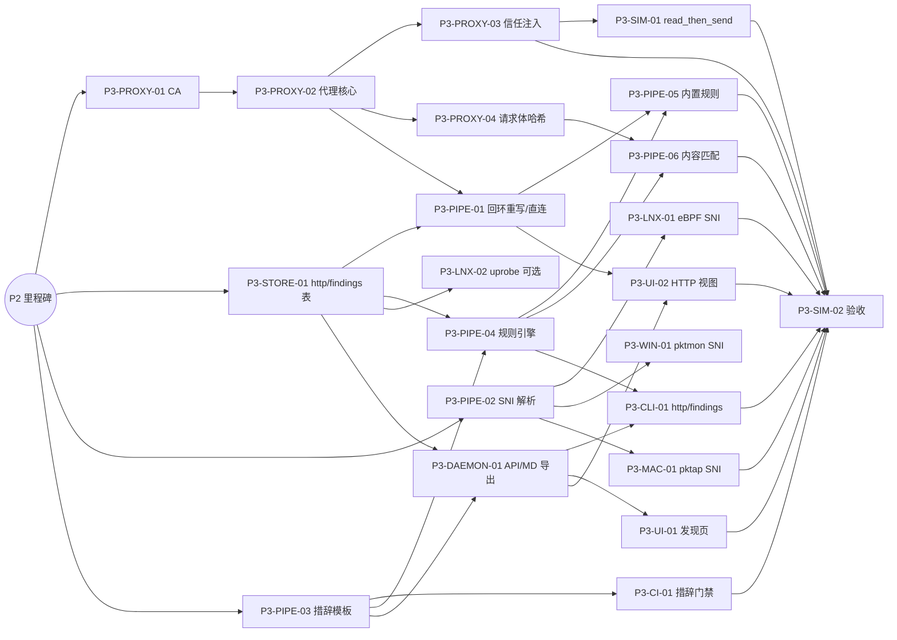

# P3 URL 与关联 任务清单

> 状态：草案
> 最后更新：2026-10-07
> 关联：[roadmap](../roadmap.md#p3-url-与关联)、[任务卡规范](README.md)、REQ-04.3、REQ-04.4、REQ-06、ADR-0004、ADR-0006、SPIKE-04
> 里程碑：P3 URL 与关联
> 截止：2027-01-17

## 1. 阶段目标

1. 在启动模式加 `--proxy` 的会话中，通过显式 MITM 代理拿到完整 URL（E2）。代理不覆盖的流量如实标为“直连”。
2. 三平台尽力采集 TLS SNI，提高域名归属的可信度。
3. 关联规则引擎只产生两类结论：“事实汇总”（E1）和“推测”（I）。措辞由模板和 CI 门禁保证，不夸大证据。
4. 内容分块哈希匹配是唯一可以升级为“内容匹配证据”的路径。

**退出标准**（与 [roadmap](../roadmap.md#p3-url-与关联) 一致）：

- 代理模式下，Node / Python / curl 三类客户端的 URL 记录准确。
- 每条 finding 都带证据等级，措辞由快照测试断言；除内容匹配证据外，不出现“上传了文件”一类表述。
- 剧本 `read_then_send` 覆盖三种结果：内容匹配命中、哈希未匹配、未启用代理（只产生推测）。
- 代理关闭后，系统和用户证书库没有任何变化。

## 2. 任务总表

| 编号 | 标题 | AREA | 规模 | 依赖 | 并行组 |
|---|---|---|---|---|---|
| P3-PROXY-01 | 会话 CA 生命周期与 `aw proxy` 子命令 | PROXY | M | P2 里程碑 | A |
| P3-PROXY-02 | hudsucker 代理核心：每会话端口与 HTTP 元数据采集 | PROXY | M | P3-PROXY-01 | B |
| P3-PROXY-03 | 信任注入与 `--proxy-on-reject` | PROXY | M | P3-PROXY-02 | C |
| P3-PROXY-04 | 请求体分块哈希（解压、JSON / base64 展开） | PROXY | M | P3-PROXY-02 | C |
| P3-STORE-01 | http 与 findings 表迁移，含 `findings.user_state` | STORE | S | P2 里程碑 | A |
| P3-PIPE-01 | 代理回环连接重写与直连检测 | PIPE | M | P3-PROXY-02, P3-STORE-01 | C |
| P3-PIPE-02 | SNI 解析与域名归属增强 | PIPE | S | P2 里程碑 | A |
| P3-PIPE-03 | 措辞模板库与 `wording::lint` | PIPE | S | P2 里程碑 | A |
| P3-PIPE-04 | 关联规则引擎（TOML DSL） | PIPE | M | P3-PIPE-03, P3-STORE-01 | B |
| P3-PIPE-05 | 8 条内置规则 | PIPE | M | P3-PIPE-04, P3-PIPE-01 | D |
| P3-PIPE-06 | 文件侧内容哈希与内容匹配判定 | PIPE | M | P3-PROXY-04, P3-PIPE-04 | D |
| P3-LNX-01 | Linux eBPF 首包 SNI 采集 | LNX | M | P3-PIPE-02 | B |
| P3-WIN-01 | Windows pktmon SNI 采集（可选） | WIN | M | P3-PIPE-02 | B |
| P3-MAC-01 | macOS pktap SNI 采集 | MAC | S | P3-PIPE-02 | B |
| P3-LNX-02 | Linux TLS 明文 uprobe（可选） | LNX | M | P3-STORE-01 | B |
| P3-CI-01 | 措辞门禁接入 CI（覆盖 `ui/src/i18n`） | CI | S | P3-PIPE-03 | B |
| P3-DAEMON-01 | `/http`、`/findings` API 与 Markdown 导出 | DAEMON | M | P3-STORE-01, P3-PIPE-03 | B |
| P3-CLI-01 | `aw http`、`aw findings`、`aw config rules test` | CLI | S | P3-DAEMON-01, P3-PIPE-04 | E |
| P3-UI-01 | 发现页与时间线推测行 | UI | M | P3-DAEMON-01 | E |
| P3-UI-02 | HTTP 视图、直连标记与代理设置 | UI | S | P3-DAEMON-01, P3-PIPE-01 | E |
| P3-SIM-01 | 剧本 `read_then_send` 与代理客户端矩阵 | SIM | M | P3-PROXY-03 | D |
| P3-SIM-02 | P3 验收 | SIM | S | 除本卡外全部 P3 任务（不含可选的 P3-LNX-02、P3-WIN-01） | F |

并行组的含义同 P2。代理线（PROXY）、规则线（PIPE-03/04/05）、SNI 线（PIPE-02 与三平台）三条线互相独立，可全程并行。

## 3. 依赖图

## 4. 任务卡

### P3-PROXY-01 会话 CA 生命周期与 `aw proxy` 子命令

- **AREA**: PROXY
- **平台**: all
- **类型**: feature
- **优先级**: M
- **规模**: M
- **依赖**: P2 里程碑
- **关联**: REQ-04.4, REQ-07, NFR-09, ADR-0006, RISK-07
- **文件范围**: `crates/aw-proxy/src/ca/`, `crates/aw-cli/src/cmd/proxy.rs`, `crates/aw-daemon/src/api/proxy.rs`
- **额外标签**: area:sec

**背景**：MITM 代理的 CA 私钥是本工具最敏感的资产。先把 CA 的生成、存储、分发、轮换和卸载做对，再开始做代理。

**实现要点**：
- 按 [security-privacy §5](../../01-architecture/security-privacy.md#5-代理-ca-证书生命周期) 实现：
  - 用 `rcgen` 生成 ECDSA P-256 自签 CA，有效期 90 天，设置 `pathlen:0`；
  - 私钥放在 `<data>/ca/ca.key`。Unix 上权限 0600、属主 root；Windows 上只有 SYSTEM 可读，并用 DPAPI（机器范围）加密；
  - 叶证书按需签发，有效期 7 天，只缓存在内存 LRU 中（上限 1024）。
- 为每个会话生成 `<session_tmp>/ca.pem`（只含公钥证书）和 `bundle.pem`（系统根证书加会话 CA）。该目录归会话用户所有，会话结束后删除。
- 自动轮换：到期前 7 天自动轮换；旧 CA 继续服务正在进行的会话，之后删除。
- CLI：
  - `aw proxy ca-info`：显示指纹和创建、到期时间；
  - `aw proxy rotate-ca [--revoke-now]`：`--revoke-now` 会立即终止所有代理会话；
  - `aw proxy trust --user | untrust`：带高风险确认提示，并把安装记录写入 `schema_meta`，供卸载时清理。
- `aw daemon uninstall` 时删除 CA 目录，并移除用户曾经显式安装到证书库的副本（NFR-09）。

**限制**：
- 私钥永不离开 daemon 进程，不出现在日志、API 或导出中。
- 默认**不**把 CA 安装到系统或用户证书库。

**验收标准**：
- [ ] `cargo test -p aw-proxy ca` 通过：生成、签发、轮换、过期处理。
- [ ] 端到端（Linux / Windows）：普通用户读取 `ca.key` 失败（Permission denied / Access denied）。
- [ ] 轮换前后各导出一次系统证书库的列表（Linux：`/etc/ssl/certs` 的文件清单；Windows：`certutil -store Root`；macOS：`security find-certificate -a`），内容不变。

**参考文档**：[security-privacy §5](../../01-architecture/security-privacy.md#5-代理-ca-证书生命周期)、[ADR-0006](../../03-adr/0006-explicit-mitm-proxy-for-url.md)

### P3-PROXY-02 hudsucker 代理核心：每会话端口与 HTTP 元数据采集

- **AREA**: PROXY
- **平台**: all
- **类型**: feature
- **优先级**: M
- **规模**: M
- **依赖**: P3-PROXY-01
- **关联**: REQ-04.4, REQ-07.2, CAP-URL, ADR-0006, RISK-12
- **文件范围**: `crates/aw-proxy/src/server/`, `crates/aw-proxy/src/record.rs`

**背景**：启动模式且显式加上 `--proxy` 的会话，由 daemon 为其启动一个只监听回环地址的 MITM 代理，采集请求元数据。

**实现要点**：
- 基于 `hudsucker`（hyper + rustls）。每个会话一个监听端口（`127.0.0.1:<随机端口>`），端口与会话一一对应；会话结束即关闭。
- 记录内容见 [network-attribution §5.4](../../01-architecture/network-attribution.md#54-记录内容)：方法、脱敏后的完整 URL、HTTP 版本、状态码、白名单请求头和响应头、请求与响应的 body 字节数、耗时、`Content-Type`。产生 `HttpRequest` / `HttpResponse` 事件，等级 E2，`source = proxy/mitm`。
- 请求头和 URL 先经过 P2 的脱敏引擎；`Authorization`、`Cookie`、`Set-Cookie`、`Proxy-Authorization`、`X-Api-Key` 等请求头一律丢弃。
- WebSocket：记录升级请求以及每个方向的帧数和字节数。SSE 和流式响应在响应结束时记录总字节。
- 把客户端连接的源端口暴露给管道，供 P3-PIPE-01 归属到 PID。
- 上游证书无效时，向客户端返回等价错误；代理过载时对客户端施加背压，不丢请求。

**限制**：
- 不保存任何 body 内容，也不把 body 写入日志。
- 不替客户端接受无效的上游证书。
- 不做透明代理：不改路由，不改防火墙。

**验收标准**：
- [ ] `cargo test -p aw-proxy server` 通过：用本地 HTTPS 测试服务器验证 HTTP/1.1、HTTP/2、WebSocket、SSE 四种场景的记录字段。
- [ ] 脱敏测试：带 `Authorization` 和 `?token=xxx` 的请求，在记录中找不到原值。
- [ ] 上游使用自签名证书时，客户端收到 TLS 错误而不是成功响应。

**参考文档**：[network-attribution §5](../../01-architecture/network-attribution.md#5-显式-mitm-代理aw-proxy)、[ADR-0006](../../03-adr/0006-explicit-mitm-proxy-for-url.md)

### P3-PROXY-03 信任注入与 `--proxy-on-reject`

- **AREA**: PROXY
- **平台**: all
- **类型**: feature
- **优先级**: M
- **规模**: M
- **依赖**: P3-PROXY-02
- **关联**: REQ-02.1, REQ-04.4, CAP-URL, SPIKE-04, RISK-04, RISK-15
- **文件范围**: `crates/aw-proxy/src/inject.rs`, `crates/aw-daemon/src/session/launch.rs`, `crates/aw-cli/src/cmd/run.rs`

**背景**：代理能否生效，取决于客户端是否认代理环境变量和自定义 CA。注入方式以 SPIKE-04 的实测矩阵为准。

**实现要点**：
- 启动目标进程时，按 [network-attribution §5.2](../../01-architecture/network-attribution.md#52-注入方式) 的表注入环境变量，并按 SPIKE-04 的结论增删。要点：
  - `NO_PROXY` 要追加到用户原有值之后，不覆盖；
  - 在会话元数据中记录哪些变量是覆盖用户原值的。
- 已知不生效的情况写成一张规则表（可执行文件名、版本特征 → 提示），在 `aw run` 启动时和 UI 新建会话页提示。例如 Electron 需要单独加 `--proxy-server` 参数。
- `--proxy-on-reject <fail|tunnel>`（配置项 `proxy.on_tls_reject`）：
  - 默认 `fail`：客户端拒绝会话 CA 时连接失败，记录 `error = cert_pinned`；
  - `tunnel`：改为 CONNECT 隧道放行，只记录域名和字节数，URL 字段标为 `NA(cert_pinned)`。
- 附着模式下使用 `--proxy` 时报错，提示“附着模式无法注入代理”。

**限制**：
- 不修改用户的 shell 配置文件或系统级代理设置。
- 不对 Chromium 内核的应用自动注入命令行参数（只提示）。

**验收标准**：
- [ ] 单元测试：注入后的环境变量集合与快照一致；用户已有的 `NO_PROXY` 得到保留。
- [ ] 端到端：`aw run --proxy -- curl https://localhost:<测试服务器端口>/x?token=abc` 后，`http` 表中有一条记录，URL 完整且 token 已脱敏。
- [ ] 端到端：用一个固定了证书的客户端（测试程序内置 pin），`fail` 模式下连接失败并记录 `cert_pinned`；`tunnel` 模式下连接成功，且 URL 为 NA。

**参考文档**：[network-attribution §5.2–§5.5](../../01-architecture/network-attribution.md#52-注入方式)、[SPIKE-04](../../06-research/SPIKE-04-proxy-trust-injection.md)

### P3-PROXY-04 请求体分块哈希（解压、JSON / base64 展开）

- **AREA**: PROXY
- **平台**: all
- **类型**: feature
- **优先级**: S
- **规模**: M
- **依赖**: P3-PROXY-02
- **关联**: REQ-06.3, CAP-URL, ADR-0012
- **文件范围**: `crates/aw-proxy/src/hash/`, `crates/aw-core/src/chunk.rs`
- **额外标签**: evidence

**背景**：内容匹配是从“推测”升级为“内容匹配证据”的唯一途径。请求侧必须使用与文件侧完全相同的分块算法，而且 body 只在内存中流式处理。

**实现要点**：
- 在 `aw-core::chunk` 实现共享的分块函数，供文件侧（P3-PIPE-06）复用：
  - FastCDC，平均块 256 B、最小 64 B、最大 1 KB；
  - 哈希用 BLAKE3；
  - 小于 64 B 的内容整体哈希。
- 请求体流式处理：
  - 按 `Content-Encoding` 解压 gzip / br / zstd，解压后大小设上限（默认 32 MB），用于防压缩炸弹；
  - 若为 JSON，另外对其中的字符串值做反转义和 base64 解码，并对结果分块；
  - multipart 按 part 分别处理。
- 把哈希集合交给匹配器（P3-PIPE-06）。处理完后立即丢弃明文缓冲区，哈希集合只存在内存中。
- 降级阶梯 L2 及以上时关闭哈希，并写入缺口。

**限制**：
- 不把 body 或解压后的内容写入磁盘、日志或交换文件（敏感缓冲区用 `zeroize`）。
- 哈希不影响转发延迟：哈希在旁路进行，超时就放弃并记录。

**验收标准**：
- [ ] `cargo test -p aw-core chunk`：同一内容无论切成什么大小的流式片段输入，得到的分块哈希集合都相同（proptest）。
- [ ] `cargo test -p aw-proxy hash`：gzip 压缩的文件、以 base64 放进 JSON 字段的文件、multipart 上传的文件，这三种情况都能产生与原文件重叠的哈希。
- [ ] 压缩炸弹测试：1 GB 的 0 压缩成约 1 MB 的 gzip，处理时内存增长 <64 MB，并记录截断。

**参考文档**：[evidence-model §6](../../01-architecture/evidence-model.md#6-内容哈希匹配i--内容匹配证据的唯一升级路径)

### P3-STORE-01 http 与 findings 表迁移，含 `findings.user_state`

- **AREA**: STORE
- **平台**: all
- **类型**: feature
- **优先级**: M
- **规模**: S
- **依赖**: P2 里程碑
- **关联**: REQ-04.4, REQ-06, ADR-0003
- **文件范围**: `crates/aw-store/migrations/`, `crates/aw-store/src/http.rs`, `crates/aw-store/src/findings.rs`, `fixtures/db/`

**背景**：代理产生的 HTTP 元数据，以及规则引擎产生的 findings，都需要存储。UI 设计中定义的“已确认 / 忽略”状态也在本任务迁移中加入。

**实现要点**：
- 新增迁移：按 [storage §3](../../01-architecture/storage.md#3-ddl) 创建 `http`、`findings` 表及其索引。如果前一阶段已建空表，则只做增量修改。
- `findings` 增加字段：
  - `user_state TEXT CHECK (user_state IN ('confirmed','ignored'))`，可为空；
  - `user_state_by`；
  - `user_state_ns`。
  同时把这几个字段回填到 storage.md 的 DDL。
- findings 的 UPSERT：按 `(session_id, rule_id, dedup_key)` 去重，累加 `count`，`refs` 最多保留 50 条。
- 更新 `timeline` 视图，纳入 `http` 和 `findings`。
- 把 `kind:http`、`kind:finding` 的字段注册到筛选编译器中。
- 新增旧版样例库 `fixtures/db/v<N>.db`。

**限制**：
- 只新增迁移文件，不修改已有的迁移。

**验收标准**：
- [ ] `cargo test -p aw-store http findings migrate` 通过，包括从 P2 版本的样例库升级。
- [ ] 同一去重键重复写入 100 次后，得到 `count = 100`，且 `refs` 长度为 50。
- [ ] storage.md 的 DDL 已更新，包含 `user_state` 相关字段。

**参考文档**：[storage](../../01-architecture/storage.md)、[ui §3.8](../../01-architecture/ui.md#38-发现-ssidfindings)

### P3-PIPE-01 代理回环连接重写与直连检测

- **AREA**: PIPE
- **平台**: all
- **类型**: feature
- **优先级**: M
- **规模**: M
- **依赖**: P3-PROXY-02, P3-STORE-01
- **关联**: REQ-04.1, REQ-04.4, CAP-NET, CAP-URL, ADR-0006, RISK-04
- **文件范围**: `crates/aw-pipeline/src/enrich/proxy.rs`, `crates/aw-store/migrations/`

**背景**：启用代理后，内核看到的是“进程 → 127.0.0.1:代理端口”的回环连接，而真正的外发由 daemon 完成。必须让“进程 X 向 api.example.com 发送了 N 字节”在有或没有代理时口径一致，并且不重复计数。

**实现要点**：
- 按 [network-attribution §5.3](../../01-architecture/network-attribution.md#53-直连检测) 实现：
  - 会话内进程到代理端口的回环连接：把 `net_flows.remote` 重写为代理上游的真实目标，设置 `via_proxy = 1`，字节数仍取内核观测到的回环连接值（E1）；
  - 代理自身的上游流量不计入会话的网络统计，只进入 `http` 表。
- 归属方式：用客户端源端口匹配内核采集器报告的回环连接，进而对应到 PID 和 ProcUid；并把 `http.flow_id` 指向重写后的 flow。
- 直连检测：代理会话中，去往非回环地址的 TCP/UDP 连接标为 `direct = 1`；UDP/443 另标 `quic`。这些连接的 URL 字段标为 `NA(direct_bypass_proxy)` 或 `NA(quic)`。
- 若 storage 尚无 `via_proxy` / `direct` 列，在本任务的迁移中新增。
- 把 `direct:true`、`via_proxy:true` 注册到筛选字段中。

**限制**：
- 不用代理侧统计的 body 字节数替代内核观测的字节数。两者口径不同，分别展示。

**验收标准**：
- [ ] `cargo test -p aw-pipeline enrich::proxy` 通过：用回放夹具（含回环连接事件和代理 HttpRequest）做快照，输出的 flow 目标是真实域名，且 `via_proxy = 1`。
- [ ] 端到端：同一剧本在有代理和无代理两种情况下，按域名汇总的上行字节差异 <5%。
- [ ] 端到端：剧本中故意绕过代理的一次直连被标为 `direct = 1`。

**参考文档**：[network-attribution §3–§5](../../01-architecture/network-attribution.md#53-直连检测)、[ADR-0006](../../03-adr/0006-explicit-mitm-proxy-for-url.md)

### P3-PIPE-02 SNI 解析与域名归属增强

- **AREA**: PIPE
- **平台**: all
- **类型**: feature
- **优先级**: M
- **规模**: S
- **依赖**: P2 里程碑
- **关联**: REQ-04.3, CAP-DNS, ADR-0004
- **文件范围**: `crates/aw-core/src/tls/client_hello.rs`, `crates/aw-pipeline/src/enrich/domain.rs`
- **额外标签**: evidence

**背景**：SNI 是 TLS 连接自报的目标主机名，比“IP 反查 DNS 缓存”更直接。本任务提供平台无关的 ClientHello 解析器，并把 SNI 纳入域名归属的优先级。三平台采集器（P3-LNX-01 / P3-WIN-01 / P3-MAC-01）只需交出首包字节。

**实现要点**：
- `aw-core::tls::parse_client_hello(&[u8]) -> Result<ClientHelloInfo, ParseError>`：
  - 提取 SNI、ALPN、TLS 版本；
  - 输入不完整（首包被截断）时返回 `Incomplete`，不 panic；
  - 能识别 ECH（Encrypted Client Hello），此时 SNI 字段为 `NA(ech)`，只记录外层的 public_name。
- 域名归属按 [network-attribution §4](../../01-architecture/network-attribution.md#4-ip--域名映射) 的优先级表，把 SNI 放在“同进程 DNS 应答”之后、“会话内其他进程 DNS 应答”之前；`domain_source` 取值增加 `sni`。
- SNI 与 DNS 映射冲突时（例如 CDN 共用 IP），以 SNI 为准，并在 `field_evidence` 中记录冲突的候选。
- 解析器加 fuzz target：`fuzz/fuzz_targets/client_hello.rs`。

**限制**：
- 只解析 ClientHello，不解析 ServerHello 或证书。
- 不对 SNI 做 DNS 反向验证。

**验收标准**：
- [ ] `cargo test -p aw-core tls` 通过：用 `fixtures/tls/` 下 curl、Node、Python、Go、Chrome 的真实 ClientHello 样本，SNI 和 ALPN 解析正确；截断样本返回 `Incomplete`。
- [ ] `cargo +nightly fuzz run client_hello -- -max_total_time=300` 无崩溃。
- [ ] `cargo test -p aw-pipeline enrich::domain`：SNI 与 DNS 冲突的夹具，输出的 `domain_source = sni`，且冲突候选被记录。

**参考文档**：[network-attribution §4](../../01-architecture/network-attribution.md#4-ip--域名映射)、[ADR-0004](../../03-adr/0004-evidence-levels.md)

### P3-PIPE-03 措辞模板库与 `wording::lint`

- **AREA**: PIPE
- **平台**: all
- **类型**: feature
- **优先级**: M
- **规模**: S
- **依赖**: P2 里程碑
- **关联**: REQ-06.2, REQ-10, RISK-08
- **文件范围**: `crates/aw-pipeline/src/wording/`
- **额外标签**: evidence

**背景**：防止“读取文件后联网”被写成“上传了文件”，不能靠自觉，要靠固定模板和自动检查。所有面向用户的结论文本都必须出自这里的模板。

**实现要点**：
- 模板文件：`crates/aw-pipeline/src/wording/zh.toml`、`en.toml`。键名按 [evidence-model §5](../../01-architecture/evidence-model.md#5-措辞模板) 定义：`fact.*`、`infer.temporal`、`infer.temporal_no_proxy`、`infer.temporal_hash_miss`、`evidence.content_match`、`fact.self_report_mismatch`、`gap.generic`、`attr.break`。
- `wording::render(id, &params, lang) -> String`：参数缺失时直接报错，不输出半成品；渲染结果中的路径和域名先经过脱敏。
- `wording::lint(text) -> Vec<Violation>`：按 evidence-model §7 的禁用词表检查。规则如下：
  - 中文禁用词包括“上传了”“泄露了”“窃取”“外传了”等；英文包括 `uploaded`、`exfiltrated`、`leaked`、`stole` 等；
  - 只有 `evidence.content_match` 模板可以出现“内容与……匹配”这类表述；
  - 每条违规带位置和建议改写。
- 两种语言的模板键集合必须一致，由单元测试保证。
- 模板自身也要通过 lint（`evidence.content_match` 走白名单）。

**限制**：
- 不支持在规则文件里写自由文本结论，只能引用模板 ID。

**验收标准**：
- [ ] `cargo test -p aw-pipeline wording` 通过：zh/en 键集合一致；所有模板通过 lint；参数缺失时报错。
- [ ] lint 反例测试：evidence-model §7 列出的每条反例都至少报一个违规；正例全部通过。

**参考文档**：[evidence-model §5、§7](../../01-architecture/evidence-model.md#5-措辞模板)

### P3-PIPE-04 关联规则引擎（TOML DSL）

- **AREA**: PIPE
- **平台**: all
- **类型**: feature
- **优先级**: M
- **规模**: M
- **依赖**: P3-PIPE-03, P3-STORE-01
- **关联**: REQ-06.2, REQ-10, NFR-07, RISK-08
- **文件范围**: `crates/aw-pipeline/src/rules/`, `crates/aw-pipeline/rules/`
- **额外标签**: evidence

**背景**：关联逻辑要可配置、可测试、可审查，并且在引擎层面就保证结论不越级。

**实现要点**：
- DSL 按 [pipeline §3.6](../../01-architecture/pipeline.md#36-correlate关联规则引擎) 实现：`[rule]` 的 id / version / title / evidence / wording / severity；`[[rule.match]]` 的 as / record / where / within / same；`[rule.emit]` 的 key / upgrade_if。
- `where` 表达式复用 `aw-core::filter` 的解析器和求值器，不另造语法。
- 加载时校验，违反即拒绝加载并给出行号：
  - 多步规则的 evidence 只能是 `I`，`kind = "fact_conjunction"` 例外；
  - severity 只能取 info / notice / warn；
  - `wording` 必须是已存在的模板 ID，且模板参数能由 match 绑定提供；
  - `within` 上限 10 分钟，防止状态无限增长。
- 执行模型：按事件时间推进的流式匹配，每条规则的部分匹配状态有上限（默认 10k），超出时淘汰最旧的状态并写入缺口 `rule_state_evicted`。
- 时钟可注入（虚拟时钟），回放测试结果确定。
- 输出 finding 写入 `findings` 表（UPSERT），`refs` 指向参与匹配的记录 ID。
- 规则来源：内置规则在 `crates/aw-pipeline/rules/*.toml`（编译期嵌入），用户规则在 `<config>/rules.d/*.toml`；同 ID 时用户规则覆盖内置规则，并在 `aw doctor` 中列出。

**限制**：
- 规则不能读取文件内容，也不能调用外部命令。
- 规则引擎不修改原始记录，只产生 findings。

**验收标准**：
- [ ] `cargo test -p aw-pipeline rules` 通过：DSL 解析；所有加载期约束的反例都被拒绝，且报错带行号。
- [ ] 虚拟时钟回放：同一夹具运行 10 次，输出的 findings 完全一致。
- [ ] 状态上限测试：构造 100k 个只匹配第一步的事件，内存增长有界，并产生 `rule_state_evicted` 缺口。
- [ ] `cargo bench -p aw-pipeline rules`：8 条内置规则全部开启时，管道吞吐下降 <15%。

**参考文档**：[pipeline §3.6](../../01-architecture/pipeline.md#36-correlate关联规则引擎)、[evidence-model](../../01-architecture/evidence-model.md)

### P3-PIPE-05 8 条内置规则

- **AREA**: PIPE
- **平台**: all
- **类型**: feature
- **优先级**: M
- **规模**: M
- **依赖**: P3-PIPE-04, P3-PIPE-01
- **关联**: REQ-06, REQ-07.4, REQ-10, RISK-04, RISK-08
- **文件范围**: `crates/aw-pipeline/rules/`, `fixtures/rules/`
- **额外标签**: evidence

**背景**：内置规则覆盖最常见的审计问题，同时作为用户写规则的范例。

**实现要点**：
- 按 [pipeline §3.6](../../01-architecture/pipeline.md#36-correlate关联规则引擎) 实现 8 条规则，每条一个 TOML 文件：

  | 规则 | 证据 | 说明 |
  |---|---|---|
  | `sensitive_access` | E1 | 访问了敏感路径（事实） |
  | `sensitive_read_then_send` | I | 读取敏感文件后一段时间内有外发（推测）；无代理时用 `infer.temporal_no_proxy`，哈希未匹配时用 `infer.temporal_hash_miss` |
  | `content_match` | 内容匹配 | 由 P3-PIPE-06 产生，本规则只负责措辞与去重 |
  | `direct_bypass_proxy` | E1 | 代理会话中出现直连 |
  | `attribution_break` | E1 | 归属链路中断 |
  | `self_report_mismatch` | E1 | Agent 自报与观测不一致（P5 接入 E3 后生效，本阶段先加载并用夹具测试） |
  | `mass_delete` | E1 | 10 秒内删除超过 50 个文件 |
  | `new_executable_written_then_run` | E1 | 写入新可执行文件后执行，`kind = "fact_conjunction"` |

- 每条规则配一个回放夹具 `fixtures/rules/<rule_id>/{input.jsonl,expected.json}`，至少包含一个命中样例和一个不命中样例（边界值：如恰好 50 个删除）。
- 每条规则在 correlation-rules.md 中的说明与 TOML 文件保持一致；以 TOML 为准，文档引用规则版本号。

**限制**：
- 不新增模板之外的措辞。
- `sensitive_read_then_send` 在任何情况下都不得输出 E1 或内容匹配等级。

**验收标准**：
- [ ] `cargo test -p aw-pipeline builtin_rules` 通过：8 个夹具的输出与 `expected.json` 一致。
- [ ] 所有内置规则输出文本通过 `wording::lint`（快照测试）。
- [ ] `aw config rules test crates/aw-pipeline/rules/mass_delete.toml fixtures/rules/mass_delete/input.jsonl` 输出与夹具一致（依赖 P3-CLI-01，可在 P3-SIM-02 中复核）。

**参考文档**：[pipeline §3.6](../../01-architecture/pipeline.md#36-correlate关联规则引擎)、[evidence-model §5](../../01-architecture/evidence-model.md#5-措辞模板)

### P3-PIPE-06 文件侧内容哈希与内容匹配判定

- **AREA**: PIPE
- **平台**: all
- **类型**: feature
- **优先级**: S
- **规模**: M
- **依赖**: P3-PROXY-04, P3-PIPE-04
- **关联**: REQ-06.3, REQ-07.2, REQ-07.4, RISK-07, RISK-08
- **文件范围**: `crates/aw-pipeline/src/content_match/`, `crates/aw-daemon/src/file_hasher.rs`
- **额外标签**: evidence, area:sec

**背景**：这是 daemon 唯一会读取文件内容的场景，必须有严格的边界：只在代理会话中、只对会话内被读取过的文件、只在内存中算哈希。

**实现要点**：
- 触发条件（全部满足）：会话启用了代理；文件被会话内进程读取过；文件大小 ≤ `max_hash_file_size`（默认 10 MB）；降级级别 < L2。
- 读取方式：daemon 以只读方式打开，用与 P3-PROXY-04 相同的 `aw-core::chunk` 分块；尽量使用 `O_NOATIME` / `FILE_FLAG_SEQUENTIAL_SCAN`；文件在读取前后的 mtime/size 不一致时放弃，记 `NA(file_changed)`。
- 被读取时的内容与 daemon 读取时的内容可能不同：在 finding 的 `caveats` 中记录“哈希基于 daemon 读取时刻的文件内容”。
- 判定阈值：同一请求体与同一文件的重叠块数 ≥ `min_chunks`（3）且覆盖率 ≥ `min_coverage`（文件块数的 20%）时，产生 `kind = content_match` 的 finding，措辞用 `evidence.content_match`，参数包括重叠块数和覆盖率。
- 不满足阈值时，把“已比对、未匹配”的结果交给 `sensitive_read_then_send`，使其选用 `infer.temporal_hash_miss` 模板。
- 哈希集合只存在内存中，会话结束即丢弃；数据库中只存匹配结论（块数、覆盖率），不存哈希值。

**限制**：
- 不对未被会话读取的文件计算哈希；不扫描目录。
- 跳过的文件（超大、权限不足、已变化）都要写原因，不能悄悄忽略。

**验收标准**：
- [ ] `cargo test -p aw-pipeline content_match` 通过：完全上传、部分上传（30%）、仅上传 10%、无关内容四种夹具，分别得到“匹配 / 匹配 / 未匹配 / 未匹配”。
- [ ] 超过 10 MB 的文件产生 `NA(too_large)` 记录，不读取文件。
- [ ] `sim scan-secrets` 扫描会话数据库，不包含任何块哈希值或文件内容片段。

**参考文档**：[evidence-model §6](../../01-architecture/evidence-model.md#6-内容哈希匹配i--内容匹配证据的唯一升级路径)、[security-privacy](../../01-architecture/security-privacy.md)

### P3-LNX-01 Linux eBPF 首包 SNI 采集

- **AREA**: LNX
- **平台**: linux
- **类型**: feature
- **优先级**: M
- **规模**: M
- **依赖**: P3-PIPE-02
- **关联**: REQ-04.3, CAP-DNS, ADR-0004
- **文件范围**: `crates/aw-collector-linux/src/bpf/sni.bpf.c`, `crates/aw-collector-linux/src/sni.rs`

**背景**：Linux 上可以在内核里拿到 TLS 连接的首笔写入，开销很小，不需要抓包。

**实现要点**：
- 在 `tcp_sendmsg`（kprobe 或 fentry）上，只对会话内进程、且该 socket 的首笔写入，用 `bpf_probe_read_user` 读取 iov 的前 1 KB，经 ringbuf 交给用户态；读取前先检查首字节是否为 `0x16`（TLS handshake），不是就跳过。
- 每个 socket 只读一次，用 socket 指针作为 map 键，连接关闭时删除。
- 用户态调用 `aw-core::tls::parse_client_hello`，把结果关联到对应的 flow，产生 `TlsClientHello` 事件，`source = linux.ebpf/tcp_sendmsg_sni`，等级 E1。
- 首包跨多个 iov 或被拆成多次写入时，解析返回 `Incomplete`，SNI 记为 `NA(partial_client_hello)`。
- 备选方案：内核不支持在该挂载点读用户内存时，改用 AF_PACKET 套接字配合 BPF 过滤器抓取会话 socket 的首包，`source = linux.afpacket/sni`；两种方式都不可用时写缺口。

**限制**：
- 除 ClientHello 前 1 KB 外，不读取任何负载数据；map 中不保留负载。
- 不对非会话进程启用。

**验收标准**：
- [ ] Linux CI（特权 runner）：`aw run -- curl https://localhost:<端口> --resolve test.example:<端口>:127.0.0.1` 后，对应 flow 的 `domain = test.example`，`domain_source = sni`。
- [ ] 读用户内存失败的内核（用 CI 矩阵中的低版本内核或强制开关 `AW_FORCE_SNI_FALLBACK=1` 模拟），回落到 AF_PACKET，或写入缺口。
- [ ] `typical_agent` 剧本下，开启 SNI 采集后 CPU 开销增量 <0.3%（`aw doctor --perf` 对比）。

**参考文档**：[linux §网络](../../02-platforms/linux.md)、[network-attribution §4](../../01-architecture/network-attribution.md#4-ip--域名映射)

### P3-WIN-01 Windows pktmon SNI 采集（可选）

- **AREA**: WIN
- **平台**: windows
- **类型**: feature
- **优先级**: C
- **规模**: M
- **依赖**: P3-PIPE-02
- **关联**: REQ-04.3, CAP-DNS, RISK-13
- **文件范围**: `crates/aw-collector-windows/src/sni/`

**背景**：Windows 默认不采集 SNI。可选方案有 pktmon（ETW provider `Microsoft-Windows-PktMon`）和 WinDivert；前者为系统自带，但能力【待验证】，后者有许可证顾虑。

**实现要点**：
- 先做为期 1 天的验证：确认 PktMon ETW 是否能实时提供包内容片段，以及能否按 5 元组过滤；把结论写回 [windows.md](../../02-platforms/windows.md) 并更新【待验证】标注。
- 可行时：订阅 PktMon 实时事件，按会话内 flow 的 5 元组匹配 TCP 首个携带负载的出向包，提取负载交给 `parse_client_hello`；`source = windows.pktmon/sni`，等级 E1。
- 不可行时：只在文档中记录 WinDivert 方案（LGPL/GPL 双许可，需作为可选的动态加载组件，不进默认安装包），并关闭本任务。
- 配置开关 `collectors.windows.sni = false`（默认关闭）。

**限制**：
- 默认安装包不包含 WinDivert 驱动。
- 不修改系统全局的 pktmon 配置；退出时清理本工具创建的过滤器。

**验收标准**：
- [ ] windows.md 中 pktmon 相关的【待验证】已更新为实测结论。
- [ ] 若实现：Windows 端到端测试中，开启开关后 curl 访问本地 HTTPS 服务器的 flow 带 `domain_source = sni`；关闭开关后，`pktmon list` 无本工具残留的过滤器。

**参考文档**：[windows](../../02-platforms/windows.md)、[risks RISK-13](../risks.md)

### P3-MAC-01 macOS pktap SNI 采集

- **AREA**: MAC
- **平台**: macos
- **类型**: feature
- **优先级**: S
- **规模**: S
- **依赖**: P3-PIPE-02
- **关联**: REQ-04.3, CAP-DNS
- **文件范围**: `crates/aw-collector-macos/src/sni.rs`

**背景**：macOS 的 DNS 查询由 mDNSResponder 代发，DNS 应答无法直接归属到发起进程。pktap 能给每个包标注进程信息，可以用来拿 SNI。

**实现要点**：
- 以子进程方式运行 `tcpdump -i pktap,all -k NP -w - 'tcp[((tcp[12]&0xf0)>>2)]=0x16'`（或直接打开 pktap 接口），只抓 TLS handshake 包；从 pktap 头里取 PID，与会话进程匹配后交给 `parse_client_hello`。
- 产生 `TlsClientHello` 事件，`source = macos.pktap/sni`，等级 E1（PID 由内核标注）。
- DNS：pktap 抓到的 DNS 应答只能归属到 mDNSResponder，对应的域名映射以 I 级回填（`domain_source = dns_unattributed`），并在 field_evidence 中写明原因。
- 子进程意外退出时自动重启，并写缺口。

**限制**：
- 只抓握手包，不保存 pcap 文件。

**验收标准**：
- [ ] macOS 端到端：`aw run -- curl https://localhost:<端口> --resolve test.example:<端口>:127.0.0.1` 后，flow 的 `domain_source = sni`。
- [ ] 手动 `kill` tcpdump 子进程后，10 秒内恢复，并产生一条缺口记录。

**参考文档**：[macos §网络](../../02-platforms/macos.md)、[network-attribution §4](../../01-architecture/network-attribution.md#4-ip--域名映射)

### P3-LNX-02 Linux TLS 明文 uprobe（可选）

- **AREA**: LNX
- **平台**: linux
- **类型**: feature
- **优先级**: C
- **规模**: M
- **依赖**: P3-STORE-01
- **关联**: REQ-04.4, CAP-URL, RISK-07
- **文件范围**: `crates/aw-collector-linux/src/bpf/tls_uprobe.bpf.c`, `crates/aw-collector-linux/src/tls_uprobe.rs`
- **额外标签**: area:sec

**背景**：附着模式无法注入代理。Linux 上可以用 uprobe 挂到 TLS 库，在加密前拿到 HTTP 请求行，作为附着模式下的 URL 补充来源。

**实现要点**：
- 挂载点：OpenSSL / BoringSSL 的 `SSL_write` / `SSL_read`（按会话进程映射的共享库定位）；Go 程序的 `crypto/tls.(*Conn).Write`（按符号表定位，处理寄存器调用约定）。
- 只读取每个连接首个请求的前 2 KB，在用户态解析出请求行和 Host 头（HTTP/1.x）；HTTP/2 只尝试识别 `:path`、`:authority`，失败就记 `NA(h2_hpack)`。
- 产生 `HttpRequest` 事件，等级 E2，`source = linux.uprobe/openssl` 或 `linux.uprobe/go_tls`；脱敏规则与代理一致。
- 配置 `collectors.linux.tls_uprobe = false`（默认关闭）；开启时，UI 概览页和 `aw doctor` 明确提示“正在读取 TLS 明文的前 2 KB”。

**限制**：
- 不读取响应体，也不读取首个请求之外的数据。
- 静态链接或去符号的程序不支持，并如实标注原因。

**验收标准**：
- [ ] Linux CI：开启开关后，附着到 `curl`（OpenSSL）和一个 Go HTTP 客户端，`http` 表中出现 URL 正确的记录。
- [ ] 默认配置下不挂载任何 uprobe（`bpftool prog list` 无对应程序）。
- [ ] `sim scan-secrets` 不能在数据库中找到请求头中的测试 token。

**参考文档**：[linux](../../02-platforms/linux.md)、[security-privacy](../../01-architecture/security-privacy.md)

### P3-CI-01 措辞门禁接入 CI（覆盖 `ui/src/i18n`）

- **AREA**: CI
- **平台**: all
- **类型**: chore
- **优先级**: M
- **规模**: S
- **依赖**: P3-PIPE-03
- **关联**: REQ-06.2, RISK-08
- **文件范围**: `xtask/src/wording_lint.rs`, `.github/workflows/ci.yml`, `ui/src/i18n/`
- **额外标签**: evidence

**背景**：措辞模板之外，UI 文案、文档示例、CLI 输出也可能写出夸大表述，需要一个统一门禁。

**实现要点**：
- `cargo xtask wording-lint [paths...]`：调用 `aw_pipeline::wording::lint`，默认扫描 `ui/src/i18n/**/*.json`、`crates/aw-cli/src/**/*.rs` 中的字符串字面量、`crates/aw-pipeline/rules/*.toml`。
- 支持行内豁免 `// wording-lint: allow <原因>`，豁免必须写原因，豁免数量在 CI 日志中汇总。
- 在 `ci.yml` 的 lint job 中加入该步骤；失败时输出文件、行号、违规词和建议改写。
- 在 [coding-conventions](../../05-dev/coding-conventions.md) 中补充一节，说明门禁和豁免方式。

**限制**：
- 不扫描 `docs/`（文档中需要出现反例），只在 evidence-model 中引用。

**验收标准**：
- [ ] 在 `ui/src/i18n/zh.json` 中加入“已上传文件”的测试 PR，CI 失败并指出行号。
- [ ] `cargo xtask wording-lint` 在主分支上通过。

**参考文档**：[evidence-model §7](../../01-architecture/evidence-model.md#7-禁止的表述反例清单)、[ci-release](../../05-dev/ci-release.md)

### P3-DAEMON-01 `/http`、`/findings` API 与 Markdown 导出

- **AREA**: DAEMON
- **平台**: all
- **类型**: feature
- **优先级**: M
- **规模**: M
- **依赖**: P3-STORE-01, P3-PIPE-03
- **关联**: REQ-04.4, REQ-05.3, REQ-06, REQ-07.6
- **文件范围**: `crates/aw-daemon/src/api/http.rs`, `crates/aw-daemon/src/api/findings.rs`, `crates/aw-daemon/src/export/markdown.rs`, `docs/01-architecture/api-and-cli.md`

**背景**：P2 中 `/http`、`/findings` 返回 501，本任务实现它们，并增加面向人阅读的 Markdown 报告导出。

**实现要点**：
- `GET /sessions/{sid}/http?filter=&cursor=&limit=`：返回 http 记录，字段与 storage 一致，未经代理时返回空列表并附 `reason: no_proxy`。
- `GET /sessions/{sid}/findings?lang=zh|en&min_severity=&evidence=`：返回 findings，并用 `wording::render` 生成 `text`；同时返回 `wording_id` 和 `params`，便于前端自行渲染。
- `PATCH /sessions/{sid}/findings/{id}`：设置 `user_state`（confirmed / ignored / null），记录操作者和时间。
- 导出：`POST /sessions/{sid}/export?format=md`，生成 Markdown 报告：会话信息、采集能力与缺口、发现（按证据等级分组，内容匹配单独一节）、Top 域名和文件。报告末尾固定附上证据等级说明。
- 报告与 JSONL / CSV 导出一样经过脱敏，并通过 `wording::lint`。
- 更新 api-and-cli.md 中对应接口说明，与 OpenAPI 定义保持一致。

**限制**：
- 普通用户只能访问自己的会话，权限检查沿用 P2-DAEMON-01。
- 报告中不出现“安全”“无风险”等结论。

**验收标准**：
- [ ] `cargo test -p aw-daemon api::http api::findings export::markdown` 通过。
- [ ] 用 `read_then_send` 剧本的会话导出 Markdown，`cargo xtask wording-lint <报告文件>` 通过，且 `sim scan-secrets` 无命中。
- [ ] OpenAPI 生成的类型与 `ui/` 编译通过（`pnpm -C ui typecheck`）。

**参考文档**：[api-and-cli](../../01-architecture/api-and-cli.md)、[storage](../../01-architecture/storage.md)

### P3-CLI-01 `aw http`、`aw findings`、`aw config rules test`

- **AREA**: CLI
- **平台**: all
- **类型**: feature
- **优先级**: M
- **规模**: S
- **依赖**: P3-DAEMON-01, P3-PIPE-04
- **关联**: REQ-04.4, REQ-05.2, REQ-06, REQ-10
- **文件范围**: `crates/aw-cli/src/cmd/http.rs`, `crates/aw-cli/src/cmd/findings.rs`, `crates/aw-cli/src/cmd/config_rules.rs`

**背景**：CLI 是自动化和无图形环境下的主要入口，也是规则作者调试规则的工具。

**实现要点**：
- `aw http <SESSION> [--filter] [--json]`：表格列出时间、进程、方法、URL（脱敏后）、状态码、请求和响应字节、耗时；会话未启用代理时提示原因。
- `aw findings <SESSION> [--min-severity info|notice|warn] [--evidence E1|I|content_match] [--lang] [--json]`：输出渲染后的措辞、证据等级、次数、首次和末次时间；`--json` 包含 `refs`。
- `aw config rules test <rule.toml> <fixture.jsonl> [--expect expected.json]`：离线加载规则（不需要 daemon），用虚拟时钟回放夹具，打印 findings；给了 `--expect` 时比较结果，不一致则以非 0 退出。规则加载失败时打印行号。
- `aw config rules list`：列出内置规则和用户规则，以及覆盖关系。
- 参数和输出格式以 [api-and-cli](../../01-architecture/api-and-cli.md) 为准，有出入时先改文档。

**限制**：
- `aw config rules test` 不连接 daemon，也不读取任何真实会话。

**验收标准**：
- [ ] `cargo test -p aw-cli` 中的快照测试覆盖三个命令的表格和 JSON 输出。
- [ ] `aw config rules test crates/aw-pipeline/rules/mass_delete.toml fixtures/rules/mass_delete/input.jsonl --expect fixtures/rules/mass_delete/expected.json` 以 0 退出；改坏 expected 后以非 0 退出。

**参考文档**：[api-and-cli](../../01-architecture/api-and-cli.md)、[pipeline §3.6](../../01-architecture/pipeline.md#36-correlate关联规则引擎)

### P3-UI-01 发现页与时间线推测行

- **AREA**: UI
- **平台**: all
- **类型**: feature
- **优先级**: M
- **规模**: M
- **依赖**: P3-DAEMON-01
- **关联**: REQ-06, REQ-05.1, RISK-08
- **文件范围**: `ui/src/routes/s.$sid.findings.tsx`, `ui/src/features/findings/`, `ui/src/features/timeline/`, `ui/src/i18n/`
- **额外标签**: evidence

**背景**：findings 是用户最关注的内容，也是最容易被误读的内容。UI 必须让“事实”“推测”“内容匹配证据”在视觉上一眼可分。

**实现要点**：
- 发现页按 [ui §3.8](../../01-architecture/ui.md#38-发现-ssidfindings)：
  - 分组顺序：内容匹配证据 → 事实汇总（E1）→ 推测（I）；每组标题旁带证据等级说明的 ⓘ；
  - 每条显示措辞（来自 API 的 `text`）、次数、首次和末次时间、严重度；
  - 「查看依据」展开 `refs` 对应的原始记录，并可跳到时间线；
  - 推测类条目固定显示 caveat 文案（例如“时间上相邻，不代表文件内容被发送”）；
  - 操作：确认 / 忽略（调用 `PATCH`），已忽略的默认折叠。
- 时间线：渲染 P2 预留的 `kind = finding` 分支，推测行用虚线边框和 `推测` 徽标，与事实行区分；点击展开依据。
- 概览页的“发现摘要”占位替换为实际数据。
- 所有新增文案放入 `ui/src/i18n/`，受 P3-CI-01 门禁约束。

**限制**：
- 前端不自行拼接结论文本，只使用 API 返回的 `text`，或用 `wording_id` + `params` 渲染同一套模板。
- 不使用红色等“警报”样式表现推测类条目。

**验收标准**：
- [ ] 组件测试：三种 kind 的 finding 渲染出不同徽标和样式；推测类条目总是显示 caveat。
- [ ] Playwright：`read_then_send` 会话中点击「查看依据」可看到文件读取和网络记录；忽略后刷新页面状态保留。

**参考文档**：[ui §3.4、§3.8](../../01-architecture/ui.md#38-发现-ssidfindings)、[evidence-model](../../01-architecture/evidence-model.md)

### P3-UI-02 HTTP 视图、直连标记与代理设置

- **AREA**: UI
- **平台**: all
- **类型**: feature
- **优先级**: M
- **规模**: S
- **依赖**: P3-DAEMON-01, P3-PIPE-01
- **关联**: REQ-04.4, REQ-07.2
- **文件范围**: `ui/src/features/network/`, `ui/src/features/settings/proxy/`

**背景**：补上 P2 网络页中的 HTTP 层占位，并把代理相关设置做成可用的界面。

**实现要点**：
- 网络页分组表的第三层显示 HTTP 请求：方法、URL、状态码、请求和响应字节、耗时、证据（E2）。
- 连接行标记：`直连`（`direct = 1`，带 ⓘ 说明“此连接未经过代理，URL 不可得”）、`QUIC`、`经代理`；新增快捷筛选「直连」。
- `cert_pinned` 的请求显示为“客户端拒绝了会话证书”，并提示 `--proxy-on-reject tunnel` 的取舍。
- 设置页代理分区：显示 CA 指纹、创建和到期时间；「轮换 CA」按钮（需管理员，二次确认）；默认的 `on_tls_reject` 选项；“信任到用户证书库”只给出 CLI 命令和风险说明，不提供一键按钮。

**限制**：
- 不展示任何请求头的原值之外的内容（body 本就不存）。

**验收标准**：
- [ ] 组件测试：`direct`、`quic`、`cert_pinned` 三种状态的渲染。
- [ ] Playwright：代理会话中，网络页展开连接后能看到 HTTP 请求，URL 与 `aw http @last --json` 一致。

**参考文档**：[ui §3.7、§3.10](../../01-architecture/ui.md#37-网络-ssidnetwork)、[network-attribution §5](../../01-architecture/network-attribution.md#5-显式-mitm-代理aw-proxy)

### P3-SIM-01 剧本 `read_then_send` 与代理客户端矩阵

- **AREA**: SIM
- **平台**: all
- **类型**: feature
- **优先级**: M
- **规模**: M
- **依赖**: P3-PROXY-03
- **关联**: REQ-04.4, REQ-06, SPIKE-04, RISK-04
- **文件范围**: `sim/scenarios/read_then_send.toml`, `sim/scenarios/proxy_clients.toml`, `sim/clients/`

**背景**：P3 的退出标准依赖两个可重复的剧本：一个验证关联结论的措辞与证据等级，一个验证不同客户端在代理下的 URL 准确性。

**实现要点**：
- `read_then_send.toml`，三个变体（真值文件中写明预期 finding）：
  1. `match`：读取诱饵文件后，把其内容以 gzip + JSON base64 方式 POST 到本地测试服务器（代理开启）→ 预期 `content_match`；
  2. `miss`：读取诱饵文件后，POST 一段无关数据（代理开启）→ 预期推测 `infer.temporal_hash_miss`；
  3. `no_proxy`：同 `match` 但不开代理 → 预期推测 `infer.temporal_no_proxy`。
- `proxy_clients.toml`：分别用 Node（fetch 与 axios）、Python（requests 与 httpx）、curl 访问本地测试服务器的一组已知 URL（含查询参数、重定向、HTTP/2、WebSocket），真值为 URL 列表。
- `sim compare` 增加 `http` 与 `findings` 两类比对：URL 精确匹配率；finding 的 rule_id、evidence、wording_id 是否与真值一致。
- 测试客户端放在 `sim/clients/`，CI 中通过 `setup-node` / `setup-python` 安装。

**限制**：
- 测试服务器只监听回环地址；剧本不访问外网。

**验收标准**：
- [ ] `cargo run -p sim -- run sim/scenarios/read_then_send.toml --variant match --truth out/truth.jsonl` 在三平台运行成功。
- [ ] `cargo test -p sim compare::http compare::findings` 通过。

**参考文档**：[testing](../../05-dev/testing.md)、[SPIKE-04](../../06-research/SPIKE-04-proxy-trust-injection.md)

### P3-SIM-02 P3 验收

- **AREA**: SIM
- **平台**: all
- **类型**: chore
- **优先级**: M
- **规模**: S
- **依赖**: P3-PROXY-03, P3-PIPE-05, P3-PIPE-06, P3-LNX-01, P3-MAC-01, P3-CI-01, P3-CLI-01, P3-UI-01, P3-UI-02, P3-SIM-01
- **关联**: REQ-04.3, REQ-04.4, REQ-06, NFR-09
- **文件范围**: `docs/04-plan/`, `docs/02-platforms/capability-matrix.md`, `docs/04-plan/risks.md`

**背景**：逐条核对 roadmap 中 P3 的退出标准，并把实测结果回填到文档。

**实现要点**：
- 三平台运行 `proxy_clients`，统计 URL 准确率；运行 `read_then_send` 三个变体，核对 finding 的证据等级与措辞。
- 代理会话结束和 `aw daemon uninstall` 后，按 P3-PROXY-01 的方法比对证书库。
- 把结果写入 roadmap 的「阶段复盘」；更新 capability-matrix 中 CAP-URL、CAP-DNS 各项的【待验证】；在 risks.md 中更新 RISK-04、RISK-08 的状态。
- 可选任务 P3-LNX-02、P3-WIN-01 若未完成，在复盘中注明。

**限制**：
- 本任务不修改代码，发现的问题另开任务。

**验收标准**：
- [ ] roadmap 中 P3 的退出标准均有实测数据并标明是否达标。
- [ ] capability-matrix 中 CAP-URL、CAP-DNS 不再有未处理的【待验证】。
- [ ] 三平台的证书库比对结果附在复盘中，均无变化。

**参考文档**：[roadmap](../roadmap.md)、[capability-matrix](../../02-platforms/capability-matrix.md)、[risks](../risks.md)
