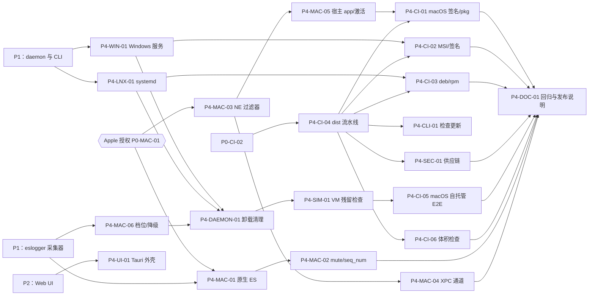

# P4 原生化与打包 任务清单

> 状态：草案
> 最后更新：2026-10-06
> 关联：[roadmap](../roadmap.md#p4-原生化与打包)、[任务卡规范](README.md)、[macos](../../02-platforms/macos.md)、[ci-release](../../05-dev/ci-release.md)、[ADR-0009](../../03-adr/0009-macos-two-step.md)
> 里程碑：P4 原生化与打包
> 截止：2027-02-14

## 1. 阶段目标

1. **macOS 原生化**：如果拿到了 Apple 授权，用原生 ES 替换 eslogger，用 Network Extension 替换 nettop，把 macOS 的进程、文件、流量证据都升到 E1。没拿到授权时，macOS 照常发布，能力降级要在产品里如实标出。
2. **三平台可安装**：提供签名的安装包，daemon 以系统服务运行，卸载干净：不留服务、系统扩展、CA 和数据（NFR-09）。
3. **可发布**：打 tag 后自动产出 GitHub Release，附带校验和、签名和 SBOM。安装包体积满足 NFR-04。
4. **发布质量**：三平台在干净虚拟机里跑完 安装 → 剧本 → 卸载 的全量回归，结果存档。

> **外部依赖**：P4-MAC-01~05 需要 Apple 授权（[RISK-01](../risks.md#risk-01-apple-es--ne-授权审批慢或被拒)，[SPIKE-08](../../06-research/SPIKE-08-apple-entitlements.md)）。P4 开始时还没获批的话，这几项打上 `status:blocked`，先做 P4-MAC-06（降级开关），按 M1 档位发布。

## 2. 任务总表

| 编号 | 标题 | AREA | 规模 | 依赖 | 并行组 |
|---|---|---|---|---|---|
| P4-MAC-01 | 原生 ES 客户端与事件映射 | MAC | M | P0-MAC-01, P1：macOS eslogger 采集器 | A |
| P4-MAC-02 | ES 反向 mute、范围联动与 seq_num 丢失检测 | MAC | M | P4-MAC-01 | B |
| P4-MAC-03 | macos-ext：NE 内容过滤器（Swift） | MAC | M | P0-MAC-01 | A |
| P4-MAC-04 | NE ↔ daemon XPC 通道与流事件映射 | MAC | M | P4-MAC-03 | B |
| P4-MAC-05 | 宿主 app、系统扩展激活/停用与用户引导 | MAC | M | P4-MAC-03 | B |
| P4-MAC-06 | macOS 采集档位（M1/M2）选择与降级开关 | MAC | S | P1：macOS eslogger 采集器 | A |
| P4-CI-01 | macOS 签名、公证与 pkg 安装包 | CI | M | P4-MAC-05, P4-CI-04 | C |
| P4-WIN-01 | Windows 服务化：安装、恢复策略与权限 | WIN | M | P1：daemon 与 CLI | A |
| P4-CI-02 | Windows MSI 安装包与 Authenticode 签名 | CI | M | P4-WIN-01, P4-CI-04 | C |
| P4-LNX-01 | systemd unit 与最小能力集合 | LNX | M | P1：daemon 与 CLI | A |
| P4-CI-03 | Linux deb / rpm / tar.gz 打包 | CI | S | P4-LNX-01, P4-CI-04 | C |
| P4-CI-04 | dist 发布流水线与版本策略 | CI | M | P0-CI-02 | A |
| P4-SEC-01 | 供应链：cargo-deny、cargo-audit、SBOM、签名校验和 | SEC | S | P4-CI-04 | B |
| P4-DAEMON-01 | 卸载清理与 `--purge`（三平台） | DAEMON | M | P4-WIN-01, P4-LNX-01, P4-MAC-06 | B |
| P4-SIM-01 | 干净虚拟机安装 → 剧本 → 卸载 残留检查 | SIM | M | P4-DAEMON-01 | C |
| P4-CI-05 | 自托管 macOS runner 的特权端到端测试 | CI | M | P4-SIM-01 | D |
| P4-CI-06 | 安装包体积预算检查（NFR-04） | CI | S | P4-CI-04 | B |
| P4-CLI-01 | 手动检查更新（不自动外发） | CLI | S | P4-CI-04 | B |
| P4-UI-01 | 可选 Tauri 桌面外壳 | UI | M | P2：Web UI | C |
| P4-DOC-01 | 发布前全量回归与 1.0 发布说明 | DOC | S | 本阶段其余全部任务 | D |

并行组：同组任务之间文件不重叠，可同时分给多个 subagent。macOS 原生（MAC-01~05）和 Windows/Linux 打包是两条独立路线；只有 Apple 授权到位后，前者才能开工。

## 3. 依赖图

## 4. 任务卡

### P4-MAC-01 原生 ES 客户端与事件映射

- **AREA**: MAC
- **平台**: macos
- **类型**: feature
- **优先级**: S
- **规模**: M
- **依赖**: P0-MAC-01, P1：macOS eslogger 采集器
- **关联**: REQ-01, REQ-02, REQ-03, CAP-PROC, CAP-FILE, ADR-0009, SPIKE-08, RISK-01, RISK-12
- **文件范围**: `crates/aw-collector-macos/src/es/`、`crates/aw-collector-macos/Cargo.toml`
- **额外标签**: evidence, status:blocked

**背景**：eslogger 要解析 JSON、不能按进程过滤，Apple 也声明它的输出格式不稳定（RISK-03）。拿到 `com.apple.developer.endpoint-security.client` 授权后，改由 daemon 直接创建 ES client，拿到结构化的 `es_message_t`。

**实现要点**：
- 依赖 `endpoint-sec` crate，放在 `cfg(target_os = "macos")` 和 feature `native-es` 之下。不开 feature 时编译产物与 M1 档位一致。
- 只订阅 NOTIFY 事件：`EXEC`、`FORK`、`EXIT`、`OPEN`、`CLOSE`、`CREATE`、`UNLINK`、`RENAME`、`WRITE`（可选）、`MMAP`（可选）。**不订阅任何 AUTH 事件**。
- 映射规则沿用 [macos §3](../../02-platforms/macos.md#3-到-rawevent-的映射汇总)。`source` 取 `macos.es/<事件名>`，如 `macos.es/exec`、`macos.es/open`。
- `FileRead` 字节数仍拿不到：`bytes = None`，`field_evidence.bytes = NA(es_no_read_event)`。
- ES 回调里只拷贝必要字段，然后放进有界通道；解析和 ProcUid 计算放到回调之外做。
- 时钟：`mach_time` 按启动时取得的 timebase 换算，与 [event-schema §4](../../01-architecture/event-schema.md#4-时钟域) 保持一致。
- 实现 `Collector` trait，`capabilities()` 返回 M2 档位能力。
- `es_new_client` 的错误码（`ERR_NOT_ENTITLED`、`ERR_NOT_PERMITTED`、`ERR_NOT_PRIVILEGED` 等）翻译成 `CollectorError::Permission { hint }`，供 `aw doctor` 展示。

**限制**：
- 不订阅 AUTH 事件，不做任何拦截。
- 不删除 eslogger 采集器，两者共存，由 P4-MAC-06 选择。
- ES 回调中禁止阻塞 I/O 和加锁等待。

**验收标准**：
- [ ] `cargo build -p aw-collector-macos --features native-es` 在 macOS CI 通过；`cargo check -p aw-collector-macos` 在不开 feature 时同样通过。
- [ ] fixture 回放测试：`cargo test -p aw-collector-macos es::mapping` 覆盖所有订阅事件到 `RawEvent` 的映射。fixture 是录制的 `es_message_t` 摘要 JSON，放在 `fixtures/macos-es/`。
- [ ] 人工验收（签名测试机）：`sudo aw run -- sim run sim/scenarios/typical_agent.toml` 后，`aw procs @last` 和 `aw files @last` 的记录 `source` 均为 `macos.es/*`，证据等级 E1；进程与文件事件召回率 ≥95%（读取字节数除外）。结果贴进 PR。
- [ ] 未授权签名时启动，`aw doctor` 显示 “ES 未授权” 及处理建议，daemon 不崩溃，自动回落到 M1。

**参考文档**：[macos §2.1](../../02-platforms/macos.md#21-原生-es替换-eslogger)、[event-schema](../../01-architecture/event-schema.md)、[capability-matrix](../../02-platforms/capability-matrix.md)、[ADR-0009](../../03-adr/0009-macos-two-step.md)

### P4-MAC-02 ES 反向 mute、范围联动与 seq_num 丢失检测

- **AREA**: MAC
- **平台**: macos
- **类型**: feature
- **优先级**: S
- **规模**: M
- **依赖**: P4-MAC-01
- **关联**: REQ-02, REQ-06.4, NFR-01, NFR-06, CAP-SCOPE, CAP-PRIV-03, CAP-PRIV-04, ADR-0009
- **文件范围**: `crates/aw-collector-macos/src/es/`
- **额外标签**: evidence, status:blocked

**背景**：全系统订阅 ES 事件开销很大。macOS 13+ 支持反向 mute：只接收被选中进程的事件，相当于把过滤做在内核侧（CAP-PRIV-04）。ES 消息带 `seq_num` 和 `global_seq_num`，可以据此检测事件丢失（CAP-PRIV-03）。

**实现要点**：
- 会话开始时调用 `es_invert_muting(ES_MUTE_INVERSE_TYPE_PROCESS)`，把范围内的根进程加入 mute 集合（反向 mute 下即“只接收这些进程”）。
- 收到 `FORK` 事件时，如果父进程在范围内，立刻把子进程 audit token 加入集合。【待验证】加入之前子进程的首批事件会不会丢；如果会，这段窗口要记成 `Gap`（`gap_kind = scope_race`）。
- 再按路径前缀反向 mute 掉噪声目录：`/System/`、`/usr/lib/`、dyld 共享缓存。噪声清单做成可配置项，默认值写在 [performance-budget](../../01-architecture/performance-budget.md)。
- 按事件类型跟踪 `seq_num`，跳号即生成 `Gap { kind: dropped, count }`；`global_seq_num` 跳号用来交叉核对。
- 会话结束时把相应进程移出集合；最后一个会话结束后关闭 ES 订阅（空闲时不订阅）。

**限制**：
- macOS 12 及以下没有反向 mute，退回全量订阅 + 用户态过滤，并在 `capabilities()` 中如实声明。
- 只操作本 daemon 自己的 ES client，不影响其他 ES 客户端。

**验收标准**：
- [ ] 单元测试：`cargo test -p aw-collector-macos es::seq` 模拟 seq_num 跳号，断言生成 `Gap` 且 `count` 正确。
- [ ] 人工验收：跑剧本 `storm` 期间，`aw doctor --perf` 报告的 daemon CPU 低于 [performance-budget](../../01-architecture/performance-budget.md) 预算；同一剧本在不开反向 mute 时的 CPU 也记录下来作为对照，贴进 PR。
- [ ] 人工验收：剧本 `typical_agent` 中 3 层派生的子进程全部纳入会话；会话外进程（如浏览器）不出现在 `aw procs @last` 中。

**参考文档**：[macos §2.1](../../02-platforms/macos.md#21-原生-es替换-eslogger)、[macos §4](../../02-platforms/macos.md#4-范围追踪)、[pipeline §4](../../01-architecture/pipeline.md#4-事件丢失与缺口)、[process-tracking](../../01-architecture/process-tracking.md)

### P4-MAC-03 macos-ext：NE 内容过滤器（Swift）

- **AREA**: MAC
- **平台**: macos
- **类型**: feature
- **优先级**: S
- **规模**: M
- **依赖**: P0-MAC-01
- **关联**: REQ-04, CAP-NET, CAP-DNS-03, ADR-0009, SPIKE-08, RISK-01
- **文件范围**: `macos-ext/`
- **额外标签**: evidence, status:blocked

**背景**：没有 NE 时，macOS 的按进程流量只能靠 nettop 采样（S 级）。`NEFilterDataProvider` 能逐连接看到数据，通过“只看不拦”的方式累计字节，把流量证据升到 E1。

**实现要点**：
- `macos-ext/` 下建 Xcode 工程（或 Swift Package + `xcodebuild` 脚本），产物为 `dev.agentwatch.netfilter.systemextension`。
- `handleNewFlow`：从 `sourceAppAuditToken` 取 PID 和 pidversion，记录 `remoteEndpoint`、`localEndpoint`（若可得）、`remoteHostname`、协议。
- 只对**范围内 PID 集合**（由 daemon 通过 P4-MAC-04 的 XPC 下发）返回带 peek 的 `filterDataVerdict` 以累计字节；其他流直接 `.allow()`，降低开销。
- 数据回调里只累加字节数，**不读取、不保存载荷内容**，并始终返回放行。
- 流结束时（或每 5 秒）上报一次累计值，不逐包上报。
- **fail-open 是硬性要求**：任何异常路径都必须放行；与 daemon 断连时退化为对所有流直接 `.allow()`。
- 【待验证】全量 peek 的性能代价，以及能否用 `NEFilterReport` 只拿字节总数。结论写回 [macos §2.2](../../02-platforms/macos.md#22-network-extension按连接统计字节)。

**限制**：
- 不做任何拦截或丢包，不修改流量。
- 不实现 `NEFilterControlProvider` 的规则下发，也不使用 `NEDNSProxyProvider`。
- Swift 代码只放在 `macos-ext/`，Rust 侧不直接链接 Swift。

**验收标准**：
- [ ] `xcodebuild -project macos-ext/NetFilter.xcodeproj -scheme NetFilter build` 在 macOS CI 通过（CI 中用开发签名或跳过签名）。
- [ ] Swift 单元测试：`xcodebuild test` 覆盖字节累加和 fail-open 分支（模拟 daemon 断连时返回 allow）。
- [ ] 人工验收（签名测试机）：剧本 `typical_agent` 中 `http_upload` 的已知字节数，与扩展上报的上行字节误差 <5%。
- [ ] 人工验收：运行中用 `kill -9` 杀掉扩展进程，系统网络不中断（`curl https://example.com` 仍然成功）。

**参考文档**：[macos §2.2](../../02-platforms/macos.md#22-network-extension按连接统计字节)、[network-attribution](../../01-architecture/network-attribution.md)、[SPIKE-08](../../06-research/SPIKE-08-apple-entitlements.md)

### P4-MAC-04 NE ↔ daemon XPC 通道与流事件映射

- **AREA**: MAC
- **平台**: macos
- **类型**: feature
- **优先级**: S
- **规模**: M
- **依赖**: P4-MAC-03
- **关联**: REQ-04, CAP-NET, CAP-PRIV-03, ADR-0005, ADR-0009
- **文件范围**: `macos-ext/Shared/`、`crates/aw-collector-macos/src/ne/`
- **额外标签**: evidence, status:blocked

**背景**：系统扩展和 daemon 是两个进程，通过 XPC Mach service 通信：下行下发范围 PID 集合，上行推送流事件。

**实现要点**：
- Mach service 名 `dev.agentwatch.netfilter.xpc`。连接时双向校验对端的代码签名要求（同一 Team ID），拒绝其他进程连入。
- 下行：`SetScope { pids: [(pid, pidversion)] }`、`Ping`。
- 上行：`FlowStart`、`FlowBytes { up, down }`、`FlowEnd`，字段与 `NetConnect` / `NetSend` / `NetRecv` / `NetClose` 一一对应。
- Rust 侧通过最小 FFI（`xpc_connection_*` C API）收消息，转成 `RawEvent`；`source` 为 `macos.ne/flow`，证据等级 E1。
- 消息带单调序号，跳号或断连时生成 `Gap`（`gap_kind = collector_disconnected`）。
- `remoteHostname` 映射为 `TlsSni` 或主机名提示，并按 [network-attribution](../../01-architecture/network-attribution.md) 的匹配顺序标注来源。
- NE 与 nettop 同时可用时，以 NE 为准；nettop 仅作校准，按 [pipeline §3.2](../../01-architecture/pipeline.md#32-dedup多源去重) 去重。

**限制**：
- XPC 消息不携带任何载荷内容。
- 不在扩展中写数据库或日志文件，持久化只由 daemon 完成。

**验收标准**：
- [ ] `cargo test -p aw-collector-macos ne::mapping` 用录制的 XPC 消息 fixture 验证映射和跳号 → `Gap`。
- [ ] 人工验收：剧本 `typical_agent` 跑完后，`aw flows @last` 中对应连接的证据等级为 E1、`source = macos.ne/flow`，没有重复计数（NE 与 nettop 不叠加）。
- [ ] 人工验收：用未签名的测试程序连接 Mach service，被拒绝。

**参考文档**：[macos §2.2](../../02-platforms/macos.md#22-network-extension按连接统计字节)、[pipeline](../../01-architecture/pipeline.md)、[security-privacy](../../01-architecture/security-privacy.md)

### P4-MAC-05 宿主 app、系统扩展激活/停用与用户引导

- **AREA**: MAC
- **平台**: macos
- **类型**: feature
- **优先级**: S
- **规模**: M
- **依赖**: P4-MAC-03
- **关联**: REQ-01, NFR-09, CAP-PRIV-01, CAP-PRIV-02, ADR-0009
- **文件范围**: `macos-ext/HostApp/`、`crates/aw-cli/src/commands/doctor/macos.rs`
- **额外标签**: status:blocked

**背景**：系统扩展必须由 app bundle 内的宿主 app 发起安装。ES 授权也要求可执行文件位于 bundle 内（【待验证】SPIKE-08）。用户要手动批准两件事：系统扩展、完全磁盘访问。这一步体验做不好，就等于没装上。

**实现要点**：
- 宿主 app `AgentWatch.app`：内含 `agentwatchd`（带 ES 授权）、`aw`、系统扩展。界面只有极简的状态窗口：扩展状态、完全磁盘访问状态、“打开系统设置”按钮。
- 激活流程：`OSSystemExtensionRequest.activationRequest` → 等待用户批准 → 用 `NEFilterManager` 启用过滤器配置。每一步的状态都通过 XPC 回报给 daemon。
- 停用流程：`deactivationRequest`，同时移除 `NEFilterManager` 配置，供 P4-DAEMON-01 调用。
- `aw doctor` 在 macOS 上检测：扩展状态（`systemextensionsctl list`）、完全磁盘访问是否已授予、ES client 能否创建；每一项给出可操作的指引，指引附系统设置的深链接。
- 升级时处理扩展版本替换（`actionForReplacingExtension`）。

**限制**：
- 宿主 app 不做数据展示，展示统一走 Web UI。
- 不用私有 API 或 MDM 静默批准扩展，个人场景下必须由用户手动批准。

**验收标准**：
- [ ] `xcodebuild -scheme HostApp build` 在 macOS CI 通过。
- [ ] 人工验收（干净 macOS 虚拟机，按步骤截图存档）：装好 pkg → 打开 app → 按引导批准扩展与完全磁盘访问 → `aw doctor` 全部为绿。
- [ ] 人工验收：只批准扩展、不给完全磁盘访问时，`aw doctor` 准确指出缺少哪一项，daemon 退回 M1 档位继续工作。
- [ ] 人工验收：执行停用后，`systemextensionsctl list` 中不再有 `dev.agentwatch.netfilter`。

**参考文档**：[macos §2.2、§5](../../02-platforms/macos.md#5-权限与安装)、[api-and-cli](../../01-architecture/api-and-cli.md)、[SPIKE-08](../../06-research/SPIKE-08-apple-entitlements.md)

### P4-MAC-06 macOS 采集档位（M1/M2）选择与降级开关

- **AREA**: MAC
- **平台**: macos
- **类型**: feature
- **优先级**: M
- **规模**: S
- **依赖**: P1：macOS eslogger 采集器
- **关联**: REQ-01, REQ-06, CAP-PRIV-01, ADR-0009, RISK-01
- **文件范围**: `crates/aw-collector-macos/src/tier.rs`、`crates/aw-collector-macos/src/lib.rs`
- **额外标签**: evidence

**背景**：Apple 授权可能迟迟拿不到，也可能只拿到 ES、没拿到 NE。产品要在运行时按实际可用的能力自动选档，并如实展示当前档位。授权有没有，都不能阻塞发布。

**实现要点**：
- 档位分三种：`M1`（eslogger + nettop + pktap）、`M2-es`（原生 ES + nettop）、`M2-full`（原生 ES + NE）。
- 启动时按 原生 ES → NE 的顺序探测：试创建 ES client，查询扩展连接是否可用。选中的档位写入会话元数据（`sessions.collector_profile`，或 storage 中对应的会话元数据字段）。
- 配置项 `macos.tier = auto | m1 | m2-es | m2-full`，默认 `auto`。强制选了更高档位但能力不可用时，给出明确错误，不静默降级。
- 档位中途变化（例如扩展被用户停用）时生成 `Gap`，并切换到可用档位。
- `capabilities()` 按档位返回，UI 和 `aw doctor` 据此展示“网络：采样（S）”或“网络：E1”。

**限制**：
- 不改变 M1 采集器本身的行为。
- 档位判断只看实际探测结果，不看配置文件里声称的授权。

**验收标准**：
- [ ] `cargo test -p aw-collector-macos tier` 用模拟的探测结果覆盖 auto 选档、强制档位不可用时报错、中途降级时生成 `Gap` 三种情况。
- [ ] 未签名构建上 `aw doctor --json` 中 `macos.tier = "M1"`，网络能力等级为 `S`。

**参考文档**：[ADR-0009](../../03-adr/0009-macos-two-step.md)、[capability-matrix](../../02-platforms/capability-matrix.md)、[evidence-model](../../01-architecture/evidence-model.md)

### P4-CI-04 dist 发布流水线与版本策略

- **AREA**: CI
- **平台**: all
- **类型**: chore
- **优先级**: M
- **规模**: M
- **依赖**: P0-CI-02
- **关联**: REQ-08, NFR-04, NFR-08, ADR-0001
- **文件范围**: `.github/workflows/release.yml`、`dist-workspace.toml`（或 `Cargo.toml` 中的 `[workspace.metadata.dist]`）、`CHANGELOG.md`、`docs/05-dev/ci-release.md`

**背景**：1.0 要求打 tag 后自动产出三平台产物。dist（原 cargo-dist）可以用一套配置生成多平台压缩包和安装器，各平台的签名和打包任务都挂在这条流水线上。

**实现要点**：
- `dist init` 生成基础配置，目标平台：
  - `x86_64-unknown-linux-gnu`、`aarch64-unknown-linux-gnu`；
  - `x86_64-pc-windows-msvc`；
  - `aarch64-apple-darwin`、`x86_64-apple-darwin`，合并为 universal2。
- Web UI 的构建（`ui/` 下 `pnpm build`）作为 dist 的前置步骤，产物经 `rust-embed` 打进二进制。
- tag 规则：`v<semver>` 触发正式发布；`v<semver>-rc.N` 触发预发布。版本号由 workspace 统一管理，所有 crate 的版本保持一致。
- 产物命名为 `agentwatch-<version>-<target>.<ext>`，并附 `SHA256SUMS`。
- 签名、MSI、pkg、deb/rpm 由 P4-CI-01/02/03 作为后续 job 接入，本任务预留好挂载点。
- 版本策略与 CHANGELOG 规范（Keep a Changelog 格式）写入 [ci-release](../../05-dev/ci-release.md)。

**限制**：
- 不在本任务中引入签名密钥。
- 不发布到 crates.io（各 crate 设置 `publish = false`）。

**验收标准**：
- [ ] 在 fork 或测试仓库推送 `v0.0.0-rc.1`，Actions 自动创建预发布 Release，内含 5 个目标平台的压缩包和 `SHA256SUMS`。
- [ ] 下载 Linux 包解压后 `./aw version` 输出与 tag 一致；`./aw ui --no-open` 能提供内嵌 UI（`curl` 首页返回 200）。
- [ ] `dist plan` 在 CI 的 PR 检查中运行，配置错误会让 PR 失败。

**参考文档**：[ci-release](../../05-dev/ci-release.md)、[repo-layout](../../05-dev/repo-layout.md)、[ADR-0002](../../03-adr/0002-embedded-web-ui.md)

### P4-CI-01 macOS 签名、公证与 pkg 安装包

- **AREA**: CI
- **平台**: macos
- **类型**: chore
- **优先级**: M
- **规模**: M
- **依赖**: P4-MAC-05, P4-CI-04
- **关联**: REQ-01, NFR-04, NFR-09, CAP-PRIV-02, ADR-0009, SPIKE-08, RISK-11
- **文件范围**: `packaging/macos/`、`.github/workflows/release.yml`（macOS job）

**背景**：Gatekeeper 要求分发的软件用 Developer ID 签名并经过公证。ES 和 NE 授权也只有在正确签名、嵌入 provisioning profile 后才生效。

**实现要点**：
- `packaging/macos/` 下准备 entitlements 文件：
  - daemon：`com.apple.developer.endpoint-security.client`；
  - 系统扩展：`com.apple.developer.networking.networkextension = [content-filter-provider-systemextension]`；
  - 宿主 app：`com.apple.developer.system-extension.install`。
- 签名顺序由内向外：系统扩展 → 内嵌二进制 → app bundle。全部开启 Hardened Runtime（`--options runtime`）并带时间戳。
- pkg 用 `pkgbuild` + `productbuild` 生成。安装后脚本做三件事：安装 LaunchDaemon plist、启动 daemon、打开宿主 app 进入引导；签名使用 Developer ID Installer 证书。
- 公证：`xcrun notarytool submit --wait`，然后 `xcrun stapler staple`。
- CI 密钥全部存在 GitHub Secrets：证书 p12 与密码、App Store Connect API Key、Team ID。job 中使用临时 keychain，结束后删除。
- **两套构建**：没有 Apple 授权时，产出不带 ES/NE 的 M1 pkg，签名公证照常进行；授权到位后产出完整 pkg。用 workflow 输入参数切换。
- Homebrew tap：提供 cask，指向 pkg。

**限制**：
- 证书和私钥不能进入仓库、日志或构建产物；workflow 中禁止 `set -x`。
- 只在 tag 触发的 workflow 上签名；PR 构建一律不签名。

**验收标准**：
- [ ] 预发布 tag 产出 `AgentWatch-<version>.pkg`，`spctl -a -vv -t install AgentWatch-<version>.pkg` 输出 `accepted` 和 `source=Notarized Developer ID`。
- [ ] `codesign -d --entitlements - AgentWatch.app/Contents/MacOS/agentwatchd` 列出预期的授权项。
- [ ] 人工验收：在干净 macOS 虚拟机上双击安装，过程中没有“无法验证开发者”的提示。
- [ ] `xcrun stapler validate` 对 pkg 返回成功。

**参考文档**：[macos §2.3、§5](../../02-platforms/macos.md#23-apple-授权申请流程spike-08-负责跟踪)、[ci-release](../../05-dev/ci-release.md)、[security-privacy §6](../../01-architecture/security-privacy.md#6-其他安全要求)

### P4-WIN-01 Windows 服务化：安装、恢复策略与权限

- **AREA**: WIN
- **平台**: windows
- **类型**: feature
- **优先级**: M
- **规模**: M
- **依赖**: P1：daemon 与 CLI
- **关联**: REQ-01, REQ-07.5, REQ-07.6, NFR-06, CAP-PRIV-01, CAP-PRIV-02, ADR-0005, ADR-0008
- **文件范围**: `crates/aw-daemon/src/service/windows.rs`、`crates/aw-cli/src/commands/daemon/`

**背景**：在 Windows 上，daemon 要以 Windows Service 形式常驻，用 LocalSystem 身份运行 ETW 会话；普通用户的 CLI 和 UI 通过命名管道访问它（ADR-0005）。

**实现要点**：
- 用 `windows-service` crate 实现服务入口，服务名 `AgentWatch`，显示名 “AgentWatch Daemon”。
- `aw daemon install`：注册服务，设为自动（延迟）启动；恢复策略为前两次失败 5 秒后重启、第三次 60 秒后重启（NFR-06）。
- 服务 SID 类型设为 restricted；命名管道 ACL 只允许 SYSTEM、Administrators 和交互式用户。数据库目录 `%ProgramData%\AgentWatch` 的 ACL 设为仅 SYSTEM 与 Administrators 可读写（REQ-07.5）。
- 服务停止时干净关闭 ETW 会话；遗留的同名 ETW 会话在启动时先清理。
- `aw daemon status|start|stop|restart|logs` 的 Windows 实现。日志写入 `%ProgramData%\AgentWatch\logs`，按大小轮转。

**限制**：
- 不安装驱动。
- 不修改防火墙规则：本地 API 只监听回环地址。

**验收标准**：
- [ ] 管理员 PowerShell 中执行 `aw daemon install; aw daemon status`，输出 running；`sc.exe qfailure AgentWatch` 显示上述恢复策略。
- [ ] `Stop-Process -Name agentwatchd -Force` 后 10 秒内服务自动恢复，时间线上出现采集器重启 `Gap`。
- [ ] 非管理员用户能执行 `aw sessions list`；`icacls %ProgramData%\AgentWatch\agentwatch.db` 显示普通用户无访问权限。
- [ ] `logman query -ets` 中只有一个 AgentWatch 会话，重启服务后不累积。

**参考文档**：[windows](../../02-platforms/windows.md)、[ADR-0005](../../03-adr/0005-privileged-daemon-split.md)、[api-and-cli](../../01-architecture/api-and-cli.md)

### P4-CI-02 Windows MSI 安装包与 Authenticode 签名

- **AREA**: CI
- **平台**: windows
- **类型**: chore
- **优先级**: M
- **规模**: M
- **依赖**: P4-WIN-01, P4-CI-04
- **关联**: REQ-01, NFR-04, NFR-09, CAP-PRIV-02, RISK-11
- **文件范围**: `packaging/windows/`、`.github/workflows/release.yml`（Windows job）

**背景**：未签名的 exe 会触发 SmartScreen 警告，部分企业环境也会直接拦截。MSI 是 Windows 上最通用、也最便于集中部署的安装格式。

**实现要点**：
- 优先使用 dist 内置的 MSI 生成（WiX）；需要定制时再在 `packaging/windows/` 中维护 `.wxs`。
- 安装：文件放到 `%ProgramFiles%\AgentWatch`，把 `aw` 加入 PATH，然后执行 `aw daemon install`。
- 卸载：调用 P4-DAEMON-01 的清理逻辑。默认保留数据，用户在卸载界面勾选“删除所有记录”时才执行 purge。
- 签名：exe 和 msi 都用 Authenticode SHA-256 签名，并带 RFC 3161 时间戳。证书可以是云 HSM（如 Azure Trusted Signing）或 EV 证书，具体选型记录在 [ci-release](../../05-dev/ci-release.md)，与 RISK-11 联动。
- 评估是否需要 MSIX（C 优先级）：MSIX 对服务和 ETW 权限有限制，评估结论写入 ci-release，不在本任务中实现。

**限制**：
- 签名凭据只放在 Secrets 或云 HSM 中，不落盘到 runner 的持久目录。

**验收标准**：
- [ ] 预发布 tag 产出 `agentwatch-<version>-x86_64.msi`；`Get-AuthenticodeSignature` 对 msi 和其中的 exe 均返回 `Valid`。
- [ ] 静默安装与卸载：`msiexec /i agentwatch.msi /qn` 后服务处于运行状态；`msiexec /x agentwatch.msi /qn` 后 `Get-Service AgentWatch` 报“找不到服务”。
- [ ] 人工验收：在干净的 Windows 11 虚拟机上用浏览器下载并安装，不出现“未知发布者”。

**参考文档**：[windows](../../02-platforms/windows.md)、[ci-release](../../05-dev/ci-release.md)

### P4-LNX-01 systemd unit 与最小能力集合

- **AREA**: LNX
- **平台**: linux
- **类型**: feature
- **优先级**: M
- **规模**: M
- **依赖**: P1：daemon 与 CLI
- **关联**: REQ-01, REQ-07.5, NFR-06, CAP-PRIV-01, ADR-0005, ADR-0010, SPIKE-01, SPIKE-05, RISK-05
- **文件范围**: `packaging/linux/agentwatchd.service`、`crates/aw-daemon/src/service/linux.rs`、`crates/aw-cli/src/commands/daemon/`

**背景**：用 root 运行 daemon 最简单，但违背最小权限原则。SPIKE-01 会给出 eBPF、fanotify、cgroup 实际需要的能力集合，本任务据此写出加固后的 unit 文件。

**实现要点**：
- unit 文件以 [security-privacy §6](../../01-architecture/security-privacy.md#6-其他安全要求) 的草案为起点，按 SPIKE-01 的结论删去不需要的能力：
  - `CapabilityBoundingSet` / `AmbientCapabilities`；
  - `ProtectSystem=strict`、`ProtectHome=read-only`、`ReadWritePaths=`；
  - `NoNewPrivileges=yes`、`PrivateTmp=yes`、`RestrictAddressFamilies=AF_UNIX AF_INET AF_INET6 AF_NETLINK`；
  - `Restart=on-failure`、`RestartSec=5`。
- 用户组 `agentwatch`：组成员可以访问 `/run/agentwatch/aw.sock`；`aw daemon install` 会提示把当前用户加入该组。
- daemon 自己创建并管理 `agentwatch.slice`，用作启动模式下的会话 cgroup 父节点，避免与 systemd 争夺 cgroup 管理权（SPIKE-05 结论）。
- 启动时检测内核版本、BTF、BPF LSM 是否可用，选择 eBPF 或降级路径，并写入 `aw doctor`。

**限制**：
- 不修改发行版的 BPF 或 LSM 内核参数，只做检测和提示。
- 不依赖 SELinux 或 AppArmor 策略：先保证在默认策略下能运行，策略文件作为后续工作。

**验收标准**：
- [ ] Ubuntu 24.04 上执行 `sudo aw daemon install && systemctl status agentwatchd`，状态为 active。
- [ ] `systemd-analyze security agentwatchd` 的暴露分数 ≤ 5.0，具体分数写进 PR。
- [ ] 加入 `agentwatch` 组的普通用户执行 `aw run -- sim run sim/scenarios/typical_agent.toml`，进程与网络事件召回率 ≥95%。
- [ ] `kill -9 $(pidof agentwatchd)` 后服务自动恢复，并记录 `Gap`。
- [ ] 在无 BTF 的内核（CI 中的旧内核虚拟机）上，`aw doctor` 显示已降级为 fanotify + sock_diag。

**参考文档**：[linux](../../02-platforms/linux.md)、[security-privacy §6](../../01-architecture/security-privacy.md#6-其他安全要求)、[SPIKE-01](../../06-research/SPIKE-01-linux-aya-poc.md)、[SPIKE-05](../../06-research/SPIKE-05-launch-scoping.md)

### P4-CI-03 Linux deb / rpm / tar.gz 打包

- **AREA**: CI
- **平台**: linux
- **类型**: chore
- **优先级**: M
- **规模**: S
- **依赖**: P4-LNX-01, P4-CI-04
- **关联**: REQ-01, NFR-04, NFR-09, CAP-PRIV-02
- **文件范围**: `packaging/linux/`、`.github/workflows/release.yml`（Linux job）

**背景**：Linux 用户习惯用包管理器安装和卸载，有了包也便于保证卸载干净。

**实现要点**：
- 用 `cargo-deb` 和 `cargo-generate-rpm` 打包，配置写在各二进制 crate 的 `[package.metadata.deb]` / `[package.metadata.generate-rpm]` 中。
- 包内容：`/usr/bin/aw`、`/usr/libexec/agentwatch/agentwatchd`、systemd unit、`/usr/share/doc/agentwatch/`。
- postinst：创建 `agentwatch` 组，执行 `systemctl daemon-reload`。**不自动启动服务**，并打印下一步提示（`sudo aw daemon install`）。
- prerm：停止服务、移除 cgroup slice。purge（`apt purge`）时额外删除 `/var/lib/agentwatch` 和 CA 目录。
- 继续提供 tar.gz，供无包管理器的环境使用，附带 `install.sh` 和 `uninstall.sh`。
- 校验和由 P4-SEC-01 统一签名。

**限制**：
- 本阶段不建 APT/YUM 仓库，只在 Release 中提供包文件。

**验收标准**：
- [ ] Ubuntu 24.04 与 Debian 12 容器中，`apt install ./agentwatch_<v>_amd64.deb` 后 `aw version` 正常，`apt purge agentwatch` 后 `/var/lib/agentwatch` 不存在。
- [ ] Fedora 40 容器中，`dnf install ./agentwatch-<v>.x86_64.rpm` 与 `dnf remove agentwatch` 均成功。
- [ ] `lintian` 对 deb 无 error 级问题。

**参考文档**：[linux](../../02-platforms/linux.md)、[ci-release](../../05-dev/ci-release.md)

### P4-SEC-01 供应链：cargo-deny、cargo-audit、SBOM、签名校验和

- **AREA**: SEC
- **平台**: all
- **类型**: chore
- **优先级**: M
- **规模**: S
- **依赖**: P4-CI-04
- **关联**: REQ-07, CAP-PRIV-02, RISK-12, RISK-13
- **文件范围**: `deny.toml`、`.github/workflows/ci.yml`（supply-chain job）、`.github/workflows/release.yml`、`.github/dependabot.yml`

**背景**：本工具以特权运行，依赖链上任何一个问题都会被放大。参考过的 GPL 项目（如 LuLu），以及 WinDivert 的 LGPL/GPL 双授权，都有许可证风险（RISK-13）。如果 P0-CI-02 已经接入了 cargo-deny 和 cargo-audit 的基础检查，本任务负责补齐规则、SBOM 和签名。

**实现要点**：
- `deny.toml`：
  - 许可证白名单：MIT、Apache-2.0、BSD-2/3、ISC、Unicode-3.0、Zlib、MPL-2.0；
  - 禁止 GPL/AGPL/LGPL 进入运行时依赖；
  - 禁止同一 crate 的重复主版本（有例外时须写明理由）；
  - 禁止来自非 crates.io 的源。
- `cargo audit` 在 PR 和每日定时任务中运行；新出现的安全公告自动开 Issue（标签 `type:bug`、`area:sec`）。
- 前端：`pnpm audit --prod` 在 CI 中运行，严重级别 ≥ high 时失败。
- SBOM：Release 中附带 CycloneDX 格式的 SBOM，Rust 部分用 `cargo cyclonedx`，前端用 `@cyclonedx/cyclonedx-npm`。
- 校验和签名：用 Sigstore（`cosign sign-blob`，keyless，基于 GitHub OIDC）签 `SHA256SUMS`，并在 README 中写明验证命令。
- Dependabot：cargo、npm、github-actions 三个生态，每周检查。

**限制**：
- 只有在 `deny.toml` 中写明原因、到期日和关联 Issue 后，才允许忽略某条安全公告。

**验收标准**：
- [ ] `cargo deny check` 与 `cargo audit` 在 CI 通过；故意引入一个 GPL 依赖的测试 PR 会被拦下（日志贴进 PR）。
- [ ] Release 中包含 `sbom.cdx.json` 和 `SHA256SUMS.sig`；按 README 中的命令执行 `cosign verify-blob` 成功。

**参考文档**：[security-privacy §6](../../01-architecture/security-privacy.md#6-其他安全要求)、[ci-release](../../05-dev/ci-release.md)、[risks](../risks.md)

### P4-DAEMON-01 卸载清理与 `--purge`（三平台）

- **AREA**: DAEMON
- **平台**: all
- **类型**: feature
- **优先级**: M
- **规模**: M
- **依赖**: P4-WIN-01, P4-LNX-01, P4-MAC-06
- **关联**: NFR-09, REQ-07, CAP-PRIV-02, ADR-0006, RISK-07
- **文件范围**: `crates/aw-daemon/src/uninstall/`、`crates/aw-cli/src/commands/daemon/`

**背景**：监控工具卸载后如果留下 CA 证书、系统扩展或服务，就会变成安全隐患。NFR-09 要求卸载后不留残留。各平台安装包的卸载钩子都调用本任务实现的清理逻辑，保证各平台行为一致。

**实现要点**：
- `aw daemon uninstall [--purge]` 的清理清单如下。每一项都要先检查、再移除、再验证，并输出报告：

  | 项目 | Linux | Windows | macOS |
  |---|---|---|---|
  | 服务 | systemd unit、`agentwatch.slice` | Windows Service | LaunchDaemon plist |
  | 内核 / 系统对象 | 已加载的 eBPF 程序和 pin 住的 map | 遗留的 ETW 会话 | 系统扩展（`deactivationRequest`）、NEFilterManager 配置 |
  | CA | `<data>/ca/`，以及用户曾通过 `aw proxy trust --user` 显式安装到证书库的副本 | 同左（用户证书库） | 同左（钥匙串） |
  | 会话临时文件 | `<session_tmp>`、`/run/agentwatch` | 同左 | 同左 |
  | 数据（仅 `--purge`） | `/var/lib/agentwatch` | `%ProgramData%\AgentWatch` | `/Library/Application Support/AgentWatch` |
  | 配置（仅 `--purge`） | `/etc/agentwatch` | 同数据目录 | 同数据目录 |

- CA 的识别依据是安装时记录的指纹清单，只删除本工具生成的证书；**绝不按名称模糊匹配删除**。
- 卸载前如果有活动会话，提示用户确认；确认后先正常结束这些会话，再卸载。
- 报告支持 `--json` 输出，供 P4-SIM-01 自动校验。
- 提供 `aw daemon uninstall --check`：只列出将要清理的项目，不执行。

**限制**：
- 只删除本工具创建、并且有记录可查的对象。
- 不带 `--purge` 时不删除用户数据。

**验收标准**：
- [ ] `cargo test -p aw-daemon uninstall` 用临时目录和模拟的平台接口覆盖：只删除指纹清单内的证书；不带 `--purge` 时保留数据。
- [ ] 三平台各人工执行一次 `aw daemon uninstall --purge --json`，报告中每一项都是 `removed` 或 `absent`，没有 `failed`；报告贴进 PR。
- [ ] 先执行 `aw proxy trust --user`，再卸载，然后在用户证书库中按指纹查找，已不存在。

**参考文档**：[security-privacy §5](../../01-architecture/security-privacy.md#5-代理-ca-证书生命周期)、[capability-matrix](../../02-platforms/capability-matrix.md)、[api-and-cli](../../01-architecture/api-and-cli.md)

### P4-SIM-01 干净虚拟机安装 → 剧本 → 卸载 残留检查

- **AREA**: SIM
- **平台**: all
- **类型**: chore
- **优先级**: M
- **规模**: M
- **依赖**: P4-DAEMON-01
- **关联**: NFR-09, REQ-01, RISK-10
- **文件范围**: `sim/e2e/`、`.github/workflows/e2e-install.yml`

**背景**：发布前要证明一件事：用户在干净系统上安装能用，卸载后不留残留。要把它做成可重复执行的脚本，而不是一次性的手工检查。

**实现要点**：
- 脚本 `sim/e2e/install-cycle.{sh,ps1}`，按顺序做四步：
  1. 快照系统状态：服务列表、证书库指纹、系统扩展列表、相关目录、ETW 会话、cgroup。
  2. 安装安装包。
  3. 运行剧本 `typical_agent`，并校验召回率。
  4. 执行 `uninstall --purge`，再做一次快照并与第 1 步比较，输出差异。
- Linux 和 Windows 在 GitHub 托管 runner 上跑（Ubuntu 24.04、Windows Server 2022），由 release tag 和手动触发启动。
- macOS 由 P4-CI-05 在自托管 runner 上跑；没有自托管 runner 时，就在虚拟机（UTM / Tart）中人工执行，并把结果归档到 `docs/06-research/release-checks/`。
- 白名单只允许极少数与本工具无关的系统噪声，并且白名单需要评审。

**限制**：
- 脚本只在一次性虚拟机或 runner 上运行；开头必须检测环境变量 `AW_E2E_DISPOSABLE=1`，没有设置就拒绝执行。

**验收标准**：
- [ ] `e2e-install.yml` 在 Linux 和 Windows 上绿色，快照差异为空。
- [ ] 人为制造一个残留（例如在测试分支中注释掉删除 CA 的代码），workflow 失败，并在输出中指出残留项。
- [ ] macOS 的人工执行记录已归档。

**参考文档**：[testing](../../05-dev/testing.md)、[ci-release](../../05-dev/ci-release.md)

### P4-CI-05 自托管 macOS runner 的特权端到端测试

- **AREA**: CI
- **平台**: macos
- **类型**: chore
- **优先级**: S
- **规模**: M
- **依赖**: P4-SIM-01
- **关联**: REQ-01, RISK-10, ADR-0009
- **文件范围**: `.github/workflows/e2e-macos.yml`、`docs/05-dev/ci-release.md`（自托管 runner 章节）

**背景**：GitHub 托管的 macOS runner 无法交互式地授予完全磁盘访问，也无法批准系统扩展（RISK-10），所以 macOS 的特权端到端测试要靠一台专用 Mac。

**实现要点**：
- 用一台专用 Mac（推荐 Apple Silicon）运行 Tart 虚拟机。基础镜像中预先授予完全磁盘访问、预先批准扩展（一次性手工完成）。每次测试从快照克隆新虚拟机，用完即弃。
- runner 使用标签 `self-hosted, macOS, aw-e2e`。workflow 只允许在 main 分支、tag 上触发，或由维护者手动触发。**禁止来自 fork 的 PR 触发**。
- 任务内容：P4-SIM-01 的安装周期脚本，加上 M1 和 M2 两个档位各跑一遍剧本 `typical_agent`、`read_then_send`。
- 在 ci-release 文档中写清 runner 的搭建步骤和安全注意事项：网络隔离、不存放签名密钥。

**限制**：
- 自托管 runner 上不保存任何发布签名凭据。
- 不设为合并的必需检查：runner 离线时不应阻塞开发。

**验收标准**：
- [ ] 手动触发 `e2e-macos.yml` 成功，产物中有 M1 和 M2 两份召回率报告。
- [ ] 用 fork PR 尝试触发，被拒绝（保存 workflow 日志截图）。
- [ ] 搭建文档经人工评审：另一人仅凭文档能搭出可用的 runner。

**参考文档**：[macos §7](../../02-platforms/macos.md#7-测试方法)、[ci-release](../../05-dev/ci-release.md)、[testing](../../05-dev/testing.md)

### P4-CI-06 安装包体积预算检查（NFR-04）

- **AREA**: CI
- **平台**: all
- **类型**: chore
- **优先级**: S
- **规模**: S
- **依赖**: P4-CI-04
- **关联**: NFR-04, NFR-08
- **文件范围**: `.github/workflows/release.yml`、`scripts/check-size.ps1`、`Cargo.toml`（`[profile.release]`）

**背景**：NFR-04 要求单平台安装包 <25 MB。体积往往是一点一点慢慢变大的，必须让 CI 自动卡住。

**实现要点**：
- release profile：`lto = "thin"`（或 `fat`，按构建时间取舍）、`codegen-units = 1`、`strip = "symbols"`、`panic = "abort"`（需确认不影响采集器的崩溃恢复）。调试符号单独上传为 Release 附件。
- `scripts/check-size.ps1`：逐个检查产物大小，超过预算就失败；超过预算的 90% 时只警告。结果写入 job summary。
- PR 中用 `cargo bloat --release --crates` 输出前 20 个 crate 的体积，作为趋势参考。
- Web UI 产物单独设预算（gzip 后 ≤2 MB）。

**限制**：
- 不使用 UPX 一类的加壳压缩：容易被杀毒软件误报，也会影响签名。

**验收标准**：
- [ ] Release workflow 的 summary 中有各产物体积表，全部 <25 MB。
- [ ] 本地执行 `pwsh scripts/check-size.ps1 -Path <dir> -LimitMB 1` 返回非零退出码。

**参考文档**：[performance-budget](../../01-architecture/performance-budget.md)、[ci-release](../../05-dev/ci-release.md)

### P4-CLI-01 手动检查更新（不自动外发）

- **AREA**: CLI
- **平台**: all
- **类型**: feature
- **优先级**: S
- **规模**: S
- **依赖**: P4-CI-04
- **关联**: REQ-07.1, ADR-0005
- **文件范围**: `crates/aw-cli/src/commands/version.rs`、`docs/01-architecture/api-and-cli.md`

**背景**：REQ-07.1 要求工具没有任何自动外发。审计工具自己偷偷联网，会直接破坏用户信任，也会污染监控结果。但用户确实需要知道有没有新版本。

**实现要点**：
- 新增 `aw version --check`：只有用户显式执行时，才请求 GitHub Releases API 的 `latest` 接口，并显示新版本号和发布说明链接。
- 请求不带任何本机标识：只有默认的 User-Agent `agentwatch/<version>`。请求从 CLI 进程发出，不经过 daemon。
- 不自动下载、不自动安装；只给出各平台的升级命令提示（brew / msi / apt）。
- daemon 和 UI 中**没有**任何后台更新检查。UI 设置页可以有一个“检查更新”按钮，点击后调用同一逻辑，并明确告诉用户将访问 `api.github.com`。
- 在 api-and-cli.md 的命令树中补上 `version --check`。

**限制**：
- 禁止任何定时或启动时的自动检查，也不提供“自动检查”配置项。

**验收标准**：
- [ ] 代码审查运行 `rg -n "api.github.com" crates/ ui/src/`，只命中 `version.rs` 和 UI 设置页的按钮处理函数。
- [ ] 集成测试：用本地 mock 服务器（通过环境变量覆盖 API 地址）验证有新版本和无新版本两种输出。
- [ ] 用 `aw run -- aw daemon status` 监控自身一小时空闲运行，外发流量为 0（用 `aw flows @last` 确认）。

**参考文档**：[api-and-cli](../../01-architecture/api-and-cli.md)、[security-privacy](../../01-architecture/security-privacy.md)

### P4-UI-01 可选 Tauri 桌面外壳

- **AREA**: UI
- **平台**: all
- **类型**: feature
- **优先级**: C
- **规模**: M
- **依赖**: P2：Web UI
- **关联**: ADR-0002, NFR-04
- **文件范围**: `desktop/`（新建的 Tauri 工程）

**背景**：部分用户习惯用桌面应用而不是浏览器。ADR-0002 把 Tauri 外壳定为可选：它只是用系统 WebView 加载同一份 Web UI，不重写前端。

**实现要点**：
- Tauri 2 工程：窗口加载 daemon 的本地 UI 地址，鉴权沿用 api-and-cli 中的一次性 ticket 机制。
- 托盘图标：显示是否有活动会话（即“录制中”指示，对应 security-privacy 的自身可见性要求），并提供打开 UI 的入口。
- 不内嵌前端的第二份拷贝，也不给 WebView 开启任何 Tauri 的文件系统或 shell 权限（allowlist 为空）。
- 打包为独立安装包；体积单独记录，不计入 NFR-04 的主包预算。

**限制**：
- 外壳不包含任何业务逻辑，不直接访问数据库。
- 不影响默认的 `aw ui` 浏览器打开方式。

**验收标准**：
- [ ] `cargo tauri build` 在三平台 CI 通过。
- [ ] 人工验收：启动应用后无需登录即可看到会话列表；有活动会话时托盘图标显示录制状态。
- [ ] `tauri.conf.json` 中的 capabilities 不包含 fs、shell、http 插件权限。

**参考文档**：[ADR-0002](../../03-adr/0002-embedded-web-ui.md)、[ui](../../01-architecture/ui.md)、[api-and-cli](../../01-architecture/api-and-cli.md)

### P4-DOC-01 发布前全量回归与 1.0 发布说明

- **AREA**: DOC
- **平台**: all
- **类型**: docs
- **优先级**: M
- **规模**: S
- **依赖**: P4-CI-01, P4-CI-02, P4-CI-03, P4-SEC-01, P4-SIM-01, P4-CI-06, P4-MAC-02, P4-MAC-04（后两项仅在已获 Apple 授权时要求；未获批则按 M1 发布）
- **关联**: REQ-01, REQ-06, NFR-01, NFR-02, NFR-03, NFR-04, NFR-09, RISK-01
- **文件范围**: `docs/06-research/release-checks/v1.0.0.md`、`CHANGELOG.md`、`docs/02-platforms/capability-matrix.md`、`docs/04-plan/roadmap.md`（复盘表）

**背景**：1.0 是首个正式版，发布说明必须如实写清各平台的能力档位。尤其是 macOS 没拿到授权时的降级情况，这属于“如实标注”原则在发布层面的体现。

**实现要点**：
- 回归清单：三平台全部模拟器剧本的召回率和字节误差、性能预算（NFR-01/02/03）、安装周期残留检查、措辞 lint、脱敏测试集。
- 结果表写入 `release-checks/v1.0.0.md`，每项注明数据来源（CI 运行链接或人工记录）。
- 发布说明必须包含一张“各平台能力与证据等级”简表，并链接能力矩阵；另附已知限制：TLS/QUIC、证书固定、mmap、归属中断。
- 把能力矩阵中仍为【待验证】的项目逐一确认或降级。在 roadmap 复盘表中登记 P4 的计划与实际对比。

**限制**：
- 发布说明不写未经验证的能力声明。

**验收标准**：
- [ ] `release-checks/v1.0.0.md` 中所有项目都有结果和来源，失败项都有对应 Issue。
- [ ] `rg -n "【待验证】" docs/02-platforms/capability-matrix.md` 无命中，或每个剩余命中都有对应的风险条目。
- [ ] 发布说明经措辞 lint 检查，没有禁用表述。

**参考文档**：[roadmap](../roadmap.md)、[capability-matrix](../../02-platforms/capability-matrix.md)、[evidence-model §7](../../01-architecture/evidence-model.md#7-禁止的表述反例清单)、[testing](../../05-dev/testing.md)
