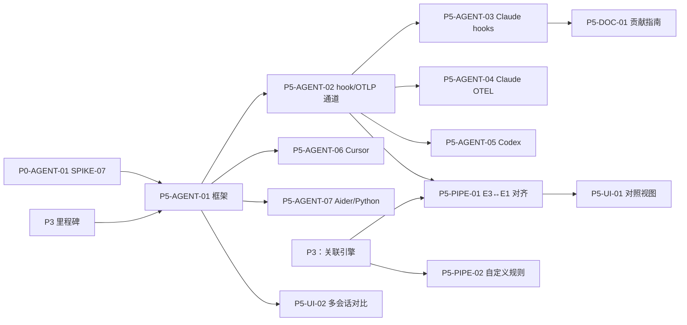

# P5 Agent 适配 任务清单

> 状态：草案
> 最后更新：2026-10-06
> 关联：[roadmap](../roadmap.md#p5-agent-适配持续)、[任务卡规范](README.md)、[process-tracking §7](../../01-architecture/process-tracking.md)、[SPIKE-07](../../06-research/SPIKE-07-agent-hooks.md)、[evidence-model](../../01-architecture/evidence-model.md)
> 里程碑：P5 Agent 适配
> 截止：2027-03-07

## 1. 阶段目标

1. **开箱识别**：`aw run --agent auto` 和进程选择器能识别主流 AI Agent。识别规则写在声明式配置里，由数据驱动。
2. **E3 接入**：至少把 2 个 Agent 的工具调用以 `AgentToolCall`（E3）记录下来。接入时不永久修改用户配置。
3. **对照而非采信**：E3 只用来解释意图、与系统观测对照。E3 与 E1 矛盾时以 E1 为准，只标注差异，不下结论。**E3 不能单独支撑任何 finding**（ADR-0004）。
4. **可扩展**：用户可以自定义规则和告警（REQ-10），社区可以按指南贡献新的 Agent 适配器。

这是一个持续阶段，表中截止日期只是**首批**任务的截止日期。后续新增的适配器按本文件末尾追加任务卡。

> **输入依赖**：SPIKE-07（P0-AGENT-01）的结论决定各适配器具体用哪种接入渠道。各 Agent 的接口变化很快，每张适配器卡开工前都要先重新核对官方文档，并在 PR 中记录核对时的版本号。

## 2. 任务总表

| 编号 | 标题 | AREA | 规模 | 依赖 | 并行组 |
|---|---|---|---|---|---|
| P5-AGENT-01 | 适配器框架：AgentProfile、进程组识别与 `--agent auto` | AGENT | M | P0-AGENT-01, P3 里程碑 | A |
| P5-AGENT-02 | E3 接入通道：`aw hook` 与本地 OTLP 接收器 | AGENT | M | P5-AGENT-01 | B |
| P5-AGENT-03 | Claude Code 适配：临时 hooks 注入与工具调用映射 | AGENT | M | P5-AGENT-02 | C |
| P5-AGENT-04 | Claude Code 适配：OTEL 遥测接入 | AGENT | S | P5-AGENT-02 | C |
| P5-AGENT-05 | Codex CLI 适配 | AGENT | M | P5-AGENT-02 | C |
| P5-AGENT-06 | Cursor 适配（Electron 进程形态与代理覆盖） | AGENT | M | P5-AGENT-01 | C |
| P5-AGENT-07 | Aider 与通用 Python Agent 适配 | AGENT | S | P5-AGENT-01 | C |
| P5-PIPE-01 | E3 ↔ E1 对齐与 `self_report_mismatch` 发现 | PIPE | M | P5-AGENT-02, P3：关联引擎 | B |
| P5-UI-01 | 自报告对照视图 | UI | M | P5-PIPE-01 | D |
| P5-PIPE-02 | 用户自定义规则与告警（REQ-10） | PIPE | M | P3：关联引擎 | A |
| P5-UI-02 | 多会话对比 | UI | M | P5-AGENT-01 | B |
| P5-DOC-01 | 适配器贡献指南与模板 | DOC | S | P5-AGENT-03 | D |

并行组：同组任务之间文件不重叠。C 组的各个适配器分别位于 `crates/aw-agent-adapters/src/agents/<id>/`，可以完全并行。

## 3. 依赖图

## 4. 任务卡

### P5-AGENT-01 适配器框架：AgentProfile、进程组识别与 `--agent auto`

- **AREA**: AGENT
- **平台**: all
- **类型**: feature
- **优先级**: S
- **规模**: M
- **依赖**: P0-AGENT-01, P3 里程碑
- **关联**: REQ-09, REQ-02, CAP-SCOPE, SPIKE-07
- **文件范围**: `crates/aw-agent-adapters/`（不含 `src/agents/<id>/`）、`crates/aw-daemon/src/session/agent.rs`

**背景**：可执行文件名往往识别不出 Agent。很多 Agent 是 `node`、`python` 或 Electron 进程，要结合 argv、入口脚本和父子关系一起判断。会话标注了 Agent 类型后，才能决定接入哪种 E3 数据源，也才能按 Agent 统计。

**实现要点**：
- 定义 `AgentProfile`（TOML），格式见 [process-tracking §7](../../01-architecture/process-tracking.md)。字段补充如下：
  - `match.exe_names`、`match.argv_regex`、`match.parent_exe`（可选）、`match.env_keys`（只判断环境变量是否存在，不读取值）；
  - `children.role_regex`：标注子进程角色，如 MCP 服务器、语言服务器、终端 shell；
  - `self_report`：可用的 E3 渠道。
- 内置 profile 放在 `crates/aw-agent-adapters/profiles/*.toml`，编译时嵌入；用户 profile 放在配置目录的 `agents.d/` 下，同一 `id` 时用户 profile 覆盖内置。
- 匹配器是纯函数：`fn identify(proc: &ProcInfo, ancestors: &[ProcInfo]) -> Option<AgentMatch>`。返回匹配的 `id`、置信依据（命中了哪些条件）和证据等级。识别结果是推断，等级为 I，在 UI 中显示为“识别为”。
- `aw run --agent auto`：在根进程及其前两层子进程上运行匹配器，把结果写入会话元数据。用户显式指定的 `--agent <id>` 优先。
- `aw ps --agents-only` 和 UI 进程选择器复用同一匹配器。
- 定义 `SelfReportSource` trait（`start(session) / stop()`），由各适配器实现。
- 模拟器增加 `fake_agent` 剧本：模仿 `node .../claude-code/cli.js` 的进程形态。

**限制**：
- 不通过读取进程内存或文件内容来识别。
- 识别结果不影响采集范围，范围只由启动或附着方式决定。

**验收标准**：
- [ ] `cargo test -p aw-agent-adapters identify`：表驱动测试覆盖 Claude Code、Codex、Cursor、Aider 的典型进程形态（来自 SPIKE-07 的录制），以及普通 `node` 和 `python` 进程等负例，全部识别正确。
- [ ] 用户 profile 覆盖内置 profile 的测试通过。
- [ ] `aw run --agent auto -- sim run sim/scenarios/fake_agent.toml` 后，`aw sessions show @last` 显示“识别为：claude-code（I）”。

**参考文档**：[process-tracking](../../01-architecture/process-tracking.md)、[SPIKE-07](../../06-research/SPIKE-07-agent-hooks.md)、[api-and-cli](../../01-architecture/api-and-cli.md)

### P5-AGENT-02 E3 接入通道：`aw hook` 与本地 OTLP 接收器

- **AREA**: AGENT
- **平台**: all
- **类型**: feature
- **优先级**: S
- **规模**: M
- **依赖**: P5-AGENT-01
- **关联**: REQ-09, REQ-07, ADR-0004, ADR-0012, SPIKE-07
- **文件范围**: `crates/aw-cli/src/commands/hook.rs`、`crates/aw-agent-adapters/src/channel/`、`crates/aw-daemon/src/api/agent.rs`
- **额外标签**: evidence

**背景**：各 Agent 的自报告主要有两种形式：一是 hook 脚本，从 stdin 接收 JSON；二是 OpenTelemetry 导出。先做一个共用的接入层，各适配器只负责格式映射。

**实现要点**：
- `aw hook <AGENT> [--session <SESSION>]`：
  - 从 stdin 读取一条 JSON，交给对应适配器的 `parse_hook(&Value) -> Vec<AgentToolCall>`，然后经本地 socket 或命名管道发给 daemon。
  - **无论成功与否都立即以 0 退出**，输出不影响 Agent 的决策。理由：本工具只审计、不拦截；也不能拖慢 Agent。
  - 总耗时上限 200 ms，超时即丢弃，并在 daemon 侧记一条 `Gap`（`gap_kind = self_report_dropped`）。
  - 会话归属：优先使用 `aw run` 注入的环境变量 `AW_SESSION`，其次用调用者的 ProcUid 反查会话。
- 本地 OTLP 接收器：daemon 为每个会话开一个只监听回环地址的 OTLP/HTTP 端点（`/v1/logs`、`/v1/traces`、`/v1/metrics`），端口随机；端点地址通过环境变量注入给被启动的 Agent。只接受 protobuf 和 JSON 编码，请求体大小有上限。
- 所有 E3 内容都先经过管道的 Redact 阶段再入库（ADR-0012）。`summary` 只保留工具名、路径、命令、URL 等结构化字段，**不保存提示词、模型输出和文件内容**，单条上限 4 KB。
- 入库写 `agent_events` 表：`evidence = 'E3'`，`source` 为 `agent.<id>/hook` 或 `agent.<id>/otel`。

**限制**：
- hook 子命令不返回任何会改变 Agent 行为的输出（例如 deny 决策）。
- OTLP 接收器不转发数据到任何外部端点。

**验收标准**：
- [ ] `echo '<fixture>' | aw hook claude-code` 在 daemon 未运行时也以 0 退出，耗时 <200 ms。用 `hyperfine` 或等价工具测量，结果贴进 PR。
- [ ] 集成测试：向 OTLP 端点 POST 一条录制的日志后，`agent_events` 中生成一条记录，证据等级为 E3。
- [ ] 脱敏测试：含 `Authorization: Bearer ...` 和 `sk-...` 的 hook 载荷入库后，数据库中没有明文（复用 `redact_corpus/`）。
- [ ] 对端点发 >1 MB 的请求体，返回 413，daemon 内存无明显上升。

**参考文档**：[api-and-cli](../../01-architecture/api-and-cli.md)、[event-schema](../../01-architecture/event-schema.md)、[storage](../../01-architecture/storage.md)、[security-privacy §3](../../01-architecture/security-privacy.md#3-脱敏规则)

### P5-AGENT-03 Claude Code 适配：临时 hooks 注入与工具调用映射

- **AREA**: AGENT
- **平台**: all
- **类型**: feature
- **优先级**: S
- **规模**: M
- **依赖**: P5-AGENT-02
- **关联**: REQ-09, SPIKE-07, RISK-15
- **文件范围**: `crates/aw-agent-adapters/src/agents/claude_code/`、`crates/aw-agent-adapters/profiles/claude-code.toml`、`fixtures/agents/claude-code/`

**背景**：Claude Code 提供 `PreToolUse` / `PostToolUse` 等 hooks，可以拿到工具名和参数（具体结构以 SPIKE-07 的结论为准）。难点在于：启用 hook 需要配置，而本工具不应永久修改用户的配置。

**实现要点**：
- 注入方式按优先顺序试三种，最终用哪种由 SPIKE-07 实测决定：
  1. 启动参数或环境变量指定额外的 settings 文件（如 `--settings <file>`）【待验证】。这是首选，完全不动用户文件。
  2. 在会话工作目录写入项目级的本地 settings 文件。只有在该文件原本不存在时才写入；会话结束后删除；崩溃后由 daemon 按会话记录清理。
  3. 不自动注入，只提示用户执行 `aw hook` 的手工配置片段。
- 注入的 hook 命令是 `aw hook claude-code`，匹配所有工具。
- 映射规则：
  - `Bash` → `tool=Bash, summary={command}`；
  - `Read` / `Edit` / `Write` → `summary={path}`；
  - `WebFetch` / `WebSearch` → `summary={url|query}`；
  - MCP 工具 → `tool=mcp:<server>/<tool>`；
  - 未知工具保留工具名，`summary` 置空。
  - `phase` 按 Pre 和 Post 区分；用 `tool_use_id` 一类的字段作为 `call_id`，把同一次调用的 Pre 和 Post 配对。
- `SessionStart` / `SessionEnd` 事件用来填 `agent_session`。
- fixtures：用 SPIKE-07 录制的 hook stdin 样本做回放测试；样本须先用 `aw fixtures scrub` 清洗。

**限制**：
- 不修改 `~/.claude/` 下的任何文件。
- 不读取 Claude Code 的会话 transcript 内容。若以后需要用 transcript，另开 ADR 讨论隐私问题。

**验收标准**：
- [ ] `cargo test -p aw-agent-adapters claude_code` 回放全部 fixtures，映射结果与 `insta` 快照一致。
- [ ] 人工验收：`aw run --agent auto -- claude`，在会话中让 Agent 执行一次 Read、一次 Bash、一次 WebFetch。之后 `aw timeline @last --filter 'kind:agent'` 显示这 3 次工具调用（E3）；会话结束后用户的配置文件哈希不变。记录所用 Claude Code 版本。
- [ ] 用 `kill -9` 强杀 `aw run` 后重启 daemon，临时 settings 文件被清理。

**参考文档**：[SPIKE-07](../../06-research/SPIKE-07-agent-hooks.md)、[event-schema](../../01-architecture/event-schema.md)、[risks](../risks.md)

### P5-AGENT-04 Claude Code 适配：OTEL 遥测接入

- **AREA**: AGENT
- **平台**: all
- **类型**: feature
- **优先级**: C
- **规模**: S
- **依赖**: P5-AGENT-02
- **关联**: REQ-09, SPIKE-07
- **文件范围**: `crates/aw-agent-adapters/src/agents/claude_code/otel.rs`、`fixtures/agents/claude-code/otel/`

**背景**：Claude Code 支持通过 OpenTelemetry 导出遥测（开关与端点由环境变量配置，具体变量名以 SPIKE-07 的结论为准）。它可以在 hooks 不可用时作为替代，也可以提供 token 用量一类的会话级统计。

**实现要点**：
- `--self-report otel` 或 `auto` 模式下，启动时为被监控进程注入两类环境变量：启用遥测，以及把 OTLP 端点指向本会话的本地接收器。
- 如果用户原本就配置了自己的 OTLP 端点，**不覆盖**，并在会话信息中提示“用户已配置遥测，未接入”。
- 把工具事件类日志映射为 `AgentToolCall`；指标类数据（token、费用）只作为会话元数据汇总，不进时间线。
- 同时启用 hooks 和 OTEL 时，按 `call_id` 去重，以 hooks 为准。

**限制**：
- 不接收、不保存提示词内容；即使遥测中包含提示词字段，也在脱敏前丢弃。

**验收标准**：
- [ ] `cargo test -p aw-agent-adapters claude_code::otel` 回放 OTLP fixtures，快照一致；提示词字段确认被丢弃。
- [ ] 单元测试：用户已设置 OTLP 端点的环境变量时，注入逻辑不覆盖它。
- [ ] hooks 和 OTEL 同时启用时无重复记录。

**参考文档**：[SPIKE-07](../../06-research/SPIKE-07-agent-hooks.md)、[network-attribution](../../01-architecture/network-attribution.md)

### P5-AGENT-05 Codex CLI 适配

- **AREA**: AGENT
- **平台**: all
- **类型**: feature
- **优先级**: S
- **规模**: M
- **依赖**: P5-AGENT-02
- **关联**: REQ-09, SPIKE-07, CAP-SCOPE-03
- **文件范围**: `crates/aw-agent-adapters/src/agents/codex/`、`crates/aw-agent-adapters/profiles/codex.toml`、`fixtures/agents/codex/`

**背景**：Codex CLI 的候选自报告渠道有三种：本地会话记录、OTEL 配置、`notify` 脚本（SPIKE-07 待确认）。它在沙箱中执行命令（Linux 上用 Landlock/seccomp，macOS 上用 Seatbelt），可能让进程树呈现不同的形态。

**实现要点**：
- profile：识别 Codex 的可执行文件和入口；把沙箱辅助进程（如 `sandbox-exec`）标注为子进程角色 `sandbox`。
- 按 SPIKE-07 的结论实现一个接入渠道：
  - 如果用 OTEL：复用 P5-AGENT-02 的接收器，只写映射；
  - 如果用会话记录文件：只在会话结束后读取本会话对应的记录，只提取工具调用结构，**不存模型输出和提示词**，并记 `source = agent.codex/transcript`。这种方式需要先写 ADR 说明隐私取舍。
- 验证沙箱内执行的命令在三平台采集器中是否仍归属到会话；如果归属断开，按 CAP-SCOPE-03 标注。

**限制**：
- 不修改 `~/.codex/` 下的用户配置。

**验收标准**：
- [ ] `cargo test -p aw-agent-adapters codex` 回放 fixtures，快照一致。
- [ ] 人工验收：`aw run --agent auto -- codex` 执行一个会调用 shell 命令的任务。结束后 `aw procs @last --tree` 中沙箱子进程归属正确，`aw timeline @last --filter 'kind:agent'` 中有工具调用记录。记录所用 Codex 版本和平台。

**参考文档**：[SPIKE-07](../../06-research/SPIKE-07-agent-hooks.md)、[process-tracking](../../01-architecture/process-tracking.md)

### P5-AGENT-06 Cursor 适配（Electron 进程形态与代理覆盖）

- **AREA**: AGENT
- **平台**: all
- **类型**: feature
- **优先级**: S
- **规模**: M
- **依赖**: P5-AGENT-01
- **关联**: REQ-09, REQ-04.4, CAP-SCOPE-03, CAP-URL-01, SPIKE-04, SPIKE-07, RISK-04, RISK-06
- **文件范围**: `crates/aw-agent-adapters/src/agents/cursor/`、`crates/aw-agent-adapters/profiles/cursor.toml`、`docs/06-research/cursor-notes.md`

**背景**：Cursor 是 Electron 应用，有三个特殊问题：
- 进程很多（主进程、渲染进程、扩展宿主、终端的 pty 子进程）。
- 用户往往在启动 AgentWatch 之前就已经打开了 Cursor；第二次启动 Cursor 只会把请求转给已有实例，这是典型的归属中断。
- Electron 不认 `HTTPS_PROXY` 环境变量（SPIKE-04）。

**实现要点**：
- profile：识别主进程，并按 Electron 的 `--type=` 参数区分子进程角色：`renderer`、`utility`、扩展宿主、终端 shell。
- 启动模式：检测到已有 Cursor 实例时，提示用户二选一：退出已有实例后重新启动，或改用附着模式。用户坚持启动时，记录 `attribution_break`。
- 代理：`--proxy` 模式下追加 Chromium 启动参数 `--proxy-server=`，并把会话 CA 以 Electron 认可的方式提供【待验证：Electron 是否认 `NODE_EXTRA_CA_CERTS`，Chromium 网络栈是否只认系统证书库】。代理覆盖不到的流量按直连标注，URL 记 `NA(direct_bypass_proxy)`。
- E3：如果 SPIKE-07 确认 Cursor 提供了公开的 hooks 机制，就复用 P5-AGENT-02；否则本卡只做识别和归属，并在 profile 中写 `self_report = []`。
- 把实测结论写入 `docs/06-research/cursor-notes.md`，内容包括进程树截图和代理覆盖率。

**限制**：
- 不修改 Cursor 的安装目录和用户设置。
- 不把会话 CA 安装到系统证书库。如果确实需要，只提示用户自行执行 `aw proxy trust --user`，并说明风险。

**验收标准**：
- [ ] `cargo test -p aw-agent-adapters cursor` 覆盖各类子进程角色的识别。
- [ ] 人工验收：在没有 Cursor 实例时执行 `aw run --agent auto --proxy -- cursor`，让 Agent 执行一条终端命令。之后：终端子进程归属到会话；`aw http @last` 和 `aw flows @last` 中，经过代理与直连的占比记录在 cursor-notes 中。
- [ ] 人工验收：在已有实例时启动，CLI 给出提示；用户坚持后，时间线上出现归属中断标注。

**参考文档**：[SPIKE-04](../../06-research/SPIKE-04-proxy-trust-injection.md)、[SPIKE-07](../../06-research/SPIKE-07-agent-hooks.md)、[network-attribution](../../01-architecture/network-attribution.md)、[process-tracking §6](../../01-architecture/process-tracking.md)

### P5-AGENT-07 Aider 与通用 Python Agent 适配

- **AREA**: AGENT
- **平台**: all
- **类型**: feature
- **优先级**: C
- **规模**: S
- **依赖**: P5-AGENT-01
- **关联**: REQ-09, CAP-URL-01, SPIKE-04
- **文件范围**: `crates/aw-agent-adapters/src/agents/python_generic/`、`crates/aw-agent-adapters/profiles/aider.toml`、`crates/aw-agent-adapters/profiles/python-generic.toml`

**背景**：大量自建 Agent 以及 Aider 一类工具都是 Python 进程。它们没有统一的自报告接口，但代理覆盖通常较好：`requests` / `httpx` 都认代理环境变量，具体结果以 SPIKE-04 为准。

**实现要点**：
- `aider` profile：识别 `aider` 入口和 `python -m aider`；把它调用的 `git` 子进程标注为角色 `vcs`。
- `python-generic` profile：不自动匹配，只在用户显式指定 `--agent python-generic` 时生效。作用是启用针对 Python 的代理注入组合：`REQUESTS_CA_BUNDLE`、`SSL_CERT_FILE`、`HTTPX` 相关变量。
- 在提示信息中说明：这类 Agent 没有 E3 数据，只有系统观测。

**限制**：
- 不修改 Python 环境，不注入 `sitecustomize` 一类的代码。

**验收标准**：
- [ ] 识别测试覆盖 `aider`、`python -m aider`；普通 Python 脚本不被识别为 Aider。
- [ ] 集成测试：`aw run --agent python-generic --proxy -- python sim/clients/httpx_get.py` 产生的 `http` 记录中 URL 正确。

**参考文档**：[SPIKE-04](../../06-research/SPIKE-04-proxy-trust-injection.md)、[network-attribution](../../01-architecture/network-attribution.md)

### P5-PIPE-01 E3 ↔ E1 对齐与 `self_report_mismatch` 发现

- **AREA**: PIPE
- **平台**: all
- **类型**: feature
- **优先级**: S
- **规模**: M
- **依赖**: P5-AGENT-02, P3：关联引擎
- **关联**: REQ-06, REQ-09, ADR-0004, RISK-08
- **文件范围**: `crates/aw-pipeline/src/correlate/self_report.rs`、`crates/aw-pipeline/rules/self_report_mismatch.toml`、`fixtures/pipeline/self_report/`
- **额外标签**: evidence

**背景**：Agent 的自报告和系统观测之间会有差异：可能是 Agent 通过子进程间接访问了文件，可能是自报告有遗漏，也可能是自报告被篡改。审计价值正在于把这些差异如实标出来，但不推断动机。

**实现要点**：
- 对齐算法：以 `AgentToolCall(pre)` 为窗口起点、对应的 `post` 为终点；没有 `post` 时窗口取 30 秒，可配置。在这个窗口内，把工具调用与同一进程子树中的 E1 事件匹配：
  - `Bash(command)` ↔ `ProcessStart`（argv 前缀匹配）；
  - `Read/Edit/Write(path)` ↔ `file_access`（规范化路径后相等）；
  - `WebFetch(url)` ↔ `http` 或 `net_flows` 的域名。
- 对齐结果是推断（I），写入关联表或 `findings` 的引用字段，具体以 storage 的设计为准。
- `self_report_mismatch` 发现（E1，措辞模板用 `fact.self_report_mismatch`）只在以下情况触发：
  - 敏感路径的 E1 访问或外发流量在自报告中没有对应记录。
  - 但前提是：该时段的自报告通道正常，没有 `self_report_dropped` 缺口。如果有缺口，只标注“自报告不完整”，不生成发现。
  - 反向情况（自报告里有、系统没观测到）只在采集器覆盖该能力且无缺口时才标注，且措辞需要新增模板，先更新 evidence-model。
- 严格遵守 ADR-0004：任何发现的必要依据中必须至少有一条 E1 或 E2 记录，引擎中加断言。

**限制**：
- 措辞中不得出现“隐瞒”“欺骗”“恶意”等替 Agent 推断动机的词，并加入 `wording::lint` 的禁用词清单。

**验收标准**：
- [ ] `cargo test -p aw-pipeline self_report` 回放三组 fixtures：完全一致、缺少工具调用、自报告有缺口。三组分别断言：无发现、恰好一条 E1 发现、无发现但有“自报告不完整”标注。
- [ ] 单元测试：只由 E3 记录支撑的发现会被引擎拒绝。
- [ ] 措辞快照通过 `wording::lint`。

**参考文档**：[evidence-model](../../01-architecture/evidence-model.md)、[pipeline §3.6](../../01-architecture/pipeline.md#36-correlate关联规则引擎)、[ADR-0004](../../03-adr/0004-evidence-levels.md)

### P5-UI-01 自报告对照视图

- **AREA**: UI
- **平台**: all
- **类型**: feature
- **优先级**: S
- **规模**: M
- **依赖**: P5-PIPE-01
- **关联**: REQ-05, REQ-06, REQ-09
- **文件范围**: `ui/src/features/self-report/`、`ui/src/routes/s.$sid.self-report.tsx`、`ui/src/i18n/`、`crates/aw-daemon/src/api/agent.rs`
- **额外标签**: evidence

**背景**：用户想知道“Agent 说它做了什么”和“系统看到它做了什么”是否一致。两栏并排对照是最直观的呈现方式。

**实现要点**：
- 会话页新增“自报告对照”标签，只有会话中存在 E3 数据时才显示。
  - 左栏：工具调用列表，带 E3 徽章，空心描边。
  - 右栏：每次调用对齐到的 E1 事件，展开显示。
  - 底部“未对应的系统事件”区域：只列敏感路径和外发流量，其余折叠。
- 对齐线用虚线，并标“推测对齐（I）”；`self_report_mismatch` 发现用 E1 样式显示。
- 自报告通道有缺口的时段，在时间轴上用斜线底纹标出。
- 文案全部放在 `ui/src/i18n/`，由措辞 lint 覆盖。

**限制**：
- 不提供“可信度评分”一类的综合打分。

**验收标准**：
- [ ] 组件测试（Vitest + Testing Library）：用 fixture 数据渲染时，虚线对齐、缺口底纹、E3 徽章都存在。
- [ ] `pnpm -C ui lint:wording` 通过。
- [ ] 人工验收：用 P5-AGENT-03 的真实会话打开对照页，截图贴进 PR。

**参考文档**：[ui](../../01-architecture/ui.md)、[evidence-model §4](../../01-architecture/evidence-model.md#4-展示样式)

### P5-PIPE-02 用户自定义规则与告警（REQ-10）

- **AREA**: PIPE
- **平台**: all
- **类型**: feature
- **优先级**: C
- **规模**: M
- **依赖**: P3：关联引擎
- **关联**: REQ-10, REQ-06, ADR-0004, RISK-08
- **文件范围**: `crates/aw-pipeline/src/rules/user.rs`、`crates/aw-cli/src/commands/config/rules.rs`、`crates/aw-daemon/src/notify/`、`docs/01-architecture/pipeline.md`（用户规则章节）

**背景**：内置规则覆盖不了所有场景。用户需要写自己的规则（例如“Agent 写入 `~/.bashrc`”），并在命中时得到提示。

**实现要点**：
- 加载配置目录 `rules.d/*.toml`，格式与内置规则相同（[pipeline §3.6](../../01-architecture/pipeline.md#36-correlate关联规则引擎)）。引擎的强制约束同样适用：多步规则必须是 I；措辞必须引用模板；severity 白名单。
- 热加载：规则文件变更后重新校验。校验失败时保留旧版本，并在 `aw config rules list` 和 UI 中显示错误。
- `aw config rules test <rule.toml> <fixture.jsonl>`：离线跑管道，输出命中的发现及其依据记录，退出码表示是否命中，可用于 CI。
- 告警通道：
  - 本地系统通知：Windows Toast、macOS `UNUserNotificationCenter`、Linux `notify-send` / D-Bus；
  - `aw run` 终端内提示；
  - UI 中的发现角标。
  - **不提供 webhook 或任何外发告警**（REQ-07.1）。
- 限流：同一规则、同一去重键，每个会话最多通知一次。

**限制**：
- 用户规则不能覆盖或禁用内置规则的措辞约束。
- 不支持在规则中执行脚本。

**验收标准**：
- [ ] `aw config rules test fixtures/rules/bashrc_write.toml fixtures/rules/bashrc_write.jsonl` 退出码为 0，输出恰好一条发现；换用不匹配的 fixture 时退出码非 0。
- [ ] 把一个多步规则声明为 `evidence = "E1"`，被拒绝加载，错误信息中指出原因。
- [ ] 人工验收：三平台各触发一次本地通知，截图贴进 PR。

**参考文档**：[pipeline](../../01-architecture/pipeline.md)、[api-and-cli](../../01-architecture/api-and-cli.md)、[evidence-model §5](../../01-architecture/evidence-model.md#5-固定措辞模板)

### P5-UI-02 多会话对比

- **AREA**: UI
- **平台**: all
- **类型**: feature
- **优先级**: C
- **规模**: M
- **依赖**: P5-AGENT-01
- **关联**: REQ-05, REQ-09
- **文件范围**: `ui/src/features/compare/`、`ui/src/routes/compare.tsx`、`crates/aw-daemon/src/api/compare.rs`、`crates/aw-store/src/query/compare.rs`

**背景**：vision 的场景 3 是比较两个 Agent 完成同一任务时的行为。ui.md 已经把“对比”入口放在了会话列表中，计划在 P3 之后实现。

**实现要点**：
- API：`GET /compare?a=<SESSION>&b=<SESSION>`，返回各维度的差集和交集：
  - 访问的文件（路径经工作目录归一化后再比较）；
  - 执行的命令（按可执行文件名加子命令归类）；
  - 联系的域名与各自的字节数；
  - 发现列表。
- 各维度都保留证据等级；两个会话的采集档位不同时（如 macOS M1 对比 Linux），顶部给出提示“采集能力不同，差异可能来自观测能力”。
- UI：三栏布局（仅 A / 共同 / 仅 B），支持按维度切换；可导出为 Markdown。
- CLI：本卡不增加新命令。若以后需要，先更新 api-and-cli.md。

**限制**：
- 对比结果不生成发现，也不做优劣评价。

**验收标准**：
- [ ] `cargo test -p aw-store compare`：用两个 fixture 会话断言差集和交集正确；路径归一化后，不同工作目录下的同名文件被视为同一项。
- [ ] 两个 10 万事件的会话，对比接口响应 <1 s。
- [ ] 组件测试：采集档位不同时显示提示。

**参考文档**：[vision §6](../../00-overview/vision.md#6-典型场景)、[ui](../../01-architecture/ui.md)、[storage](../../01-architecture/storage.md)

### P5-DOC-01 适配器贡献指南与模板

- **AREA**: DOC
- **平台**: all
- **类型**: docs
- **优先级**: S
- **规模**: S
- **依赖**: P5-AGENT-03
- **关联**: REQ-09, REQ-08
- **文件范围**: `docs/05-dev/agent-adapters.md`、`crates/aw-agent-adapters/src/agents/_template/`、`.github/ISSUE_TEMPLATE/agent-adapter.yml`、`docs/README.md`（索引）

**背景**：新的 AI Agent 不断出现，靠核心维护者逐个适配跟不上。需要一套标准流程，让贡献者（以及 AI Agent）能独立完成新适配器。

**实现要点**：
- `docs/05-dev/agent-adapters.md` 写清五个步骤：
  1. 调研：进程形态、自报告渠道、代理兼容性，并记录版本。
  2. 写 profile。
  3. 录制并清洗 fixtures。
  4. 实现 `parse_hook` 或 OTEL 映射。
  5. 补识别测试和快照测试。
  另附隐私红线：不存提示词和模型输出、不改用户配置、hook 必须以 0 退出。
- 模板目录 `_template/`：编译通过的最小实现和测试骨架。
- Issue 表单 `agent-adapter.yml`：字段包括 Agent 名称与版本、平台、进程形态、自报告渠道、代理兼容性。
- 在 docs/README.md 的索引里登记新文档。

**限制**：
- 指南中的示例用 P5-AGENT-03 的真实代码片段和链接，不重复粘贴大段代码。

**验收标准**：
- [ ] 把 `_template/` 复制为 `agents/example/` 并按指南改名后，`cargo test -p aw-agent-adapters` 通过。用一个临时分支验证，验证后不合并。
- [ ] 由一个未参与 P5 的 AI Agent 仅凭指南完成一个模拟适配器（如 `fake_agent`）的 PR。将卡住的地方记录下来，并据此修订指南。
- [ ] docs/README.md 的索引已更新。

**参考文档**：[process-tracking](../../01-architecture/process-tracking.md)、[SPIKE-07](../../06-research/SPIKE-07-agent-hooks.md)、[github-workflow](../../05-dev/github-workflow.md)
