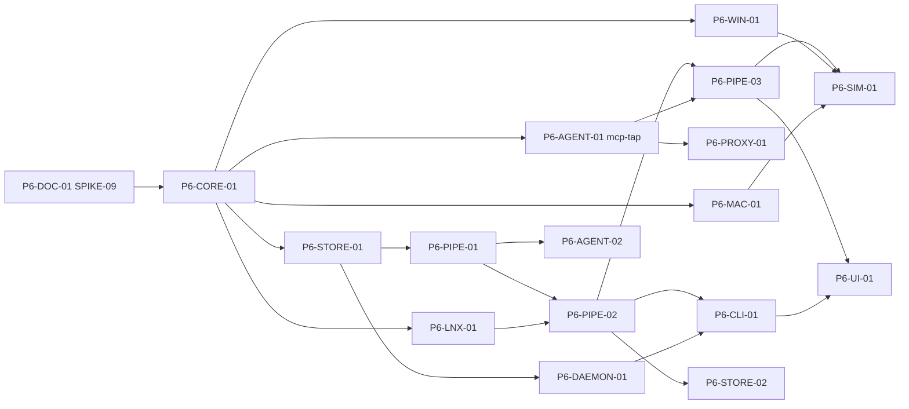

# P6 Agent 间通信 任务清单

> 状态：草案
> 最后更新：2026-10-07
> 关联：[roadmap](../roadmap.md#p6-agent-间通信)、[任务卡规范](README.md)、[inter-agent-communication](../../01-architecture/inter-agent-communication.md)、[ADR-0013](../../03-adr/0013-inter-agent-observation.md)、[SPIKE-09](../../06-research/SPIKE-09-ipc-peer-attribution.md)
> 里程碑：P6 Agent 间通信
> 截止：2027-04-04

## 1. 阶段目标

1. **通道事实**：三平台尽力配对本机 IPC（管道、Unix socket、命名管道、回环 TCP）的两端进程，并统计跨 Agent 通道的字节数；做不到的如实标 NA。
2. **Agent 实例**：会话内识别多个 AgentInstance（主 Agent、子 Agent、MCP server）；独立启动的多个 Agent 通过监控组组合。
3. **MCP 可见**：启动模式下用 `--mcp-tap` 拿到 MCP 的 method、工具名和字节数（E2），不存参数与结果内容。
4. **委托链路**：从任一敏感事件回溯到触发它的 Agent，每一跳标注等级，整条链取最弱一跳。

**退出标准**：

- 剧本 `multi_agent` 在 Linux 上：跨 Agent 通道配对召回率 ≥ 95%，字节误差 < 5%；Windows 命名管道与回环 TCP 配对召回率 ≥ 95%；macOS 能列出通道两端，字节数按能力矩阵标注。
- `mcp_chain` 剧本中，“MCP server 读取诱饵文件”能回溯到对应的 `tools/call` 和发起的 Agent；未启用 tap 时工具名为 NA，链路等级正确降级。
- 所有 `ipc.*` / `delegation.*` 措辞通过措辞 lint，不出现“A 让 B 窃取/上传”一类表述。
- 开启跨 Agent IPC 采集后，`typical_agent` 剧本下的 CPU 增量 < 1%（NFR-01）。

> **输入依赖**：SPIKE-09（P6-DOC-01 开头先做）决定各平台采集机制和 `mcp-tap` 在各 Agent 上的可行性。

## 2. 任务总表

| 编号 | 标题 | AREA | 规模 | 依赖 | 并行组 |
|---|---|---|---|---|---|
| P6-DOC-01 | SPIKE-09：IPC 两端配对与 MCP stdio 拦截 | DOC | M | P5 里程碑 | A |
| P6-CORE-01 | IPC 与 AgentRpc 事件类型 | CORE | S | P6-DOC-01 | B |
| P6-STORE-01 | agent_instances / ipc_channels / agent_rpc / agent_links / watch_groups 迁移 | STORE | M | P6-CORE-01 | C |
| P6-LNX-01 | Linux：管道与 Unix socket 配对与字节探针 | LNX | M | P6-CORE-01 | C |
| P6-WIN-01 | Windows：命名管道与回环 TCP 配对 | WIN | M | P6-CORE-01 | C |
| P6-MAC-01 | macOS：Unix socket 两端与回环配对 | MAC | M | P6-CORE-01 | C |
| P6-PIPE-01 | AgentInstance 识别与角色标注 | PIPE | M | P6-STORE-01 | D |
| P6-PIPE-02 | 通道聚合与 agent_links 生成 | PIPE | M | P6-PIPE-01, P6-LNX-01 | E |
| P6-AGENT-01 | `aw mcp-tap` stdio 透明包装器与 `--mcp-tap` 注入 | AGENT | M | P6-CORE-01 | C |
| P6-PROXY-01 | MCP over HTTP / A2A 识别 | PROXY | S | P6-AGENT-01 | D |
| P6-PIPE-03 | 共享工件规则与委托链路引擎 | PIPE | M | P6-PIPE-02, P6-AGENT-01 | F |
| P6-DAEMON-01 | 监控组与跨会话通道配对 | DAEMON | M | P6-STORE-01 | D |
| P6-CLI-01 | `aw group` / `agents` / `links` / `rpc` / `chain` 命令 | CLI | M | P6-PIPE-02, P6-DAEMON-01 | F |
| P6-UI-01 | Agent 通信图、MCP 调用列表与委托链路面板 | UI | M | P6-PIPE-03, P6-CLI-01 | G |
| P6-AGENT-02 | 同进程多 Agent 框架的 OTEL span 映射（E3） | AGENT | S | P6-PIPE-01 | D |
| P6-SIM-01 | 剧本 `multi_agent` / `mcp_chain` 与阶段验收 | SIM | M | P6-PIPE-03, P6-WIN-01, P6-MAC-01 | G |
| P6-STORE-02 | 跨主机离线合并 `aw merge`（可选） | STORE | M | P6-PIPE-02 | F |

## 3. 依赖图

## 4. 任务卡

### P6-DOC-01 SPIKE-09：IPC 两端配对与 MCP stdio 拦截

- **AREA**: DOC
- **平台**: all
- **类型**: spike
- **优先级**: S
- **规模**: M
- **依赖**: P5 里程碑
- **关联**: REQ-11, CAP-IPC, ADR-0013, SPIKE-09
- **文件范围**: `spikes/SPIKE-09/`, `docs/06-research/SPIKE-09-ipc-peer-attribution.md`, `docs/02-platforms/capability-matrix.md`（§10）

**背景**：IPC 配对的平台能力和 `mcp-tap` 在各 Agent 上的可行性都未验证，决定了后续全部任务的做法。

**实现要点**：
- 按 SPIKE-09 的方法在三平台各写一个最小采集程序，输出 JSONL。
- 验证 Claude Code、Codex CLI、Cursor 是否支持外部指定 MCP 配置，记录核对时的版本号。
- 压测 `mcp-tap` 原型的延迟。

**限制**：
- spike 代码不进产品 crate。
- 不修改用户真实的 Agent 配置文件。

**验收标准**：
- [ ] SPIKE-09 的「结果」和「结论」已填写，状态改为“已完成”。
- [ ] capability-matrix §10 的“验证”列不再有 ⏳ SPIKE-09。
- [ ] 若结论与 ADR-0013 不一致，提交 ADR 更新或替代的 PR。

**参考文档**：[SPIKE-09](../../06-research/SPIKE-09-ipc-peer-attribution.md)、[inter-agent-communication](../../01-architecture/inter-agent-communication.md)

### P6-CORE-01 IPC 与 AgentRpc 事件类型

- **AREA**: CORE
- **平台**: all
- **类型**: feature
- **优先级**: S
- **规模**: S
- **依赖**: P6-DOC-01
- **关联**: REQ-11, ADR-0013, ADR-0004
- **文件范围**: `crates/aw-core/src/event/ipc.rs`, `crates/aw-core/src/event/mod.rs`, `docs/01-architecture/event-schema.md`
- **额外标签**: evidence

**背景**：采集器和 mcp-tap 需要统一的事件契约。

**实现要点**：
- 新增 `EventKind::IpcOpen { kind, peer: Option<ProcRef>, name }`、`IpcTransfer { channel, direction, bytes }`、`IpcClose`、`AgentRpc { method, target, arg_shape, req_bytes, resp_bytes, is_error, duration_ns }`。
- `IpcKind`：`pipe` / `unix_stream` / `unix_dgram` / `named_pipe` / `loopback_tcp` / `loopback_udp`，带 `#[serde(other)] Unknown`。
- 新增 `NaReason::PeerUnknown`、`NaReason::ProtocolNotObserved`，并写入 evidence-model §3。
- 属于兼容变更，不升主版本 `v`。

**限制**：
- `AgentRpc` 不得有任何携带参数或结果内容的字段。

**验收标准**：
- [ ] `cargo test -p aw-core` 通过，快照覆盖新增变体。
- [ ] 旧版 fixtures 回放不受影响（`cargo test -p aw-pipeline replay`）。
- [ ] event-schema 与 evidence-model 已同步更新。

**参考文档**：[inter-agent-communication §7](../../01-architecture/inter-agent-communication.md#7-存储)、[event-schema](../../01-architecture/event-schema.md)

### P6-STORE-01 agent_instances / ipc_channels / agent_rpc / agent_links / watch_groups 迁移

- **AREA**: STORE
- **平台**: all
- **类型**: feature
- **优先级**: S
- **规模**: M
- **依赖**: P6-CORE-01
- **关联**: REQ-11, ADR-0003
- **文件范围**: `crates/aw-store/migrations/`, `crates/aw-store/src/ipc.rs`, `crates/aw-store/src/agents.rs`, `docs/01-architecture/storage.md`, `fixtures/db/`

**背景**：存储设计见 inter-agent-communication §7。

**实现要点**：
- 按 §7 的 DDL 写迁移，`sessions` 新增 `group_id`。
- 写入走现有的批量 UPSERT；`ipc_channels` 按 `(session_id, kind, a_proc_uid, b_proc_uid, name)` 聚合。
- 保留策略覆盖新表（级联删除）。
- 导出支持新表（JSONL / CSV）。
- 生成迁移样例库 `fixtures/db/v<N>.db`。

**限制**：
- 不改变现有表的语义。

**验收标准**：
- [ ] `cargo test -p aw-store migrate`：从上一版本样例库升级成功，数据不丢失。
- [ ] 删除会话后新表无残留行。
- [ ] storage.md 已同步更新。

**参考文档**：[storage](../../01-architecture/storage.md)、[testing §8](../../05-dev/testing.md)

### P6-LNX-01 Linux：管道与 Unix socket 配对与字节探针

- **AREA**: LNX
- **平台**: linux
- **类型**: feature
- **优先级**: S
- **规模**: M
- **依赖**: P6-CORE-01
- **关联**: CAP-IPC, SPIKE-09, ADR-0010
- **文件范围**: `crates/aw-ebpf/src/ipc.rs`, `crates/aw-collector-linux/src/ipc/`

**背景**：Linux 是唯一有望在 E1 拿到全部 IPC 两端和字节数的平台。

**实现要点**：
- 探针：`unix_stream_connect`（取对端 sock）、`unix_stream_sendmsg` / `unix_dgram_sendmsg`、管道 `pipe_write` / `pipe_read`（或 `vfs_write` 限定 pipefs）。以 SPIKE-09 结论为准。
- 内核侧过滤：BPF map `agent_roots` 存放 Agent 实例的进程集合；只有一端属于它时才统计，另一端属于同一 Agent 实例时只累加总数。
- 内核侧按通道 5 秒聚合后再写 ring buffer。
- 降级：`sock_diag`（`UNIX_DIAG_PEER`）采样配对，字节数 NA，等级 S。
- source：`linux.ebpf/unix_stream_sendmsg`、`linux.ebpf/pipe_write`、`linux.legacy/sock_diag_unix`。

**限制**：
- 不读取 IPC 内容。`collectors.linux.ipc_payload_peek` 另开任务，不在本卡范围内。

**验收标准**：
- [ ] `sudo -E cargo test -p aw-collector-linux --features e2e ipc`：管道、Unix stream、Unix dgram 三种通道的两端配对正确，字节误差 < 5%。
- [ ] 干扰进程 `tar cf - / | gzip > /dev/null` 跑满时，采集器额外 CPU < 1%。
- [ ] `AW_FORCE_MODE=legacy` 下配对可用，字节数在 `field_evidence` 中为 NA。

**参考文档**：[inter-agent-communication §4](../../01-architecture/inter-agent-communication.md#4-平台采集方案)、[linux](../../02-platforms/linux.md)

### P6-WIN-01 Windows：命名管道与回环 TCP 配对

- **AREA**: WIN
- **平台**: windows
- **类型**: feature
- **优先级**: S
- **规模**: M
- **依赖**: P6-CORE-01
- **关联**: CAP-IPC, SPIKE-09, ADR-0008
- **文件范围**: `crates/aw-collector-windows/src/ipc/`

**背景**：Windows 上的 MCP stdio 走匿名管道，很多本地服务走命名管道或回环 TCP。

**实现要点**：
- 命名管道：从 Kernel-File 中筛出 `\Device\NamedPipe\` 路径的 Create / Read / Write，按管道名和 FileObject 配对客户端与服务端。服务端 PID 用快照或 `GetNamedPipeServerProcessId` 补充，等级以 SPIKE-09 为准。
- 匿名管道：用进程创建时的句柄继承做近似配对（父 ↔ 子），等级 I；字节数取得与否以 SPIKE-09 为准。
- 回环 TCP：Kernel-Network 事件中本地和远端都为 127.0.0.1/::1 时，以镜像五元组配对两端。
- source：`windows.etw/npfs`、`windows.etw/kernel_network`。

**限制**：
- 不引入驱动（ADR-0008）。

**验收标准**：
- [ ] 管理员终端 `cargo test -p aw-collector-windows --features e2e ipc`：命名管道与回环 TCP 配对召回率 ≥ 95%。
- [ ] 匿名管道配对的等级标注与 SPIKE-09 结论一致。

**参考文档**：[inter-agent-communication §4](../../01-architecture/inter-agent-communication.md#4-平台采集方案)、[windows](../../02-platforms/windows.md)

### P6-MAC-01 macOS：Unix socket 两端与回环配对

- **AREA**: MAC
- **平台**: macos
- **类型**: feature
- **优先级**: S
- **规模**: M
- **依赖**: P6-CORE-01
- **关联**: CAP-IPC, SPIKE-09, ADR-0009
- **文件范围**: `crates/aw-collector-macos/src/ipc/`

**背景**：macOS 的 ES 没有管道和 socket 读写事件，只能拿到连接与绑定，字节数大多为 NA。

**实现要点**：
- M1/M2：ES `uipc_connect` / `uipc_bind` 得到路径和两端进程，等级 E1；字节数 `NA(collector_unavailable)`。
- 回环：nettop + libproc 快照配对，等级 S。
- 可选：libproc `PROC_PIDFDSOCKETINFO` / `PROC_PIDFDPIPEINFO` 周期采样，用于管道配对（S）。
- source：`macos.es/uipc_connect`、`macos.eslogger/uipc_connect`、`macos.libproc/fdinfo`。

**限制**：
- 不为了字节数注入被监控进程。

**验收标准**：
- [ ] macOS 真机：`multi_agent` 剧本的 Unix socket 通道两端都能列出，字节数显示为 NA 并附原因。
- [ ] capability-matrix §10 的 macOS 列与实测一致。

**参考文档**：[inter-agent-communication §4](../../01-architecture/inter-agent-communication.md#4-平台采集方案)、[macos](../../02-platforms/macos.md)

### P6-PIPE-01 AgentInstance 识别与角色标注

- **AREA**: PIPE
- **平台**: all
- **类型**: feature
- **优先级**: S
- **规模**: M
- **依赖**: P6-STORE-01
- **关联**: REQ-11, REQ-09, ADR-0013
- **文件范围**: `crates/aw-pipeline/src/agents/`, `crates/aw-agent-adapters/profiles/`

**背景**：P5 只识别会话的根 Agent；在多 Agent 场景中，需要在进程树里标出子 Agent 和 MCP server。

**实现要点**：
- 在 Enrich 阶段对每个 `ProcessStart` 跑 P5 的匹配器。命中时创建 AgentInstance，父实例为最近的祖先实例。
- 角色判断：由 Agent 直接拉起、stdin/stdout 为管道、命令行匹配 profile 中的 `children.role_regex`（如 `mcp-server-*`、`npx @modelcontextprotocol/*`）→ `mcp_server`；匹配为 Agent profile → `sub_agent`。
- 用户可以通过 API 手工标注或修正角色，结果记入 `label`。
- 识别结果是 I 级。

**限制**：
- 识别不影响采集范围。

**验收标准**：
- [ ] `cargo test -p aw-pipeline agents`：用 fixtures 回放一个“Claude Code 拉起 2 个 MCP server 和 1 个子 Agent”的会话，生成 4 个 AgentInstance，角色和父子关系正确。
- [ ] 普通的 `node` 子进程不被误识别为 Agent。

**参考文档**：[inter-agent-communication §3.1](../../01-architecture/inter-agent-communication.md#31-agent-实例agentinstance)、[process-tracking §7](../../01-architecture/process-tracking.md)

### P6-PIPE-02 通道聚合与 agent_links 生成

- **AREA**: PIPE
- **平台**: all
- **类型**: feature
- **优先级**: S
- **规模**: M
- **依赖**: P6-PIPE-01, P6-LNX-01
- **关联**: REQ-11, ADR-0011, ADR-0013
- **文件范围**: `crates/aw-pipeline/src/ipc/`, `crates/aw-pipeline/src/aggregate/ipc.rs`
- **额外标签**: evidence

**背景**：把底层的 IPC 事件聚合为通道记录，再把通道升级为 Agent 之间的汇总边。

**实现要点**：
- `IpcOpen` / `IpcTransfer` / `IpcClose` → `ipc_channels`（按 5 秒桶累加）。
- 两端映射到 AgentInstance，生成 `agent_links`：`spawned`（来自进程树）、`ipc`（来自通道）、`rpc`（来自 `AgentRpc`）、`self_reported`（来自 `AgentToolCall` 中的 subagent / `mcp__*` 调用）。
- 边的等级等于依据中最强的一项，且每种依据的等级都在 `refs` 中保留。
- 对端在会话外时填 `to_external`；对端被识别为 Agent 时，生成 info 级 finding “建议把该进程加入监控组”。

**限制**：
- 不生成 `shared_artifact` 边，由 P6-PIPE-03 负责。

**验收标准**：
- [ ] `cargo test -p aw-pipeline ipc`：回放 fixtures，得到的 `ipc_channels` 和 `agent_links` 与快照一致。
- [ ] 同一 Agent 内部的管道不生成边。
- [ ] 只有 E3 依据的边等级为 E3，UI 和导出中标为“自报告”。

**参考文档**：[inter-agent-communication §3.2](../../01-architecture/inter-agent-communication.md#32-通信通道channel与通信边agentlink)、[pipeline](../../01-architecture/pipeline.md)

### P6-AGENT-01 `aw mcp-tap` stdio 透明包装器与 `--mcp-tap` 注入

- **AREA**: AGENT
- **平台**: all
- **类型**: feature
- **优先级**: S
- **规模**: M
- **依赖**: P6-CORE-01
- **关联**: REQ-11, ADR-0013, ADR-0012, SPIKE-09
- **文件范围**: `crates/aw-agent-adapters/src/mcp_tap/`, `crates/aw-cli/src/cmd/mcp_tap.rs`, `crates/aw-cli/src/cmd/run.rs`
- **额外标签**: evidence

**背景**：MCP stdio 上的 JSON-RPC 是 Agent 委托外部能力的主要路径。只有在显式、可见的拦截点上才能合规地拿到工具名。

**实现要点**：
- `aw mcp-tap -- <cmd> [args]`：拉起真实 server，在两个方向原样转发字节；旁路解析换行分隔的 JSON-RPC，提取 method、`params.name`、id、字节数、耗时、error，以及参数键名和值的类型与长度。经本地 socket 发给 daemon，形成 `AgentRpc`。
- fail-open：解析失败或 daemon 不可达时继续透传，写缺口。
- `aw run --mcp-tap`：按 SPIKE-09 的结论为每种 Agent 生成临时 MCP 配置，把 server 命令替换为包装器，并通过参数或环境变量指向临时配置；会话结束后删除。
- 可选：对 `arguments` 做分块哈希，复用 P3 的 `aw-core::chunk`，结果只用于内容匹配。

**限制**：
- 不修改用户的原始 MCP 配置文件。
- 不存 `arguments` / `result` 内容，也不记录到日志。

**验收标准**：
- [ ] `cargo test -p aw-agent-adapters mcp_tap`：对一个回显 MCP server 做 1000 次 `tools/call`，转发字节与直连逐字节一致，p99 延迟增量 < 1 ms。
- [ ] 故意发送非法 JSON 时，包装器继续透传并写缺口。
- [ ] `sim scan-secrets` 确认参数中的假凭证未落盘。
- [ ] 会话结束后临时配置被删除，用户原始配置文件哈希不变。

**参考文档**：[inter-agent-communication §5](../../01-architecture/inter-agent-communication.md#5-协议层e2mcp-与常见-agent-协议)、[security-privacy](../../01-architecture/security-privacy.md)

### P6-PROXY-01 MCP over HTTP / A2A 识别

- **AREA**: PROXY
- **平台**: all
- **类型**: feature
- **优先级**: C
- **规模**: S
- **依赖**: P6-AGENT-01
- **关联**: REQ-11, ADR-0006, ADR-0013
- **文件范围**: `crates/aw-proxy/src/protocols/`

**背景**：MCP 的 HTTP/SSE 传输和 A2A 等协议走 HTTP，可以复用代理。

**实现要点**：
- 在代理中增加协议识别插件：JSON-RPC over HTTP 的 method / `params.name`；SSE 流中的响应帧计数。
- `--mcp-tap` 时对已知 MCP 回环端口做反向代理；端口来自临时配置。
- A2A 的识别规则以实施时的规范为准，并在 PR 中记录核对的规范版本。
- 输出 `AgentRpc`，source 为 `proxy/mcp`、`proxy/a2a`。

**限制**：
- 不存 body。

**验收标准**：
- [ ] `cargo test -p aw-proxy protocols`：对录制的 MCP HTTP 与 SSE 会话，提取的 method 和工具名与真值一致。

**参考文档**：[inter-agent-communication §5.4](../../01-architecture/inter-agent-communication.md#54-其他协议)、[network-attribution](../../01-architecture/network-attribution.md)

### P6-PIPE-03 共享工件规则与委托链路引擎

- **AREA**: PIPE
- **平台**: all
- **类型**: feature
- **优先级**: S
- **规模**: M
- **依赖**: P6-PIPE-02, P6-AGENT-01
- **关联**: REQ-11, REQ-06, ADR-0004, ADR-0013
- **文件范围**: `crates/aw-pipeline/src/rules/builtin/agent_shared_artifact.toml`, `crates/aw-pipeline/src/chain/`, `crates/aw-pipeline/src/wording/`
- **额外标签**: evidence

**背景**：间接通信只能推测；委托链路是本阶段对审计者最有价值的输出。

**实现要点**：
- 内置规则 `agent_shared_artifact`：AgentInstance A 修改文件后、另一 AgentInstance B 读取同一文件，生成 `shared_artifact` 边和 I 级 finding。排除构建产物、缓存和锁文件；支持配置协作目录。
- 委托链路：`fn chain(record_ref) -> Vec<Hop>`。往上追溯事件所属进程 → AgentInstance → 入边（`rpc` 在时间窗内 → `ipc` → `spawned` → `self_reported`）。每跳带等级，整条链取最弱一跳。并发调用重叠时标注“无法区分”。
- 措辞模板：在 evidence-model §5 中新增 `ipc.channel`、`delegation.chain`、`delegation.ambiguous`、`infer.shared_artifact`；在禁用词中加入“让 … 窃取”“通过 … 上传了”。

**限制**：
- 链路引擎只读已有记录，不生成新的事实。

**验收标准**：
- [ ] `cargo test -p aw-pipeline chain`：`mcp_chain` fixtures 中“server 读取诱饵文件”的链路为 4 跳，各跳等级与设计文档 §6.2 的示例一致；未启用 tap 的变体中 `rpc` 跳为 NA。
- [ ] `cargo xtask wording-lint` 通过，快照断言所有新增措辞。
- [ ] 共享工件规则对 `node_modules/`、`target/` 不产生 finding。

**参考文档**：[inter-agent-communication §6](../../01-architecture/inter-agent-communication.md#6-间接通信t4与委托链路)、[evidence-model](../../01-architecture/evidence-model.md)

### P6-DAEMON-01 监控组与跨会话通道配对

- **AREA**: DAEMON
- **平台**: all
- **类型**: feature
- **优先级**: S
- **规模**: M
- **依赖**: P6-STORE-01
- **关联**: REQ-11, REQ-02, ADR-0005
- **文件范围**: `crates/aw-daemon/src/group/`, `crates/aw-daemon/src/api/group.rs`, `crates/aw-daemon/src/api/agents.rs`

**背景**：独立启动的多个 Agent 需要组合在一起审计。

**实现要点**：
- 监控组 CRUD；会话创建时可指定组。
- 跨会话配对：同一组内，当一个会话的 IPC 对端进程属于另一个会话时，填写 `b_session_id` 并生成跨会话的 `agent_links`。
- API：`GET/POST/DELETE /groups`、`GET /groups/{gid}/graph`、`GET /sessions/{sid}/agents`、`GET /sessions/{sid}/links`、`GET /sessions/{sid}/rpc`、`GET /chain?ref=<table>:<id>`、`PATCH /agents/{id}`（手工标注）。
- 权限：组内会话必须属于同一用户，或由管理员发起。

**限制**：
- 不做跨主机。

**验收标准**：
- [ ] 集成测试：两个会话加入同一组，它们之间的 Unix socket（Linux）或回环 TCP（Windows）生成跨会话边。
- [ ] 其他用户的会话不能加入本用户的组（返回 403）。
- [ ] api-and-cli.md 已同步更新。

**参考文档**：[inter-agent-communication §3.3](../../01-architecture/inter-agent-communication.md#33-监控组watch-group)、[api-and-cli](../../01-architecture/api-and-cli.md)

### P6-CLI-01 `aw group` / `agents` / `links` / `rpc` / `chain` 命令

- **AREA**: CLI
- **平台**: all
- **类型**: feature
- **优先级**: S
- **规模**: M
- **依赖**: P6-PIPE-02, P6-DAEMON-01
- **关联**: REQ-11, REQ-05
- **文件范围**: `crates/aw-cli/src/cmd/group.rs`, `crates/aw-cli/src/cmd/agents.rs`, `crates/aw-cli/src/cmd/links.rs`, `crates/aw-cli/src/cmd/rpc.rs`, `crates/aw-cli/src/cmd/chain.rs`

**背景**：CLI 入口见设计文档 §8。

**实现要点**：
- 实现 `aw group create|list|show|delete|graph`、`aw agents`、`aw links`、`aw rpc`、`aw chain`；`run` / `attach` 支持 `--group`。
- `aw group graph --format dot|mermaid|json`：边的线型表示等级，标签为字节数。
- `aw chain` 以缩进树输出，每跳前显示等级徽章。
- 导出支持 `--include agents,links,rpc`。

**限制**：
- 措辞全部来自模板库。

**验收标准**：
- [ ] `cargo test -p aw-cli` 中各命令的输出快照通过。
- [ ] `aw group graph --format mermaid` 的输出可被 Mermaid 解析（CI 中用 mermaid-cli 校验）。

**参考文档**：[inter-agent-communication §8](../../01-architecture/inter-agent-communication.md#8-cli-与-ui)、[api-and-cli](../../01-architecture/api-and-cli.md)

### P6-UI-01 Agent 通信图、MCP 调用列表与委托链路面板

- **AREA**: UI
- **平台**: all
- **类型**: feature
- **优先级**: S
- **规模**: M
- **依赖**: P6-PIPE-03, P6-CLI-01
- **关联**: REQ-11, REQ-05, REQ-06
- **文件范围**: `ui/src/routes/s.$sid.agents.tsx`, `ui/src/routes/g.$gid.tsx`, `ui/src/features/agents/`, `ui/src/features/chain/`, `ui/src/i18n/`, `docs/01-architecture/ui.md`

**背景**：审计者需要一眼看出哪些 Agent 在通信、哪些边是事实、哪些是推测。

**实现要点**：
- 通信图：节点为 AgentInstance（按角色着色），边的线型表示等级（实线 E1、点划线 E2、虚线 E3 或 I），线宽表示字节数；点击边显示依据记录。使用已有的图表库，不引入新的重量级依赖。
- MCP 调用列表：按 server 和工具分组，展开后显示该次调用期间 server 子树的文件与网络事件。
- 委托链路面板：时间线上任一事件右键 → “追溯来源”；整条链的等级显示在顶部。
- 未启用 tap 的会话在 MCP 列表顶部提示“工具名不可得：未启用 --mcp-tap”。

**限制**：
- 不显示任何参数或结果内容。

**验收标准**：
- [ ] `pnpm -C ui test`：组件测试断言各等级对应的线型和措辞。
- [ ] 对 50 个节点、500 条边的图，首次渲染 < 500 ms。
- [ ] `cargo xtask wording-lint` 覆盖 `ui/src/i18n` 中的新增文案。

**参考文档**：[inter-agent-communication §8](../../01-architecture/inter-agent-communication.md#8-cli-与-ui)、[ui](../../01-architecture/ui.md)

### P6-AGENT-02 同进程多 Agent 框架的 OTEL span 映射（E3）

- **AREA**: AGENT
- **平台**: all
- **类型**: feature
- **优先级**: C
- **规模**: S
- **依赖**: P6-PIPE-01
- **关联**: REQ-11, REQ-09, ADR-0004
- **文件范围**: `crates/aw-agent-adapters/src/otel/multi_agent.rs`

**背景**：LangGraph / AutoGen / CrewAI 等框架在单个进程内跑多个角色，OS 层面不可见，只能依靠它们的 OTEL 输出。

**实现要点**：
- 复用 P5 的本地 OTLP 接收器；把表示 Agent 或角色的 span 映射为虚拟 AgentInstance（进程相同、`role=sub_agent`、等级 E3），span 之间的父子或 link 关系映射为 `self_reported` 边。
- 属性名映射表做成可配置的，以实施时各框架和 OTEL GenAI 语义约定为准，并在 PR 中记录版本。

**限制**：
- 虚拟 AgentInstance 不能作为 E1 事实的归属依据；该进程的文件和网络事件仍然归属于进程。

**验收标准**：
- [ ] `cargo test -p aw-agent-adapters multi_agent`：用录制的 OTLP fixtures，生成的虚拟实例和边与快照一致，等级均为 E3。

**参考文档**：[inter-agent-communication §2](../../01-architecture/inter-agent-communication.md#2-通信形态与可观测性)、[P5 任务](P5-agent-adapters.md)

### P6-SIM-01 剧本 `multi_agent` / `mcp_chain` 与阶段验收

- **AREA**: SIM
- **平台**: all
- **类型**: feature
- **优先级**: S
- **规模**: M
- **依赖**: P6-PIPE-03, P6-WIN-01, P6-MAC-01
- **关联**: REQ-11, NFR-01
- **文件范围**: `sim/scenarios/multi_agent.toml`, `sim/scenarios/mcp_chain.toml`, `sim/src/actions/ipc.rs`, `sim/reports/P6/`, `docs/05-dev/testing.md`

**背景**：阶段退出标准需要可重复的剧本。

**实现要点**：
- `multi_agent`：一个假主 Agent 拉起一个假子 Agent（经管道）和一个假 MCP server；另有一个独立启动的假 Agent 经 Unix socket 或命名管道和回环 TCP 与主 Agent 交换已知字节；两者经共享目录交换一个文件。
- `mcp_chain`：假 Agent 经 MCP stdio 调用 `read_file` 工具，server 读取诱饵文件并联网。两个变体：启用和不启用 `--mcp-tap`。
- `sim eval` 增加 IPC 配对召回率、通道字节误差和链路断言。
- 剧本和指标写入 testing.md §4.4。

**限制**：
- 不依赖真实 Agent 与外网。

**验收标准**：
- [ ] Linux CI（sudo）：`multi_agent` 通道配对召回率 ≥ 95%，字节误差 < 5%；`mcp_chain` 链路断言通过。
- [ ] Windows CI：命名管道与回环 TCP 配对召回率 ≥ 95%。
- [ ] macOS 手动：报告存入 `sim/reports/P6/macos-<ver>.md`。
- [ ] `cargo xtask bench-e2e --scenario typical_agent` 对比开启 IPC 采集前后，CPU 增量 < 1%。

**参考文档**：[testing §4](../../05-dev/testing.md#4-行为模拟器)、[inter-agent-communication](../../01-architecture/inter-agent-communication.md)

### P6-STORE-02 跨主机离线合并 `aw merge`（可选）

- **AREA**: STORE
- **平台**: all
- **类型**: feature
- **优先级**: C
- **规模**: M
- **依赖**: P6-PIPE-02
- **关联**: REQ-11, ADR-0013
- **文件范围**: `crates/aw-store/src/merge/`, `crates/aw-cli/src/cmd/merge.rs`

**背景**：1.0 不做集中式监控；离线合并可以在事后把两台受监控主机的会话关联起来。

**实现要点**：
- `aw merge a.jsonl b.jsonl -o merged.db`：导入两个导出文件，按连接五元组镜像配对（允许配置 NAT 映射表），用配对连接的建立时间估计时钟偏差，生成 `remote` 边（配对为 I 级）。
- 配不上的连接保持单侧。

**限制**：
- 不做网络传输，不做实时汇聚。

**验收标准**：
- [ ] `cargo test -p aw-store merge`：用两份合成导出文件（其中一份时钟偏移 2.3 s），配对率 100%，偏差估计误差 < 50 ms。

**参考文档**：[inter-agent-communication §9](../../01-architecture/inter-agent-communication.md#9-跨主机t3-可选扩展)
