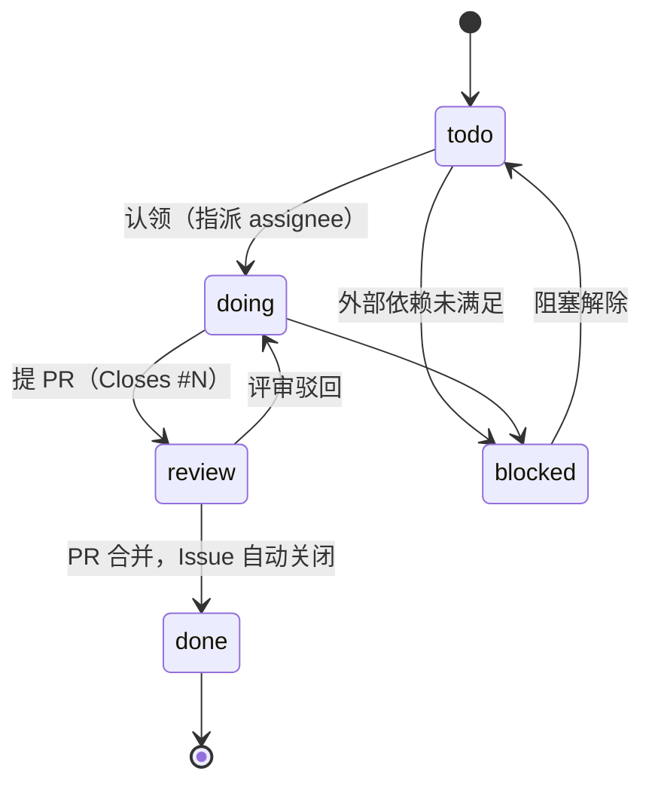

# 任务卡规范

> 状态：草案
> 最后更新：2026-10-07
> 关联：[roadmap](../roadmap.md)、[github-workflow](../../05-dev/github-workflow.md)、[AGENTS.md](../../../AGENTS.md)

本目录是开发任务的**规格源**。每个阶段一个文件；每张任务卡都能单独交给一个 AI Agent（或一个 subagent）完成，并通过 [`scripts/sync-issues.ps1`](../../../scripts/sync-issues.ps1) 同步为 GitHub Issue。

| 文件 | 阶段 | 里程碑 |
|---|---|---|
| [P0-foundation.md](P0-foundation.md) | P0 奠基 | `P0 奠基` |
| [P1-mvp.md](P1-mvp.md) | P1 MVP | `P1 MVP` |
| [P2-files-ui.md](P2-files-ui.md) | P2 文件与 UI | `P2 文件与 UI` |
| [P3-url-correlation.md](P3-url-correlation.md) | P3 URL 与关联 | `P3 URL 与关联` |
| [P4-native-packaging.md](P4-native-packaging.md) | P4 原生化与打包 | `P4 原生化与打包` |
| [P5-agent-adapters.md](P5-agent-adapters.md) | P5 Agent 适配 | `P5 Agent 适配` |
| [P6-inter-agent.md](P6-inter-agent.md) | P6 Agent 间通信 | `P6 Agent 间通信` |

## 1. 阶段文件结构

```markdown
# P1 MVP 任务清单

> 状态：草案
> 最后更新：YYYY-MM-DD
> 关联：...
> 里程碑：P1 MVP            ← 脚本读取，必须与 roadmap 一致
> 截止：2026-11-29           ← 脚本读取，写入 Milestone due date

## 1. 阶段目标
## 2. 任务总表
## 3. 依赖图
## 4. 任务卡
### P1-WIN-01 标题
...
```

## 2. 任务卡格式（机器可解析，勿改字段名）

```markdown
### P1-WIN-01 ETW 会话管理与丢失计数

- **AREA**: WIN
- **平台**: windows
- **类型**: feature
- **优先级**: M
- **规模**: M
- **依赖**: P0-WIN-01, P1-CORE-01
- **关联**: REQ-01, NFR-06, CAP-PRIV, ADR-0008, SPIKE-02
- **文件范围**: `crates/aw-collector-windows/src/etw/`
- **额外标签**: evidence            ← 可选

**背景**：为什么做，解决什么问题。

**实现要点**：
- 关键设计点、接口签名、边界情况。

**限制**：
- 不要做什么（范围外、禁用依赖、不可触碰的文件）。

**验收标准**：
- [ ] 可执行的命令或可测断言。

**参考文档**：相对路径链接。
```

字段说明：

| 字段 | 取值 | 映射到 GitHub |
|---|---|---|
| 编号 | `Pn-AREA-NN`，在本阶段 + AREA 内递增，不复用 | Issue 标题前缀 `[Pn-AREA-NN]`（幂等键） |
| AREA | README 中的 AREA 表 | `area:<小写>` |
| 平台 | `linux` / `windows` / `macos` / `all`，可逗号分隔 | `platform:*` |
| 类型 | `feature` / `bug` / `spike` / `chore` / `docs` | `type:*` |
| 优先级 | `M` / `S` / `C`（与 REQ 优先级含义相同） | `priority:*` |
| 规模 | `S` / `M` / `L` | `size:*` |
| 依赖 | 任务编号列表或 `无` | 写入 Issue 正文（脚本自动替换为 `#编号` 链接） |
| 关联 | REQ / NFR / CAP 类别 / ADR / SPIKE / RISK | 正文 |
| 文件范围 | 允许修改的目录或文件，**越界修改需在 PR 说明** | 正文 |
| 额外标签 | 任意已定义标签，逗号分隔 | 原样添加 |

## 3. 规模估算

| 规模 | 工作量（1 人 + AI） | 说明 |
|---|---|---|
| S | ≤ 0.5 天 | 单 crate 内局部改动，测试明确 |
| M | ≤ 2 天 | 一个完整子模块，可能涉及平台真机验证 |
| L | ≤ 5 天 | **开工前必须拆分**为 S/M；仅允许作为规划占位 |

估算包含编码、测试、文档同步；不含等待外部审批（如 Apple 授权）。

## 4. 状态流转



| 状态 | GitHub 表示 |
|---|---|
| todo | Issue open，Projects `Status = Todo` |
| doing | Projects `Status = In Progress`，有 assignee |
| review | 有关联 PR，Projects `Status = In Review` |
| done | Issue closed（completed） |
| blocked | `status:blocked` 标签 + 正文写明阻塞原因 |

**状态以 GitHub 为准**，任务卡文件不记录状态，避免双写不一致。

## 5. 与 GitHub 同步

```powershell
# 首次：创建标签
pwsh scripts/sync-labels.ps1

# 预览（不写入 GitHub）
pwsh scripts/sync-issues.ps1 -DryRun

# 同步某一阶段
pwsh scripts/sync-issues.ps1 -Phase P0

# 同步并加入 Projects v2（用户级项目编号 3）
pwsh scripts/sync-issues.ps1 -Phase P0,P1 -ProjectOwner '@me' -ProjectNumber 3
```

同步规则：

1. 以标题前缀 `[Pn-AREA-NN]` 查重；不存在则创建，存在则更新标题、正文、里程碑，并**追加**标签（不删除手工添加的标签，如 `status:blocked`）。
2. 已关闭的 Issue 不重新打开，也不更新正文。
3. 里程碑按文件头的 `里程碑` / `截止` 创建或更新。
4. Issue 正文末尾附来源链接（任务卡文件 + 锚点），并标注“本正文由脚本生成，请修改任务卡后重新同步”。
5. 任务卡修改应走 PR；合并后由维护者运行同步（后续可改为 Actions 自动同步，见 P4-CI-01 之后的待办）。

## 6. 新增与变更任务

- 新任务：在对应阶段文件末尾追加，编号取该阶段该 AREA 的下一个号，同时更新「任务总表」和「依赖图」。
- 拆分：原卡改为“已拆分 → X, Y”，保留条目；对应 Issue 关闭为 not planned。
- 废弃：标题加“（已废弃）”并写原因，编号不复用。
- 任务发现设计问题：先开 ADR（见 [03-adr](../../03-adr/README.md)），再改设计文档和任务卡。

## 7. 给 AI 执行者的提示模板

```text
执行任务卡 <编号>（docs/04-plan/tasks/<文件>.md）。
先读 AGENTS.md 和任务卡「参考文档」。只修改「文件范围」内的文件。
完成后逐条对照「验收标准」自检，贴出命令输出；不满足的条目如实说明。
```
