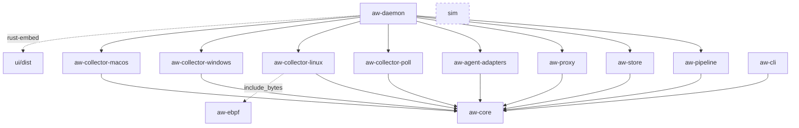

# 仓库结构

> 状态：草案
> 最后更新：2026-10-06
> 关联：NFR-07、NFR-08、[ADR-0001](../03-adr/0001-rust-workspace.md)、[architecture §3](../01-architecture/architecture.md#3-crate-划分与依赖方向)、[testing](testing.md)

本文定义目录布局、crate 职责与依赖方向。crate 的**设计职责**以 [architecture §3](../01-architecture/architecture.md#3-crate-划分与依赖方向) 为准，本文补充工程层面的约定（目录、cfg 隔离、测试归属）。

## 1. 目录树

```text
AgentWatch/
├── Cargo.toml                    workspace 根：members、workspace.dependencies、profile
├── Cargo.lock
├── rust-toolchain.toml           stable 工具链（aw-ebpf 的 nightly 单独声明）
├── deny.toml                     cargo-deny：许可证白名单、禁用 crate、漏洞库
├── .cargo/config.toml            链接器（mold/lld）、别名（cargo xtask）
├── README.md / AGENTS.md / CLAUDE.md
├── crates/
│   ├── aw-core/                  事件模型与公共类型（RawEvent、Evidence、ProcUid、配置、错误）
│   ├── aw-pipeline/              范围 / 丰富 / 脱敏 / 聚合 / 关联 / 缺口合并、wording 模板与 lint
│   │   ├── src/wording/          zh.toml、en.toml、lint.rs
│   │   └── tests/redact_corpus/  脱敏正例与反例语料（见 testing §7）
│   ├── aw-store/                 SQLite schema、迁移、批写、查询、保留、导出
│   │   └── migrations/           0001_init.sql、0002_*.sql …
│   ├── aw-proxy/                 MITM 显式代理（hudsucker）、CA 管理、分块哈希
│   ├── aw-collector-linux/       用户态：加载 eBPF、cgroup 管理、fanotify / sock_diag 降级
│   ├── aw-ebpf/                  内核态 eBPF 程序（no_std，Aya）；不在默认 members 中
│   ├── aw-collector-windows/     ETW 会话、Job Object
│   ├── aw-collector-macos/       eslogger / ES、nettop / pktap、与 NE 的 XPC
│   ├── aw-collector-poll/        跨平台轮询兜底（sysinfo、socket 表）
│   ├── aw-agent-adapters/        Agent 画像、hooks 接收、日志 / OTEL 解析（E3）
│   ├── aw-daemon/                agentwatchd：装配采集器与管道、会话管理、HTTP API、内嵌 UI
│   └── aw-cli/                   aw：命令行与 API 客户端
├── xtask/                        cargo xtask：ci、build-ebpf、build-ui、dist、bench、e2e
├── ui/                           React + Vite + TypeScript；构建产物 ui/dist 由 aw-daemon 嵌入
│   └── src/
│       ├── routes/               TanStack Router 文件路由：index.tsx、new.tsx、search.tsx、settings.tsx、s.$sid.<page>.tsx
│       ├── features/<page>/      每个页面一个目录（sessions、overview、timeline、processes、files、network、http、findings、gaps、search、settings、compare、self-report）
│       ├── components/           跨页面组件（EvidenceBadge、DetailPanel、FilterBar…）
│       ├── api/                  由 daemon OpenAPI 生成的客户端与类型
│       └── i18n/                 zh / en 文案（受措辞 lint 门禁约束）
│   └── src/i18n/                 UI 文案（受措辞 lint 检查）
├── macos-ext/                    Swift：Network Extension 系统扩展与宿主 App（P4）
├── sim/                          行为模拟器（workspace 成员，包名 sim）
│   ├── src/                      剧本执行器、真值日志
│   ├── src/server/               本地测试服务器（HTTP/HTTPS、DNS 存根）
│   └── scenarios/                smoke.toml、typical_agent.toml、storm.toml、read_then_send.toml
├── fixtures/                     录制 / 手写的事件流与测试资产（见 §5）
├── scripts/                      labels.json、sync-labels.ps1、sync-issues.ps1、docs-lint 辅助脚本
├── docs/                         文档（索引见 docs/README.md）
└── .github/
    ├── workflows/                ci.yml、e2e-linux.yml、e2e-windows.yml、e2e-macos.yml、docs-lint.yml、bench.yml、release.yml
    ├── ISSUE_TEMPLATE/           feature.yml、bug.yml、platform-research.yml、config.yml
    ├── pull_request_template.md
    └── dependabot.yml
```

## 2. crate 职责与产物

| crate | 类型 | 产物 | 主要外部依赖（计划） |
|---|---|---|---|
| `aw-core` | lib | — | serde、thiserror、time |
| `aw-pipeline` | lib | — | aw-core、regex、blake3、fastcdc、toml |
| `aw-store` | lib | — | aw-core、rusqlite（bundled） |
| `aw-proxy` | lib | — | aw-core、hudsucker、rcgen、tokio |
| `aw-collector-linux` | lib | — | aw-core、aya、nix |
| `aw-ebpf` | bin（bpf 目标） | `*.o`，由 collector-linux 用 `include_bytes!` 嵌入 | aya-ebpf |
| `aw-collector-windows` | lib | — | aw-core、ferrisetw、windows |
| `aw-collector-macos` | lib | — | aw-core、endpoint-sec（P4）、serde_json |
| `aw-collector-poll` | lib | — | aw-core、sysinfo、netstat2 |
| `aw-agent-adapters` | lib | — | aw-core |
| `aw-daemon` | bin | `agentwatchd` | 以上全部、tokio、axum、rust-embed、tracing |
| `aw-cli` | bin | `aw` | aw-core、clap、reqwest（仅回环）或 hyper |
| `sim` | bin | `sim` | tokio、hyper、rcgen |
| `xtask` | bin | — | xshell / duct |

新增外部依赖的规则见 [coding-conventions §4](coding-conventions.md#4-依赖引入)。

## 3. 依赖方向



硬性规则（CI 中用 `cargo xtask check-deps` 检查【待实现：P0-CI-01 之后】）：

1. `aw-core` 无内部依赖，不依赖 tokio、平台库、数据库库。
2. 采集器之间互不依赖；`aw-pipeline`、`aw-store`、`aw-proxy` 不依赖任何采集器。
3. 只有 `aw-daemon` 可以依赖多个采集器；`aw-cli` 只依赖 `aw-core`，通过 API 与 daemon 通信（`aw dev` 单进程模式通过 daemon crate 的 feature 引入，不破坏规则 2）。
4. `sim` 不依赖任何 `aw-*` crate，确保模拟器产生的“真值”与被测代码独立。

## 4. 平台隔离

- 平台 crate 的平台依赖写在 `[target.'cfg(target_os = "linux")'.dependencies]` 等区段。
- crate 根 `lib.rs` 采用如下结构，非目标平台编译为空壳，使 `cargo check --workspace` 在三平台都通过：

  ```rust
  #![cfg_attr(not(target_os = "windows"), allow(unused))]
  #[cfg(target_os = "windows")]
  mod etw;
  #[cfg(target_os = "windows")]
  pub use etw::WindowsCollector;
  ```

- `aw-daemon` 只在 `collectors.rs` 一个文件中用 `cfg` 装配采集器，其他文件不出现 `target_os`。
- 平台无关代码中禁止出现 `#[cfg(target_os)]`；需要平台差异时，通过 `Collector::capabilities()` 返回的能力声明分支。
- FFI 与 `unsafe` 集中在各平台 crate 的 `ffi/` 子模块（见 [coding-conventions §3](coding-conventions.md#3-unsafe-与-ffi)）。

## 5. fixtures 目录

```text
fixtures/
├── README.md                   录制、命名、脱敏（scrub）说明
├── common/                     手写、平台无关的用例
│   └── <case>/
│       ├── events.jsonl        首行 header，其后每行一个 RawEvent
│       ├── expected.snap       insta 快照：管道输出的记录 / findings
│       ├── expected.toml       （可选）显式断言：记录数、证据等级、模板 ID
│       └── README.md           用例意图、来源、对应 REQ/CAP
├── linux/<case>/  windows/<case>/  macos/<case>/   真机录制的用例，结构同上
├── db/
│   └── v<N>.db                 各 schema 版本的样例库，用于迁移测试（testing §8）
├── bench/
│   └── <name>.jsonl.zst        大样本，供 criterion 基准使用（testing §6）
└── redact_corpus/              跨 crate 共享的脱敏语料（aw-pipeline/tests/redact_corpus 可软链或复制）
```

约定：
- `<case>` 用 kebab-case，体现场景，如 `read-ssh-key-then-https`、`etw-lost-events`。
- header 字段：`v`（schema 主版本）、`platform`、`os_version`、`collectors`、`recorded_at`、`scenario`。
- 大于 1 MB 的文件必须 zstd 压缩；大于 20 MB 的放 `bench/` 并走 Git LFS【待定：P0 决定是否启用 LFS】。
- 提交前必须运行 `aw fixtures scrub`，去掉真实用户名、主机名、内网 IP 和 token。

其他专用样本目录：`fixtures/agents/`（各 Agent 的 hooks/OTEL/转录样本，P5）、`fixtures/macos-es/`（原生 ES 录制，P4）。发布前人工检查记录存放在 `docs/06-research/release-checks/`。

## 6. 测试归属

| crate / 目录 | 无特权测试 | 特权测试 | 说明 |
|---|---|---|---|
| aw-core | ✅ 全部 | — | 序列化、ProcUid、构造器 |
| aw-pipeline | ✅ 全部 | — | fixtures 回放、脱敏、措辞 |
| aw-store | ✅ 全部 | — | 内存库与临时文件库、迁移 |
| aw-proxy | ✅ 全部 | — | 本地上游 + 本地客户端 |
| aw-agent-adapters | ✅ 全部 | — | 样例 hook payload / 日志 |
| aw-collector-poll | ✅ 大部分 | — | 自身进程可见即可 |
| aw-collector-linux | 翻译层 ✅ | 加载 eBPF、cgroup | 翻译层以录制的原始事件为输入 |
| aw-collector-windows | 翻译层 ✅ | ETW 会话 | 同上 |
| aw-collector-macos | 解析层 ✅（eslogger JSON 样例） | eslogger / ES | 同上 |
| aw-daemon | API 层 ✅（mock 采集器） | 端到端 | — |
| aw-cli | ✅ | — | 对 mock API 测试 |
| sim | ✅ | — | 本地服务器、剧本解析 |

采集器要把“系统调用 / 回调”与“翻译为 RawEvent”拆成两层，翻译层的输入是可序列化的原始结构，这样大部分平台代码也能无特权测试（NFR-07）。
